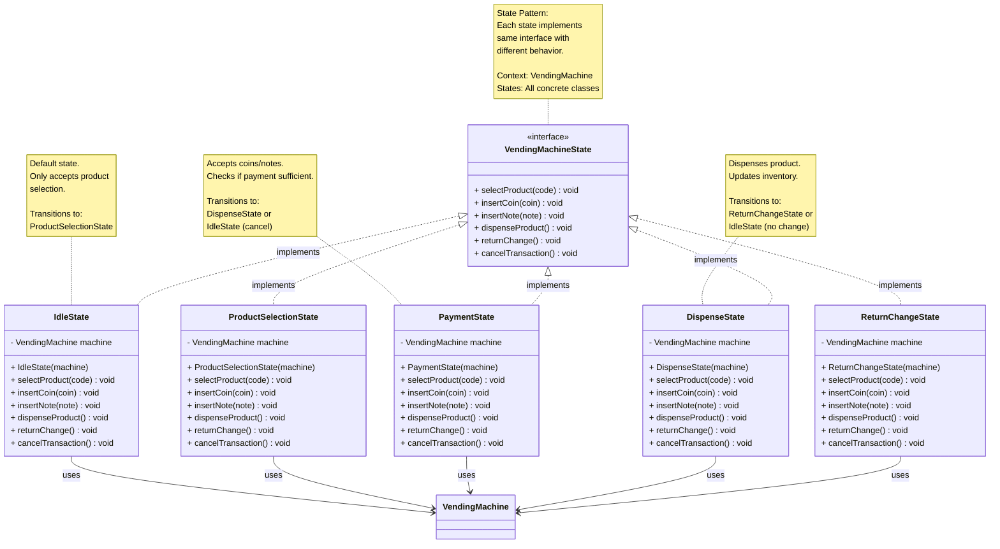
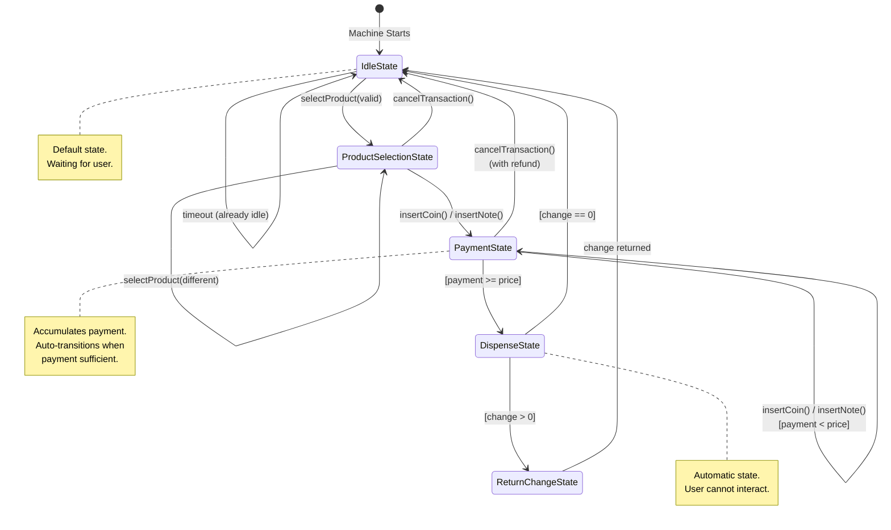

# Step 3: Implementing State Pattern - State Interface and Concrete States

## WHAT YOU ADDED IN THIS STEP?

In Step 3, we add the **State Pattern** which is a CORE REQUIREMENT:

1. **VendingMachineState** (Interface) - Defines state behavior contract
2. **IdleState** - Default state, waiting for user
3. **ProductSelectionState** - User selecting product
4. **PaymentState** - User inserting money
5. **DispenseState** - Machine dispensing product
6. **ReturnChangeState** - Machine returning change

---

## WHY STATE PATTERN?

### Problem Without State Pattern

```java
// ❌ BAD: Giant if-else or switch statements
class VendingMachine {
    private String currentState = "IDLE";

    public void insertMoney(Coin coin) {
        if (currentState.equals("IDLE")) {
            System.out.println("Please select product first");
        } else if (currentState.equals("PRODUCT_SELECTED")) {
            // Accept money
            currentState = "PAYMENT";
        } else if (currentState.equals("PAYMENT")) {
            // Add to payment
        } else if (currentState.equals("DISPENSE")) {
            System.out.println("Cannot insert money now");
        }
        // ... 100+ lines of if-else mess!
    }

    public void selectProduct(String code) {
        if (currentState.equals("IDLE")) {
            // Select product
            currentState = "PRODUCT_SELECTED";
        } else if (currentState.equals("PAYMENT")) {
            System.out.println("Cancel current transaction first");
        }
        // ... more if-else hell!
    }
}
```

**Problems**:
- ✗ Hard to maintain (too many if-else)
- ✗ Hard to add new states
- ✗ Violates Open/Closed Principle
- ✗ State transitions scattered everywhere
- ✗ Difficult to test each state

---

### Solution With State Pattern

```java
// ✅ GOOD: Each state is a separate class
interface VendingMachineState {
    void insertMoney(Coin coin);
    void selectProduct(String code);
}

class IdleState implements VendingMachineState {
    public void insertMoney(Coin coin) {
        System.out.println("Please select product first");
    }

    public void selectProduct(String code) {
        // Handle product selection
        machine.setState(new ProductSelectionState());
    }
}

class PaymentState implements VendingMachineState {
    public void insertMoney(Coin coin) {
        // Accept money - this is VALID in Payment state
    }

    public void selectProduct(String code) {
        System.out.println("Cancel transaction first");
    }
}
```

**Benefits**:
- ✓ Each state in separate class (Single Responsibility)
- ✓ Easy to add new states (Open/Closed)
- ✓ Clear state transitions
- ✓ Easy to test each state independently
- ✓ No if-else mess!

---

## Step 3: Class Diagram - State Pattern



---

## State Descriptions

### 1. IdleState (Default State)

**When**: Machine waiting for user interaction
**Allowed Actions**:
- ✓ Select product
**Disallowed Actions**:
- ✗ Insert money (no product selected)
- ✗ Dispense (nothing to dispense)
- ✗ Return change (no transaction)

**Transitions**:
- `selectProduct()` → ProductSelectionState (if valid product)
- `selectProduct()` → Stays in IdleState (if invalid product)

---

### 2. ProductSelectionState

**When**: User has selected a product
**Allowed Actions**:
- ✓ Insert money (start payment)
- ✓ Select different product
- ✓ Cancel transaction
**Disallowed Actions**:
- ✗ Dispense (not paid yet)
- ✗ Return change (no payment made)

**Transitions**:
- `insertCoin()` or `insertNote()` → PaymentState
- `cancelTransaction()` → IdleState

---

### 3. PaymentState

**When**: User inserting coins/notes
**Allowed Actions**:
- ✓ Insert more money
- ✓ Cancel transaction (refund)
**Disallowed Actions**:
- ✗ Select product (already selected)
- ✗ Dispense manually (automatic when sufficient)

**Transitions**:
- When `payment >= product.price` → DispenseState (automatic)
- `cancelTransaction()` → IdleState (with refund)

---

### 4. DispenseState

**When**: Machine dispensing product
**Allowed Actions**:
- (Automatic - no user action)
**Disallowed Actions**:
- ✗ All user actions blocked during dispense

**Transitions**:
- If `change > 0` → ReturnChangeState
- If `change == 0` → IdleState

---

### 5. ReturnChangeState

**When**: Machine calculating and returning change
**Allowed Actions**:
- (Automatic - no user action)
**Disallowed Actions**:
- ✗ All user actions blocked during change return

**Transitions**:
- After returning change → IdleState

---

## State Transition Diagram



---

## WHAT IS THE CHANGE FROM STEP 2?

### Step 2 → Step 3 Changes

| Aspect | Step 2 | Step 3 |
|--------|--------|--------|
| **State Management** | None (or String-based) | State Pattern with classes |
| **Behavior** | if-else based | Polymorphic (state-specific) |
| **Transitions** | Manual state strings | Clean setState() calls |
| **Extensibility** | Hard to add states | Easy to add new state classes |
| **Testability** | Hard to test states | Each state testable independently |

---

## WHY THESE CHANGES?

### Change 1: Interface for All States

**Question**: Why do all states implement the same interface?

**Answer**: **Polymorphism - Treat all states uniformly**

```java
// VendingMachine can hold ANY state implementing the interface
class VendingMachine {
    private VendingMachineState currentState;

    // Same method call, different behavior based on state!
    public void insertCoin(Coin coin) {
        currentState.insertCoin(coin); // Delegates to current state
    }

    // Change state at runtime
    public void setState(VendingMachineState newState) {
        this.currentState = newState;
    }
}
```

**Benefits**:
- VendingMachine doesn't need to know which specific state
- Can switch states at runtime
- Adding new state doesn't change VendingMachine code!

---

### Change 2: Each State Holds Reference to Machine

**Question**: Why does each state need VendingMachine reference?

**Answer**: **States need to transition and access machine data**

```java
class PaymentState implements VendingMachineState {
    private VendingMachine machine; // Need this to transition!

    public void insertCoin(Coin coin) {
        machine.addPayment(coin.getValue());

        // Check if payment sufficient
        if (machine.getCurrentPayment() >= machine.getSelectedProduct().getPrice()) {
            // Transition to next state
            machine.setState(new DispenseState(machine));
        }
    }
}
```

**What state needs from machine**:
- Transition to other states: `machine.setState()`
- Access machine data: `machine.getSelectedProduct()`
- Call machine methods: `machine.addPayment()`

---

### Change 3: Default "Invalid Action" Handling

**Question**: What happens when user does invalid action in a state?

**Answer**: **Each method has default implementation that shows error**

```java
class IdleState implements VendingMachineState {
    public void insertCoin(Coin coin) {
        // Invalid in Idle state
        System.out.println("Please select a product first!");
        // Stay in same state (don't transition)
    }

    public void selectProduct(String code) {
        // Valid in Idle state
        // ... handle product selection
        machine.setState(new ProductSelectionState(machine));
    }
}
```

**Pattern**:
- Invalid actions → Print error, stay in same state
- Valid actions → Perform action, possibly transition

---

## Design Decisions

### Decision 1: Who Creates New State Objects?

**Option 1**: Current state creates next state (our choice)
```java
class PaymentState {
    public void insertCoin(Coin coin) {
        if (paymentSufficient) {
            machine.setState(new DispenseState(machine)); // State creates next
        }
    }
}
```

**Option 2**: VendingMachine creates states
```java
class VendingMachine {
    public void transitionToDispense() {
        currentState = new DispenseState(this);
    }
}
```

**Why we chose Option 1?**
- State knows best when to transition (encapsulation)
- State knows which state comes next
- VendingMachine doesn't need transition logic

---

### Decision 2: How Many States?

**Question**: Why exactly 5 states?

**Answer**: Based on **distinct behaviors** in requirements:

1. **IdleState**: Different behavior (only allow selection)
2. **ProductSelectionState**: Different (allow payment start)
3. **PaymentState**: Different (accumulate money)
4. **DispenseState**: Different (dispense product)
5. **ReturnChangeState**: Different (return change)

**Could we combine states?**
- Could combine Dispense + ReturnChange → But violates SRP
- Each state should have ONE clear responsibility

---

### Decision 3: Synchronous vs Asynchronous States

**Current**: Synchronous (state executes immediately)
**Alternative**: Asynchronous (state runs in background thread)

```java
// Synchronous (our choice)
public void dispenseProduct() {
    // Blocks until dispense complete
    hardware.dispense();
    machine.setState(new ReturnChangeState());
}

// Asynchronous (more complex)
public void dispenseProduct() {
    new Thread(() -> {
        hardware.dispense(); // Runs in background
        machine.setState(new ReturnChangeState());
    }).start();
}
```

**Why synchronous?**
- Simpler for LLD exercise
- Real vending machines block during dispense
- Easier to reason about state transitions

---

## Java Code Skeleton (Step 3)

```java
// VendingMachineState.java
public interface VendingMachineState {
    void selectProduct(String code);
    void insertCoin(Coin coin);
    void insertNote(Note note);
    void dispenseProduct();
    void returnChange();
    void cancelTransaction();
}

// IdleState.java
public class IdleState implements VendingMachineState {
    private VendingMachine machine;

    public IdleState(VendingMachine machine) {
        this.machine = machine;
        System.out.println("Machine is IDLE. Please select a product.");
    }

    @Override
    public void selectProduct(String code) {
        Product product = machine.getCatalog().getProductByCode(code);

        if (product == null) {
            System.out.println("Error: Invalid product code");
            return;
        }

        if (!machine.getInventoryManager().isProductAvailable(product.getProductId())) {
            System.out.println("Error: Product out of stock");
            return;
        }

        // Valid selection
        machine.setSelectedProduct(product);
        System.out.println("Selected: " + product.getName() + " - ₹" + product.getPrice());
        machine.setState(new ProductSelectionState(machine));
    }

    @Override
    public void insertCoin(Coin coin) {
        System.out.println("Error: Please select a product first");
    }

    @Override
    public void insertNote(Note note) {
        System.out.println("Error: Please select a product first");
    }

    @Override
    public void dispenseProduct() {
        System.out.println("Error: No product selected");
    }

    @Override
    public void returnChange() {
        System.out.println("Error: No transaction in progress");
    }

    @Override
    public void cancelTransaction() {
        System.out.println("No transaction to cancel");
    }
}

// ProductSelectionState.java
public class ProductSelectionState implements VendingMachineState {
    private VendingMachine machine;

    public ProductSelectionState(VendingMachine machine) {
        this.machine = machine;
        System.out.println("Product selected. Please insert payment.");
    }

    @Override
    public void selectProduct(String code) {
        // Allow changing selection
        System.out.println("Changing product selection...");
        machine.setState(new IdleState(machine));
        machine.getState().selectProduct(code);
    }

    @Override
    public void insertCoin(Coin coin) {
        // Transition to Payment state
        machine.setState(new PaymentState(machine));
        machine.getState().insertCoin(coin);
    }

    @Override
    public void insertNote(Note note) {
        // Transition to Payment state
        machine.setState(new PaymentState(machine));
        machine.getState().insertNote(note);
    }

    @Override
    public void dispenseProduct() {
        System.out.println("Error: Please insert payment first");
    }

    @Override
    public void returnChange() {
        System.out.println("Error: No payment made yet");
    }

    @Override
    public void cancelTransaction() {
        System.out.println("Transaction cancelled");
        machine.resetTransaction();
        machine.setState(new IdleState(machine));
    }
}

// PaymentState.java
public class PaymentState implements VendingMachineState {
    private VendingMachine machine;

    public PaymentState(VendingMachine machine) {
        this.machine = machine;
    }

    @Override
    public void selectProduct(String code) {
        System.out.println("Error: Cancel current transaction first");
    }

    @Override
    public void insertCoin(Coin coin) {
        Money payment = machine.getCurrentPayment();
        payment = payment.add(new Money(coin.getValue()));
        machine.setCurrentPayment(payment);
        machine.getCashInventory().addCoins(coin, 1);

        System.out.println("Inserted ₹" + coin.getValue());
        System.out.println("Total payment: ₹" + payment.getAmount());

        checkPaymentSufficient();
    }

    @Override
    public void insertNote(Note note) {
        Money payment = machine.getCurrentPayment();
        payment = payment.add(new Money(note.getValue()));
        machine.setCurrentPayment(payment);
        machine.getCashInventory().addNotes(note, 1);

        System.out.println("Inserted ₹" + note.getValue());
        System.out.println("Total payment: ₹" + payment.getAmount());

        checkPaymentSufficient();
    }

    private void checkPaymentSufficient() {
        Money payment = machine.getCurrentPayment();
        Product product = machine.getSelectedProduct();
        Money price = new Money(product.getPrice());

        if (payment.isGreaterThan(price) || payment.isEqualTo(price)) {
            System.out.println("Payment sufficient. Dispensing product...");
            machine.setState(new DispenseState(machine));
            machine.getState().dispenseProduct();
        } else {
            Money remaining = price.subtract(payment);
            System.out.println("Please insert ₹" + remaining.getAmount() + " more");
        }
    }

    @Override
    public void dispenseProduct() {
        System.out.println("Error: Insufficient payment");
    }

    @Override
    public void returnChange() {
        System.out.println("Error: Complete payment first");
    }

    @Override
    public void cancelTransaction() {
        Money refund = machine.getCurrentPayment();
        System.out.println("Transaction cancelled. Refunding ₹" + refund.getAmount());
        machine.resetTransaction();
        machine.setState(new IdleState(machine));
    }
}

// DispenseState.java
public class DispenseState implements VendingMachineState {
    private VendingMachine machine;

    public DispenseState(VendingMachine machine) {
        this.machine = machine;
    }

    @Override
    public void selectProduct(String code) {
        System.out.println("Error: Product being dispensed");
    }

    @Override
    public void insertCoin(Coin coin) {
        System.out.println("Error: Product being dispensed");
    }

    @Override
    public void insertNote(Note note) {
        System.out.println("Error: Product being dispensed");
    }

    @Override
    public void dispenseProduct() {
        Product product = machine.getSelectedProduct();

        // Deduct inventory
        boolean success = machine.getInventoryManager()
                                 .deductProduct(product.getProductId());

        if (!success) {
            System.out.println("Error: Dispense failed. Refunding...");
            machine.setState(new IdleState(machine));
            return;
        }

        System.out.println("Product dispensed: " + product.getName());

        // Calculate change
        Money payment = machine.getCurrentPayment();
        Money price = new Money(product.getPrice());
        Money change = payment.subtract(price);

        if (change.getAmount() > 0) {
            machine.setState(new ReturnChangeState(machine));
            machine.getState().returnChange();
        } else {
            System.out.println("Thank you! Exact payment.");
            machine.resetTransaction();
            machine.setState(new IdleState(machine));
        }
    }

    @Override
    public void returnChange() {
        System.out.println("Error: Dispense in progress");
    }

    @Override
    public void cancelTransaction() {
        System.out.println("Error: Cannot cancel during dispense");
    }
}

// ReturnChangeState.java
public class ReturnChangeState implements VendingMachineState {
    private VendingMachine machine;

    public ReturnChangeState(VendingMachine machine) {
        this.machine = machine;
    }

    @Override
    public void selectProduct(String code) {
        System.out.println("Error: Returning change");
    }

    @Override
    public void insertCoin(Coin coin) {
        System.out.println("Error: Returning change");
    }

    @Override
    public void insertNote(Note note) {
        System.out.println("Error: Returning change");
    }

    @Override
    public void dispenseProduct() {
        System.out.println("Error: Already dispensed");
    }

    @Override
    public void returnChange() {
        Money payment = machine.getCurrentPayment();
        Money price = new Money(machine.getSelectedProduct().getPrice());
        Money change = payment.subtract(price);

        System.out.println("Returning change: ₹" + change.getAmount());

        // TODO: Implement actual change return logic (Step 5)
        // For now, just complete transaction

        machine.resetTransaction();
        machine.setState(new IdleState(machine));
    }

    @Override
    public void cancelTransaction() {
        System.out.println("Error: Cannot cancel, product already dispensed");
    }
}
```

---

## Common Beginner Mistakes

### Mistake 1: State Without Machine Reference
```java
// ❌ BAD: How will state transition?
class IdleState {
    public void selectProduct(String code) {
        // How to transition to ProductSelectionState?
        // Can't call machine.setState() without reference!
    }
}

// ✅ GOOD: State holds machine reference
class IdleState {
    private VendingMachine machine;

    public IdleState(VendingMachine machine) {
        this.machine = machine;
    }

    public void selectProduct(String code) {
        machine.setState(new ProductSelectionState(machine));
    }
}
```

---

### Mistake 2: Not Implementing All Interface Methods
```java
// ❌ BAD: Only implement relevant methods
class IdleState implements VendingMachineState {
    public void selectProduct(String code) {
        // Implementation
    }
    // Missing other methods! Won't compile!
}

// ✅ GOOD: Implement all, even with error messages
class IdleState implements VendingMachineState {
    public void selectProduct(String code) { /* valid */ }
    public void insertCoin(Coin coin) {
        System.out.println("Please select product first");
    }
    // All methods implemented
}
```

---

### Mistake 3: Circular State Transitions
```java
// ❌ BAD: Infinite loop
class PaymentState {
    public void insertCoin(Coin coin) {
        machine.setState(new DispenseState(machine));
    }
}

class DispenseState {
    public void dispenseProduct() {
        machine.setState(new PaymentState(machine)); // Back to payment!?
    }
}
```

Always ensure **clear, acyclic state flow** (except intentional loops like Idle → Idle).

---

## What's Next in Step 4?

In Step 4, we'll:
1. **Integrate states into VendingMachine** class
2. Add **state delegation** methods
3. Complete the **full transaction flow**

---

**Step 3 Complete!** ✅

**Key Takeaways**:
- State Pattern eliminates if-else hell
- Each state = separate class with unique behavior
- States hold machine reference for transitions
- Interface ensures all states implement same contract
- Easy to add new states without modifying existing code
