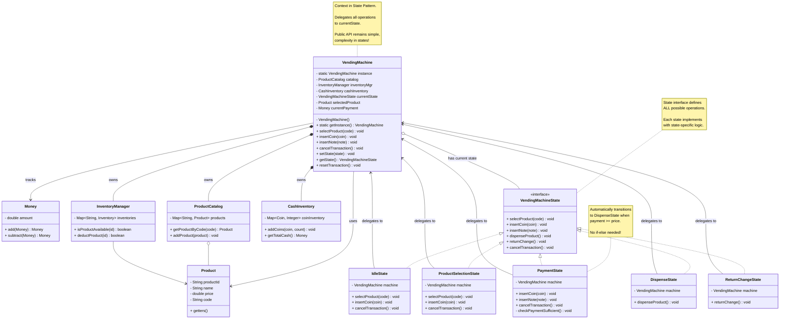
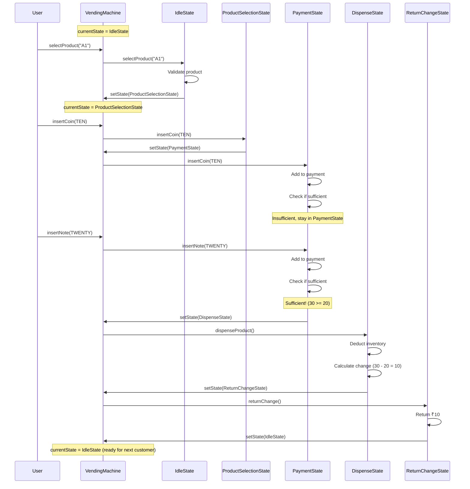

# Step 4: Integrating State Pattern with VendingMachine

## WHAT YOU ADDED IN THIS STEP?

In Step 4, we **integrate** the State Pattern into VendingMachine:

1. Add `currentState` field to VendingMachine
2. Add state delegation methods
3. Update VendingMachine to use states for all operations
4. Complete the full transaction flow

---

## WHAT IS THE CHANGE FROM STEP 3?

### Step 3 → Step 4 Changes

| Aspect | Step 3 | Step 4 |
|--------|--------|--------|
| **States** | Defined but not used | Integrated into VendingMachine |
| **VendingMachine** | No state awareness | Holds currentState, delegates |
| **Methods** | Direct implementation | Delegates to currentState |
| **Complete Flow** | No | Yes - full purchase cycle works |

---

## Step 4: Complete Class Diagram with State Integration



---

## WHY THESE CHANGES?

### Change 1: VendingMachine Delegates to State

**Before (Step 2)**:
```java
class VendingMachine {
    public void insertCoin(Coin coin) {
        // Direct implementation
        currentPayment = currentPayment.add(new Money(coin.getValue()));
        // ... lots of logic here
    }
}
```

**After (Step 4)**:
```java
class VendingMachine {
    private VendingMachineState currentState;

    public void insertCoin(Coin coin) {
        // Delegate to current state!
        currentState.insertCoin(coin);
    }
}
```

**Benefits**:
- VendingMachine stays simple (just delegates)
- State-specific behavior in state classes
- Easy to change behavior by changing state

---

### Change 2: State Initialization

```java
class VendingMachine {
    private VendingMachine() {
        this.catalog = new ProductCatalog();
        this.inventoryManager = new InventoryManager();
        this.cashInventory = new CashInventory();
        this.currentPayment = new Money(0);

        // Initialize to Idle state
        this.currentState = new IdleState(this);
    }
}
```

**Why IdleState as initial state?**
- Machine starts waiting for user
- Most common state
- Safe default (no transaction in progress)

---

## Complete Transaction Flow

Let's trace a **complete purchase** through all states:



---

## Design Decisions

### Decision 1: Who Validates Input?

**Option 1**: VendingMachine validates before delegating
```java
class VendingMachine {
    public void selectProduct(String code) {
        if (code == null || code.isEmpty()) {
            System.out.println("Invalid code");
            return;
        }
        currentState.selectProduct(code);
    }
}
```

**Option 2**: State validates (our choice)
```java
class VendingMachine {
    public void selectProduct(String code) {
        currentState.selectProduct(code); // State validates
    }
}

class IdleState {
    public void selectProduct(String code) {
        if (code == null) {
            System.out.println("Invalid code");
            return;
        }
        // ... validation logic
    }
}
```

**Why Option 2?**
- Different states may have different validation rules
- State knows context better
- VendingMachine stays simple

---

### Decision 2: Synchronous State Transitions

**Question**: Should state transitions be immediate or queued?

**Current**: Immediate (synchronous)
```java
public void setState(VendingMachineState newState) {
    this.currentState = newState; // Immediate switch
}
```

**Alternative**: Queued (asynchronous)
```java
private Queue<VendingMachineState> stateQueue = new LinkedList<>();

public void queueStateTransition(VendingMachineState newState) {
    stateQueue.add(newState);
}

public void processNextState() {
    if (!stateQueue.isEmpty()) {
        this.currentState = stateQueue.poll();
    }
}
```

**Why synchronous?**
- Simpler to understand
- Easier to debug
- Vending machines don't need async transitions
- State changes are fast

---

### Decision 3: Error Handling in States

**Question**: How to handle errors during state operations?

**Option 1**: Return boolean (success/failure)
```java
interface VendingMachineState {
    boolean selectProduct(String code);
}
```

**Option 2**: Throw exceptions
```java
interface VendingMachineState {
    void selectProduct(String code) throws InvalidProductException;
}
```

**Option 3**: Print messages and stay in state (our choice)
```java
interface VendingMachineState {
    void selectProduct(String code); // void return

    // In implementation:
    public void selectProduct(String code) {
        if (invalid) {
            System.out.println("Error: ...");
            return; // Stay in current state
        }
        // Proceed
    }
}
```

**Why Option 3?**
- User-friendly messages
- No exception handling boilerplate
- Simple for vending machine (not critical system)

---

## Updated VendingMachine Code

```java
// VendingMachine.java (Step 4 - with State Integration)
public class VendingMachine {
    // Singleton
    private static VendingMachine instance;

    // Managers (Composition)
    private ProductCatalog catalog;
    private InventoryManager inventoryManager;
    private CashInventory cashInventory;

    // State Pattern - CORE ADDITION
    private VendingMachineState currentState;

    // Transaction data
    private Product selectedProduct;
    private Money currentPayment;

    // Private constructor
    private VendingMachine() {
        this.catalog = new ProductCatalog();
        this.inventoryManager = new InventoryManager();
        this.cashInventory = new CashInventory();
        this.currentPayment = new Money(0);

        // Initialize to Idle state
        this.currentState = new IdleState(this);
    }

    // Singleton access
    public static synchronized VendingMachine getInstance() {
        if (instance == null) {
            instance = new VendingMachine();
        }
        return instance;
    }

    // ===== STATE DELEGATION METHODS =====
    // All user operations delegate to current state

    public void selectProduct(String code) {
        currentState.selectProduct(code);
    }

    public void insertCoin(Coin coin) {
        currentState.insertCoin(coin);
    }

    public void insertNote(Note note) {
        currentState.insertNote(note);
    }

    public void cancelTransaction() {
        currentState.cancelTransaction();
    }

    // ===== STATE MANAGEMENT =====

    public void setState(VendingMachineState newState) {
        this.currentState = newState;
    }

    public VendingMachineState getState() {
        return currentState;
    }

    // ===== TRANSACTION MANAGEMENT =====
    // Called by states to manage transaction data

    public void setSelectedProduct(Product product) {
        this.selectedProduct = product;
    }

    public Product getSelectedProduct() {
        return selectedProduct;
    }

    public void setCurrentPayment(Money payment) {
        this.currentPayment = payment;
    }

    public Money getCurrentPayment() {
        return currentPayment;
    }

    public void resetTransaction() {
        this.selectedProduct = null;
        this.currentPayment = new Money(0);
    }

    // ===== GETTERS FOR MANAGERS =====
    // States need access to these

    public ProductCatalog getCatalog() {
        return catalog;
    }

    public InventoryManager getInventoryManager() {
        return inventoryManager;
    }

    public CashInventory getCashInventory() {
        return cashInventory;
    }

    // ===== ADMIN OPERATIONS =====
    // Not delegated to states (admin-only)

    public void addProduct(Product product, int initialQuantity) {
        catalog.addProduct(product);
        inventoryManager.addInventory(product.getProductId(), initialQuantity);
        System.out.println("Added product: " + product.getName());
    }

    public void refillProduct(String productId, int quantity) {
        inventoryManager.refillProduct(productId, quantity);
        System.out.println("Refilled product ID: " + productId +
                           " with " + quantity + " units");
    }

    public void refillCash(Coin coin, int count) {
        cashInventory.addCoins(coin, count);
        System.out.println("Refilled " + count + " coins of ₹" + coin.getValue());
    }

    public void refillCash(Note note, int count) {
        cashInventory.addNotes(note, count);
        System.out.println("Refilled " + count + " notes of ₹" + note.getValue());
    }

    public void displayInventory() {
        System.out.println("\n===== INVENTORY STATUS =====");
        for (Product product : catalog.getAllProducts()) {
            int qty = inventoryManager.getQuantity(product.getProductId());
            String status = qty > 0 ? "In Stock" : "Out of Stock";
            System.out.println(product.getCode() + " - " + product.getName() +
                             " | ₹" + product.getPrice() +
                             " | Qty: " + qty + " | " + status);
        }
        System.out.println("==========================\n");
    }

    public void displayCashInventory() {
        System.out.println("\n===== CASH INVENTORY =====");
        System.out.println("Coins:");
        for (Coin coin : Coin.values()) {
            System.out.println("  ₹" + coin.getValue() + ": " +
                             cashInventory.getCoinCount(coin));
        }
        System.out.println("Notes:");
        for (Note note : Note.values()) {
            System.out.println("  ₹" + note.getValue() + ": " +
                             cashInventory.getNoteCount(note));
        }
        System.out.println("Total Cash: " + cashInventory.getTotalCash());
        System.out.println("==========================\n");
    }
}
```

---

## Example Usage (Main Class)

```java
// VendingMachineDemo.java
public class VendingMachineDemo {
    public static void main(String[] args) {
        // Get singleton instance
        VendingMachine machine = VendingMachine.getInstance();

        // Admin: Setup products
        System.out.println("===== ADMIN: SETTING UP MACHINE =====");
        Product coke = new Product("P001", "Coca Cola", 20.0, "A1", ProductType.BEVERAGE);
        Product chips = new Product("P002", "Lays Chips", 15.0, "A2", ProductType.SNACK);
        Product water = new Product("P003", "Water Bottle", 10.0, "A3", ProductType.BEVERAGE);

        machine.addProduct(coke, 10);
        machine.addProduct(chips, 5);
        machine.addProduct(water, 20);

        // Admin: Refill cash for change
        machine.refillCash(Coin.ONE, 20);
        machine.refillCash(Coin.TWO, 20);
        machine.refillCash(Coin.FIVE, 20);
        machine.refillCash(Coin.TEN, 20);
        machine.refillCash(Note.TEN, 10);
        machine.refillCash(Note.TWENTY, 10);

        machine.displayInventory();

        // ===== USER: Purchase Flow 1 =====
        System.out.println("\n===== CUSTOMER 1: BUYING COKE =====");

        // Step 1: Select product
        machine.selectProduct("A1"); // Coke - ₹20

        // Step 2: Insert money (exact payment)
        machine.insertNote(Note.TWENTY); // ₹20

        // Product automatically dispensed, no change needed

        // ===== USER: Purchase Flow 2 =====
        System.out.println("\n===== CUSTOMER 2: BUYING CHIPS WITH CHANGE =====");

        // Step 1: Select product
        machine.selectProduct("A2"); // Chips - ₹15

        // Step 2: Insert money (overpayment)
        machine.insertCoin(Coin.TEN); // ₹10
        machine.insertCoin(Coin.TEN); // ₹10 more (total ₹20)

        // Product dispensed, change ₹5 returned

        // ===== USER: Purchase Flow 3 =====
        System.out.println("\n===== CUSTOMER 3: CANCELLED TRANSACTION =====");

        // Step 1: Select product
        machine.selectProduct("A3"); // Water - ₹10

        // Step 2: Insert some money
        machine.insertCoin(Coin.FIVE); // ₹5

        // Step 3: Changed mind, cancel
        machine.cancelTransaction(); // Refund ₹5

        // ===== Display Final State =====
        System.out.println("\n===== FINAL INVENTORY =====");
        machine.displayInventory();
    }
}
```

**Expected Output**:
```
===== ADMIN: SETTING UP MACHINE =====
Added product: Coca Cola
Added product: Lays Chips
Added product: Water Bottle
Refilled 20 coins of ₹1.0
Refilled 20 coins of ₹2.0
...

===== INVENTORY STATUS =====
A1 - Coca Cola | ₹20.0 | Qty: 10 | In Stock
A2 - Lays Chips | ₹15.0 | Qty: 5 | In Stock
A3 - Water Bottle | ₹10.0 | Qty: 20 | In Stock
==========================

===== CUSTOMER 1: BUYING COKE =====
Machine is IDLE. Please select a product.
Selected: Coca Cola - ₹20.0
Product selected. Please insert payment.
Inserted ₹20.0
Total payment: ₹20.0
Payment sufficient. Dispensing product...
Product dispensed: Coca Cola
Thank you! Exact payment.
Machine is IDLE. Please select a product.

===== CUSTOMER 2: BUYING CHIPS WITH CHANGE =====
Selected: Lays Chips - ₹15.0
Product selected. Please insert payment.
Inserted ₹10.0
Total payment: ₹10.0
Please insert ₹5.0 more
Inserted ₹10.0
Total payment: ₹20.0
Payment sufficient. Dispensing product...
Product dispensed: Lays Chips
Returning change: ₹5.0
Machine is IDLE. Please select a product.

===== CUSTOMER 3: CANCELLED TRANSACTION =====
Selected: Water Bottle - ₹10.0
Product selected. Please insert payment.
Inserted ₹5.0
Total payment: ₹5.0
Please insert ₹5.0 more
Transaction cancelled. Refunding ₹5.0
Transaction cancelled
Machine is IDLE. Please select a product.

===== FINAL INVENTORY =====
A1 - Coca Cola | ₹20.0 | Qty: 9 | In Stock
A2 - Lays Chips | ₹15.0 | Qty: 4 | In Stock
A3 - Water Bottle | ₹10.0 | Qty: 20 | In Stock
```

---

## Common Beginner Mistakes

### Mistake 1: Forgetting to Initialize State
```java
// ❌ BAD: currentState is null
private VendingMachineState currentState; // null!

public void selectProduct(String code) {
    currentState.selectProduct(code); // NullPointerException!
}

// ✅ GOOD: Initialize in constructor
private VendingMachine() {
    this.currentState = new IdleState(this);
}
```

---

### Mistake 2: Tight Coupling Between States
```java
// ❌ BAD: State directly calls another state's methods
class PaymentState {
    public void insertCoin(Coin coin) {
        if (sufficient) {
            DispenseState dispense = new DispenseState(machine);
            dispense.dispenseProduct(); // Direct call!
        }
    }
}

// ✅ GOOD: Transition via VendingMachine
class PaymentState {
    public void insertCoin(Coin coin) {
        if (sufficient) {
            machine.setState(new DispenseState(machine));
            machine.getState().dispenseProduct(); // Through machine
        }
    }
}
```

---

### Mistake 3: Exposing State to External Clients
```java
// ❌ BAD: External code can access state directly
VendingMachine machine = VendingMachine.getInstance();
VendingMachineState state = machine.getState();
state.dispenseProduct(); // Bypassing machine!

// ✅ GOOD: Only VendingMachine methods exposed
VendingMachine machine = VendingMachine.getInstance();
machine.selectProduct("A1"); // Only public API
machine.insertCoin(Coin.TEN);
// Cannot access state directly
```

**Solution**: Make `getState()` package-private or remove it from public API.

---

## What's Next in Step 5?

In Step 5, we'll add:
1. **Change Calculation Algorithm** (greedy algorithm)
2. **PaymentProcessor** class
3. **Transaction** class for history
4. **Complete change return logic**

---

**Step 4 Complete!** ✅

**Key Takeaways**:
- VendingMachine delegates all operations to currentState
- State pattern enables clean state transitions
- Complete purchase flow works end-to-end
- Machine remains simple, complexity in states
- Easy to test each state independently
