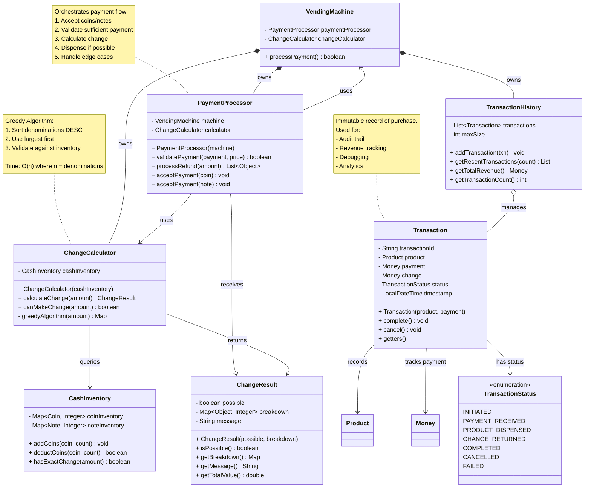

# Step 5: Payment Handling and Change Calculation

## WHAT YOU ADDED IN THIS STEP?

In Step 5, we add the **payment processing layer**:

1. **ChangeCalculator** - Calculates optimal change using greedy algorithm
2. **PaymentProcessor** - Processes payments and handles refunds
3. **Transaction** - Records transaction history
4. **TransactionStatus** - Enum for transaction states
5. Enhanced **CashInventory** with change calculation logic

---

## WHY PAYMENT PROCESSING IS COMPLEX?

### The Change-Making Problem

**Scenario**: Customer pays ₹50 for ₹23 product. Need to return ₹27 change.

**Challenge**: What if machine doesn't have exact change?

```
Available coins/notes: ₹20(x1), ₹5(x2), ₹2(x0), ₹1(x5)
Need to return: ₹27

Greedy approach:
1. ₹20 x 1 = ₹20 (remaining: ₹7)
2. ₹5 x 1 = ₹5 (remaining: ₹2)
3. ₹2 x 1 = ₹2 (remaining: ₹0) BUT we have 0 ₹2 coins!

Solution fails! Need to backtrack or reject transaction.
```

This is why we need a sophisticated **ChangeCalculator**.

---

## Step 5: Class Diagram - Payment Components



---

## Change Calculation Algorithm (Greedy Approach)

### Algorithm Explanation

**Greedy Strategy**: Always use the largest denomination possible.

**Steps**:
1. Sort all denominations in descending order
2. For each denomination (from largest to smallest):
   - Use as many as possible without exceeding remaining amount
   - Check if we have enough in inventory
   - Deduct from remaining amount
3. If remaining amount = 0, success!
4. If remaining amount > 0, cannot make exact change

---

### Pseudocode

```
function calculateChange(amount):
    result = empty map
    remaining = amount

    denominations = [500, 100, 50, 20, 10, 5, 2, 1] // sorted DESC

    for each denom in denominations:
        if remaining == 0:
            break

        needed = floor(remaining / denom)
        available = inventory.getCount(denom)
        use = min(needed, available)

        if use > 0:
            result[denom] = use
            remaining -= (denom * use)

    if remaining == 0:
        return ChangeResult(true, result)
    else:
        return ChangeResult(false, null) // Cannot make change
```

---

### Example Walkthrough

**Input**: Need ₹27 change
**Inventory**: ₹20(x2), ₹10(x3), ₹5(x5), ₹2(x10), ₹1(x20)

```
Step 1: Try ₹20
  needed = 27 / 20 = 1
  available = 2
  use = min(1, 2) = 1
  Use 1 x ₹20
  remaining = 27 - 20 = ₹7

Step 2: Try ₹10
  needed = 7 / 10 = 0
  Skip

Step 3: Try ₹5
  needed = 7 / 5 = 1
  available = 5
  use = min(1, 5) = 1
  Use 1 x ₹5
  remaining = 7 - 5 = ₹2

Step 4: Try ₹2
  needed = 2 / 2 = 1
  available = 10
  use = min(1, 10) = 1
  Use 1 x ₹2
  remaining = 2 - 2 = ₹0

SUCCESS! Change: ₹20(x1) + ₹5(x1) + ₹2(x1) = ₹27
```

---

### Edge Cases

#### Edge Case 1: Insufficient Inventory

**Input**: Need ₹27 change
**Inventory**: ₹20(x1), ₹10(x0), ₹5(x0), ₹2(x0), ₹1(x0)

```
Step 1: Use ₹20 x 1 → remaining ₹7
Step 2-5: No other denominations available

FAIL! Cannot make ₹7 change.
Action: Reject transaction OR give IOU
```

---

#### Edge Case 2: Greedy Doesn't Always Work (for some currency systems)

**Note**: For Indian currency (₹1, ₹2, ₹5, ₹10, ₹20...), greedy ALWAYS works!

**Why?** Indian denominations form a "canonical coin system" where greedy gives optimal solution.

**Counter-example** (non-canonical):
- Coins: {1, 3, 4}
- Need change: 6
- Greedy: 4 + 1 + 1 = 3 coins
- Optimal: 3 + 3 = 2 coins

But this doesn't apply to Indian Rupees!

---

## Java Implementation (Step 5)

### ChangeCalculator.java

```java
import java.util.*;

public class ChangeCalculator {
    private CashInventory cashInventory;

    // All denominations sorted in descending order
    private static final List<Double> DENOMINATIONS = Arrays.asList(
        500.0, 100.0, 50.0, 20.0, 10.0, 5.0, 2.0, 1.0
    );

    public ChangeCalculator(CashInventory cashInventory) {
        this.cashInventory = cashInventory;
    }

    /**
     * Calculate change using greedy algorithm.
     * Time Complexity: O(n) where n = number of denominations (constant = 8)
     * Space Complexity: O(n) for result map
     */
    public ChangeResult calculateChange(double amount) {
        // Edge case: no change needed
        if (amount == 0) {
            return new ChangeResult(true, new HashMap<>(), "No change needed");
        }

        Map<Object, Integer> breakdown = new HashMap<>();
        double remaining = amount;

        // Greedy algorithm: use largest denominations first
        for (double denom : DENOMINATIONS) {
            if (remaining == 0) {
                break; // Found exact change
            }

            // How many of this denomination do we need?
            int needed = (int) (remaining / denom);

            if (needed == 0) {
                continue; // This denomination too large for remaining amount
            }

            // How many of this denomination do we have?
            int available = getAvailableCount(denom);

            // Use as many as possible
            int use = Math.min(needed, available);

            if (use > 0) {
                // Determine if coin or note
                Object denominationKey = getDenominationObject(denom);
                breakdown.put(denominationKey, use);
                remaining -= (denom * use);

                // Handle floating point precision issues
                remaining = Math.round(remaining * 100.0) / 100.0;
            }
        }

        // Check if we successfully made exact change
        if (Math.abs(remaining) < 0.01) { // Floating point tolerance
            return new ChangeResult(true, breakdown, "Change calculated successfully");
        } else {
            return new ChangeResult(false, null,
                "Cannot make exact change. Short by ₹" + remaining);
        }
    }

    /**
     * Check if we can make exact change without actually calculating
     */
    public boolean canMakeChange(double amount) {
        ChangeResult result = calculateChange(amount);
        return result.isPossible();
    }

    /**
     * Get available count for a denomination
     */
    private int getAvailableCount(double value) {
        // Check if it's a coin or note
        for (Coin coin : Coin.values()) {
            if (Math.abs(coin.getValue() - value) < 0.01) {
                return cashInventory.getCoinCount(coin);
            }
        }
        for (Note note : Note.values()) {
            if (Math.abs(note.getValue() - value) < 0.01) {
                return cashInventory.getNoteCount(note);
            }
        }
        return 0;
    }

    /**
     * Get Coin or Note object for a value
     */
    private Object getDenominationObject(double value) {
        for (Coin coin : Coin.values()) {
            if (Math.abs(coin.getValue() - value) < 0.01) {
                return coin;
            }
        }
        for (Note note : Note.values()) {
            if (Math.abs(note.getValue() - value) < 0.01) {
                return note;
            }
        }
        throw new IllegalArgumentException("Invalid denomination: " + value);
    }
}
```

---

### ChangeResult.java

```java
import java.util.*;

public class ChangeResult {
    private final boolean possible;
    private final Map<Object, Integer> breakdown; // Coin/Note -> Count
    private final String message;

    public ChangeResult(boolean possible, Map<Object, Integer> breakdown, String message) {
        this.possible = possible;
        this.breakdown = breakdown != null ? breakdown : new HashMap<>();
        this.message = message;
    }

    public boolean isPossible() {
        return possible;
    }

    public Map<Object, Integer> getBreakdown() {
        return new HashMap<>(breakdown); // Return copy for immutability
    }

    public String getMessage() {
        return message;
    }

    /**
     * Calculate total value of change
     */
    public double getTotalValue() {
        double total = 0;
        for (Map.Entry<Object, Integer> entry : breakdown.entrySet()) {
            Object denom = entry.getKey();
            int count = entry.getValue();

            if (denom instanceof Coin) {
                total += ((Coin) denom).getValue() * count;
            } else if (denom instanceof Note) {
                total += ((Note) denom).getValue() * count;
            }
        }
        return total;
    }

    /**
     * Pretty print breakdown
     */
    public String getBreakdownString() {
        if (!possible) {
            return "Change not possible";
        }

        StringBuilder sb = new StringBuilder("Change breakdown:\n");
        for (Map.Entry<Object, Integer> entry : breakdown.entrySet()) {
            Object denom = entry.getKey();
            int count = entry.getValue();

            double value = 0;
            if (denom instanceof Coin) {
                value = ((Coin) denom).getValue();
            } else if (denom instanceof Note) {
                value = ((Note) denom).getValue();
            }

            sb.append(String.format("  ₹%.0f x %d = ₹%.0f\n",
                                   value, count, value * count));
        }
        sb.append(String.format("Total: ₹%.2f", getTotalValue()));
        return sb.toString();
    }

    @Override
    public String toString() {
        return message + "\n" + getBreakdownString();
    }
}
```

---

### PaymentProcessor.java

```java
public class PaymentProcessor {
    private VendingMachine machine;
    private ChangeCalculator changeCalculator;

    public PaymentProcessor(VendingMachine machine) {
        this.machine = machine;
        this.changeCalculator = new ChangeCalculator(machine.getCashInventory());
    }

    /**
     * Validate if payment is sufficient for product
     */
    public boolean validatePayment(Money payment, Money price) {
        return payment.isGreaterThan(price) || payment.isEqualTo(price);
    }

    /**
     * Check if machine can process this transaction
     * (enough inventory + can make change)
     */
    public boolean canProcessTransaction(Product product, Money payment) {
        // Check product availability
        if (!machine.getInventoryManager().isProductAvailable(product.getProductId())) {
            System.out.println("Product out of stock");
            return false;
        }

        // Check if payment sufficient
        Money price = new Money(product.getPrice());
        if (!validatePayment(payment, price)) {
            System.out.println("Insufficient payment");
            return false;
        }

        // Check if we can make change
        double changeAmount = payment.getAmount() - price.getAmount();
        if (changeAmount > 0) {
            if (!changeCalculator.canMakeChange(changeAmount)) {
                System.out.println("Cannot make exact change. Please use exact amount.");
                return false;
            }
        }

        return true;
    }

    /**
     * Process change return
     */
    public ChangeResult returnChange(Money payment, Money price) {
        double changeAmount = payment.getAmount() - price.getAmount();

        if (changeAmount <= 0) {
            return new ChangeResult(true, new HashMap<>(), "No change needed");
        }

        // Calculate change
        ChangeResult result = changeCalculator.calculateChange(changeAmount);

        if (!result.isPossible()) {
            return result; // Failed to calculate change
        }

        // Deduct change from cash inventory
        for (Map.Entry<Object, Integer> entry : result.getBreakdown().entrySet()) {
            Object denom = entry.getKey();
            int count = entry.getValue();

            if (denom instanceof Coin) {
                machine.getCashInventory().deductCoins((Coin) denom, count);
            } else if (denom instanceof Note) {
                machine.getCashInventory().deductNotes((Note) denom, count);
            }
        }

        return result;
    }

    /**
     * Process refund (return all inserted money)
     */
    public ChangeResult processRefund(Money amount) {
        if (amount.getAmount() == 0) {
            return new ChangeResult(true, new HashMap<>(), "No refund needed");
        }

        ChangeResult result = changeCalculator.calculateChange(amount.getAmount());

        if (result.isPossible()) {
            // Deduct from cash inventory
            for (Map.Entry<Object, Integer> entry : result.getBreakdown().entrySet()) {
                Object denom = entry.getKey();
                int count = entry.getValue();

                if (denom instanceof Coin) {
                    machine.getCashInventory().deductCoins((Coin) denom, count);
                } else if (denom instanceof Note) {
                    machine.getCashInventory().deductNotes((Note) denom, count);
                }
            }
        }

        return result;
    }
}
```

---

### Transaction.java

```java
import java.time.LocalDateTime;
import java.time.format.DateTimeFormatter;
import java.util.UUID;

public class Transaction {
    private final String transactionId;
    private final Product product;
    private final Money payment;
    private Money change;
    private TransactionStatus status;
    private final LocalDateTime timestamp;

    public Transaction(Product product, Money payment) {
        this.transactionId = UUID.randomUUID().toString().substring(0, 8);
        this.product = product;
        this.payment = payment;
        this.change = new Money(0);
        this.status = TransactionStatus.INITIATED;
        this.timestamp = LocalDateTime.now();
    }

    public void setChange(Money change) {
        this.change = change;
    }

    public void setStatus(TransactionStatus status) {
        this.status = status;
    }

    public void complete() {
        this.status = TransactionStatus.COMPLETED;
    }

    public void cancel() {
        this.status = TransactionStatus.CANCELLED;
    }

    public void fail(String reason) {
        this.status = TransactionStatus.FAILED;
    }

    // Getters
    public String getTransactionId() { return transactionId; }
    public Product getProduct() { return product; }
    public Money getPayment() { return payment; }
    public Money getChange() { return change; }
    public TransactionStatus getStatus() { return status; }
    public LocalDateTime getTimestamp() { return timestamp; }

    public double getRevenue() {
        if (status == TransactionStatus.COMPLETED) {
            return product.getPrice();
        }
        return 0;
    }

    @Override
    public String toString() {
        DateTimeFormatter formatter = DateTimeFormatter.ofPattern("yyyy-MM-dd HH:mm:ss");
        return String.format("Transaction[%s] %s | %s | ₹%.2f | %s",
            transactionId,
            timestamp.format(formatter),
            product.getName(),
            product.getPrice(),
            status);
    }
}
```

---

### TransactionStatus.java

```java
public enum TransactionStatus {
    INITIATED,          // Transaction started
    PAYMENT_RECEIVED,   // Payment accepted
    PRODUCT_DISPENSED,  // Product successfully dispensed
    CHANGE_RETURNED,    // Change returned
    COMPLETED,          // Transaction successful
    CANCELLED,          // User cancelled
    FAILED              // System error
}
```

---

### TransactionHistory.java

```java
import java.util.*;

public class TransactionHistory {
    private List<Transaction> transactions;
    private int maxSize;

    public TransactionHistory(int maxSize) {
        this.transactions = new ArrayList<>();
        this.maxSize = maxSize;
    }

    public synchronized void addTransaction(Transaction transaction) {
        transactions.add(transaction);

        // Keep only recent transactions (circular buffer behavior)
        if (transactions.size() > maxSize) {
            transactions.remove(0);
        }
    }

    public List<Transaction> getRecentTransactions(int count) {
        int size = Math.min(count, transactions.size());
        int startIndex = Math.max(0, transactions.size() - size);
        return new ArrayList<>(transactions.subList(startIndex, transactions.size()));
    }

    public List<Transaction> getAllTransactions() {
        return new ArrayList<>(transactions);
    }

    public Money getTotalRevenue() {
        double total = 0;
        for (Transaction txn : transactions) {
            total += txn.getRevenue();
        }
        return new Money(total);
    }

    public int getTransactionCount() {
        return transactions.size();
    }

    public int getSuccessfulTransactionCount() {
        return (int) transactions.stream()
                     .filter(t -> t.getStatus() == TransactionStatus.COMPLETED)
                     .count();
    }

    public void displayHistory() {
        System.out.println("\n===== TRANSACTION HISTORY =====");
        if (transactions.isEmpty()) {
            System.out.println("No transactions yet");
        } else {
            for (Transaction txn : transactions) {
                System.out.println(txn);
            }
            System.out.println("\nTotal Transactions: " + getTransactionCount());
            System.out.println("Successful: " + getSuccessfulTransactionCount());
            System.out.println("Total Revenue: " + getTotalRevenue());
        }
        System.out.println("==============================\n");
    }
}
```

---

## Complete Example with Change Calculation

```java
public class PaymentDemo {
    public static void main(String[] args) {
        VendingMachine machine = VendingMachine.getInstance();

        // Setup
        Product chips = new Product("P001", "Chips", 23.0, "A1", ProductType.SNACK);
        machine.addProduct(chips, 10);

        // Refill cash
        machine.refillCash(Coin.ONE, 20);
        machine.refillCash(Coin.TWO, 10);
        machine.refillCash(Coin.FIVE, 10);
        machine.refillCash(Note.TEN, 5);
        machine.refillCash(Note.TWENTY, 5);

        System.out.println("===== SCENARIO: Customer pays ₹50 for ₹23 product =====");

        // Select product
        machine.selectProduct("A1"); // Chips - ₹23

        // Insert payment
        machine.insertNote(Note.FIFTY); // ₹50

        // Machine calculates change: ₹50 - ₹23 = ₹27
        // Change breakdown: ₹20(x1) + ₹5(x1) + ₹2(x1)

        // View transaction history
        machine.getTransactionHistory().displayHistory();
    }
}
```

---

## Common Beginner Mistakes

### Mistake 1: Not Handling Floating Point Precision

```java
// ❌ BAD: Direct comparison
if (remaining == 0) { }  // May never be true!

// ✅ GOOD: Tolerance-based comparison
if (Math.abs(remaining) < 0.01) { }
```

---

### Mistake 2: Forgetting to Check Inventory Before Deducting

```java
// ❌ BAD: Deduct without checking
cashInventory.deductCoins(Coin.TEN, 5); // What if we only have 3?

// ✅ GOOD: Check first
if (cashInventory.getCoinCount(Coin.TEN) >= 5) {
    cashInventory.deductCoins(Coin.TEN, 5);
}
```

---

### Mistake 3: Not Handling Change Calculation Failure

```java
// ❌ BAD: Assume change always possible
ChangeResult result = calculator.calculateChange(27);
// Directly use result.getBreakdown() - NullPointerException if failed!

// ✅ GOOD: Check if possible first
ChangeResult result = calculator.calculateChange(27);
if (result.isPossible()) {
    // Use breakdown
} else {
    // Reject transaction or handle error
}
```

---

## What's Next?

We've completed the incremental class diagrams! Next we'll create:

1. **Final Complete Class Diagram** (all components together)
2. **Relationships Explanation** (comprehensive guide)
3. **SOLID Principles Application**
4. **Design Patterns Deep Dive**
5. **Sequence Diagrams**

---

**Step 5 Complete!** ✅

**Key Takeaways**:
- Greedy algorithm works for Indian currency (canonical system)
- Always validate if change can be made BEFORE dispensing product
- Handle floating-point precision carefully
- Transaction history provides audit trail
- ChangeCalculator is reusable and testable independently
