# Use Case Diagram - Vending Machine System

## Actors Identification

### Primary Actors
1. **Customer/User**: Person who purchases products from the vending machine
2. **Admin/Operator**: Person who manages, maintains, and refills the machine

### Secondary Actors
3. **System**: Automated system components (timers, sensors, etc.)

---

## Use Case Diagram

---

## Detailed Actor Diagram

```mermaid
graph LR
    subgraph "Actors in Vending Machine System"
        A1[👤 Customer<br/>Primary Actor]
        A2[👨‍💼 Admin<br/>Primary Actor]
        A3[🤖 System<br/>Secondary Actor]
    end

    subgraph "Customer Responsibilities"
        R1[Browse Products]
        R2[Select Product]
        R3[Insert Payment]
        R4[Cancel Transaction]
        R5[Collect Items]
    end

    subgraph "Admin Responsibilities"
        R6[Manage Inventory]
        R7[Manage Cash]
        R8[Configure Prices]
        R9[View Reports]
        R10[Maintain Machine]
    end

    subgraph "System Responsibilities"
        R11[Validate Inputs]
        R12[Calculate Change]
        R13[Dispense Products]
        R14[Track Transactions]
        R15[Handle Timeouts]
    end

    A1 --> R1
    A1 --> R2
    A1 --> R3
    A1 --> R4
    A1 --> R5

    A2 --> R6
    A2 --> R7
    A2 --> R8
    A2 --> R9
    A2 --> R10

    A3 --> R11
    A3 --> R12
    A3 --> R13
    A3 --> R14
    A3 --> R15

    style A1 fill:#90EE90,stroke:#333,stroke-width:3px
    style A2 fill:#87CEEB,stroke:#333,stroke-width:3px
    style A3 fill:#FFD700,stroke:#333,stroke-width:3px
```

---

## Use Case Descriptions

### Customer Use Cases

#### UC-1: Select Product
**Actor**: Customer
**Precondition**: Machine is in Idle or Product Selection state
**Description**: Customer browses available products and selects one by entering product code
**Postcondition**: Product is selected, machine waits for payment

**Main Flow**:
1. Customer views available products on display
2. Customer enters product code (e.g., A1, B2)
3. System validates product code
4. System checks if product is in stock
5. System displays product price
6. Machine transitions to Payment state

**Alternate Flow**:
- 3a. Invalid product code → Display error, stay in current state
- 4a. Product out of stock → Display "Out of Stock", return to Idle

---

#### UC-2: Insert Money
**Actor**: Customer
**Precondition**: Product is selected, machine in Payment state
**Description**: Customer inserts coins/notes to pay for selected product
**Postcondition**: Product is dispensed or more payment is required

**Main Flow**:
1. System displays "Insert ₹X" (remaining amount)
2. Customer inserts coin or note
3. System validates coin/note authenticity (via hardware)
4. System adds amount to total payment
5. System checks if payment >= product price
   - If yes → Proceed to dispense
   - If no → Go to step 1

**Alternate Flow**:
- 3a. Invalid coin/note → Reject and return, show error
- Customer can cancel at any time → Refund full amount

---

#### UC-3: Cancel Transaction
**Actor**: Customer
**Precondition**: Transaction in progress (Product Selection or Payment state)
**Description**: Customer cancels ongoing transaction before product is dispensed
**Postcondition**: Machine returns to Idle state, refund issued if payment made

**Main Flow**:
1. Customer presses "Cancel" button
2. System checks current state
3. System calculates refund amount (total inserted money)
4. System returns all inserted money
5. System clears selected product
6. Machine transitions to Idle state

---

#### UC-4: Collect Product
**Actor**: Customer
**Precondition**: Product successfully dispensed
**Description**: Customer collects product from dispense tray
**Postcondition**: Product collected, transaction almost complete

**Main Flow**:
1. System dispenses product to collection tray
2. System displays "Please collect your product"
3. Customer picks up product from tray
4. System confirms product picked (via sensor - optional)
5. Proceed to change return (if applicable)

---

#### UC-5: Collect Change
**Actor**: Customer
**Precondition**: Change calculation completed
**Description**: Customer collects change after overpayment
**Postcondition**: Transaction complete, machine returns to Idle

**Main Flow**:
1. System calculates change amount
2. System dispenses coins/notes as change
3. System displays "Please collect your change: ₹X"
4. Customer picks up change
5. Machine transitions to Idle state

---

#### UC-6: View Available Products
**Actor**: Customer
**Precondition**: None
**Description**: Customer views list of available products with prices
**Postcondition**: Customer has information to make selection

**Main Flow**:
1. Machine displays product list on screen
2. For each product, show:
   - Product code (A1, B2, etc.)
   - Product name
   - Price
   - Availability (In Stock / Out of Stock)
3. Customer reviews options

---

### Admin Use Cases

#### UC-7: Refill Inventory
**Actor**: Admin
**Precondition**: Admin authenticated, machine in Maintenance mode
**Description**: Admin adds products to replenish inventory
**Postcondition**: Product quantities updated

**Main Flow**:
1. Admin enters admin mode (PIN/Key)
2. Admin selects "Refill Inventory"
3. Admin selects product slot
4. Admin adds products physically
5. Admin enters quantity added
6. System updates inventory count
7. Admin exits maintenance mode

---

#### UC-8: Refill Cash
**Actor**: Admin
**Precondition**: Admin authenticated
**Description**: Admin replenishes coins and notes for giving change
**Postcondition**: Coin/note inventory updated

**Main Flow**:
1. Admin enters admin mode
2. Admin selects "Refill Cash"
3. Admin adds coins/notes physically
4. Admin enters denomination and quantity
5. System updates cash inventory
6. Admin exits maintenance mode

---

#### UC-9: View Sales Report
**Actor**: Admin
**Precondition**: Admin authenticated
**Description**: Admin views sales statistics and revenue
**Postcondition**: Admin has business insights

**Main Flow**:
1. Admin enters admin mode
2. Admin selects "Sales Report"
3. System displays:
   - Total revenue
   - Products sold (by type)
   - Inventory status
   - Transaction count
4. Admin reviews data
5. Admin can export report (optional)

---

#### UC-10: Update Product Price
**Actor**: Admin
**Precondition**: Admin authenticated
**Description**: Admin changes price of existing product
**Postcondition**: Product price updated

**Main Flow**:
1. Admin enters admin mode
2. Admin selects "Update Prices"
3. Admin selects product
4. Admin enters new price
5. System validates price (within min/max limits)
6. System updates price
7. System displays confirmation

---

#### UC-11: Add/Remove Product
**Actor**: Admin
**Precondition**: Admin authenticated
**Description**: Admin adds new product type or removes existing one
**Postcondition**: Product catalog updated

**Main Flow** (Add):
1. Admin enters admin mode
2. Admin selects "Add Product"
3. Admin enters product details (code, name, price, slot)
4. System validates product code uniqueness
5. System adds product to catalog
6. System displays confirmation

**Main Flow** (Remove):
1. Admin enters admin mode
2. Admin selects "Remove Product"
3. Admin selects product to remove
4. System checks if product has inventory
5. System removes product from catalog
6. System displays confirmation

---

#### UC-12: Reset Machine
**Actor**: Admin
**Precondition**: Admin authenticated
**Description**: Admin resets machine to idle state (emergency use)
**Postcondition**: Machine in Idle state, active transactions cancelled

**Main Flow**:
1. Admin enters admin mode
2. Admin selects "Reset Machine"
3. System displays warning about active transactions
4. Admin confirms reset
5. System cancels active transactions (with refund)
6. System clears all temporary data
7. Machine transitions to Idle state

---

### System Use Cases

#### UC-13: Validate Payment
**Actor**: System
**Trigger**: Customer inserts coin/note
**Description**: System validates authenticity and value of inserted money
**Postcondition**: Valid money accepted, invalid rejected

**Main Flow**:
1. Hardware sensor detects coin/note insertion
2. System reads denomination
3. System validates authenticity (weight, size, material)
4. If valid → Add to total payment
5. If invalid → Reject and return to customer
6. Update payment display

---

#### UC-14: Dispense Product
**Actor**: System
**Trigger**: Sufficient payment received
**Description**: System physically dispenses selected product
**Postcondition**: Product in collection tray or error logged

**Main Flow**:
1. System locks product slot motor
2. System sends dispense command to motor
3. Motor rotates to push product
4. System verifies dispense (via sensor)
5. Product falls into collection tray
6. System unlocks motor
7. System updates inventory (decrement by 1)

**Alternate Flow**:
- 4a. Dispense failure (jam) → Log error, refund customer, alert admin

---

#### UC-15: Calculate Change
**Actor**: System
**Trigger**: Payment > Product Price
**Description**: System calculates optimal change using available coins/notes
**Postcondition**: Change calculated or insufficient change detected

**Main Flow**:
1. Calculate change amount = Payment - Product Price
2. Run greedy algorithm (largest denomination first)
3. Check if exact change can be made with available inventory
4. If yes → Prepare change breakdown
5. If no → Reject transaction, refund full amount

---

#### UC-16: Return Change
**Actor**: System
**Trigger**: Change calculation successful
**Description**: System dispenses change to customer
**Postcondition**: Change dispensed, coin/note inventory updated

**Main Flow**:
1. For each denomination in change breakdown:
   - Dispense coin/note
   - Update cash inventory
2. Display "Collect your change: ₹X"
3. Wait for customer to collect
4. Transaction complete

---

#### UC-17: Handle Timeout
**Actor**: System
**Trigger**: No user activity for 30 seconds
**Description**: System automatically cancels transaction and refunds
**Postcondition**: Machine in Idle state

**Main Flow**:
1. System starts timeout timer on state entry
2. If no activity for 30 seconds:
   - Cancel transaction
   - Refund any inserted money
   - Clear product selection
   - Display "Transaction timeout"
   - Transition to Idle state

---

## Use Case Relationships

### Include Relationships
- **Select Product** includes **View Available Products** (must show products before selection)
- **Insert Money** includes **Validate Payment** (every insertion must be validated)

### Extend Relationships
- **Cancel Transaction** extends **Insert Money** (optional cancellation during payment)
- **Handle Timeout** extends **Select Product** (optional timeout if user inactive)

### Generalization
- None in this simple system

---

## Use Case Priority Matrix

| Use Case | Priority | Complexity | Risk |
|----------|----------|------------|------|
| Select Product | High | Low | Low |
| Insert Money | High | Medium | Medium |
| Cancel Transaction | High | Low | Low |
| Collect Product | High | Low | Medium (hardware) |
| Collect Change | High | Medium | Medium |
| View Products | Medium | Low | Low |
| Refill Inventory | High | Low | Low |
| Refill Cash | High | Low | Low |
| Validate Payment | High | Medium | High (fraud) |
| Dispense Product | High | Medium | High (hardware) |
| Calculate Change | High | High | Medium |
| Return Change | High | Medium | Medium |

---

## Key Insights for Beginners

### 1. **Why identify actors first?**
Actors help you understand WHO interacts with the system. This shapes your entire design!

### 2. **Primary vs Secondary Actors**
- **Primary**: Initiate use cases (Customer, Admin)
- **Secondary**: Respond to system triggers (System/Timer)

### 3. **Include vs Extend**
- **Include**: Always happens (mandatory)
  - Example: Selecting product ALWAYS includes viewing products
- **Extend**: Sometimes happens (optional)
  - Example: Cancellation MAY extend payment

### 4. **System as Actor**
The vending machine itself acts as an autonomous actor for automated tasks like timeout handling and change calculation.

---

**Next Phase**: We'll translate these use cases into class diagrams, starting with core entities!
