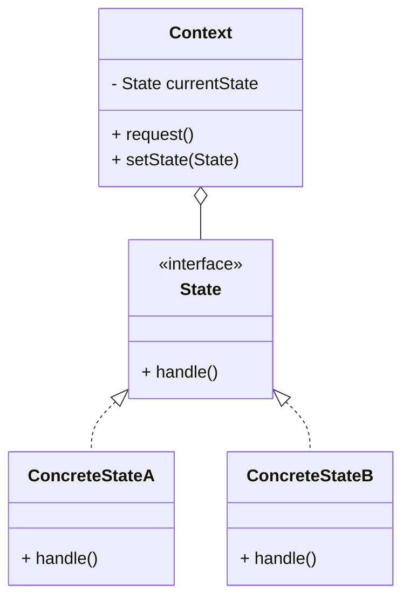

# SOLID Principles & Design Patterns - Vending Machine

## SOLID Principles Applied

### 1. Single Responsibility Principle (SRP)

**Definition**: A class should have ONE and ONLY ONE reason to change.

#### Examples in Our Design:

**✅ GOOD: ProductCatalog**
```java
// ONLY responsible for managing products
class ProductCatalog {
    private Map<String, Product> products;

    public void addProduct(Product p) { }
    public Product getProductByCode(String code) { }
    public void removeProduct(String id) { }
}
// ONE reason to change: Product management logic changes
```

**✅ GOOD: InventoryManager**
```java
// ONLY responsible for managing inventory quantities
class InventoryManager {
    private Map<String, Inventory> inventories;

    public void refillProduct(String id, int qty) { }
    public boolean deductProduct(String id) { }
    public int getQuantity(String id) { }
}
// ONE reason to change: Inventory tracking logic changes
```

**❌ BAD: God Class (Anti-pattern)**
```java
class VendingMachine {
    // Too many responsibilities!
    private List<Product> products; // Product management
    private Map<String, Integer> inventory; // Inventory management
    private Map<Coin, Integer> coins; // Cash management

    public void addProduct() { } // Product concern
    public void refillInventory() { } // Inventory concern
    public void refillCash() { } // Cash concern
    public void calculateChange() { } // Payment concern
    public void dispenseProduct() { } // Dispense concern

    // 5+ reasons to change! Violates SRP!
}
```

**How we fixed it**: Created separate managers (ProductCatalog, InventoryManager, CashInventory)

---

### 2. Open/Closed Principle (OCP)

**Definition**: Software entities should be OPEN for extension but CLOSED for modification.

#### Example 1: State Pattern

**✅ GOOD: Adding New State Without Modifying Existing Code**

```java
// Existing interface - CLOSED for modification
interface VendingMachineState {
    void selectProduct(String code);
    void insertCoin(Coin coin);
}

// Existing states - no changes needed
class IdleState implements VendingMachineState { }
class PaymentState implements VendingMachineState { }

// NEW state - OPEN for extension
class MaintenanceState implements VendingMachineState {
    public void selectProduct(String code) {
        System.out.println("Machine under maintenance");
    }

    public void insertCoin(Coin coin) {
        System.out.println("Machine under maintenance");
    }
}
```

**No existing code modified!** Just added new class.

#### Example 2: Adding New Payment Method (Future)

```java
// Current design is open for extension
enum PaymentMethod {
    CASH,
    CARD,     // Can add without changing existing logic
    UPI,      // Can add without changing existing logic
    MOBILE    // Can add without changing existing logic
}

// Future: Add CardPaymentStrategy without modifying CashPaymentStrategy
interface PaymentStrategy {
    boolean processPayment(Money amount);
}

class CashPaymentStrategy implements PaymentStrategy { }
class CardPaymentStrategy implements PaymentStrategy { } // New, no changes to cash
```

---

### 3. Liskov Substitution Principle (LSP)

**Definition**: Objects of a superclass should be replaceable with objects of subclass without breaking the application.

#### Example: State Pattern

```java
// Base type
VendingMachineState state;

// Can substitute with ANY state implementation
state = new IdleState(machine);        // ✅ Works
state = new PaymentState(machine);     // ✅ Works
state = new DispenseState(machine);    // ✅ Works

// All behave correctly according to interface contract
state.selectProduct("A1"); // Each handles differently but correctly
```

**Contract**: All states implement `VendingMachineState` interface correctly.

#### Counter-Example (Violation):

```java
// ❌ BAD: Violates LSP
class DispenseState implements VendingMachineState {
    public void insertCoin(Coin coin) {
        throw new UnsupportedOperationException(); // VIOLATES LSP!
        // Caller expects method to work, not throw exception
    }
}

// ✅ GOOD: Honor contract
class DispenseState implements VendingMachineState {
    public void insertCoin(Coin coin) {
        System.out.println("Cannot insert coin during dispense");
        // Returns gracefully, no exception
    }
}
```

---

### 4. Interface Segregation Principle (ISP)

**Definition**: Clients should not be forced to depend on interfaces they don't use.

#### Example: State Interface

**❌ BAD: Fat Interface**
```java
interface VendingMachineOperations {
    // User operations
    void selectProduct(String code);
    void insertCoin(Coin coin);
    void cancelTransaction();

    // Admin operations
    void refillInventory(String id, int qty);
    void updatePrice(String id, double price);
    void generateReport();

    // Maintenance operations
    void reset();
    void diagnostics();
}

// States forced to implement ALL methods, even if irrelevant!
class IdleState implements VendingMachineOperations {
    public void selectProduct(String code) { /* relevant */ }
    public void insertCoin(Coin coin) { /* relevant */ }

    // Forced to implement these even though not needed!
    public void refillInventory(String id, int qty) {
        throw new UnsupportedOperationException();
    }
    public void updatePrice(String id, double price) {
        throw new UnsupportedOperationException();
    }
    public void generateReport() {
        throw new UnsupportedOperationException();
    }
    // Violates ISP!
}
```

**✅ GOOD: Segregated Interfaces**
```java
// Separate interfaces for different clients
interface UserOperations {
    void selectProduct(String code);
    void insertCoin(Coin coin);
    void cancelTransaction();
}

interface AdminOperations {
    void refillInventory(String id, int qty);
    void updatePrice(String id, double price);
    void generateReport();
}

interface MaintenanceOperations {
    void reset();
    void diagnostics();
}

// States only implement what they need
class IdleState implements UserOperations {
    public void selectProduct(String code) { /* implement */ }
    public void insertCoin(Coin coin) { /* implement */ }
    public void cancelTransaction() { /* implement */ }
    // No forced methods!
}

// VendingMachine implements all (it's the facade)
class VendingMachine implements UserOperations, AdminOperations {
    // Can choose which interfaces to implement
}
```

---

### 5. Dependency Inversion Principle (DIP)

**Definition**: High-level modules should not depend on low-level modules. Both should depend on abstractions.

#### Example: Payment Processing

**❌ BAD: Direct Dependency on Concrete Class**
```java
class PaymentState {
    private CashPaymentHandler cashHandler; // Concrete class!

    public void processPayment() {
        cashHandler.handleCash(); // Tightly coupled
        // Cannot easily add card payment, UPI, etc.
    }
}
```

**✅ GOOD: Depend on Abstraction**
```java
// Abstraction (interface)
interface PaymentHandler {
    boolean processPayment(Money amount);
}

// Low-level module
class CashPaymentHandler implements PaymentHandler {
    public boolean processPayment(Money amount) {
        // Cash-specific logic
    }
}

// High-level module depends on abstraction
class PaymentState {
    private PaymentHandler paymentHandler; // Interface!

    public PaymentState(PaymentHandler handler) {
        this.paymentHandler = handler; // Injected
    }

    public void processPayment(Money amount) {
        paymentHandler.processPayment(amount); // Polymorphic call
    }
}

// Easy to add new payment methods
class CardPaymentHandler implements PaymentHandler {
    public boolean processPayment(Money amount) {
        // Card-specific logic
    }
}
```

---

## Design Patterns Applied

### 1. Singleton Pattern

**Used in**: VendingMachine class

**Why**: Only ONE vending machine instance should exist.

**Implementation**:
```java
public class VendingMachine {
    // Single instance
    private static VendingMachine instance;

    // Private constructor - prevents external instantiation
    private VendingMachine() {
        this.catalog = new ProductCatalog();
        this.currentState = new IdleState(this);
    }

    // Public access point
    public static synchronized VendingMachine getInstance() {
        if (instance == null) {
            instance = new VendingMachine();
        }
        return instance;
    }
}

// Usage
VendingMachine machine = VendingMachine.getInstance();
```

**Benefits**:
- ✓ Controlled access to single instance
- ✓ Reduced memory footprint
- ✓ Global access point
- ✓ Lazy initialization

**Thread-Safety**:
```java
// Option 1: Synchronized method (our choice)
public static synchronized VendingMachine getInstance() { }

// Option 2: Double-checked locking
public static VendingMachine getInstance() {
    if (instance == null) {
        synchronized (VendingMachine.class) {
            if (instance == null) {
                instance = new VendingMachine();
            }
        }
    }
    return instance;
}

// Option 3: Eager initialization
private static final VendingMachine instance = new VendingMachine();
```

---

### 2. State Pattern ⭐ (CORE REQUIREMENT)

**Used in**: VendingMachine state management

**Problem**: Vending machine behaves differently based on current state.

**Solution**: Encapsulate each state in a separate class.

**Structure**:


**Our Implementation**:
- **Context**: VendingMachine
- **State**: VendingMachineState interface
- **Concrete States**: IdleState, PaymentState, DispenseState, etc.

**Benefits**:
- ✓ Eliminates complex if-else chains
- ✓ Each state encapsulated in own class (SRP)
- ✓ Easy to add new states (OCP)
- ✓ State-specific behavior clearly separated
- ✓ State transitions explicit

---

### 3. Strategy Pattern

**Potential Use**: Different payment methods (future enhancement)

**Problem**: Need to support multiple payment algorithms (cash, card, UPI).

**Solution**: Define family of algorithms, encapsulate each, make them interchangeable.

**Implementation** (Future):
```java
// Strategy interface
interface PaymentStrategy {
    boolean processPayment(Money amount);
    boolean refund(String transactionId, Money amount);
}

// Concrete strategies
class CashPaymentStrategy implements PaymentStrategy {
    public boolean processPayment(Money amount) {
        // Cash-specific: check inventory, calculate change
        return changeCalculator.canMakeChange(amount);
    }
}

class CardPaymentStrategy implements PaymentStrategy {
    public boolean processPayment(Money amount) {
        // Card-specific: call payment gateway
        return paymentGateway.charge(amount);
    }
}

class UPIPaymentStrategy implements PaymentStrategy {
    public boolean processPayment(Money amount) {
        // UPI-specific: generate QR, wait for payment
        return upiHandler.processPayment(amount);
    }
}

// Context uses strategy
class PaymentProcessor {
    private PaymentStrategy strategy;

    public void setStrategy(PaymentStrategy strategy) {
        this.strategy = strategy;
    }

    public boolean process(Money amount) {
        return strategy.processPayment(amount);
    }
}

// Usage
PaymentProcessor processor = new PaymentProcessor();
processor.setStrategy(new CashPaymentStrategy());
processor.process(new Money(20)); // Uses cash logic

processor.setStrategy(new CardPaymentStrategy());
processor.process(new Money(20)); // Uses card logic
```

**Benefits**:
- ✓ Easy to add new payment methods
- ✓ Algorithm selection at runtime
- ✓ Eliminates conditional statements

---

### 4. Factory Pattern

**Potential Use**: Creating different product types or states

**Example**: ProductFactory
```java
class ProductFactory {
    public static Product createProduct(ProductType type,
                                       String id, String name, double price, String code) {
        switch (type) {
            case BEVERAGE:
                return new BeverageProduct(id, name, price, code);
            case SNACK:
                return new SnackProduct(id, name, price, code);
            case FOOD:
                return new FoodProduct(id, name, price, code);
            default:
                throw new IllegalArgumentException("Unknown type");
        }
    }
}

// Usage
Product coke = ProductFactory.createProduct(
    ProductType.BEVERAGE, "P001", "Coke", 20.0, "A1"
);
```

**Benefits**:
- ✓ Centralized object creation
- ✓ Easy to add new product types
- ✓ Hides complexity of construction

---

### 5. Observer Pattern

**Potential Use**: Notify admin when inventory low

**Example**:
```java
// Subject
class InventoryManager {
    private List<InventoryObserver> observers = new ArrayList<>();

    public void addObserver(InventoryObserver observer) {
        observers.add(observer);
    }

    public void deductProduct(String productId) {
        // ... deduct logic
        if (inventory.needsRefill()) {
            notifyObservers(productId);
        }
    }

    private void notifyObservers(String productId) {
        for (InventoryObserver observer : observers) {
            observer.onLowStock(productId);
        }
    }
}

// Observer interface
interface InventoryObserver {
    void onLowStock(String productId);
}

// Concrete observer
class AdminNotifier implements InventoryObserver {
    public void onLowStock(String productId) {
        System.out.println("ALERT: Product " + productId + " is low on stock!");
        sendEmailToAdmin(productId);
    }
}

// Usage
InventoryManager inv = new InventoryManager();
inv.addObserver(new AdminNotifier());
inv.deductProduct("P001"); // If low, admin gets notified
```

---

### 6. Value Object Pattern

**Used in**: Money class

**Characteristics**:
- Immutable
- Equality based on value, not identity
- No setters

**Implementation**:
```java
public final class Money {
    private final double amount; // final = immutable

    public Money(double amount) {
        this.amount = amount;
    }

    public double getAmount() {
        return amount;
    }

    // Operations return NEW objects (immutability)
    public Money add(Money other) {
        return new Money(this.amount + other.amount);
    }

    public Money subtract(Money other) {
        return new Money(this.amount - other.amount);
    }

    // Value-based equality
    @Override
    public boolean equals(Object obj) {
        if (!(obj instanceof Money)) return false;
        Money other = (Money) obj;
        return Math.abs(this.amount - other.amount) < 0.001;
    }

    @Override
    public int hashCode() {
        return Double.hashCode(amount);
    }
}
```

**Benefits**:
- ✓ Thread-safe (immutable)
- ✓ Can be shared safely
- ✓ Prevents accidental modifications

---

## Pattern Comparison Table

| Pattern | Used In | Purpose | Key Benefit |
|---------|---------|---------|-------------|
| **Singleton** | VendingMachine | Ensure single instance | Controlled access |
| **State** | State management | Vary behavior by state | Eliminate if-else |
| **Strategy** | Payment methods (future) | Interchangeable algorithms | Runtime selection |
| **Factory** | Product creation (optional) | Centralized creation | Hide complexity |
| **Observer** | Inventory alerts (optional) | Notify on events | Loose coupling |
| **Value Object** | Money | Immutable value | Thread-safety |

---

## Anti-Patterns to Avoid

### 1. God Class
**Problem**: One class does everything
**Solution**: Use SRP, create managers

### 2. Primitive Obsession
**Problem**: Using primitives instead of objects
**Solution**: Create Money, Email, ProductCode classes

### 3. Feature Envy
**Problem**: Method uses more data from another class than its own
**Solution**: Move method to the class with data

### 4. Long Method
**Problem**: Methods with 50+ lines
**Solution**: Extract smaller methods

### 5. Shotgun Surgery
**Problem**: One change requires modifying many classes
**Solution**: Better encapsulation, cohesive classes

---

## Design Pattern Interview Questions

**Q1: Why did you use Singleton for VendingMachine?**
**A**: Only one physical vending machine exists. Singleton ensures:
- Single source of truth
- Consistent state management
- Global access point

**Q2: Can State pattern be replaced with if-else?**
**A**: Yes, but:
- if-else becomes unmaintainable with many states
- State pattern follows OCP (easy to add new states)
- Better testability (test each state independently)
- Clearer code organization

**Q3: When would you NOT use Singleton?**
**A**: When:
- Managing multiple vending machines (use VendingMachineManager)
- Need dependency injection for testing
- Parallel/concurrent instances needed

**Q4: Difference between State and Strategy?**
**A**:
- **State**: Object changes behavior when internal state changes (automatic transitions)
- **Strategy**: Client chooses algorithm explicitly (manual selection)

---

**SOLID & Patterns Complete!** ✅

Our design demonstrates:
- ✓ All 5 SOLID principles
- ✓ 6+ design patterns
- ✓ Clean, maintainable architecture
- ✓ Easy to extend and test
