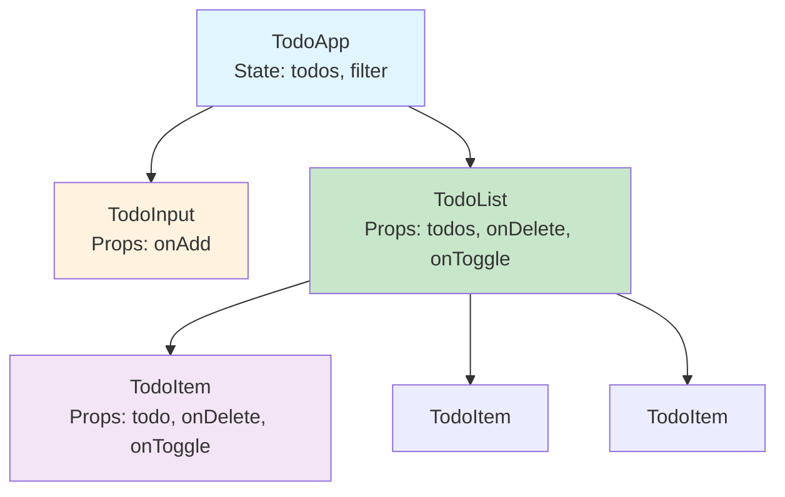
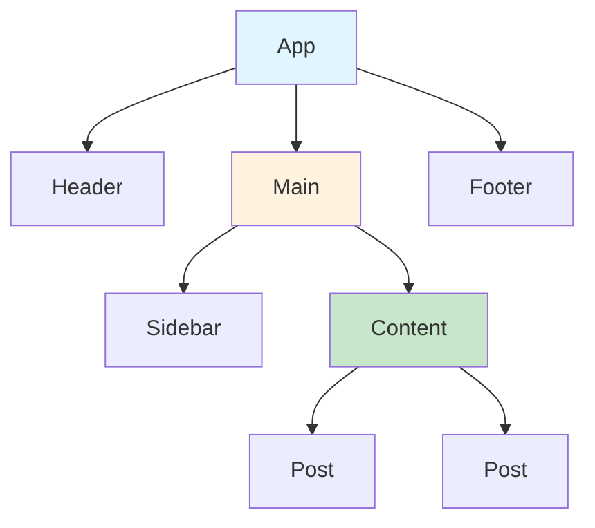
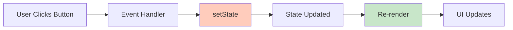
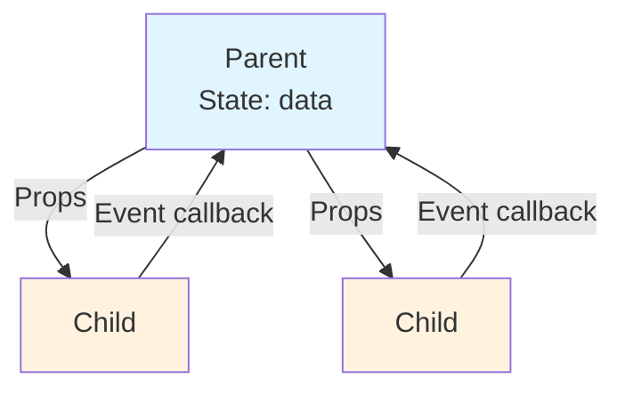
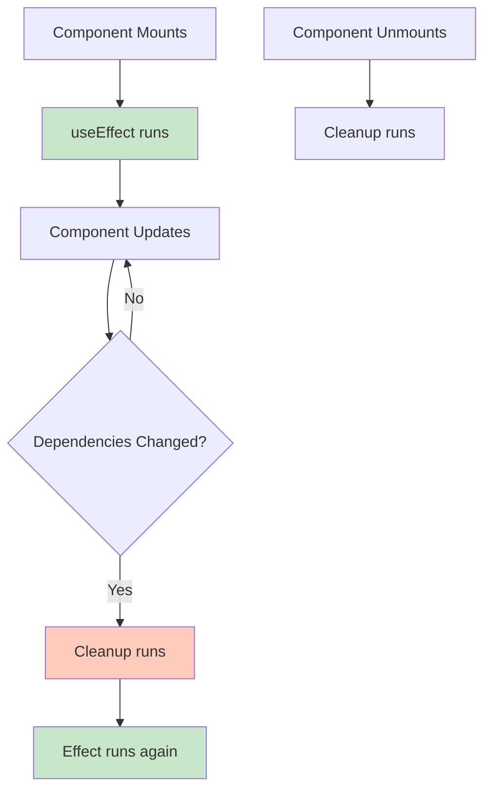

# React Frontend Interview - Complete Approach Guide

> Master React coding interviews with systematic approaches, detailed explanations, and best practices

---

## Overview

This guide teaches you **HOW TO APPROACH** any React frontend coding interview question methodically. Whether you're given a Counter or Connect Four, follow this framework to demonstrate senior-level thinking.

---

## The 5-Step Interview Framework

### Step 1: Clarify Requirements (2-3 minutes)

**ALWAYS start by asking questions** - This shows you think before coding.

#### Questions to Ask:

**Functional Requirements:**
```
1. What are the core features?
   - Example: "For a Todo app, do you want add, delete, edit, and mark complete?"

2. What's the user interaction flow?
   - Example: "Should the search trigger on every keystroke or after a delay?"

3. Are there any edge cases?
   - Example: "What happens if the user submits an empty form?"

4. What's the data structure?
   - Example: "Is the data coming from an API or is it hardcoded?"
```

**Non-Functional Requirements:**
```
1. Performance expectations?
   - "Should I optimize for large datasets (10,000+ items)?"

2. Accessibility requirements?
   - "Do you want keyboard navigation and ARIA attributes?"

3. Browser support?
   - "Should this work on IE11 or just modern browsers?"

4. Styling expectations?
   - "Should I focus on functionality or also make it look good?"
```

**Example Dialogue:**
```
Interviewer: "Build a Todo List"

You: "Great! Let me clarify a few things:
1. Should users be able to edit existing todos?
2. Do we need persistence (localStorage)?
3. Should there be filtering (all/active/completed)?
4. Any character limit on todo text?"

✅ This shows you're thoughtful, not just a code monkey!
```

---

### Step 2: Think Out Loud - Break Down the Problem (3-5 minutes)

**Verbally explain your approach before coding.**

#### Component Structure

```
"I'm thinking we'll need these components:
1. TodoApp (parent) - manages state
2. TodoInput - for adding new todos
3. TodoList - displays todos
4. TodoItem - individual todo with actions"
```

#### State Identification

```
"For state, we'll need:
1. todos - array of todo objects
2. inputValue - controlled input for new todo
3. filter - current filter (all/active/completed)"
```

#### Data Flow

```
"The data flow will be:
1. User types in TodoInput
2. On submit, TodoApp adds to todos array
3. TodoApp passes todos down to TodoList
4. TodoList maps over todos and renders TodoItems
5. TodoItem receives delete/toggle callbacks from TodoApp"
```

**Visual Aid:**


---

### Step 3: Start with the Simplest Version (10-15 minutes)

**Don't over-engineer!** Start with basic functionality, then iterate.

#### Version 1: Core Functionality

```jsx
// STEP 1: Basic structure (no edge cases)
function TodoApp() {
  const [todos, setTodos] = useState([]);
  const [input, setInput] = useState('');

  const addTodo = () => {
    setTodos([...todos, { id: Date.now(), text: input, done: false }]);
    setInput('');
  };

  return (
    <div>
      <input value={input} onChange={e => setInput(e.target.value)} />
      <button onClick={addTodo}>Add</button>
      <ul>
        {todos.map(todo => <li key={todo.id}>{todo.text}</li>)}
      </ul>
    </div>
  );
}
```

**Tell the interviewer:**
```
"I'm starting with the MVP - add and display todos.
Once this works, I'll add:
1. Delete functionality
2. Toggle complete
3. Input validation
4. Styling"
```

---

### Step 4: Iterate and Add Features (15-20 minutes)

**Now enhance systematically.**

#### Version 2: Add More Features

```jsx
// STEP 2: Add delete and toggle
const deleteTodo = (id) => {
  setTodos(todos.filter(todo => todo.id !== id));
};

const toggleTodo = (id) => {
  setTodos(todos.map(todo =>
    todo.id === id ? { ...todo, done: !todo.done } : todo
  ));
};
```

#### Version 3: Add Validation

```jsx
// STEP 3: Validate input
const addTodo = () => {
  // WHY trim()? Remove leading/trailing whitespace
  const trimmed = input.trim();

  // WHY check empty? Prevent empty todos
  if (!trimmed) {
    alert('Todo cannot be empty!');
    return;
  }

  // WHY check length? Prevent excessively long todos
  if (trimmed.length > 100) {
    alert('Todo too long (max 100 chars)');
    return;
  }

  setTodos([...todos, { id: Date.now(), text: trimmed, done: false }]);
  setInput('');
};
```

#### Version 4: Extract Components

```jsx
// STEP 4: Extract for reusability and readability
function TodoInput({ onAdd }) { /* ... */ }
function TodoList({ todos, onDelete, onToggle }) { /* ... */ }
function TodoItem({ todo, onDelete, onToggle }) { /* ... */ }
```

---

### Step 5: Discuss Trade-offs and Optimizations (5-10 minutes)

**Show you understand performance and best practices.**

#### Common Optimizations to Mention

**1. Preventing Unnecessary Re-renders**
```jsx
// ❌ BEFORE: Creates new function on every render
<TodoItem onDelete={() => deleteTodo(todo.id)} />

// ✅ AFTER: Memoized function
const deleteTodo = useCallback((id) => {
  setTodos(prev => prev.filter(t => t.id !== id));
}, []);

// Wrap TodoItem in React.memo
const TodoItem = React.memo(({ todo, onDelete }) => { /* ... */ });
```

**2. Using Keys Properly**
```jsx
// ❌ WRONG: Index as key (breaks when reordering)
{todos.map((todo, index) => <TodoItem key={index} todo={todo} />)}

// ✅ RIGHT: Unique stable ID
{todos.map(todo => <TodoItem key={todo.id} todo={todo} />)}
```

**3. Functional State Updates**
```jsx
// ❌ RISK: Stale closure
setTodos([...todos, newTodo]);

// ✅ SAFE: Always get latest state
setTodos(prev => [...prev, newTodo]);
```

---

## Hook Usage Guide - When and Why

### useState

**WHEN TO USE:**
- Need to track data that changes (count, input value, toggle state)
- Need React to re-render when data changes

**HOW TO THINK:**
```
"What data changes in my component?"
→ That's state!
```

**PATTERN:**
```jsx
// ✅ Simple value
const [count, setCount] = useState(0);

// ✅ Object
const [user, setUser] = useState({ name: '', age: 0 });

// ✅ Array
const [items, setItems] = useState([]);
```

**BEGINNER MISTAKES:**
```jsx
// ❌ Mutating state directly
todos.push(newTodo);  // React won't detect change!

// ✅ Create new array
setTodos([...todos, newTodo]);

// ❌ Direct object mutation
user.name = 'John';  // React won't detect change!

// ✅ Create new object
setUser({ ...user, name: 'John' });
```

---

### useEffect

**WHEN TO USE:**
- Fetching data from API
- Setting up subscriptions (WebSocket, intervals)
- Manually changing the DOM
- Logging/analytics

**HOW TO THINK:**
```
"Do I need to do something when component mounts or when a value changes?"
→ That's a side effect!
```

**PATTERN:**
```jsx
// ✅ Run once on mount
useEffect(() => {
  fetchData();
}, []);  // Empty array = run once

// ✅ Run when dependency changes
useEffect(() => {
  searchUsers(query);
}, [query]);  // Run when query changes

// ✅ Cleanup on unmount
useEffect(() => {
  const timer = setInterval(() => { /* ... */ }, 1000);

  return () => clearInterval(timer);  // Cleanup!
}, []);
```

**BEGINNER MISTAKES:**
```jsx
// ❌ Missing dependency (stale closure)
useEffect(() => {
  console.log(count);  // Will always log initial count
}, []);  // Should include [count]

// ❌ Forgetting cleanup (memory leak)
useEffect(() => {
  const timer = setInterval(() => setCount(c => c + 1), 1000);
  // Missing: return () => clearInterval(timer);
}, []);

// ❌ Infinite loop
useEffect(() => {
  setCount(count + 1);  // Changes count
}, [count]);  // Triggers effect again → infinite loop
```

---

### useRef

**WHEN TO USE:**
- Access DOM elements directly
- Store value that persists across renders but doesn't cause re-render
- Store previous values

**HOW TO THINK:**
```
"Do I need a value that persists but doesn't trigger re-renders?"
→ Use useRef!
```

**PATTERN:**
```jsx
// ✅ DOM access
const inputRef = useRef(null);

useEffect(() => {
  inputRef.current.focus();  // Focus input on mount
}, []);

return <input ref={inputRef} />;

// ✅ Persist value without re-render
const renderCount = useRef(0);

useEffect(() => {
  renderCount.current += 1;  // Doesn't cause re-render
});

// ✅ Store previous value
const prevCountRef = useRef();

useEffect(() => {
  prevCountRef.current = count;
});

const prevCount = prevCountRef.current;
```

**BEGINNER MISTAKES:**
```jsx
// ❌ Using state when ref is better
const [inputElement, setInputElement] = useState(null);  // Causes re-render!

// ✅ Use ref instead
const inputRef = useRef(null);

// ❌ Reading ref.current in render
return <div>{renderCount.current}</div>;  // Won't update UI!

// ✅ Use state if you need to display value
const [renderCount, setRenderCount] = useState(0);
```

---

### useMemo

**WHEN TO USE:**
- Expensive calculations (sorting large arrays, filtering data)
- Creating objects/arrays that are passed as props (prevent re-renders)

**HOW TO THINK:**
```
"Is this calculation expensive and does it depend on specific values?"
→ Memoize it!
```

**PATTERN:**
```jsx
// ✅ Expensive calculation
const sortedItems = useMemo(() => {
  console.log('Sorting...');
  return items.sort((a, b) => a.price - b.price);
}, [items]);  // Only re-sort when items change

// ✅ Filtered list
const filteredTodos = useMemo(() => {
  return todos.filter(todo => !todo.done);
}, [todos]);

// ✅ Derived state
const total = useMemo(() => {
  return cartItems.reduce((sum, item) => sum + item.price, 0);
}, [cartItems]);
```

**BEGINNER MISTAKES:**
```jsx
// ❌ Overusing (premature optimization)
const doubled = useMemo(() => count * 2, [count]);  // Overkill!

// ✅ Just compute directly
const doubled = count * 2;

// ❌ Missing dependencies
const filtered = useMemo(() => {
  return items.filter(item => item.category === category);
}, [items]);  // Missing category!

// ✅ Include all dependencies
const filtered = useMemo(() => {
  return items.filter(item => item.category === category);
}, [items, category]);
```

**WHEN NOT TO USE:**
- Simple calculations (multiplication, string concatenation)
- First render (no previous render to compare)
- When dependencies change frequently (memoization overhead)

---

### useCallback

**WHEN TO USE:**
- Passing callbacks to memoized child components
- Callbacks in useEffect dependencies
- Preventing function re-creation

**HOW TO THINK:**
```
"Is this function being passed to a child component or used in useEffect?"
→ Consider useCallback!
```

**PATTERN:**
```jsx
// ✅ Prevent child re-renders
const handleDelete = useCallback((id) => {
  setTodos(prev => prev.filter(t => t.id !== id));
}, []);  // No dependencies

// Use with React.memo
const TodoItem = React.memo(({ todo, onDelete }) => { /* ... */ });

// ✅ Stable function for useEffect
const fetchUser = useCallback(async () => {
  const data = await fetch(`/users/${userId}`);
  setUser(data);
}, [userId]);

useEffect(() => {
  fetchUser();
}, [fetchUser]);  // Won't cause infinite loop
```

**BEGINNER MISTAKES:**
```jsx
// ❌ Using without React.memo (no benefit)
const handleClick = useCallback(() => { /* ... */ }, []);
// But child component is NOT memoized → no benefit

// ❌ Missing dependencies
const handleUpdate = useCallback(() => {
  console.log(user.name);  // Uses user
}, []);  // Should include [user]

// ❌ Inline functions with memoized components (defeats purpose)
<MemoizedComponent onClick={() => handleClick(id)} />
// Creates new function every render!

// ✅ Use useCallback for the wrapper
const handleClickWrapper = useCallback(() => handleClick(id), [id]);
<MemoizedComponent onClick={handleClickWrapper} />
```

---

### useReducer

**WHEN TO USE:**
- Complex state with multiple sub-values
- Next state depends on previous state
- Want to separate state logic from component

**HOW TO THINK:**
```
"Do I have multiple related state values or complex update logic?"
→ Use useReducer!
```

**PATTERN:**
```jsx
// ✅ Complex state
const initialState = {
  user: null,
  loading: false,
  error: null
};

function reducer(state, action) {
  switch (action.type) {
    case 'FETCH_START':
      return { ...state, loading: true, error: null };

    case 'FETCH_SUCCESS':
      return { ...state, loading: false, user: action.payload };

    case 'FETCH_ERROR':
      return { ...state, loading: false, error: action.error };

    default:
      return state;
  }
}

const [state, dispatch] = useReducer(reducer, initialState);

// Usage:
dispatch({ type: 'FETCH_START' });
dispatch({ type: 'FETCH_SUCCESS', payload: userData });
```

**WHEN TO PREFER OVER useState:**
```
useState → Simple, independent state values
useReducer → Complex, related state values
```

---

## Common Interview Patterns

### Pattern 1: Controlled Components

**WHAT:** React state controls form inputs

**WHY:** Single source of truth, can validate/transform input

```jsx
function ControlledInput() {
  const [value, setValue] = useState('');

  // React state controls the input
  return (
    <input
      value={value}
      onChange={(e) => setValue(e.target.value)}
    />
  );
}
```

**UNCONTROLLED (Don't do in interviews):**
```jsx
// ❌ DOM controls the input
<input ref={inputRef} />
```

---

### Pattern 2: Lifting State Up

**WHAT:** Move state to common ancestor

**WHY:** Share state between sibling components

```jsx
// ❌ BEFORE: State in child (siblings can't share)
function SearchBar() {
  const [query, setQuery] = useState('');
  // ...
}

function Results() {
  // Can't access query!
}

// ✅ AFTER: Lift state to parent
function App() {
  const [query, setQuery] = useState('');  // Shared state

  return (
    <>
      <SearchBar query={query} setQuery={setQuery} />
      <Results query={query} />
    </>
  );
}
```

---

### Pattern 3: Composition (Children Prop)

**WHAT:** Pass components as children

**WHY:** Flexible, reusable wrapper components

```jsx
// ✅ Card wrapper
function Card({ children }) {
  return (
    <div className="card">
      {children}
    </div>
  );
}

// Usage:
<Card>
  <h2>Title</h2>
  <p>Content</p>
</Card>
```

---

### Pattern 4: Render Props

**WHAT:** Share code between components using a prop whose value is a function

```jsx
function DataFetcher({ url, render }) {
  const [data, setData] = useState(null);

  useEffect(() => {
    fetch(url).then(r => r.json()).then(setData);
  }, [url]);

  return render(data);
}

// Usage:
<DataFetcher
  url="/api/users"
  render={(data) => <UserList users={data} />}
/>
```

---

## Diagram Templates for Interviews

### Component Hierarchy



### State Flow



### Data Flow (Props Down, Events Up)



### useEffect Lifecycle



---

## Interview Dialogue Examples

### Example 1: Build a Counter

**Interviewer:** "Build a counter with increment and decrement buttons."

**You:** "Sure! Let me clarify:
1. Should there be a minimum or maximum value?
2. Do you want a reset button?
3. Should I use any specific styling?"

**Interviewer:** "No limits, add reset, basic styling is fine."

**You:** "Great! I'll approach this by:
1. Using useState for the count
2. Creating three event handlers (increment, decrement, reset)
3. Rendering the count and buttons

Let me start with the basic version..."

[Code basic version]

**You:** "This works! Should I add:
1. Increment/decrement by custom amount?
2. Keyboard shortcuts?
3. Animation?"

---

### Example 2: Build a Search with Debounce

**Interviewer:** "Build a search that doesn't query on every keystroke."

**You:** "Got it! So we want debouncing. Let me clarify:
1. What delay do you want? 300ms?
2. Should there be a loading indicator?
3. Where does the data come from - API or hardcoded?"

**Interviewer:** "500ms delay, show loading, use JSONPlaceholder API."

**You:** "Perfect! My approach:
1. Use useState for input and results
2. Use useEffect with setTimeout for debouncing
3. Cleanup previous timeout on new input
4. Fetch from API and show loading state

Let me explain the debounce logic with a diagram..."

[Draw timing diagram]

**You:** "Here's why cleanup is crucial:
If user types 'hello' quickly, we don't want 5 API calls.
We only want the last one after they stop typing."

---

## Common Beginner Mistakes Summary

### Mistake 1: Mutating State Directly

```jsx
// ❌ WRONG
todos.push(newTodo);
setTodos(todos);  // React won't detect change!

// ✅ RIGHT
setTodos([...todos, newTodo]);
```

**WHY IT MATTERS:**
React uses `Object.is()` to compare prev and next state. Same array reference = no re-render!

---

### Mistake 2: Forgetting Keys in Lists

```jsx
// ❌ WRONG
{items.map(item => <div>{item.name}</div>)}

// ❌ ALSO WRONG (index as key)
{items.map((item, i) => <div key={i}>{item.name}</div>)}

// ✅ RIGHT
{items.map(item => <div key={item.id}>{item.name}</div>)}
```

**WHY IT MATTERS:**
- Without key: React re-renders entire list on change
- With index: Breaks when reordering items
- With unique ID: React efficiently updates only changed items

---

### Mistake 3: Missing useEffect Dependencies

```jsx
// ❌ WRONG (stale closure)
useEffect(() => {
  console.log(count);  // Always logs initial count
}, []);

// ✅ RIGHT
useEffect(() => {
  console.log(count);
}, [count]);
```

**WHY IT MATTERS:**
Effect captures variables from when it was created. Missing dependency = stale value.

---

### Mistake 4: Creating Functions in Render

```jsx
// ❌ WRONG (new function every render)
{items.map(item => (
  <Item onClick={() => handleClick(item.id)} />
))}

// ✅ RIGHT (memoized)
const handleClick = useCallback((id) => { /* ... */ }, []);

{items.map(item => (
  <Item onClick={() => handleClick(item.id)} />
))}

// ✅ BETTER (no inline function)
{items.map(item => (
  <Item id={item.id} onClickId={handleClick} />
))}
```

---

### Mistake 5: Forgetting Cleanup

```jsx
// ❌ WRONG (memory leak!)
useEffect(() => {
  const timer = setInterval(() => setCount(c => c + 1), 1000);
}, []);

// ✅ RIGHT
useEffect(() => {
  const timer = setInterval(() => setCount(c => c + 1), 1000);

  return () => clearInterval(timer);  // Cleanup!
}, []);
```

**WHY IT MATTERS:**
Without cleanup, interval keeps running even after component unmounts → memory leak!

---

## Interview Checklist

### Before You Start Coding

- [ ] Clarify requirements
- [ ] Ask about edge cases
- [ ] Confirm styling expectations
- [ ] Understand data structure
- [ ] Ask about performance needs

### While Coding

- [ ] Think out loud
- [ ] Start simple, iterate
- [ ] Explain WHY for each decision
- [ ] Use meaningful variable names
- [ ] Add comments for complex logic

### Code Quality

- [ ] No direct state mutation
- [ ] Functional state updates
- [ ] Proper keys in lists
- [ ] useEffect cleanup
- [ ] Correct hook dependencies

### After Basic Version Works

- [ ] Add validation/error handling
- [ ] Extract reusable components
- [ ] Optimize (useMemo, useCallback)
- [ ] Add accessibility (ARIA, keyboard)
- [ ] Discuss trade-offs

---

## Time Management

**45-Minute Interview:**
- 5 min: Clarify requirements
- 10 min: Think out loud, plan approach
- 20 min: Code basic version
- 10 min: Enhance, optimize, discuss

**30-Minute Interview:**
- 2 min: Clarify requirements
- 3 min: Plan approach
- 20 min: Code basic version
- 5 min: Quick enhancements

---

## What Interviewers Look For

### Junior Level (0-2 years)
✅ Basic useState and useEffect
✅ Event handling
✅ Controlled components
✅ List rendering with keys
✅ No major mistakes (state mutation, missing keys)

### Mid Level (2-4 years)
✅ All junior skills
✅ useRef, useCallback, useMemo
✅ Custom hooks
✅ Performance optimization
✅ Clean component structure

### Senior Level (4+ years)
✅ All mid skills
✅ Design patterns (compound components, render props)
✅ Context API + useReducer
✅ Accessibility
✅ Explaining trade-offs
✅ Production-ready code

---

## Final Tips

### DO:
✅ Ask questions before coding
✅ Think out loud
✅ Start simple, iterate
✅ Explain WHY, not just WHAT
✅ Test edge cases
✅ Discuss performance

### DON'T:
❌ Jump into coding immediately
❌ Over-engineer from start
❌ Stay silent while coding
❌ Ignore edge cases
❌ Forget accessibility
❌ Skip testing your code

---

## Summary

**The key to React interviews isn't memorizing solutions - it's understanding:**

1. **How to think** systematically
2. **When to use** each hook
3. **Why** certain patterns exist
4. **What** mistakes to avoid
5. **How** to communicate your thought process

**Practice this framework with every problem, and you'll ace any React interview!**

---

## Next Steps

1. Read through Easy/Medium/Hard question files
2. Code along with examples
3. Study the diagrams
4. Practice explaining out loud
5. Build mini-projects using these patterns

**Good luck! 🚀**
