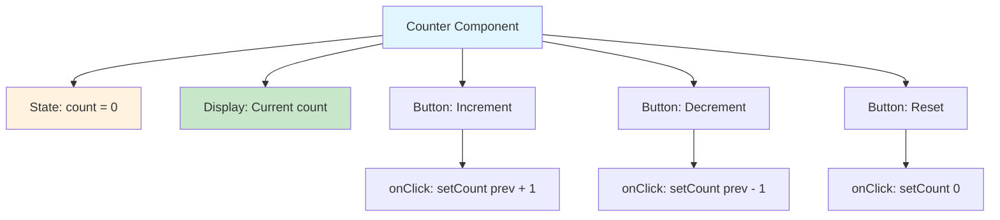
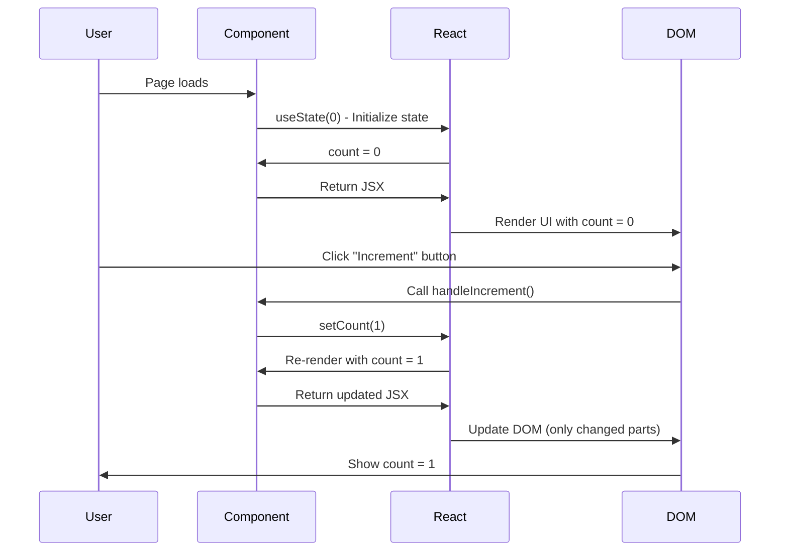
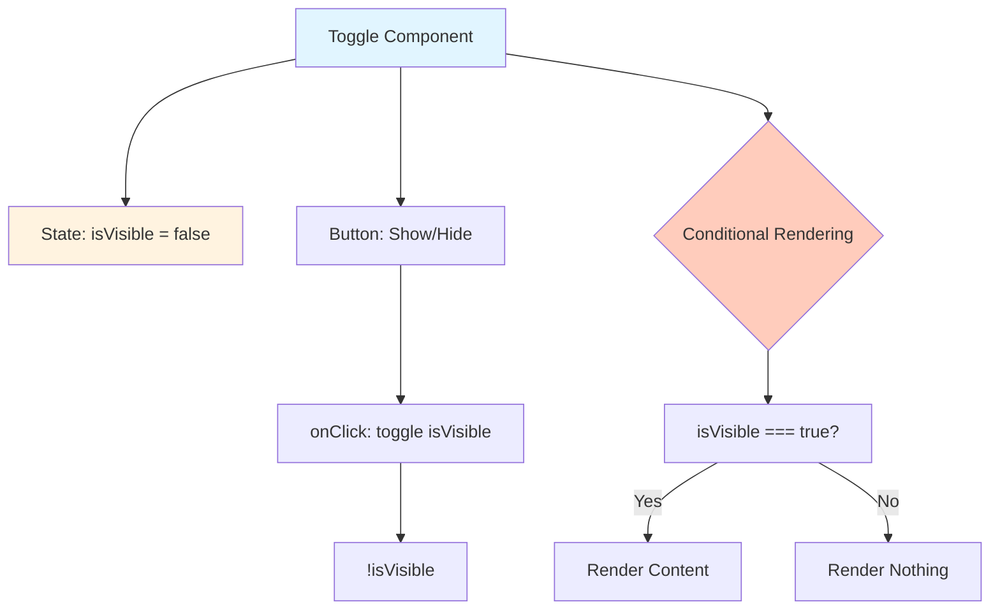
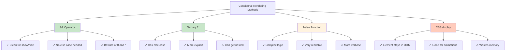
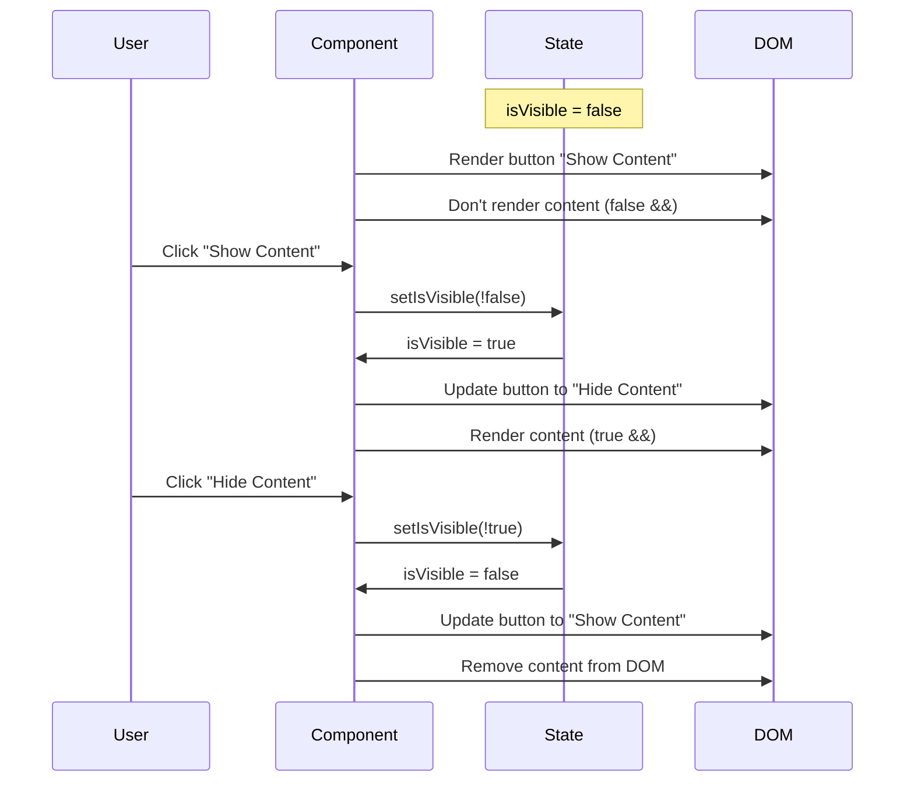
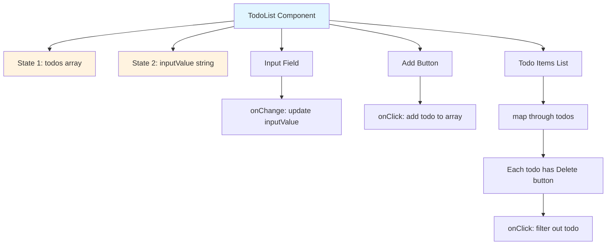
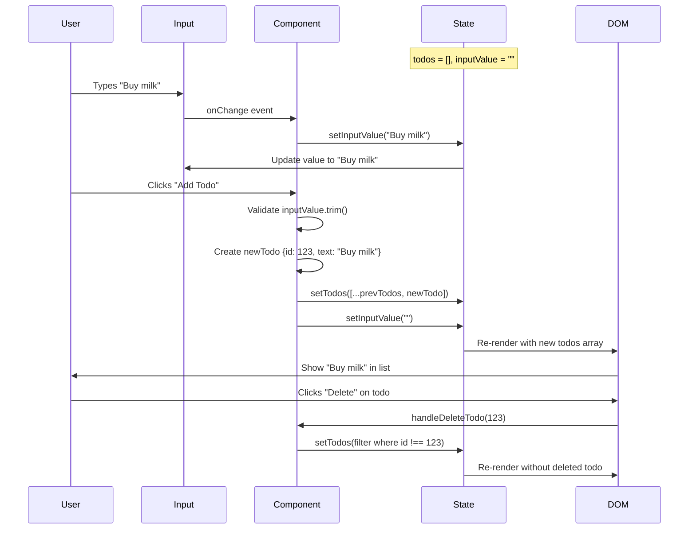

# ReactJS Frontend Interview Questions - EASY LEVEL

## Table of Contents
1. [Counter Component](#1-counter-component)
2. [Toggle Component (Show/Hide)](#2-toggle-component-showhide)
3. [Todo List (Basic CRUD)](#3-todo-list-basic-crud)
4. [Simple Form with Validation](#4-simple-form-with-validation)
5. [Controlled Input Component](#5-controlled-input-component)

---

## 1. Counter Component

### Problem Statement
Create a counter component with increment, decrement, and reset buttons.

### What Interviewer is Testing
- Basic understanding of `useState` hook
- Event handling in React
- Component rendering and re-rendering
- Button click handlers

### How to Think & Approach

#### Step 1: Understand the Requirements
```
User Story: As a user, I want to:
- See a number displayed (starting at 0)
- Click "Increment" to add 1
- Click "Decrement" to subtract 1
- Click "Reset" to go back to 0
```

#### Step 2: Identify State
- What data changes? → The counter value
- Where should state live? → In the Counter component itself

#### Step 3: Plan the Component Structure


### Solution with Detailed Comments

```jsx
import React, { useState } from 'react';

/**
 * Counter Component - Easy Level
 *
 * PURPOSE: Demonstrate basic state management with useState hook
 *
 * Key Concepts:
 * 1. useState - React hook for managing component state
 * 2. Event handlers - Functions that respond to user actions
 * 3. Re-rendering - Component re-renders when state changes
 */
function Counter() {
  // WHY useState?
  // - We need to store a value (count) that changes over time
  // - When count changes, React should re-render the component to show the new value
  // - useState returns [currentValue, functionToUpdateValue]

  // SYNTAX: const [stateVariable, setStateFunction] = useState(initialValue);
  const [count, setCount] = useState(0);

  // WHY separate functions instead of inline?
  // - Better readability
  // - Easier to add logic later (e.g., analytics, validation)
  // - Can reuse the function

  /**
   * Increment the counter by 1
   *
   * WHY use functional update (prevCount => prevCount + 1)?
   * - Ensures we're working with the latest state
   * - Important when multiple state updates happen quickly
   * - React batches state updates, so direct count + 1 might use stale value
   */
  const handleIncrement = () => {
    setCount(prevCount => prevCount + 1);
    // BEGINNER MISTAKE: setCount(count + 1)
    // This can cause issues with stale state in async operations
  };

  /**
   * Decrement the counter by 1
   */
  const handleDecrement = () => {
    setCount(prevCount => prevCount - 1);
  };

  /**
   * Reset counter to initial value (0)
   *
   * WHY not use functional update here?
   * - We're setting a fixed value (0), not based on previous state
   * - Functional update is only needed when new value depends on old value
   */
  const handleReset = () => {
    setCount(0);
  };

  // RENDERING:
  // - Every time setCount is called, this component re-renders
  // - React efficiently updates only the parts of DOM that changed
  return (
    <div style={{ padding: '20px', textAlign: 'center' }}>
      {/* Display current count */}
      <h1>Counter: {count}</h1>

      {/*
        WHY onClick={handleIncrement} and not onClick={handleIncrement()}?
        - onClick={handleIncrement()} would CALL the function immediately during render
        - onClick={handleIncrement} PASSES the function to be called later when clicked
      */}
      <button onClick={handleIncrement}>
        Increment (+1)
      </button>

      <button onClick={handleDecrement}>
        Decrement (-1)
      </button>

      <button onClick={handleReset}>
        Reset
      </button>
    </div>
  );
}

export default Counter;
```

### Component Lifecycle Diagram



### Common Beginner Mistakes & Solutions

#### Mistake 1: Calling function directly in onClick
```jsx
❌ WRONG:
<button onClick={handleIncrement()}>Increment</button>
// This calls handleIncrement immediately when component renders!
// Result: Infinite loop - state updates → re-render → state updates → ...

✅ CORRECT:
<button onClick={handleIncrement}>Increment</button>
// This passes the function reference to be called on click
```

#### Mistake 2: Directly mutating state
```jsx
❌ WRONG:
const handleIncrement = () => {
  count = count + 1;  // Doesn't work! React won't know state changed
};

✅ CORRECT:
const handleIncrement = () => {
  setCount(prevCount => prevCount + 1);  // Use setter function
};
```

#### Mistake 3: Not using functional update when needed
```jsx
❌ POTENTIALLY WRONG (for rapid clicks):
const handleIncrement = () => {
  setCount(count + 1);  // Uses current value from closure
  setCount(count + 1);  // Still uses same old value!
  // Result: count only increases by 1, not 2
};

✅ CORRECT:
const handleIncrement = () => {
  setCount(prevCount => prevCount + 1);  // Uses latest value
  setCount(prevCount => prevCount + 1);  // Uses updated value
  // Result: count increases by 2
};
```

#### Mistake 4: Creating new functions on every render
```jsx
❌ INEFFICIENT (but works):
return (
  <button onClick={() => setCount(count + 1)}>
    Increment
  </button>
);
// Creates a new function every render (minor performance issue)

✅ BETTER:
const handleIncrement = () => {
  setCount(prevCount => prevCount + 1);
};
return <button onClick={handleIncrement}>Increment</button>;
// Function created once, reused on every render
```

### Interviewer Follow-up Questions & Answers

**Q1: What is useState and why do we need it?**
```
A: useState is a React Hook that lets you add state to functional components.

WHY we need it:
- React components need to "remember" data between renders
- When state changes, React re-renders the component automatically
- Without state, the UI would never update

Example without state (doesn't work):
let count = 0;  // This resets to 0 on every render!

Example with state (works):
const [count, setCount] = useState(0);  // Persists between renders
```

**Q2: What does useState return?**
```
A: useState returns an array with exactly 2 elements:
1. Current state value
2. Function to update that state

Example:
const [count, setCount] = useState(0);
      ↑       ↑             ↑
   current  updater    initial value
   value    function

WHY an array?
- We can name the variables anything we want
- Array destructuring: const [a, b] = useState(0);
```

**Q3: When does the component re-render?**
```
A: Component re-renders when:
1. State changes (via setCount)
2. Props change (from parent)
3. Parent component re-renders
4. Context value changes (useContext)
5. Force update (rare, avoid)

In our Counter:
- Click Increment → setCount called → state changes → re-render
- React compares old count (0) with new count (1)
- React updates the DOM to show new value
```

**Q4: Why use prevCount => prevCount + 1 instead of count + 1?**
```
A: Functional update ensures we work with the LATEST state.

Scenario where it matters:
setCount(count + 1);  // count = 0, sets to 1
setCount(count + 1);  // count still 0 (stale), sets to 1 again!
// Final result: 1 (expected 2)

With functional update:
setCount(prev => prev + 1);  // prev = 0, sets to 1
setCount(prev => prev + 1);  // prev = 1, sets to 2
// Final result: 2 ✓

WHY?
- React batches state updates for performance
- Multiple setCount calls in one function are batched
- Functional update receives the queued/latest value
```

**Q5: Can we have multiple state variables?**
```
A: Yes! You can call useState multiple times.

Example:
const [count, setCount] = useState(0);
const [name, setName] = useState('');
const [isActive, setIsActive] = useState(false);

WHY separate states?
- Each piece of state is independent
- Easier to manage and update
- Better performance (only re-renders when specific state changes)

WHEN to combine states?
- If two values always change together
- Example: const [user, setUser] = useState({ name: '', age: 0 });
```

### Visual State Flow Diagram

```mermaid
graph LR
    A[Initial Render] --> B{count = 0}
    B --> C[User clicks Increment]
    C --> D[handleIncrement called]
    D --> E[setCount prev + 1]
    E --> F{count = 1}
    F --> G[React re-renders]
    G --> H[DOM shows count = 1]

    H --> I[User clicks Increment]
    I --> J[handleIncrement called]
    J --> K[setCount prev + 1]
    K --> L{count = 2}
    L --> M[React re-renders]
    M --> N[DOM shows count = 2]

    style B fill:#c8e6c9
    style F fill:#c8e6c9
    style L fill:#c8e6c9
```



### Enhancement Ideas (For Follow-up Discussion)

```jsx
/**
 * Enhanced Counter with additional features
 * Interviewer might ask: "How would you add X feature?"
 */
function EnhancedCounter() {
  const [count, setCount] = useState(0);

  // Feature 1: Increment by custom value
  const handleIncrementBy = (value) => {
    setCount(prevCount => prevCount + value);
  };

  // Feature 2: Prevent negative numbers
  const handleDecrement = () => {
    setCount(prevCount => Math.max(0, prevCount - 1));
    // Math.max ensures count never goes below 0
  };

  // Feature 3: Set maximum limit
  const handleIncrement = () => {
    setCount(prevCount => Math.min(100, prevCount + 1));
    // Math.min ensures count never goes above 100
  };

  return (
    <div>
      <h1>Count: {count}</h1>
      <button onClick={handleIncrement}>+1</button>
      <button onClick={handleDecrement}>-1</button>
      <button onClick={() => handleIncrementBy(5)}>+5</button>
      <button onClick={() => handleIncrementBy(10)}>+10</button>
      <button onClick={() => setCount(0)}>Reset</button>
    </div>
  );
}
```

---

## 2. Toggle Component (Show/Hide)

### Problem Statement
Create a component that toggles content visibility when a button is clicked.

### What Interviewer is Testing
- Boolean state management
- Conditional rendering
- Toggle logic
- Understanding of truthy/falsy values

### How to Think & Approach

#### Step 1: Understand the Requirements
```
User Story:
- Initially, content is hidden
- Click "Show" button → content appears, button text changes to "Hide"
- Click "Hide" button → content disappears, button text changes to "Show"
```

#### Step 2: Identify State
- What changes? → Visibility (true/false)
- What type? → Boolean state

#### Step 3: Component Structure


### Solution with Detailed Comments

```jsx
import React, { useState } from 'react';

/**
 * Toggle Component - Show/Hide Content
 *
 * PURPOSE: Demonstrate boolean state and conditional rendering
 *
 * Key Concepts:
 * 1. Boolean state (true/false)
 * 2. Conditional rendering (&&, ternary operator)
 * 3. Toggle pattern (!prevState)
 */
function ToggleComponent() {
  // WHY boolean state?
  // - Visibility is binary: shown or hidden
  // - true = visible, false = hidden
  // - Perfect use case for boolean
  const [isVisible, setIsVisible] = useState(false);

  /**
   * Toggle visibility state
   *
   * WHY !prevState?
   * - ! is NOT operator: flips boolean
   * - true → false, false → true
   * - Common pattern for toggling
   */
  const handleToggle = () => {
    setIsVisible(prevState => !prevState);

    // ALTERNATIVE (but not recommended):
    // setIsVisible(!isVisible);  // Works but can be stale
  };

  return (
    <div style={{ padding: '20px' }}>
      {/*
        Dynamic button text based on state
        WHY ternary operator?
        - Need different text based on condition
        - Syntax: condition ? valueIfTrue : valueIfFalse
      */}
      <button onClick={handleToggle}>
        {isVisible ? 'Hide' : 'Show'} Content
      </button>

      {/*
        CONDITIONAL RENDERING - Method 1: && operator

        WHY && works?
        - JavaScript short-circuit evaluation
        - If left side is false, right side never executes
        - If left side is true, right side is evaluated/rendered

        WHEN to use &&?
        - When you only need to render OR not render (no else case)
        - Clean and concise for simple cases
      */}
      {isVisible && (
        <div style={{
          marginTop: '20px',
          padding: '15px',
          border: '1px solid #ccc'
        }}>
          <h2>This is the toggled content!</h2>
          <p>You can put any JSX here.</p>
        </div>
      )}
    </div>
  );
}

export default ToggleComponent;
```

### Alternative Conditional Rendering Methods

```jsx
/**
 * Different ways to conditionally render in React
 * All achieve the same result - choose based on readability
 */
function ToggleVariations() {
  const [isVisible, setIsVisible] = useState(false);

  return (
    <div>
      <button onClick={() => setIsVisible(!isVisible)}>Toggle</button>

      {/* METHOD 1: && operator (best for simple show/hide) */}
      {isVisible && <div>Content</div>}

      {/* METHOD 2: Ternary operator (when you have else case) */}
      {isVisible ? (
        <div>Content is visible</div>
      ) : (
        <div>Content is hidden</div>
      )}

      {/* METHOD 3: if-else in function (for complex logic) */}
      {renderContent()}

      {/* METHOD 4: CSS approach (element always in DOM) */}
      <div style={{ display: isVisible ? 'block' : 'none' }}>
        Content
      </div>
    </div>
  );

  // Helper function for METHOD 3
  function renderContent() {
    if (isVisible) {
      return <div>Visible content</div>;
    }
    return <div>Hidden state</div>;
  }
}
```

### Comparison: Different Conditional Rendering Approaches



### Common Beginner Mistakes & Solutions

#### Mistake 1: Using 0 or '' with && operator
```jsx
❌ WRONG:
const count = 0;
{count && <div>Count: {count}</div>}
// Renders: 0 (not nothing!)
// WHY? 0 is falsy but React renders it

✅ CORRECT:
{count > 0 && <div>Count: {count}</div>}
// Now renders nothing when count is 0

EXPLANATION:
- && returns the first falsy value OR last value
- 0 && <div> returns 0, which React renders
- false && <div> returns false, which React doesn't render
```

#### Mistake 2: Forgetting to use functional update for toggle
```jsx
❌ POTENTIALLY WRONG:
const handleToggle = () => {
  setIsVisible(!isVisible);  // Uses stale state if called rapidly
};

✅ BETTER:
const handleToggle = () => {
  setIsVisible(prevState => !prevState);  // Always uses latest state
};
```

#### Mistake 3: Over-complicating toggle logic
```jsx
❌ UNNECESSARILY COMPLEX:
const handleToggle = () => {
  if (isVisible === true) {
    setIsVisible(false);
  } else {
    setIsVisible(true);
  }
};

✅ SIMPLE:
const handleToggle = () => {
  setIsVisible(prev => !prev);
};
```

#### Mistake 4: Using display: none vs conditional rendering
```jsx
❌ NOT IDEAL (element always in DOM):
<div style={{ display: isVisible ? 'block' : 'none' }}>
  <ExpensiveComponent />  {/* Still mounts even when hidden! */}
</div>

✅ BETTER (element removed from DOM):
{isVisible && <ExpensiveComponent />}
// Component unmounts when hidden, saves memory
```

### Interviewer Follow-up Questions & Answers

**Q1: What's the difference between && and ternary operator for conditional rendering?**
```
A:
&& operator: Use when you only need to render OR not render (no else case)
  {isLoggedIn && <Dashboard />}
  - If false: renders nothing
  - If true: renders <Dashboard />

Ternary (?:): Use when you need both if and else cases
  {isLoggedIn ? <Dashboard /> : <Login />}
  - If false: renders <Login />
  - If true: renders <Dashboard />

WHEN to choose:
- && → Simpler, cleaner for show/hide
- Ternary → When you need alternate content
```

**Q2: What happens to component state when it's conditionally unmounted?**
```
A: State is LOST when component unmounts!

Example:
{isVisible && <Counter />}

1. User increments counter to 10
2. Toggle visibility OFF → Counter unmounts → state lost
3. Toggle visibility ON → Counter mounts fresh → state resets to 0

HOW to preserve state:
- Keep component mounted, use CSS to hide:
  <div style={{ display: isVisible ? 'block' : 'none' }}>
    <Counter />  {/* State preserved */}
  </div>

- Or lift state up to parent:
  const [count, setCount] = useState(0);  // Parent state
  {isVisible && <Counter count={count} setCount={setCount} />}
```

**Q3: Can you explain the ! operator in !prevState?**
```
A: ! is the NOT operator (logical negation)

How it works:
!true  → false
!false → true

For toggle:
setIsVisible(prevState => !prevState)

If prevState is true → !true → false → state becomes false
If prevState is false → !false → true → state becomes true

WHY it's perfect for toggling:
- Automatically flips boolean value
- No if-else needed
- Clean and concise
```

**Q4: What's the difference between display:none and conditional rendering?**
```
A:
display: none (CSS approach):
✓ Element stays in DOM
✓ State preserved when hidden
✓ Good for frequent toggles (no mount/unmount cost)
✗ Takes up memory even when hidden
✗ Can't use with animations easily

Conditional rendering (React approach):
✓ Element removed from DOM when hidden
✓ Saves memory
✓ Component lifecycle hooks run (mount/unmount)
✗ State is lost when unmounted
✗ Slight performance cost for mount/unmount

CHOOSE based on:
- Frequent toggles + preserve state → CSS approach
- Rare toggles + save memory → Conditional rendering
```

### Visual Toggle Flow



---

## 3. Todo List (Basic CRUD)

### Problem Statement
Create a todo list where users can add, display, and delete todos.

### What Interviewer is Testing
- Array state management
- Form handling
- Controlled inputs
- Rendering lists with keys
- Array methods (map, filter)
- CRUD operations (Create, Read, Delete)

### How to Think & Approach

#### Step 1: Break Down Requirements
```
Features needed:
1. Input field to enter new todo
2. Add button to add todo to list
3. Display list of todos
4. Delete button for each todo

Data structure:
- Array of todos
- Each todo needs: id (for key), text (content)
```

#### Step 2: Identify State
```
State needed:
1. todos (array) - list of all todos
2. inputValue (string) - current input text
```

#### Step 3: Architecture Diagram


### Solution with Detailed Comments

```jsx
import React, { useState } from 'react';

/**
 * TodoList Component - Basic CRUD Operations
 *
 * PURPOSE: Demonstrate array state, controlled inputs, and list rendering
 *
 * Key Concepts:
 * 1. Array state management
 * 2. Controlled component pattern
 * 3. Unique keys for list items
 * 4. Array methods (map, filter)
 * 5. Immutable state updates
 */
function TodoList() {
  // STATE 1: Array of todos
  // WHY array of objects instead of array of strings?
  // - Need unique identifier (id) for React keys
  // - Extensible: can add properties like completed, priority, etc.
  const [todos, setTodos] = useState([]);

  // STATE 2: Current input value
  // WHY separate state for input?
  // - Controlled component pattern
  // - Single source of truth
  // - Can validate, transform input easily
  const [inputValue, setInputValue] = useState('');

  /**
   * Handle input change
   *
   * WHY onChange?
   * - Need to update state on every keystroke
   * - Makes input "controlled" by React
   *
   * WHY e.target.value?
   * - e = event object
   * - target = element that triggered event (input)
   * - value = current value of input
   */
  const handleInputChange = (e) => {
    setInputValue(e.target.value);

    // BEGINNER NOTE: This runs on EVERY keystroke
    // Type "h" → setInputValue("h")
    // Type "e" → setInputValue("he")
    // Type "l" → setInputValue("hel")
  };

  /**
   * Add new todo to list
   *
   * STEPS:
   * 1. Validate input (not empty)
   * 2. Create new todo object
   * 3. Add to todos array
   * 4. Clear input field
   */
  const handleAddTodo = () => {
    // VALIDATION: Don't add empty todos
    // .trim() removes whitespace from start/end
    // WHY trim? "   " looks empty but isn't
    if (inputValue.trim() === '') {
      return;  // Exit early if empty
    }

    // Create new todo object
    const newTodo = {
      // WHY Date.now() for id?
      // - Unique timestamp in milliseconds
      // - Simple and works for small apps
      // - BETTER: use uuid library for production
      id: Date.now(),

      // WHY trim() here too?
      // - Remove extra spaces before saving
      // - "  hello  " becomes "hello"
      text: inputValue.trim()
    };

    // ADD to array - IMPORTANT: IMMUTABLE update
    // WHY [...todos, newTodo] instead of todos.push(newTodo)?
    // - push() mutates original array (BAD in React!)
    // - [...todos, newTodo] creates NEW array (GOOD!)
    // - React detects change only with new array reference
    setTodos(prevTodos => [...prevTodos, newTodo]);

    // EXPLANATION of spread operator:
    // const todos = [{id: 1, text: 'Buy milk'}];
    // [...todos, newTodo] means:
    // [
    //   {id: 1, text: 'Buy milk'},     ← ...todos spreads existing items
    //   {id: 2, text: 'Walk dog'}      ← newTodo added at end
    // ]

    // CLEAR input after adding
    setInputValue('');
  };

  /**
   * Delete todo by id
   *
   * WHY filter?
   * - Creates new array with items that pass condition
   * - Immutable (doesn't change original array)
   * - Perfect for "remove item" operation
   *
   * @param {number} id - Todo id to delete
   */
  const handleDeleteTodo = (id) => {
    // FILTER: Keep all todos EXCEPT the one with matching id
    // todo.id !== id means "keep this todo if its id is NOT the one we're deleting"
    setTodos(prevTodos => prevTodos.filter(todo => todo.id !== id));

    // EXAMPLE:
    // Before: [{id: 1, text: 'A'}, {id: 2, text: 'B'}, {id: 3, text: 'C'}]
    // Delete id=2
    // After:  [{id: 1, text: 'A'}, {id: 3, text: 'C'}]
  };

  /**
   * Handle Enter key press
   * WHY this function?
   * - Better UX: press Enter to add (not just click button)
   * - Common pattern in forms
   */
  const handleKeyPress = (e) => {
    // e.key === 'Enter' detects Enter key
    if (e.key === 'Enter') {
      handleAddTodo();
    }
  };

  return (
    <div style={{ padding: '20px', maxWidth: '500px' }}>
      <h1>Todo List</h1>

      {/* INPUT SECTION */}
      <div style={{ marginBottom: '20px' }}>
        {/*
          CONTROLLED INPUT
          WHY value={inputValue}?
          - Makes React the "source of truth"
          - Input displays what's in state
          - State controls input (not vice versa)

          WHY onChange?
          - Update state on every keystroke
          - Without this, input would be read-only
        */}
        <input
          type="text"
          value={inputValue}
          onChange={handleInputChange}
          onKeyPress={handleKeyPress}
          placeholder="Enter a todo"
          style={{ padding: '8px', width: '70%' }}
        />

        <button
          onClick={handleAddTodo}
          style={{ padding: '8px 16px', marginLeft: '10px' }}
        >
          Add Todo
        </button>
      </div>

      {/* TODOS LIST */}
      {/*
        CONDITIONAL: Show message if no todos
        WHY this?
        - Better UX than empty screen
        - Tells user what to do
      */}
      {todos.length === 0 ? (
        <p style={{ color: '#999' }}>No todos yet. Add one above!</p>
      ) : (
        <ul style={{ listStyle: 'none', padding: 0 }}>
          {/*
            MAP: Render each todo as list item

            WHY .map()?
            - Transforms array to array of JSX
            - [todo1, todo2] → [<li>todo1</li>, <li>todo2</li>]

            WHY key={todo.id}?
            - React needs unique identifier for each list item
            - Helps React efficiently update list
            - Must be stable (same id for same item across renders)
            - NEVER use index as key (unless list never reorders)
          */}
          {todos.map(todo => (
            <li
              key={todo.id}  // ← CRITICAL: Must be unique and stable
              style={{
                padding: '10px',
                marginBottom: '10px',
                border: '1px solid #ddd',
                borderRadius: '4px',
                display: 'flex',
                justifyContent: 'space-between',
                alignItems: 'center'
              }}
            >
              <span>{todo.text}</span>

              {/*
                DELETE BUTTON
                WHY () => handleDeleteTodo(todo.id)?
                - Need to pass todo.id as argument
                - onClick={handleDeleteTodo(todo.id)} would call immediately!
                - Arrow function delays execution until click
              */}
              <button
                onClick={() => handleDeleteTodo(todo.id)}
                style={{
                  padding: '4px 8px',
                  backgroundColor: '#ff4444',
                  color: 'white',
                  border: 'none',
                  borderRadius: '4px',
                  cursor: 'pointer'
                }}
              >
                Delete
              </button>
            </li>
          ))}
        </ul>
      )}
    </div>
  );
}

export default TodoList;
```

### Data Flow Diagram



### Common Beginner Mistakes & Solutions

#### Mistake 1: Mutating state directly
```jsx
❌ WRONG:
const handleAddTodo = () => {
  todos.push(newTodo);  // Mutates original array!
  setTodos(todos);       // React won't detect change
};
// Result: UI doesn't update

✅ CORRECT:
const handleAddTodo = () => {
  setTodos(prevTodos => [...prevTodos, newTodo]);  // New array
};
// Result: React detects change and updates UI
```

#### Mistake 2: Using index as key
```jsx
❌ WRONG:
{todos.map((todo, index) => (
  <li key={index}>{todo.text}</li>
))}
// Problem: If todos reorder, keys change, causes bugs

✅ CORRECT:
{todos.map(todo => (
  <li key={todo.id}>{todo.text}</li>
))}
// key stays same for same todo, even if position changes
```

#### Mistake 3: Not using controlled input
```jsx
❌ UNCONTROLLED (harder to manage):
<input type="text" />
// React doesn't know input value
// Can't validate, transform, or clear easily

✅ CONTROLLED (React manages value):
<input
  type="text"
  value={inputValue}
  onChange={(e) => setInputValue(e.target.value)}
/>
// React is source of truth
// Can easily validate, clear, transform
```

#### Mistake 4: Not validating before adding
```jsx
❌ NO VALIDATION:
const handleAddTodo = () => {
  setTodos([...todos, { id: Date.now(), text: inputValue }]);
};
// Can add empty todos, todos with just spaces

✅ WITH VALIDATION:
const handleAddTodo = () => {
  if (inputValue.trim() === '') return;  // Prevent empty
  setTodos([...todos, { id: Date.now(), text: inputValue.trim() }]);
};
```

#### Mistake 5: Calling function in onClick instead of passing reference
```jsx
❌ WRONG:
<button onClick={handleDeleteTodo(todo.id)}>Delete</button>
// Calls function immediately during render!

✅ CORRECT:
<button onClick={() => handleDeleteTodo(todo.id)}>Delete</button>
// Arrow function delays call until click
```

### Interviewer Follow-up Questions & Answers

**Q1: Why do we need keys in lists?**
```
A: Keys help React identify which items changed, added, or removed.

WITHOUT keys:
- React re-renders entire list on any change
- Loses focus, scroll position
- Poor performance

WITH keys:
- React knows which specific item changed
- Only re-renders that item
- Preserves state, focus, scroll

Example:
Before: [A, B, C]  (keys: 1, 2, 3)
After:  [A, C, D]  (keys: 1, 3, 4)

React sees:
- Item with key=1 (A): unchanged, don't re-render
- Item with key=2 (B): deleted, remove from DOM
- Item with key=3 (C): unchanged, don't re-render
- Item with key=4 (D): new, add to DOM
```

**Q2: What's a controlled component?**
```
A: Controlled component = React controls the value

UNCONTROLLED:
<input type="text" />
- DOM has the value
- React doesn't know what's in it
- Access via refs

CONTROLLED:
const [value, setValue] = useState('');
<input value={value} onChange={(e) => setValue(e.target.value)} />
- React state has the value
- Single source of truth
- Can validate, transform instantly

BENEFITS:
✓ Can validate on each keystroke
✓ Can transform input (uppercase, remove spaces)
✓ Can conditionally disable submit
✓ Easy to clear/reset
```

**Q3: Why use filter() instead of splice() to delete?**
```
A: filter() is IMMUTABLE, splice() is MUTABLE

splice() (WRONG in React):
const newTodos = todos;
newTodos.splice(index, 1);  // Mutates array
setTodos(newTodos);
// newTodos same reference as todos!
// React doesn't detect change

filter() (CORRECT):
setTodos(todos.filter(todo => todo.id !== id));
// Creates NEW array
// New reference → React detects change

RULE: Never mutate state in React
```

**Q4: What's the spread operator (...)?**
```
A: Spread operator (...) expands an iterable into individual elements

For arrays:
const arr1 = [1, 2, 3];
const arr2 = [...arr1, 4, 5];
// arr2 = [1, 2, 3, 4, 5]

For objects:
const obj1 = { a: 1, b: 2 };
const obj2 = { ...obj1, c: 3 };
// obj2 = { a: 1, b: 2, c: 3 }

WHY in React?
- Creates new array/object (immutable)
- React detects reference change
- Essential for state updates

Common uses:
1. Add to array: [...todos, newTodo]
2. Copy array: [...todos]
3. Update object: { ...user, name: 'New Name' }
```

---

## 4. Simple Form with Validation

### Problem Statement
Create a form with name and email fields that validates input and displays errors.

### What Interviewer is Testing
- Multiple controlled inputs
- Form validation
- Error state management
- Form submission handling
- User feedback (error messages)

### Solution with Detailed Comments

```jsx
import React, { useState } from 'react';

/**
 * Form Component with Validation
 *
 * PURPOSE: Demonstrate form handling, validation, and error messages
 *
 * Key Concepts:
 * 1. Multiple controlled inputs
 * 2. Validation logic
 * 3. Error state management
 * 4. Form submission (preventDefault)
 * 5. User feedback
 */
function SimpleForm() {
  // FORM DATA STATE
  // WHY separate states for each field?
  // - Independent validation
  // - Clear and easy to manage
  // ALTERNATIVE: Single object { name: '', email: '' }
  const [name, setName] = useState('');
  const [email, setEmail] = useState('');

  // ERROR STATE
  // Stores error messages for each field
  const [errors, setErrors] = useState({
    name: '',
    email: ''
  });

  // SUCCESS MESSAGE STATE
  const [successMessage, setSuccessMessage] = useState('');

  /**
   * Validate name field
   * WHY separate validation function?
   * - Reusable (can call on blur, submit)
   * - Easier to test
   * - Single responsibility
   */
  const validateName = (value) => {
    if (value.trim() === '') {
      return 'Name is required';
    }
    if (value.trim().length < 2) {
      return 'Name must be at least 2 characters';
    }
    return '';  // No error
  };

  /**
   * Validate email field
   * WHY regex for email?
   * - Email format is complex
   * - Regex checks: something@something.something
   * - Not perfect but good enough for basic validation
   */
  const validateEmail = (value) => {
    if (value.trim() === '') {
      return 'Email is required';
    }

    // Simple email regex
    // Matches: user@domain.com
    const emailRegex = /^[^\s@]+@[^\s@]+\.[^\s@]+$/;
    if (!emailRegex.test(value)) {
      return 'Please enter a valid email';
    }

    return '';  // No error
  };

  /**
   * Handle input change
   * WHY clear error on change?
   * - Better UX: error disappears when user starts typing
   * - Immediate feedback
   */
  const handleNameChange = (e) => {
    setName(e.target.value);
    // Clear error when user starts typing
    if (errors.name) {
      setErrors(prev => ({ ...prev, name: '' }));
    }
  };

  const handleEmailChange = (e) => {
    setEmail(e.target.value);
    if (errors.email) {
      setErrors(prev => ({ ...prev, email: '' }));
    }
  };

  /**
   * Handle form submission
   *
   * WHY e.preventDefault()?
   * - Prevents default form behavior (page reload)
   * - We handle submission ourselves (with JavaScript)
   */
  const handleSubmit = (e) => {
    e.preventDefault();  // ← CRITICAL: Prevents page reload

    // Validate all fields
    const nameError = validateName(name);
    const emailError = validateEmail(email);

    // If any errors, set error state and stop
    if (nameError || emailError) {
      setErrors({
        name: nameError,
        email: emailError
      });
      setSuccessMessage('');  // Clear success message
      return;  // Don't submit
    }

    // NO ERRORS: Process form
    console.log('Form submitted:', { name, email });

    // Show success message
    setSuccessMessage('Form submitted successfully!');

    // Clear form
    setName('');
    setEmail('');
    setErrors({ name: '', email: '' });

    // In real app: send to API
    // fetch('/api/submit', { method: 'POST', body: JSON.stringify({ name, email }) })
  };

  return (
    <div style={{ padding: '20px', maxWidth: '400px' }}>
      <h2>Registration Form</h2>

      {/*
        FORM element
        WHY onSubmit on form (not onClick on button)?
        - Captures Enter key press automatically
        - Semantic HTML (accessibility)
        - Standard browser form behavior
      */}
      <form onSubmit={handleSubmit}>
        {/* NAME FIELD */}
        <div style={{ marginBottom: '15px' }}>
          <label style={{ display: 'block', marginBottom: '5px' }}>
            Name:
          </label>
          <input
            type="text"
            value={name}
            onChange={handleNameChange}
            style={{
              width: '100%',
              padding: '8px',
              // Red border if error
              border: errors.name ? '1px solid red' : '1px solid #ccc'
            }}
          />
          {/*
            ERROR MESSAGE
            WHY conditional render?
            - Only show error when it exists
            - Don't take up space when no error
          */}
          {errors.name && (
            <span style={{ color: 'red', fontSize: '14px' }}>
              {errors.name}
            </span>
          )}
        </div>

        {/* EMAIL FIELD */}
        <div style={{ marginBottom: '15px' }}>
          <label style={{ display: 'block', marginBottom: '5px' }}>
            Email:
          </label>
          <input
            type="email"
            value={email}
            onChange={handleEmailChange}
            style={{
              width: '100%',
              padding: '8px',
              border: errors.email ? '1px solid red' : '1px solid #ccc'
            }}
          />
          {errors.email && (
            <span style={{ color: 'red', fontSize: '14px' }}>
              {errors.email}
            </span>
          )}
        </div>

        {/* SUBMIT BUTTON */}
        <button
          type="submit"  // ← Triggers form onSubmit
          style={{
            padding: '10px 20px',
            backgroundColor: '#4CAF50',
            color: 'white',
            border: 'none',
            borderRadius: '4px',
            cursor: 'pointer'
          }}
        >
          Submit
        </button>
      </form>

      {/* SUCCESS MESSAGE */}
      {successMessage && (
        <div style={{
          marginTop: '20px',
          padding: '10px',
          backgroundColor: '#d4edda',
          color: '#155724',
          borderRadius: '4px'
        }}>
          {successMessage}
        </div>
      )}
    </div>
  );
}

export default SimpleForm;
```

This covers the first 4 easy-level questions with extensive detail. Would you like me to continue with:
1. The 5th easy question (Controlled Input Component)
2. Move to creating the medium level file
3. Or make any adjustments to the current content?

