# ReactJS Frontend Interview Questions - HARD LEVEL

## Table of Contents
1. [Custom Hook: useFetch with Caching](#1-custom-hook-usefetch-with-caching)
2. [Compound Component Pattern](#2-compound-component-pattern)
3. [Performance Optimization - React.memo, useCallback, useMemo](#3-performance-optimization)
4. [Context API with useReducer](#4-context-api-with-usereducer)
5. [Advanced Form with Field Arrays](#5-advanced-form-with-field-arrays)

---

## 1. Custom Hook: useFetch with Caching

### Problem Statement
Create a reusable custom hook for fetching data with loading states, error handling, and caching.

### What Interviewer is Testing
- Custom hooks creation
- Caching strategy
- Error boundaries
- AbortController for cleanup
- Generic/reusable patterns

### Solution with Detailed Comments

```jsx
import { useState, useEffect, useRef, useCallback } from 'react';

/**
 * CACHE STORE
 *
 * WHY outside component?
 * - Shared across all hook instances
 * - Persists between component unmounts
 * - Acts as global cache
 *
 * WHY Map instead of object?
 * - Better performance for frequent additions/deletions
 * - Can use any type as key (not just strings)
 * - Has size property
 */
const cache = new Map();

/**
 * useFetch Custom Hook - Hard Level
 *
 * PURPOSE: Reusable data fetching with caching, loading, and error states
 *
 * @param {string} url - API endpoint to fetch
 * @param {object} options - Fetch options (method, headers, etc.)
 * @returns {object} { data, loading, error, refetch }
 *
 * FEATURES:
 * 1. Loading state management
 * 2. Error handling
 * 3. Request cancellation (cleanup)
 * 4. Caching (avoid duplicate requests)
 * 5. Manual refetch
 */
function useFetch(url, options = {}) {
  // STATE 1: Fetched data
  const [data, setData] = useState(null);

  // STATE 2: Loading indicator
  const [loading, setLoading] = useState(false);

  // STATE 3: Error object
  const [error, setError] = useState(null);

  // REF: AbortController for cancelling requests
  // WHY useRef?
  // - Need to persist across renders
  // - Don't need re-render when it changes
  const abortControllerRef = useRef(null);

  /**
   * FETCH FUNCTION
   *
   * WHY useCallback?
   * - Can be called manually (refetch)
   * - Used in useEffect dependency array
   * - Prevent unnecessary re-creations
   */
  const fetchData = useCallback(async () => {
    // CACHE CHECK: Return cached data if available
    if (cache.has(url)) {
      console.log(`✓ Cache hit for: ${url}`);
      setData(cache.get(url));
      setLoading(false);
      return;
    }

    console.log(`↻ Fetching: ${url}`);

    // CREATE ABORT CONTROLLER
    // WHY?
    // - Cancel fetch if component unmounts
    // - Cancel previous fetch if new fetch starts
    // - Prevent memory leaks and state updates on unmounted component
    abortControllerRef.current = new AbortController();

    setLoading(true);
    setError(null);

    try {
      const response = await fetch(url, {
        ...options,
        signal: abortControllerRef.current.signal  // ← Connect signal
      });

      // CHECK RESPONSE STATUS
      if (!response.ok) {
        throw new Error(`HTTP Error: ${response.status} ${response.statusText}`);
      }

      const result = await response.json();

      // CACHE THE RESULT
      cache.set(url, result);
      console.log(`✓ Cached: ${url}`);

      // UPDATE STATE
      setData(result);
      setLoading(false);

    } catch (err) {
      // HANDLE ABORT (not a real error)
      if (err.name === 'AbortError') {
        console.log(`⊗ Fetch aborted: ${url}`);
        return;  // Don't set error state for aborts
      }

      // HANDLE REAL ERRORS
      console.error(`✗ Fetch error: ${url}`, err);
      setError(err.message);
      setLoading(false);
    }
  }, [url, options]);  // Re-create if url or options change

  /**
   * EFFECT: Fetch on mount or when dependencies change
   */
  useEffect(() => {
    fetchData();

    // CLEANUP: Abort fetch if component unmounts or url changes
    return () => {
      if (abortControllerRef.current) {
        abortControllerRef.current.abort();
        console.log(`⊗ Cleanup: Aborting fetch for ${url}`);
      }
    };
  }, [fetchData]);

  /**
   * REFETCH FUNCTION
   *
   * PURPOSE: Manually trigger re-fetch (bypass cache)
   * USE CASE: Refresh button, pull-to-refresh
   */
  const refetch = useCallback(() => {
    cache.delete(url);  // Clear cache for this URL
    fetchData();
  }, [url, fetchData]);

  return { data, loading, error, refetch };
}

/**
 * USAGE EXAMPLE
 */
function UserProfile({ userId }) {
  const {
    data: user,
    loading,
    error,
    refetch
  } = useFetch(`https://api.example.com/users/${userId}`);

  if (loading) return <div>Loading...</div>;
  if (error) return <div>Error: {error}</div>;
  if (!user) return null;

  return (
    <div>
      <h1>{user.name}</h1>
      <p>{user.email}</p>
      <button onClick={refetch}>Refresh</button>
    </div>
  );
}

export default useFetch;
```

### Interviewer Follow-up Questions & Answers

**Q1: What is AbortController and why use it?**
```
A: AbortController cancels fetch requests

PROBLEM:
- Component unmounts while fetch is in progress
- Fetch completes after unmount
- Tries to setState on unmounted component
- React warning + potential memory leak

SOLUTION:
const controller = new AbortController();
fetch(url, { signal: controller.signal });
controller.abort();  // Cancel the request

HOW IT WORKS:
1. Create AbortController
2. Pass signal to fetch
3. Call abort() to cancel
4. Fetch throws AbortError (catch it)

WHEN TO USE:
✓ Component unmounts during fetch
✓ User navigates away
✓ New fetch replaces old one (search)
✓ Timeout (abort after X seconds)
```

**Q2: Why store cache outside the hook?**
```
A: Cache needs to persist across all instances

IF INSIDE HOOK:
function useFetch(url) {
  const [cache] = useState(new Map());  // ← New cache per instance!
  // Component A's cache ≠ Component B's cache
}

IF OUTSIDE HOOK:
const cache = new Map();  // ← Shared cache!
function useFetch(url) {
  // All components share same cache
}

BENEFITS:
✓ Avoid duplicate requests across components
✓ Faster (data already cached)
✓ Better UX (instant load)

TRADE-OFFS:
- Cache grows over time (may need eviction strategy)
- Stale data (may need TTL or manual invalidation)
```

---

## 2. Compound Component Pattern

### Problem Statement
Create a flexible, composable dropdown component using the compound component pattern.

### What Interviewer is Testing
- Advanced component patterns
- Context API
- Component composition
- Flexible APIs
- Separation of concerns

### Solution with Detailed Comments

```jsx
import React, { createContext, useContext, useState } from 'react';

/**
 * COMPOUND COMPONENT PATTERN
 *
 * CONCEPT: Parent component shares state with children via Context
 *
 * WHY?
 * - Flexible composition
 * - Children can be reordered
 * - Parent controls behavior, children control rendering
 * - Better than props drilling
 */

/**
 * STEP 1: Create Context
 */
const DropdownContext = createContext();

/**
 * CUSTOM HOOK: useDropdownContext
 *
 * PURPOSE: Access dropdown state in child components
 * ERROR: Throw if used outside Dropdown
 */
function useDropdownContext() {
  const context = useContext(DropdownContext);

  if (!context) {
    throw new Error('Dropdown compound components must be used within <Dropdown>');
  }

  return context;
}

/**
 * PARENT COMPONENT: Dropdown
 *
 * RESPONSIBILITIES:
 * - Manage open/close state
 * - Provide context to children
 * - Handle outside click
 */
function Dropdown({ children }) {
  const [isOpen, setIsOpen] = useState(false);
  const [selectedValue, setSelectedValue] = useState(null);

  const toggle = () => setIsOpen(prev => !prev);
  const open = () => setIsOpen(true);
  const close = () => setIsOpen(false);

  const select = (value) => {
    setSelectedValue(value);
    close();
  };

  // CONTEXT VALUE: Share with children
  const value = {
    isOpen,
    selectedValue,
    toggle,
    open,
    close,
    select
  };

  return (
    <DropdownContext.Provider value={value}>
      <div style={{ position: 'relative', display: 'inline-block' }}>
        {children}
      </div>
    </DropdownContext.Provider>
  );
}

/**
 * CHILD COMPONENT: Dropdown.Trigger
 *
 * RESPONSIBILITY: Button to open/close dropdown
 */
Dropdown.Trigger = function DropdownTrigger({ children }) {
  const { toggle, selectedValue } = useDropdownContext();

  return (
    <button
      onClick={toggle}
      style={{
        padding: '10px 20px',
        border: '1px solid #ddd',
        borderRadius: '4px',
        background: 'white',
        cursor: 'pointer'
      }}
    >
      {children || selectedValue || 'Select...'}
    </button>
  );
};

/**
 * CHILD COMPONENT: Dropdown.Menu
 *
 * RESPONSIBILITY: Container for dropdown items
 */
Dropdown.Menu = function DropdownMenu({ children }) {
  const { isOpen } = useDropdownContext();

  if (!isOpen) return null;

  return (
    <div style={{
      position: 'absolute',
      top: '100%',
      left: 0,
      marginTop: '4px',
      minWidth: '200px',
      background: 'white',
      border: '1px solid #ddd',
      borderRadius: '4px',
      boxShadow: '0 2px 8px rgba(0,0,0,0.1)',
      zIndex: 1000
    }}>
      {children}
    </div>
  );
};

/**
 * CHILD COMPONENT: Dropdown.Item
 *
 * RESPONSIBILITY: Individual selectable item
 */
Dropdown.Item = function DropdownItem({ value, children }) {
  const { select, selectedValue } = useDropdownContext();

  const isSelected = selectedValue === value;

  return (
    <div
      onClick={() => select(value)}
      style={{
        padding: '10px 20px',
        cursor: 'pointer',
        background: isSelected ? '#f0f0f0' : 'white',
        fontWeight: isSelected ? 'bold' : 'normal'
      }}
      onMouseEnter={(e) => e.target.style.background = '#f5f5f5'}
      onMouseLeave={(e) => e.target.style.background = isSelected ? '#f0f0f0' : 'white'}
    >
      {children}
    </div>
  );
};

/**
 * USAGE EXAMPLE
 */
function App() {
  return (
    <div style={{ padding: '50px' }}>
      <h1>Compound Component Pattern</h1>

      {/* FLEXIBLE COMPOSITION */}
      <Dropdown>
        <Dropdown.Trigger>Choose a fruit</Dropdown.Trigger>
        <Dropdown.Menu>
          <Dropdown.Item value="apple">🍎 Apple</Dropdown.Item>
          <Dropdown.Item value="banana">🍌 Banana</Dropdown.Item>
          <Dropdown.Item value="cherry">🍒 Cherry</Dropdown.Item>
        </Dropdown.Menu>
      </Dropdown>

      {/* CAN REORDER CHILDREN */}
      <Dropdown>
        <Dropdown.Menu>
          <Dropdown.Item value="react">React</Dropdown.Item>
          <Dropdown.Item value="vue">Vue</Dropdown.Item>
        </Dropdown.Menu>
        <Dropdown.Trigger />
      </Dropdown>

      {/* CAN CUSTOMIZE */}
      <Dropdown>
        <Dropdown.Trigger>
          <strong>Pick one</strong>
        </Dropdown.Trigger>
        <Dropdown.Menu>
          <Dropdown.Item value="1">Option 1</Dropdown.Item>
        </Dropdown.Menu>
      </Dropdown>
    </div>
  );
}

export default Dropdown;
```

### Interviewer Follow-up: Benefits of Compound Components?

```
TRADITIONAL PROP-BASED:
<Dropdown
  trigger={<button>Click</button>}
  items={[
    { value: 'a', label: 'A' },
    { value: 'b', label: 'B' }
  ]}
  renderItem={(item) => <div>{item.label}</div>}
/>

PROBLEMS:
- Many props (complex API)
- Limited flexibility
- Hard to customize

COMPOUND COMPONENT:
<Dropdown>
  <Dropdown.Trigger>Click</Dropdown.Trigger>
  <Dropdown.Menu>
    <Dropdown.Item value="a">A</Dropdown.Item>
    <Dropdown.Item value="b">B</Dropdown.Item>
  </Dropdown.Menu>
</Dropdown>

BENEFITS:
✓ Flexible composition
✓ Easy to customize
✓ Clear hierarchy
✓ Reorderable children
✓ Clean API (fewer props)

EXAMPLES IN LIBRARIES:
- Radix UI: <Tabs>, <Accordion>
- Reach UI: <Menu>, <Tabs>
- Headless UI: <Listbox>, <Disclosure>
```

---

## 3. Performance Optimization

### Problem Statement
Demonstrate proper use of React.memo, useCallback, and useMemo to prevent unnecessary re-renders.

### Solution with Detailed Comments

```jsx
import React, { useState, useCallback, useMemo, memo } from 'react';

/**
 * PROBLEM SCENARIO: Expensive List with Filters
 *
 * WITHOUT OPTIMIZATION:
 * - Parent re-renders → All children re-render
 * - Filter function recreated → Child prop changes → Re-render
 * - Expensive calculations run every render
 */

/**
 * CHILD COMPONENT: ListItem
 *
 * WHY React.memo?
 * - Only re-render if props actually change
 * - Prevents unnecessary re-renders from parent
 *
 * SYNTAX:
 * const Memoized = memo(Component, arePropsEqual?)
 */
const ListItem = memo(function ListItem({ item, onDelete }) {
  console.log(`Rendering item: ${item.name}`);

  return (
    <div style={{
      padding: '10px',
      margin: '5px 0',
      border: '1px solid #ddd',
      display: 'flex',
      justifyContent: 'space-between'
    }}>
      <span>{item.name} - ${item.price}</span>
      <button onClick={() => onDelete(item.id)}>Delete</button>
    </div>
  );
}, (prevProps, nextProps) => {
  // CUSTOM COMPARISON (optional)
  // Return true if props are equal (skip re-render)
  // Return false if props changed (re-render)

  return (
    prevProps.item.id === nextProps.item.id &&
    prevProps.item.name === nextProps.item.name &&
    prevProps.item.price === nextProps.item.price &&
    prevProps.onDelete === nextProps.onDelete
  );
});

/**
 * PARENT COMPONENT: ProductList
 */
function ProductList() {
  const [products, setProducts] = useState([
    { id: 1, name: 'Laptop', price: 1000, category: 'electronics' },
    { id: 2, name: 'Mouse', price: 25, category: 'electronics' },
    { id: 3, name: 'Desk', price: 300, category: 'furniture' },
    { id: 4, name: 'Chair', price: 150, category: 'furniture' }
  ]);

  const [filter, setFilter] = useState('');
  const [sortBy, setSortBy] = useState('name');

  // UNRELATED STATE (causes re-renders but shouldn't affect list)
  const [count, setCount] = useState(0);

  /**
   * DELETE HANDLER
   *
   * WHY useCallback?
   * - Function is passed as prop to child
   * - Without useCallback: new function every render
   * - New function → child sees prop change → re-renders
   * - With useCallback: same function reference (unless deps change)
   *
   * DEPENDENCIES: [products]
   * - Only recreate function when products change
   */
  const handleDelete = useCallback((id) => {
    setProducts(prev => prev.filter(item => item.id !== id));
  }, []);  // Empty deps: function never recreated

  /**
   * FILTERED & SORTED PRODUCTS
   *
   * WHY useMemo?
   * - Expensive operation (filter + sort)
   * - Without useMemo: runs on EVERY render (even unrelated state changes)
   * - With useMemo: only runs when dependencies change
   *
   * DEPENDENCIES: [products, filter, sortBy]
   * - Recalculate only when these change
   * - NOT when count changes
   */
  const filteredAndSortedProducts = useMemo(() => {
    console.log('🔄 Recalculating filtered products...');

    // FILTER
    let result = products;
    if (filter) {
      result = result.filter(p =>
        p.name.toLowerCase().includes(filter.toLowerCase()) ||
        p.category.toLowerCase().includes(filter.toLowerCase())
      );
    }

    // SORT
    result = [...result].sort((a, b) => {
      if (sortBy === 'name') {
        return a.name.localeCompare(b.name);
      }
      return a.price - b.price;
    });

    return result;
  }, [products, filter, sortBy]);

  /**
   * EXPENSIVE CALCULATION (for demonstration)
   *
   * WITHOUT useMemo: Runs on every render
   * WITH useMemo: Only when products change
   */
  const totalPrice = useMemo(() => {
    console.log('💰 Calculating total price...');
    return products.reduce((sum, p) => sum + p.price, 0);
  }, [products]);

  return (
    <div style={{ padding: '20px', maxWidth: '600px' }}>
      <h1>Product List - Performance Optimized</h1>

      {/* UNRELATED STATE (to demonstrate optimization) */}
      <div style={{ marginBottom: '20px', padding: '10px', background: '#f0f0f0' }}>
        <p>Unrelated counter (shouldn't trigger list re-render): {count}</p>
        <button onClick={() => setCount(c => c + 1)}>Increment</button>
      </div>

      {/* FILTERS */}
      <input
        type="text"
        value={filter}
        onChange={(e) => setFilter(e.target.value)}
        placeholder="Filter by name or category..."
        style={{ width: '100%', padding: '8px', marginBottom: '10px' }}
      />

      <select
        value={sortBy}
        onChange={(e) => setSortBy(e.target.value)}
        style={{ padding: '8px', marginBottom: '20px' }}
      >
        <option value="name">Sort by Name</option>
        <option value="price">Sort by Price</option>
      </select>

      {/* TOTAL PRICE (memoized) */}
      <div style={{ marginBottom: '20px', fontWeight: 'bold' }}>
        Total Price: ${totalPrice}
      </div>

      {/* LIST */}
      <div>
        {filteredAndSortedProducts.map(product => (
          <ListItem
            key={product.id}
            item={product}
            onDelete={handleDelete}
          />
        ))}
      </div>

      {/* INSTRUCTIONS */}
      <div style={{ marginTop: '20px', padding: '10px', background: '#e7f3ff' }}>
        <strong>Try this:</strong>
        <ol>
          <li>Click "Increment" → Only counter re-renders (not list items) ✓</li>
          <li>Type in filter → Filtered products recalculated ✓</li>
          <li>Delete item → Only that item re-renders ✓</li>
        </ol>
      </div>
    </div>
  );
}

export default ProductList;
```

### Performance Comparison Table

```
| Scenario | Without Optimization | With Optimization |
|----------|---------------------|-------------------|
| Click "Increment" | All items re-render | No items re-render |
| Type in filter | Filter runs + all items re-render | Filter runs + only affected items re-render |
| Change sort | Sort runs + all items re-render | Sort runs + only if needed |
| Delete item | All items re-render | Only deleted item unmounts |
```

### Interviewer Follow-up: When to use each optimization?

```
React.memo:
✓ Component renders often with same props
✓ Heavy render logic
✗ Props change frequently (memo overhead wasted)
✗ Cheap render (memo overhead > render cost)

useCallback:
✓ Function passed to optimized child (memo)
✓ Function in dependency array
✗ Not passed to children
✗ No performance issue

useMemo:
✓ Expensive calculations
✓ Creating objects/arrays for child props
✗ Simple calculations (overhead > benefit)
✗ Not used by children

GOLDEN RULE:
Measure first, optimize second!
Don't prematurely optimize.
```

---

## 4. Context API with useReducer

### Problem Statement
Build a global state management solution using Context API and useReducer for a shopping cart.

### Solution with Detailed Comments

```jsx
import React, { createContext, useContext, useReducer } from 'react';

/**
 * CONTEXT + useReducer PATTERN
 *
 * WHY useReducer over useState?
 * - Complex state logic
 * - Multiple sub-values
 * - Next state depends on previous
 * - Predictable state updates (actions)
 *
 * SIMILAR TO: Redux (but built-in)
 */

/**
 * STEP 1: Define Action Types
 *
 * WHY constants?
 * - Avoid typos
 * - Autocomplete in IDE
 * - Easy refactoring
 */
const ADD_ITEM = 'ADD_ITEM';
const REMOVE_ITEM = 'REMOVE_ITEM';
const UPDATE_QUANTITY = 'UPDATE_QUANTITY';
const CLEAR_CART = 'CLEAR_CART';

/**
 * STEP 2: Create Context
 */
const CartContext = createContext();

/**
 * STEP 3: Reducer Function
 *
 * SIGNATURE: (state, action) => newState
 *
 * RULES:
 * - Must be pure (no side effects)
 * - Must return new state (immutable)
 * - Same input → same output
 */
function cartReducer(state, action) {
  switch (action.type) {
    case ADD_ITEM: {
      const existingItem = state.items.find(
        item => item.id === action.payload.id
      );

      // If item exists, increase quantity
      if (existingItem) {
        return {
          ...state,
          items: state.items.map(item =>
            item.id === action.payload.id
              ? { ...item, quantity: item.quantity + 1 }
              : item
          )
        };
      }

      // If new item, add to cart
      return {
        ...state,
        items: [...state.items, { ...action.payload, quantity: 1 }]
      };
    }

    case REMOVE_ITEM:
      return {
        ...state,
        items: state.items.filter(item => item.id !== action.payload)
      };

    case UPDATE_QUANTITY:
      return {
        ...state,
        items: state.items.map(item =>
          item.id === action.payload.id
            ? { ...item, quantity: action.payload.quantity }
            : item
        )
      };

    case CLEAR_CART:
      return {
        ...state,
        items: []
      };

    default:
      return state;
  }
}

/**
 * STEP 4: Provider Component
 */
export function CartProvider({ children }) {
  const [state, dispatch] = useReducer(cartReducer, {
    items: []
  });

  // ACTION CREATORS (for cleaner usage)
  const addItem = (item) => dispatch({ type: ADD_ITEM, payload: item });
  const removeItem = (id) => dispatch({ type: REMOVE_ITEM, payload: id });
  const updateQuantity = (id, quantity) =>
    dispatch({ type: UPDATE_QUANTITY, payload: { id, quantity } });
  const clearCart = () => dispatch({ type: CLEAR_CART });

  // COMPUTED VALUES
  const totalItems = state.items.reduce((sum, item) => sum + item.quantity, 0);
  const totalPrice = state.items.reduce(
    (sum, item) => sum + item.price * item.quantity,
    0
  );

  const value = {
    items: state.items,
    totalItems,
    totalPrice,
    addItem,
    removeItem,
    updateQuantity,
    clearCart
  };

  return <CartContext.Provider value={value}>{children}</CartContext.Provider>;
}

/**
 * STEP 5: Custom Hook
 */
export function useCart() {
  const context = useContext(CartContext);
  if (!context) {
    throw new Error('useCart must be used within CartProvider');
  }
  return context;
}

/**
 * USAGE EXAMPLE
 */
function ProductCard({ product }) {
  const { addItem } = useCart();

  return (
    <div style={{ border: '1px solid #ddd', padding: '15px', margin: '10px' }}>
      <h3>{product.name}</h3>
      <p>${product.price}</p>
      <button onClick={() => addItem(product)}>Add to Cart</button>
    </div>
  );
}

function CartSummary() {
  const { items, totalItems, totalPrice, removeItem, clearCart } = useCart();

  return (
    <div style={{ padding: '20px', border: '2px solid #333' }}>
      <h2>Cart ({totalItems} items)</h2>
      {items.map(item => (
        <div key={item.id} style={{ marginBottom: '10px' }}>
          {item.name} x {item.quantity} = ${item.price * item.quantity}
          <button onClick={() => removeItem(item.id)}>Remove</button>
        </div>
      ))}
      <div style={{ marginTop: '20px', fontWeight: 'bold' }}>
        Total: ${totalPrice.toFixed(2)}
      </div>
      <button onClick={clearCart}>Clear Cart</button>
    </div>
  );
}

function App() {
  const products = [
    { id: 1, name: 'Laptop', price: 1000 },
    { id: 2, name: 'Mouse', price: 25 },
    { id: 3, name: 'Keyboard', price: 75 }
  ];

  return (
    <CartProvider>
      <div style={{ padding: '20px' }}>
        <h1>Shopping Cart with Context + useReducer</h1>
        <div style={{ display: 'flex', gap: '20px' }}>
          <div>
            <h2>Products</h2>
            {products.map(product => (
              <ProductCard key={product.id} product={product} />
            ))}
          </div>
          <div>
            <CartSummary />
          </div>
        </div>
      </div>
    </CartProvider>
  );
}

export default App;
```

---

---

## 5. Nested Checkboxes (Hierarchical Tree)

### Problem Statement

Build a hierarchical checkbox tree where:
- Parent checkboxes control all children
- Checking a parent checks all descendants
- Unchecking a parent unchecks all descendants
- Partially checked state (indeterminate) when some children are checked
- Checking/unchecking children updates parent state automatically

### What Interviewer is Testing
- Recursive state management
- Tree data structure handling
- Indeterminate checkbox state
- Recursive component rendering
- State updates propagating up/down tree
- Complex state logic

### How to Think & Approach

#### Step 1: Understand the Tree Structure

```
Permissions
├─ Read
│  ├─ View Files
│  └─ Download Files
├─ Write
│  ├─ Create Files
│  ├─ Edit Files
│  └─ Delete Files
└─ Admin
   ├─ Manage Users
   └─ Manage Settings
```

#### Step 2: Identify State Requirements

```
For each checkbox, we need to track:
1. checked: true/false (all children checked/unchecked)
2. indeterminate: true/false (some children checked)
3. children: array of child checkboxes
```

#### Step 3: State Flow Diagram


### Solution with Detailed Comments

```jsx
import React, { useState, useCallback, useRef, useEffect } from 'react';

/**
 * NESTED CHECKBOXES - Hard Level
 *
 * PURPOSE: Demonstrate recursive state management and tree data structures
 *
 * KEY CONCEPTS:
 * 1. Recursive components (component renders itself)
 * 2. Tree traversal (DFS - depth-first search)
 * 3. State propagation (up and down the tree)
 * 4. Indeterminate checkbox state
 * 5. useRef for DOM manipulation
 */

// STEP 1: Define the tree data structure
const PERMISSIONS_TREE = {
  id: 'all',
  label: 'All Permissions',
  checked: false,
  children: [
    {
      id: 'read',
      label: 'Read',
      checked: false,
      children: [
        { id: 'view', label: 'View Files', checked: false },
        { id: 'download', label: 'Download Files', checked: false }
      ]
    },
    {
      id: 'write',
      label: 'Write',
      checked: false,
      children: [
        { id: 'create', label: 'Create Files', checked: false },
        { id: 'edit', label: 'Edit Files', checked: false },
        { id: 'delete', label: 'Delete Files', checked: false }
      ]
    },
    {
      id: 'admin',
      label: 'Admin',
      checked: false,
      children: [
        { id: 'users', label: 'Manage Users', checked: false },
        { id: 'settings', label: 'Manage Settings', checked: false }
      ]
    }
  ]
};

/**
 * HELPER FUNCTION: Update node and all descendants
 *
 * WHY recursion?
 * - Tree has unknown depth
 * - Each node has same structure
 * - Elegant solution for nested updates
 */
function updateNodeAndChildren(node, checked) {
  // Update current node
  const updated = { ...node, checked };

  // If has children, recursively update them
  if (node.children) {
    updated.children = node.children.map(child =>
      updateNodeAndChildren(child, checked)
    );
  }

  return updated;
}

/**
 * HELPER FUNCTION: Calculate parent state based on children
 *
 * LOGIC:
 * - All children checked → parent checked
 * - No children checked → parent unchecked
 * - Some children checked → parent indeterminate
 */
function calculateNodeState(node) {
  if (!node.children || node.children.length === 0) {
    // Leaf node - return as is
    return node;
  }

  // First, recursively calculate all children states
  const updatedChildren = node.children.map(calculateNodeState);

  // Count how many children are checked
  const checkedCount = updatedChildren.filter(child => child.checked).length;
  const totalCount = updatedChildren.length;

  // Determine parent state
  let parentChecked = false;
  let parentIndeterminate = false;

  if (checkedCount === totalCount) {
    // All children checked
    parentChecked = true;
    parentIndeterminate = false;
  } else if (checkedCount > 0) {
    // Some children checked
    parentChecked = false;
    parentIndeterminate = true;
  } else {
    // Check if any child is indeterminate
    const hasIndeterminateChild = updatedChildren.some(
      child => child.indeterminate
    );
    if (hasIndeterminateChild) {
      parentIndeterminate = true;
    }
  }

  return {
    ...node,
    checked: parentChecked,
    indeterminate: parentIndeterminate,
    children: updatedChildren
  };
}

/**
 * HELPER FUNCTION: Update node by ID in tree
 *
 * WHY this approach?
 * - Immutable update (create new objects)
 * - React detects changes
 * - Functional programming pattern
 */
function updateNodeById(tree, nodeId, checked) {
  if (tree.id === nodeId) {
    // Found the node - update it and all children
    return updateNodeAndChildren(tree, checked);
  }

  // Not the target node - recursively search children
  if (tree.children) {
    const updatedChildren = tree.children.map(child =>
      updateNodeById(child, nodeId, checked)
    );

    return {
      ...tree,
      children: updatedChildren
    };
  }

  return tree;
}

/**
 * CHECKBOX TREE ITEM COMPONENT
 *
 * WHY separate component?
 * - Reusable for each node
 * - Cleaner code organization
 * - Can optimize with React.memo if needed
 */
function CheckboxTreeItem({ node, onToggle, level = 0 }) {
  // REF for the checkbox input
  // WHY useRef?
  // - Need to set indeterminate property (not an attribute!)
  // - Can't set indeterminate via props
  const checkboxRef = useRef(null);

  /**
   * EFFECT: Set indeterminate state on checkbox
   *
   * WHY in useEffect?
   * - Need to access DOM element
   * - indeterminate is a property, not an HTML attribute
   * - Must be set via JavaScript
   */
  useEffect(() => {
    if (checkboxRef.current) {
      // IMPORTANT: indeterminate is a DOM property, not a state!
      checkboxRef.current.indeterminate = node.indeterminate || false;
    }
  }, [node.indeterminate]);

  /**
   * HANDLE CHECKBOX CHANGE
   *
   * WHY useCallback?
   * - Function passed to child component
   * - Prevent unnecessary re-renders
   * - Dependencies: node.id, node.checked, onToggle
   */
  const handleChange = useCallback(() => {
    onToggle(node.id, !node.checked);
  }, [node.id, node.checked, onToggle]);

  return (
    <div style={{ marginLeft: level * 20 }}>
      {/* WHY marginLeft based on level? Visual hierarchy! */}

      <label style={{ display: 'flex', alignItems: 'center', padding: '4px 0' }}>
        <input
          ref={checkboxRef}
          type="checkbox"
          checked={node.checked}
          onChange={handleChange}
          style={{ marginRight: '8px' }}
        />
        <span style={{ fontWeight: node.children ? 'bold' : 'normal' }}>
          {node.label}
        </span>
      </label>

      {/* RECURSIVE RENDERING: Render children */}
      {node.children && node.children.map(child => (
        <CheckboxTreeItem
          key={child.id}
          node={child}
          onToggle={onToggle}
          level={level + 1}  // Increment level for indentation
        />
      ))}
    </div>
  );
}

/**
 * MAIN COMPONENT: Nested Checkboxes
 */
function NestedCheckboxes() {
  // STATE: Entire tree
  const [tree, setTree] = useState(PERMISSIONS_TREE);

  /**
   * HANDLE TOGGLE
   *
   * ALGORITHM:
   * 1. Update the clicked node and all its descendants
   * 2. Recalculate parent states from bottom-up
   *
   * WHY two-step process?
   * - Clicking parent affects children (top-down)
   * - Clicking child affects parents (bottom-up)
   */
  const handleToggle = useCallback((nodeId, checked) => {
    setTree(prevTree => {
      // STEP 1: Update node and descendants (top-down)
      const updatedTree = updateNodeById(prevTree, nodeId, checked);

      // STEP 2: Recalculate parent states (bottom-up)
      const finalTree = calculateNodeState(updatedTree);

      return finalTree;
    });
  }, []);

  /**
   * GET SELECTED IDs (for demo purposes)
   *
   * WHY this helper?
   * - Show which permissions are selected
   * - Useful for form submission
   * - Demonstrates tree traversal
   */
  const getSelectedIds = useCallback((node, result = []) => {
    if (node.checked && (!node.children || node.children.length === 0)) {
      result.push(node.id);
    }
    if (node.children) {
      node.children.forEach(child => getSelectedIds(child, result));
    }
    return result;
  }, []);

  const selectedIds = getSelectedIds(tree);

  return (
    <div style={{ padding: '20px', fontFamily: 'Arial, sans-serif' }}>
      <h2>Nested Checkboxes - Hierarchical Permissions</h2>

      <div style={{
        border: '1px solid #ccc',
        borderRadius: '8px',
        padding: '16px',
        marginTop: '16px',
        backgroundColor: '#f9f9f9'
      }}>
        <CheckboxTreeItem node={tree} onToggle={handleToggle} />
      </div>

      {/* SELECTED PERMISSIONS DISPLAY */}
      <div style={{ marginTop: '20px' }}>
        <h3>Selected Permissions:</h3>
        <pre style={{
          backgroundColor: '#f0f0f0',
          padding: '12px',
          borderRadius: '4px',
          fontSize: '14px'
        }}>
          {selectedIds.length > 0
            ? JSON.stringify(selectedIds, null, 2)
            : 'No permissions selected'
          }
        </pre>
      </div>

      {/* STATE VISUALIZATION (for learning) */}
      <details style={{ marginTop: '20px' }}>
        <summary style={{ cursor: 'pointer', fontWeight: 'bold' }}>
          🔍 View Full State (for learning)
        </summary>
        <pre style={{
          backgroundColor: '#f0f0f0',
          padding: '12px',
          borderRadius: '4px',
          fontSize: '12px',
          overflow: 'auto',
          maxHeight: '400px'
        }}>
          {JSON.stringify(tree, null, 2)}
        </pre>
      </details>
    </div>
  );
}

export default NestedCheckboxes;
```

### Beginner Mistakes & Solutions

#### ❌ Mistake 1: Setting indeterminate via props

```jsx
// WRONG: indeterminate is not an HTML attribute
<input type="checkbox" indeterminate={true} />

// RIGHT: Set via DOM property using ref
const checkboxRef = useRef();
useEffect(() => {
  checkboxRef.current.indeterminate = true;
}, []);
<input ref={checkboxRef} type="checkbox" />
```

#### ❌ Mistake 2: Mutating state directly

```jsx
// WRONG: Direct mutation
node.checked = true;
node.children[0].checked = true;

// RIGHT: Immutable update
const updatedNode = {
  ...node,
  checked: true,
  children: node.children.map((child, i) =>
    i === 0 ? { ...child, checked: true } : child
  )
};
```

#### ❌ Mistake 3: Not handling partial selection

```jsx
// WRONG: Only checking if all children are checked
const allChecked = children.every(c => c.checked);
parent.checked = allChecked;

// RIGHT: Also handle indeterminate state
const checkedCount = children.filter(c => c.checked).length;
if (checkedCount === children.length) {
  parent.checked = true;
  parent.indeterminate = false;
} else if (checkedCount > 0) {
  parent.checked = false;
  parent.indeterminate = true;
} else {
  parent.checked = false;
  parent.indeterminate = false;
}
```

#### ❌ Mistake 4: Inefficient state updates

```jsx
// WRONG: Multiple state updates
children.forEach(child => {
  updateChild(child.id, true); // Each triggers re-render!
});

// RIGHT: Single state update
const updatedChildren = children.map(child => ({ ...child, checked: true }));
setTree(prev => ({ ...prev, children: updatedChildren }));
```

### State Flow Visualization


### Interviewer Follow-up Questions & Answers

**Q1: How would you handle async loading of tree nodes?**

```jsx
// A1: Use lazy loading with async state
const [tree, setTree] = useState(null);
const [loading, setLoading] = useState(false);

const loadChildren = async (nodeId) => {
  setLoading(true);
  const children = await fetchChildrenFromAPI(nodeId);

  setTree(prev => updateNodeWithChildren(prev, nodeId, children));
  setLoading(false);
};

// In render:
{!node.childrenLoaded && (
  <button onClick={() => loadChildren(node.id)}>Load more</button>
)}
```

**Q2: How would you optimize for very large trees (10,000+ nodes)?**

```jsx
// A2: Several optimization strategies

// 1. Virtualization (only render visible nodes)
import { FixedSizeTree } from 'react-window';

// 2. React.memo to prevent unnecessary re-renders
const CheckboxTreeItem = React.memo(({ node, onToggle, level }) => {
  // ...
}, (prevProps, nextProps) => {
  return prevProps.node.checked === nextProps.node.checked &&
         prevProps.node.indeterminate === nextProps.node.indeterminate;
});

// 3. Use Map for O(1) lookups instead of tree traversal
const nodeMap = useMemo(() => {
  const map = new Map();
  function traverse(node) {
    map.set(node.id, node);
    if (node.children) node.children.forEach(traverse);
  }
  traverse(tree);
  return map;
}, [tree]);
```

**Q3: How would you persist selected state?**

```jsx
// A3: localStorage or API

// Save to localStorage on change
useEffect(() => {
  const selectedIds = getSelectedIds(tree);
  localStorage.setItem('permissions', JSON.stringify(selectedIds));
}, [tree]);

// Load on mount
useEffect(() => {
  const saved = localStorage.getItem('permissions');
  if (saved) {
    const ids = JSON.parse(saved);
    // Reconstruct tree state from saved IDs
    const restoredTree = restoreTreeState(PERMISSIONS_TREE, ids);
    setTree(restoredTree);
  }
}, []);
```

**Q4: What if parent can be partially selected independently?**

```jsx
// A4: Add separate tracking for explicit parent selection

const [explicitSelections, setExplicitSelections] = useState(new Set());

// When parent clicked, track it explicitly
const handleToggle = (nodeId, checked) => {
  setExplicitSelections(prev => {
    const next = new Set(prev);
    if (checked) next.add(nodeId);
    else next.delete(nodeId);
    return next;
  });

  // Then update children as before
  setTree(prev => updateNodeById(prev, nodeId, checked));
};
```

---

## 6. Calendar / Date Picker

### Problem Statement

Create a calendar component that:
- Displays a month grid (days of the week + dates)
- Allows month/year navigation
- Highlights selected date
- Handles edge cases (different month lengths, leap years)
- Shows dates from previous/next month to fill the grid

### What Interviewer is Testing
- JavaScript Date API knowledge
- Grid layout logic
- State management for date selection
- Edge case handling (month boundaries, leap years)
- Component composition

### How to Think & Approach

#### Step 1: Understand Calendar Math

```
Key Questions:
1. How many days in current month?
2. What day of week does month start on?
3. How many days from previous month to show?
4. How many days from next month to show?

Formula:
- Days in month: new Date(year, month + 1, 0).getDate()
- First day of week: new Date(year, month, 1).getDay()
- Total cells needed: 7 columns × 6 rows = 42 (or 35)
```

#### Step 2: Calendar Grid Visualization


### Solution with Detailed Comments

```jsx
import React, { useState, useMemo } from 'react';

/**
 * CALENDAR / DATE PICKER - Hard Level
 *
 * PURPOSE: Demonstrate date manipulation, grid logic, and complex calculations
 *
 * KEY CONCEPTS:
 * 1. JavaScript Date API
 * 2. Calendar math (days in month, first day of week)
 * 3. Grid generation
 * 4. useMemo for expensive calculations
 * 5. Date comparison
 */

/**
 * HELPER: Get number of days in a month
 *
 * WHY Date(year, month + 1, 0)?
 * - month + 1 = next month
 * - Day 0 = last day of previous month
 * - So: "last day of this month"
 *
 * Example: getDaysInMonth(2024, 1) // February 2024
 * → new Date(2024, 2, 0) = Feb 29, 2024 (leap year!)
 * → .getDate() = 29
 */
function getDaysInMonth(year, month) {
  return new Date(year, month + 1, 0).getDate();
}

/**
 * HELPER: Get first day of month (0 = Sunday, 6 = Saturday)
 *
 * WHY need this?
 * - Determines where to start drawing calendar
 * - If month starts on Wednesday (3), need 3 empty cells before day 1
 */
function getFirstDayOfMonth(year, month) {
  return new Date(year, month, 1).getDay();
}

/**
 * HELPER: Check if two dates are the same day
 *
 * WHY compare toDateString()?
 * - date1 === date2 compares references, not values!
 * - toDateString() returns "Wed Jan 15 2025"
 * - Ignores time, only compares dates
 */
function isSameDay(date1, date2) {
  if (!date1 || !date2) return false;
  return date1.toDateString() === date2.toDateString();
}

/**
 * HELPER: Check if date is today
 */
function isToday(date) {
  return isSameDay(date, new Date());
}

/**
 * MAIN COMPONENT: Calendar
 */
function Calendar() {
  // STATE 1: Currently displayed month/year
  const [currentDate, setCurrentDate] = useState(new Date());

  // STATE 2: Selected date
  const [selectedDate, setSelectedDate] = useState(null);

  // Extract year and month from currentDate
  const year = currentDate.getFullYear();
  const month = currentDate.getMonth();

  /**
   * CALCULATE CALENDAR GRID
   *
   * WHY useMemo?
   * - Expensive calculation (loops, date creation)
   * - Only recalculate when year or month changes
   * - Result is array of 42 date objects
   */
  const calendarDays = useMemo(() => {
    const days = [];

    // STEP 1: Get calendar metadata
    const daysInMonth = getDaysInMonth(year, month);
    const daysInPrevMonth = getDaysInMonth(year, month - 1);
    const firstDayOfWeek = getFirstDayOfMonth(year, month);

    // STEP 2: Add trailing days from previous month
    // Example: If month starts on Wed (3), show Sun/Mon/Tue from prev month
    for (let i = firstDayOfWeek - 1; i >= 0; i--) {
      const day = daysInPrevMonth - i;
      const date = new Date(year, month - 1, day);

      days.push({
        date,
        day,
        isCurrentMonth: false,  // Grayed out
        isToday: isToday(date)
      });
    }

    // STEP 3: Add days of current month
    for (let day = 1; day <= daysInMonth; day++) {
      const date = new Date(year, month, day);

      days.push({
        date,
        day,
        isCurrentMonth: true,  // Active
        isToday: isToday(date)
      });
    }

    // STEP 4: Add leading days from next month
    // Fill remaining cells to make 42 (or 35)
    const remainingCells = 42 - days.length;
    for (let day = 1; day <= remainingCells; day++) {
      const date = new Date(year, month + 1, day);

      days.push({
        date,
        day,
        isCurrentMonth: false,  // Grayed out
        isToday: isToday(date)
      });
    }

    return days;
  }, [year, month]);

  /**
   * NAVIGATION: Previous month
   */
  const goToPreviousMonth = () => {
    setCurrentDate(prev => new Date(prev.getFullYear(), prev.getMonth() - 1, 1));
  };

  /**
   * NAVIGATION: Next month
   */
  const goToNextMonth = () => {
    setCurrentDate(prev => new Date(prev.getFullYear(), prev.getMonth() + 1, 1));
  };

  /**
   * NAVIGATION: Go to today
   */
  const goToToday = () => {
    setCurrentDate(new Date());
  };

  /**
   * HANDLE DATE SELECTION
   */
  const handleDateClick = (dateObj) => {
    setSelectedDate(dateObj.date);
  };

  /**
   * FORMAT MONTH/YEAR for header
   */
  const monthYearString = currentDate.toLocaleDateString('en-US', {
    month: 'long',
    year: 'numeric'
  });

  return (
    <div style={{
      padding: '20px',
      fontFamily: 'Arial, sans-serif',
      maxWidth: '400px',
      margin: '0 auto'
    }}>
      <h2>Calendar / Date Picker</h2>

      {/* CALENDAR CONTAINER */}
      <div style={{
        border: '1px solid #ccc',
        borderRadius: '8px',
        overflow: 'hidden',
        boxShadow: '0 2px 8px rgba(0,0,0,0.1)'
      }}>
        {/* HEADER: Month/Year + Navigation */}
        <div style={{
          display: 'flex',
          justifyContent: 'space-between',
          alignItems: 'center',
          padding: '16px',
          backgroundColor: '#4CAF50',
          color: 'white'
        }}>
          <button
            onClick={goToPreviousMonth}
            style={{
              background: 'transparent',
              border: 'none',
              color: 'white',
              fontSize: '18px',
              cursor: 'pointer'
            }}
          >
            ◀
          </button>

          <div style={{ fontSize: '18px', fontWeight: 'bold' }}>
            {monthYearString}
          </div>

          <button
            onClick={goToNextMonth}
            style={{
              background: 'transparent',
              border: 'none',
              color: 'white',
              fontSize: '18px',
              cursor: 'pointer'
            }}
          >
            ▶
          </button>
        </div>

        {/* WEEKDAY LABELS */}
        <div style={{
          display: 'grid',
          gridTemplateColumns: 'repeat(7, 1fr)',
          backgroundColor: '#f0f0f0',
          fontWeight: 'bold',
          fontSize: '14px'
        }}>
          {['Sun', 'Mon', 'Tue', 'Wed', 'Thu', 'Fri', 'Sat'].map(day => (
            <div
              key={day}
              style={{
                padding: '8px',
                textAlign: 'center',
                borderBottom: '1px solid #ccc'
              }}
            >
              {day}
            </div>
          ))}
        </div>

        {/* DATE GRID */}
        <div style={{
          display: 'grid',
          gridTemplateColumns: 'repeat(7, 1fr)',
          backgroundColor: 'white'
        }}>
          {calendarDays.map((dateObj, index) => {
            const isSelected = isSameDay(dateObj.date, selectedDate);

            return (
              <button
                key={index}
                onClick={() => handleDateClick(dateObj)}
                style={{
                  padding: '12px',
                  border: 'none',
                  borderBottom: '1px solid #f0f0f0',
                  borderRight: (index + 1) % 7 === 0 ? 'none' : '1px solid #f0f0f0',
                  background: isSelected
                    ? '#4CAF50'
                    : dateObj.isToday
                    ? '#E8F5E9'
                    : 'white',
                  color: dateObj.isCurrentMonth
                    ? isSelected ? 'white' : 'black'
                    : '#ccc',
                  cursor: 'pointer',
                  fontSize: '14px',
                  fontWeight: dateObj.isToday ? 'bold' : 'normal',
                  transition: 'background 0.2s'
                }}
                onMouseEnter={(e) => {
                  if (!isSelected) {
                    e.target.style.background = '#f0f0f0';
                  }
                }}
                onMouseLeave={(e) => {
                  if (!isSelected) {
                    e.target.style.background = dateObj.isToday ? '#E8F5E9' : 'white';
                  }
                }}
              >
                {dateObj.day}
              </button>
            );
          })}
        </div>

        {/* FOOTER: Today button */}
        <div style={{ padding: '12px', textAlign: 'center', backgroundColor: '#f9f9f9' }}>
          <button
            onClick={goToToday}
            style={{
              padding: '8px 16px',
              backgroundColor: '#4CAF50',
              color: 'white',
              border: 'none',
              borderRadius: '4px',
              cursor: 'pointer',
              fontSize: '14px'
            }}
          >
            Go to Today
          </button>
        </div>
      </div>

      {/* SELECTED DATE DISPLAY */}
      {selectedDate && (
        <div style={{
          marginTop: '20px',
          padding: '12px',
          backgroundColor: '#f0f0f0',
          borderRadius: '4px',
          textAlign: 'center'
        }}>
          <strong>Selected Date:</strong><br />
          {selectedDate.toLocaleDateString('en-US', {
            weekday: 'long',
            year: 'numeric',
            month: 'long',
            day: 'numeric'
          })}
        </div>
      )}
    </div>
  );
}

export default Calendar;
```

### Calendar Math Diagram

```mermaid
graph TB
    A[January 2025] --> B[Step 1: Get Metadata]
    B --> C[Days in Month = 31]
    B --> D[First Day = Wed day 3]
    B --> E[Days in Prev Month = 31]

    A --> F[Step 2: Build Grid]
    F --> G[Add 3 days from Dec: 29, 30, 31]
    F --> H[Add 31 days from Jan: 1-31]
    F --> I[Add 8 days from Feb: 1-8]

    F --> J[Total: 42 cells 7×6 grid]

    style A fill:#e1f5ff
    style C fill:#fff3e0
    style D fill:#fff3e0
    style J fill:#c8e6c9
```



### Beginner Mistakes & Solutions

#### ❌ Mistake 1: Wrong month indexing

```jsx
// WRONG: Months are 0-indexed in JavaScript!
const march = new Date(2025, 3, 1); // This is April!

// RIGHT: March is month 2
const march = new Date(2025, 2, 1); // This is March
```

#### ❌ Mistake 2: Comparing dates with ===

```jsx
// WRONG: Compares object references
const date1 = new Date(2025, 0, 15);
const date2 = new Date(2025, 0, 15);
console.log(date1 === date2); // false!

// RIGHT: Compare date strings
date1.toDateString() === date2.toDateString(); // true
```

#### ❌ Mistake 3: Not handling leap years

```jsx
// WRONG: Hardcoded days in February
const feb = month === 1 ? 28 : daysInMonth[month];

// RIGHT: Use Date API (handles leap years automatically)
const feb = new Date(year, 2, 0).getDate(); // 28 or 29
```

#### ❌ Mistake 4: Mutating date objects

```jsx
// WRONG: Mutates original date
const nextMonth = currentDate;
nextMonth.setMonth(nextMonth.getMonth() + 1);

// RIGHT: Create new date
const nextMonth = new Date(currentDate);
nextMonth.setMonth(nextMonth.getMonth() + 1);

// BETTER: Use constructor
const nextMonth = new Date(
  currentDate.getFullYear(),
  currentDate.getMonth() + 1,
  1
);
```

### Interviewer Follow-up Questions & Answers

**Q1: How would you add date range selection?**

```jsx
// A1: Track start and end dates
const [dateRange, setDateRange] = useState({ start: null, end: null });

const handleDateClick = (date) => {
  if (!dateRange.start || (dateRange.start && dateRange.end)) {
    // Start new range
    setDateRange({ start: date, end: null });
  } else {
    // Complete range
    const [start, end] = date < dateRange.start
      ? [date, dateRange.start]
      : [dateRange.start, date];
    setDateRange({ start, end });
  }
};

// Check if date is in range
const isInRange = (date) => {
  if (!dateRange.start || !dateRange.end) return false;
  return date >= dateRange.start && date <= dateRange.end;
};
```

**Q2: How would you handle disabled dates?**

```jsx
// A2: Add disabled date logic
const disabledDates = useMemo(() => new Set([
  new Date(2025, 0, 15).toDateString(),
  new Date(2025, 0, 16).toDateString()
]), []);

const isDisabled = (date) => {
  return disabledDates.has(date.toDateString()) ||
         date < new Date(); // Past dates disabled
};

// In render:
<button
  disabled={isDisabled(dateObj.date)}
  style={{ opacity: isDisabled(dateObj.date) ? 0.3 : 1 }}
>
```

**Q3: How would you add time selection?**

```jsx
// A3: Add time picker
const [selectedTime, setSelectedTime] = useState({ hour: 12, minute: 0 });

<div>
  <input
    type="number"
    value={selectedTime.hour}
    onChange={(e) => setSelectedTime(prev => ({
      ...prev,
      hour: Math.min(23, Math.max(0, Number(e.target.value)))
    }))}
    min="0"
    max="23"
  />
  :
  <input
    type="number"
    value={selectedTime.minute}
    onChange={(e) => setSelectedTime(prev => ({
      ...prev,
      minute: Math.min(59, Math.max(0, Number(e.target.value)))
    }))}
    min="0"
    max="59"
  />
</div>
```

---

## 7. Connect Four Game

### Problem Statement

Implement the Connect Four game where:
- Two players take turns dropping colored discs into a 7×6 grid
- Discs fall to the lowest available position in the column
- Win condition: 4 consecutive discs in a row (horizontal, vertical, or diagonal)
- Display current player turn
- Show winner and allow game reset

### What Interviewer is Testing
- 2D array state management
- Complex game logic (win detection)
- Grid rendering and interaction
- Conditional rendering (turn indicator, winner)
- Pure functions for game rules
- State immutability with nested arrays

### How to Think & Approach

#### Step 1: Understand the Game Rules

```
Grid: 7 columns × 6 rows
Players: Player 1 (Red) and Player 2 (Yellow)
Turn: Players alternate dropping discs
Gravity: Disc falls to lowest empty row in column
Win: 4 consecutive discs (→ ↓ ↗ ↘)
```

#### Step 2: State Design

```
State needed:
1. board: 6×7 2D array (null | 'red' | 'yellow')
2. currentPlayer: 'red' | 'yellow'
3. winner: null | 'red' | 'yellow' | 'draw'
4. gameOver: boolean
```

#### Step 3: Game Flow Diagram


### Solution with Detailed Comments

```jsx
import React, { useState, useCallback } from 'react';

/**
 * CONNECT FOUR GAME - Hard Level
 *
 * PURPOSE: Demonstrate complex game logic, 2D arrays, and win detection algorithms
 *
 * KEY CONCEPTS:
 * 1. 2D array state (board)
 * 2. Win detection (check 4 directions)
 * 3. Pure functions (game logic separate from UI)
 * 4. Immutable state updates (creating new arrays)
 * 5. Game state management
 */

// CONSTANTS
const ROWS = 6;
const COLS = 7;
const PLAYER1 = 'red';
const PLAYER2 = 'yellow';

/**
 * HELPER: Create empty board
 *
 * WHY Array.from() instead of Array(6)?
 * - Array(6) creates array with empty slots (not iteratable)
 * - Array.from({length: 6}) creates array with undefined (iteratable)
 * - Then map to create nested arrays
 */
function createEmptyBoard() {
  return Array.from({ length: ROWS }, () =>
    Array.from({ length: COLS }, () => null)
  );
}

/**
 * HELPER: Get lowest empty row in a column
 *
 * WHY iterate from bottom to top?
 * - Disc falls to lowest position (gravity)
 * - Start at row 5 (bottom) and go up to row 0 (top)
 *
 * @returns row index or -1 if column is full
 */
function getLowestEmptyRow(board, col) {
  for (let row = ROWS - 1; row >= 0; row--) {
    if (board[row][col] === null) {
      return row;
    }
  }
  return -1; // Column is full
}

/**
 * HELPER: Check if there's a winner
 *
 * ALGORITHM: Check 4 directions from last placed disc
 * 1. Horizontal (left-right)
 * 2. Vertical (up-down)
 * 3. Diagonal \ (top-left to bottom-right)
 * 4. Diagonal / (bottom-left to top-right)
 *
 * WHY check from last move?
 * - Optimization: Only last move can create a win
 * - No need to check entire board every time
 */
function checkWinner(board, row, col, player) {
  // DIRECTION VECTORS
  // [rowDelta, colDelta]
  const directions = [
    [0, 1],   // Horizontal →
    [1, 0],   // Vertical ↓
    [1, 1],   // Diagonal ↘
    [1, -1]   // Diagonal ↙
  ];

  /**
   * COUNT consecutive discs in a direction
   *
   * WHY separate function?
   * - Reusable for both directions (forward/backward)
   * - Clean, testable logic
   */
  function countDirection(rowDelta, colDelta) {
    let count = 0;
    let r = row + rowDelta;
    let c = col + colDelta;

    // Keep going while:
    // 1. Within bounds
    // 2. Cell has same player's disc
    while (
      r >= 0 && r < ROWS &&
      c >= 0 && c < COLS &&
      board[r][c] === player
    ) {
      count++;
      r += rowDelta;
      c += colDelta;
    }

    return count;
  }

  // CHECK each direction
  for (const [rowDelta, colDelta] of directions) {
    // Count in both directions + 1 (current disc)
    const count =
      1 + // Current disc
      countDirection(rowDelta, colDelta) + // Forward
      countDirection(-rowDelta, -colDelta); // Backward

    if (count >= 4) {
      return true; // Winner!
    }
  }

  return false; // No winner yet
}

/**
 * HELPER: Check if board is full (draw)
 */
function isBoardFull(board) {
  // Top row (row 0) full = entire board full
  return board[0].every(cell => cell !== null);
}

/**
 * MAIN COMPONENT: Connect Four Game
 */
function ConnectFour() {
  // STATE 1: Game board (2D array)
  const [board, setBoard] = useState(createEmptyBoard());

  // STATE 2: Current player
  const [currentPlayer, setCurrentPlayer] = useState(PLAYER1);

  // STATE 3: Winner ('red' | 'yellow' | 'draw' | null)
  const [winner, setWinner] = useState(null);

  /**
   * HANDLE COLUMN CLICK
   *
   * WHY useCallback?
   * - Function passed to child components (Column buttons)
   * - Prevent re-creating function on every render
   * - Dependencies: board, currentPlayer, winner
   */
  const handleColumnClick = useCallback((col) => {
    // GUARD: Game already over
    if (winner) return;

    // STEP 1: Find where disc will land
    const row = getLowestEmptyRow(board, col);

    // GUARD: Column is full
    if (row === -1) return;

    // STEP 2: Create new board with disc placed
    // WHY map instead of direct mutation?
    // - React needs new reference to detect change
    // - Immutability prevents bugs
    const newBoard = board.map((boardRow, rowIndex) =>
      boardRow.map((cell, colIndex) =>
        rowIndex === row && colIndex === col ? currentPlayer : cell
      )
    );

    setBoard(newBoard);

    // STEP 3: Check for winner
    if (checkWinner(newBoard, row, col, currentPlayer)) {
      setWinner(currentPlayer);
      return;
    }

    // STEP 4: Check for draw
    if (isBoardFull(newBoard)) {
      setWinner('draw');
      return;
    }

    // STEP 5: Switch player
    setCurrentPlayer(prev => prev === PLAYER1 ? PLAYER2 : PLAYER1);
  }, [board, currentPlayer, winner]);

  /**
   * RESET GAME
   */
  const handleReset = () => {
    setBoard(createEmptyBoard());
    setCurrentPlayer(PLAYER1);
    setWinner(null);
  };

  return (
    <div style={{
      padding: '20px',
      fontFamily: 'Arial, sans-serif',
      textAlign: 'center'
    }}>
      <h1>Connect Four Game</h1>

      {/* GAME STATUS */}
      <div style={{
        margin: '20px 0',
        padding: '16px',
        backgroundColor: '#f0f0f0',
        borderRadius: '8px',
        fontSize: '18px',
        fontWeight: 'bold'
      }}>
        {winner ? (
          winner === 'draw' ? (
            <span>It's a Draw! 🤝</span>
          ) : (
            <span style={{ color: winner }}>
              {winner === PLAYER1 ? 'Red' : 'Yellow'} Wins! 🎉
            </span>
          )
        ) : (
          <span>
            Current Turn:
            <span style={{ color: currentPlayer, marginLeft: '8px' }}>
              {currentPlayer === PLAYER1 ? '🔴 Red' : '🟡 Yellow'}
            </span>
          </span>
        )}
      </div>

      {/* GAME BOARD */}
      <div style={{
        display: 'inline-block',
        backgroundColor: '#0066cc',
        padding: '20px',
        borderRadius: '12px',
        boxShadow: '0 4px 12px rgba(0,0,0,0.3)'
      }}>
        {/* BOARD GRID */}
        <div style={{
          display: 'grid',
          gridTemplateColumns: `repeat(${COLS}, 60px)`,
          gap: '8px'
        }}>
          {board.map((row, rowIndex) =>
            row.map((cell, colIndex) => (
              <button
                key={`${rowIndex}-${colIndex}`}
                onClick={() => handleColumnClick(colIndex)}
                disabled={winner !== null}
                style={{
                  width: '60px',
                  height: '60px',
                  borderRadius: '50%',
                  border: '3px solid #004080',
                  backgroundColor: cell || 'white',
                  cursor: winner ? 'not-allowed' : 'pointer',
                  transition: 'transform 0.2s',
                  boxShadow: 'inset 0 2px 4px rgba(0,0,0,0.2)'
                }}
                onMouseEnter={(e) => {
                  if (!winner) e.target.style.transform = 'scale(1.05)';
                }}
                onMouseLeave={(e) => {
                  e.target.style.transform = 'scale(1)';
                }}
              />
            ))
          )}
        </div>
      </div>

      {/* RESET BUTTON */}
      <div style={{ marginTop: '20px' }}>
        <button
          onClick={handleReset}
          style={{
            padding: '12px 24px',
            fontSize: '16px',
            fontWeight: 'bold',
            backgroundColor: '#4CAF50',
            color: 'white',
            border: 'none',
            borderRadius: '8px',
            cursor: 'pointer',
            boxShadow: '0 2px 4px rgba(0,0,0,0.2)'
          }}
        >
          New Game
        </button>
      </div>

      {/* HOW TO PLAY (Collapsible) */}
      <details style={{ marginTop: '30px', textAlign: 'left', maxWidth: '600px', margin: '30px auto' }}>
        <summary style={{ cursor: 'pointer', fontWeight: 'bold', fontSize: '16px' }}>
          📋 How to Play
        </summary>
        <ul style={{ lineHeight: '1.8' }}>
          <li>Players take turns dropping colored discs into columns</li>
          <li>Discs fall to the lowest available space in the column</li>
          <li>First player to get 4 consecutive discs wins (horizontal, vertical, or diagonal)</li>
          <li>If the board fills up with no winner, it's a draw</li>
        </ul>
      </details>
    </div>
  );
}

export default ConnectFour;
```

### Win Detection Visualization


### Beginner Mistakes & Solutions

#### ❌ Mistake 1: Mutating 2D array directly

```jsx
// WRONG: Direct mutation
board[row][col] = currentPlayer;
setBoard(board); // React won't detect change!

// RIGHT: Create new array
const newBoard = board.map((r, i) =>
  i === row
    ? r.map((cell, j) => (j === col ? currentPlayer : cell))
    : r
);
setBoard(newBoard);
```

#### ❌ Mistake 2: Incorrect win detection

```jsx
// WRONG: Only checking one direction
if (board[row][col] === board[row][col+1]) // ❌ Incomplete

// RIGHT: Check both directions + count
const count = 1 +
  countDirection(0, 1) +  // Right
  countDirection(0, -1);  // Left
return count >= 4;
```

#### ❌ Mistake 3: Not handling full columns

```jsx
// WRONG: Assuming column has space
const row = board[0][col] === null ? 0 : 1; // ❌ Wrong logic

// RIGHT: Find lowest empty row
function getLowestEmptyRow(board, col) {
  for (let row = ROWS - 1; row >= 0; row--) {
    if (board[row][col] === null) return row;
  }
  return -1; // Column full
}
```

#### ❌ Mistake 4: Checking entire board for win

```jsx
// WRONG: Checking entire board (inefficient)
function checkWinner(board) {
  for (let r = 0; r < ROWS; r++) {
    for (let c = 0; c < COLS; c++) {
      // Check from every cell ❌ O(R*C*directions)
    }
  }
}

// RIGHT: Only check from last move
function checkWinner(board, lastRow, lastCol, player) {
  // Only check 4 directions from last move ✅ O(1)
}
```

### Interviewer Follow-up Questions & Answers

**Q1: How would you add AI opponent?**

```jsx
// A1: Minimax algorithm or simple heuristics

// Simple AI: Random valid move
function getAIMove(board) {
  const validCols = [];
  for (let col = 0; col < COLS; col++) {
    if (getLowestEmptyRow(board, col) !== -1) {
      validCols.push(col);
    }
  }
  return validCols[Math.floor(Math.random() * validCols.length)];
}

// Better AI: Check for winning move or blocking move
function getSmartAIMove(board, aiPlayer) {
  // 1. Check if AI can win
  for (let col = 0; col < COLS; col++) {
    const row = getLowestEmptyRow(board, col);
    if (row !== -1) {
      const testBoard = placeDisc(board, row, col, aiPlayer);
      if (checkWinner(testBoard, row, col, aiPlayer)) {
        return col; // Winning move!
      }
    }
  }

  // 2. Block opponent's winning move
  const opponent = aiPlayer === PLAYER1 ? PLAYER2 : PLAYER1;
  for (let col = 0; col < COLS; col++) {
    const row = getLowestEmptyRow(board, col);
    if (row !== -1) {
      const testBoard = placeDisc(board, row, col, opponent);
      if (checkWinner(testBoard, row, col, opponent)) {
        return col; // Block opponent!
      }
    }
  }

  // 3. Otherwise, random move
  return getAIMove(board);
}
```

**Q2: How would you add animations for falling discs?**

```jsx
// A2: Use CSS transitions and state for animating disc

const [fallingDisc, setFallingDisc] = useState(null);

const handleColumnClick = (col) => {
  const row = getLowestEmptyRow(board, col);
  if (row === -1) return;

  // Animate disc falling
  setFallingDisc({ row, col, player: currentPlayer });

  // After animation completes
  setTimeout(() => {
    const newBoard = placeDisc(board, row, col, currentPlayer);
    setBoard(newBoard);
    setFallingDisc(null);
    // Check winner, switch player...
  }, 500); // Animation duration
};

// In render:
<div
  className="falling-disc"
  style={{
    position: 'absolute',
    transform: `translateY(${fallingDisc.row * 68}px)`,
    transition: 'transform 0.5s ease-in'
  }}
/>
```

**Q3: How would you implement undo/redo?**

```jsx
// A3: Keep history of board states

const [history, setHistory] = useState([createEmptyBoard()]);
const [currentStep, setCurrentStep] = useState(0);

const board = history[currentStep];

const makeMove = (row, col, player) => {
  const newBoard = placeDisc(board, row, col, player);

  // Add to history, removing any future states
  const newHistory = history.slice(0, currentStep + 1);
  setHistory([...newHistory, newBoard]);
  setCurrentStep(currentStep + 1);
};

const undo = () => {
  if (currentStep > 0) {
    setCurrentStep(currentStep - 1);
  }
};

const redo = () => {
  if (currentStep < history.length - 1) {
    setCurrentStep(currentStep + 1);
  }
};
```

---

## 8. Poll / Quiz Widget

### Problem Statement

Build a poll or quiz component that:
- Displays a question with multiple choice options
- Allows users to vote/answer
- Shows live results (vote counts or percentages)
- Displays visual bars representing results
- Prevents multiple votes (client-side)
- Supports multiple questions

### What Interviewer is Testing
- Form handling (radio buttons)
- State management (votes, user selection)
- Percentage calculations
- Dynamic styling (progress bars)
- Conditional rendering (before/after voting)
- Data transformation (votes → percentages)

### How to Think & Approach

#### Step 1: Understand Requirements

```
Features:
1. Display question + options
2. User selects one option
3. Submit vote
4. Show results with percentages
5. Visual bars for each option
6. Total vote count
```

#### Step 2: State Design

```
State needed:
1. votes: { optionId: voteCount }
2. userVote: optionId | null
3. hasVoted: boolean
4. questions: array of question objects
```

#### Step 3: Data Flow Diagram


### Solution with Detailed Comments

```jsx
import React, { useState, useMemo } from 'react';

/**
 * POLL / QUIZ WIDGET - Hard Level
 *
 * PURPOSE: Demonstrate forms, calculations, dynamic styling, and data visualization
 *
 * KEY CONCEPTS:
 * 1. Controlled form inputs (radio buttons)
 * 2. State management (votes, selections)
 * 3. Percentage calculations
 * 4. Dynamic CSS (progress bars)
 * 5. Conditional rendering (vote form vs results)
 * 6. useMemo for derived state
 */

// SAMPLE POLL DATA
const POLL_QUESTION = {
  id: 'poll-1',
  question: 'What is your favorite frontend framework?',
  options: [
    { id: 'react', label: 'React' },
    { id: 'vue', label: 'Vue.js' },
    { id: 'angular', label: 'Angular' },
    { id: 'svelte', label: 'Svelte' }
  ]
};

/**
 * MAIN COMPONENT: Poll Widget
 */
function PollWidget() {
  // STATE 1: Vote counts for each option
  // WHY object instead of array?
  // - O(1) lookup by option ID
  // - Easier to increment specific option
  const [votes, setVotes] = useState({
    react: 0,
    vue: 0,
    angular: 0,
    svelte: 0
  });

  // STATE 2: User's selected option (before voting)
  const [selectedOption, setSelectedOption] = useState(null);

  // STATE 3: Has user voted?
  const [hasVoted, setHasVoted] = useState(false);

  /**
   * CALCULATE TOTAL VOTES
   *
   * WHY useMemo?
   * - Derived from votes state
   * - Avoid recalculating on every render
   * - Only recalculate when votes change
   */
  const totalVotes = useMemo(() => {
    return Object.values(votes).reduce((sum, count) => sum + count, 0);
  }, [votes]);

  /**
   * CALCULATE RESULTS with percentages
   *
   * WHY useMemo?
   * - Expensive calculation (map + percentage for each option)
   * - Depends on votes and totalVotes
   */
  const results = useMemo(() => {
    return POLL_QUESTION.options.map(option => {
      const voteCount = votes[option.id];
      const percentage = totalVotes > 0
        ? Math.round((voteCount / totalVotes) * 100)
        : 0;

      return {
        ...option,
        voteCount,
        percentage
      };
    });
  }, [votes, totalVotes]);

  /**
   * HANDLE OPTION SELECTION
   *
   * WHY controlled input?
   * - React state controls radio button
   * - Single source of truth
   * - Can validate/transform before updating
   */
  const handleOptionChange = (optionId) => {
    setSelectedOption(optionId);
  };

  /**
   * HANDLE VOTE SUBMISSION
   *
   * STEPS:
   * 1. Validate selection
   * 2. Increment vote count
   * 3. Mark as voted
   * 4. Clear selection
   */
  const handleSubmit = (e) => {
    e.preventDefault();

    // VALIDATION: No option selected
    if (!selectedOption) {
      alert('Please select an option!');
      return;
    }

    // INCREMENT VOTE COUNT
    // WHY functional update?
    // - Ensures we work with latest state
    // - Prevents stale closure issues
    setVotes(prev => ({
      ...prev,
      [selectedOption]: prev[selectedOption] + 1
    }));

    setHasVoted(true);
    setSelectedOption(null);
  };

  /**
   * RESET POLL (Vote again)
   */
  const handleVoteAgain = () => {
    setHasVoted(false);
    setSelectedOption(null);
  };

  return (
    <div style={{
      padding: '20px',
      fontFamily: 'Arial, sans-serif',
      maxWidth: '500px',
      margin: '0 auto'
    }}>
      <h2>Poll Widget</h2>

      {/* POLL CONTAINER */}
      <div style={{
        border: '1px solid #ccc',
        borderRadius: '12px',
        padding: '24px',
        backgroundColor: '#f9f9f9',
        boxShadow: '0 2px 8px rgba(0,0,0,0.1)'
      }}>
        {/* QUESTION */}
        <h3 style={{ marginTop: 0, color: '#333' }}>
          {POLL_QUESTION.question}
        </h3>

        {/* VOTING FORM (Before voting) */}
        {!hasVoted ? (
          <form onSubmit={handleSubmit}>
            <div style={{ marginBottom: '20px' }}>
              {POLL_QUESTION.options.map(option => (
                <label
                  key={option.id}
                  style={{
                    display: 'flex',
                    alignItems: 'center',
                    padding: '12px',
                    marginBottom: '8px',
                    backgroundColor: selectedOption === option.id ? '#e3f2fd' : 'white',
                    border: `2px solid ${selectedOption === option.id ? '#2196F3' : '#ddd'}`,
                    borderRadius: '8px',
                    cursor: 'pointer',
                    transition: 'all 0.2s'
                  }}
                  onMouseEnter={(e) => {
                    if (selectedOption !== option.id) {
                      e.currentTarget.style.backgroundColor = '#f5f5f5';
                    }
                  }}
                  onMouseLeave={(e) => {
                    if (selectedOption !== option.id) {
                      e.currentTarget.style.backgroundColor = 'white';
                    }
                  }}
                >
                  <input
                    type="radio"
                    name="poll-option"
                    value={option.id}
                    checked={selectedOption === option.id}
                    onChange={() => handleOptionChange(option.id)}
                    style={{ marginRight: '12px' }}
                  />
                  <span style={{ fontSize: '16px' }}>{option.label}</span>
                </label>
              ))}
            </div>

            <button
              type="submit"
              style={{
                width: '100%',
                padding: '12px',
                fontSize: '16px',
                fontWeight: 'bold',
                backgroundColor: '#4CAF50',
                color: 'white',
                border: 'none',
                borderRadius: '8px',
                cursor: 'pointer',
                transition: 'background 0.2s'
              }}
              onMouseEnter={(e) => e.target.style.backgroundColor = '#45a049'}
              onMouseLeave={(e) => e.target.style.backgroundColor = '#4CAF50'}
            >
              Submit Vote
            </button>
          </form>
        ) : (
          /* RESULTS VIEW (After voting) */
          <div>
            {results.map(option => (
              <div key={option.id} style={{ marginBottom: '16px' }}>
                {/* OPTION NAME + PERCENTAGE */}
                <div style={{
                  display: 'flex',
                  justifyContent: 'space-between',
                  marginBottom: '4px',
                  fontSize: '14px',
                  fontWeight: 'bold'
                }}>
                  <span>{option.label}</span>
                  <span>{option.percentage}% ({option.voteCount} votes)</span>
                </div>

                {/* PROGRESS BAR */}
                <div style={{
                  width: '100%',
                  height: '24px',
                  backgroundColor: '#e0e0e0',
                  borderRadius: '12px',
                  overflow: 'hidden'
                }}>
                  <div
                    style={{
                      width: `${option.percentage}%`,
                      height: '100%',
                      backgroundColor: '#4CAF50',
                      transition: 'width 0.5s ease-in-out',
                      display: 'flex',
                      alignItems: 'center',
                      justifyContent: 'flex-end',
                      paddingRight: '8px',
                      color: 'white',
                      fontSize: '12px',
                      fontWeight: 'bold'
                    }}
                  >
                    {option.percentage > 10 && `${option.percentage}%`}
                  </div>
                </div>
              </div>
            ))}

            {/* TOTAL VOTES */}
            <div style={{
              marginTop: '20px',
              padding: '12px',
              backgroundColor: '#e3f2fd',
              borderRadius: '8px',
              textAlign: 'center',
              fontWeight: 'bold',
              color: '#1976D2'
            }}>
              Total Votes: {totalVotes}
            </div>

            {/* VOTE AGAIN BUTTON */}
            <button
              onClick={handleVoteAgain}
              style={{
                width: '100%',
                marginTop: '16px',
                padding: '10px',
                fontSize: '14px',
                backgroundColor: '#2196F3',
                color: 'white',
                border: 'none',
                borderRadius: '8px',
                cursor: 'pointer'
              }}
            >
              Vote Again
            </button>
          </div>
        )}
      </div>
    </div>
  );
}

export default PollWidget;
```

### Results Visualization


### Beginner Mistakes & Solutions

#### ❌ Mistake 1: Not preventing multiple submissions

```jsx
// WRONG: No check for multiple votes
const handleSubmit = () => {
  setVotes(prev => ({...prev, [selectedOption]: prev[selectedOption] + 1}));
  // Can vote infinite times!
};

// RIGHT: Track voting state
const [hasVoted, setHasVoted] = useState(false);

const handleSubmit = () => {
  if (hasVoted) return; // Guard clause

  setVotes(prev => ({...prev, [selectedOption]: prev[selectedOption] + 1}));
  setHasVoted(true);
};
```

#### ❌ Mistake 2: Division by zero in percentage

```jsx
// WRONG: Crashes when totalVotes is 0
const percentage = (voteCount / totalVotes) * 100;

// RIGHT: Handle zero case
const percentage = totalVotes > 0
  ? Math.round((voteCount / totalVotes) * 100)
  : 0;
```

#### ❌ Mistake 3: Not rounding percentages

```jsx
// WRONG: Shows long decimals
const percentage = (voteCount / totalVotes) * 100;
// Result: 33.333333333%

// RIGHT: Round to whole number
const percentage = Math.round((voteCount / totalVotes) * 100);
// Result: 33%
```

#### ❌ Mistake 4: Recalculating results on every render

```jsx
// WRONG: Expensive calculation on every render
const results = POLL_QUESTION.options.map(option => ({
  ...option,
  percentage: (votes[option.id] / totalVotes) * 100
}));
// Runs even when votes haven't changed!

// RIGHT: Memoize calculation
const results = useMemo(() => {
  return POLL_QUESTION.options.map(option => ({
    ...option,
    percentage: (votes[option.id] / totalVotes) * 100
  }));
}, [votes, totalVotes]);
```

### Interviewer Follow-up Questions & Answers

**Q1: How would you persist votes across page refreshes?**

```jsx
// A1: Use localStorage

// Load votes on mount
useEffect(() => {
  const savedVotes = localStorage.getItem('poll-votes');
  if (savedVotes) {
    setVotes(JSON.parse(savedVotes));
  }
}, []);

// Save votes on change
useEffect(() => {
  localStorage.setItem('poll-votes', JSON.stringify(votes));
}, [votes]);
```

**Q2: How would you add multiple polls/questions?**

```jsx
// A2: Array of questions + track current index

const [polls] = useState([
  { id: 1, question: '...', options: [...] },
  { id: 2, question: '...', options: [...] },
]);

const [currentPollIndex, setCurrentPollIndex] = useState(0);
const [allVotes, setAllVotes] = useState({});

const currentPoll = polls[currentPollIndex];

const goToNextPoll = () => {
  if (currentPollIndex < polls.length - 1) {
    setCurrentPollIndex(prev => prev + 1);
    setHasVoted(false);
  }
};
```

**Q3: How would you add real-time updates (WebSocket)?**

```jsx
// A3: WebSocket for live vote updates

useEffect(() => {
  const ws = new WebSocket('ws://localhost:8080/poll');

  ws.onmessage = (event) => {
    const updatedVotes = JSON.parse(event.data);
    setVotes(updatedVotes);
  };

  return () => ws.close(); // Cleanup
}, []);

const handleSubmit = () => {
  // Send vote to server
  fetch('/api/vote', {
    method: 'POST',
    body: JSON.stringify({ pollId: POLL_QUESTION.id, optionId: selectedOption })
  });

  setHasVoted(true);
};
```

---

## Summary: Hard Level Concepts

### Key Takeaways

1. **Custom Hooks**: Reusable logic extraction
2. **Compound Components**: Flexible, composable APIs
3. **Performance**: React.memo, useCallback, useMemo
4. **State Management**: Context + useReducer
5. **Advanced Patterns**: Render props, HOCs, hooks
6. **Tree Structures**: Recursive state, nested data
7. **Date Manipulation**: JavaScript Date API, calendar math

### When to Use What

```
useState: Simple state
useReducer: Complex state with multiple actions
Context: Global state (theme, auth, etc.)
Custom Hooks: Reusable logic
React.memo: Prevent unnecessary re-renders
useMemo: Expensive calculations
useCallback: Stable function references
useRef: DOM access, indeterminate state
```

### Interview Success Tips

1. **Explain your thinking**: Why you chose a pattern
2. **Discuss trade-offs**: Nothing is perfect
3. **Consider edge cases**: Loading, errors, empty states
4. **Performance**: Know when and why to optimize
5. **Accessibility**: ARIA attributes, keyboard nav
6. **Code organization**: Clean, readable, maintainable
