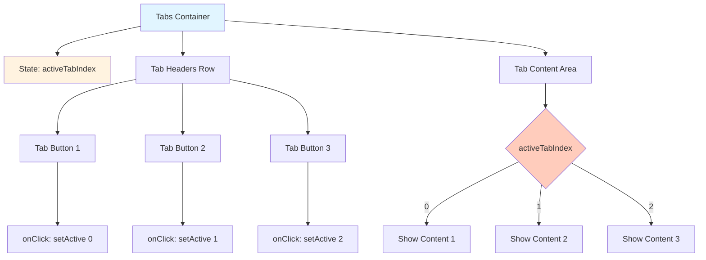
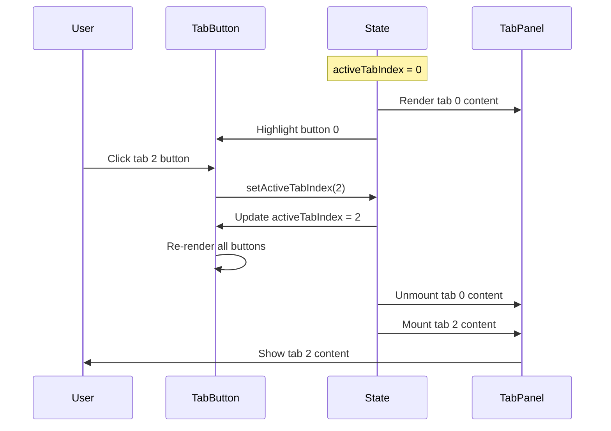
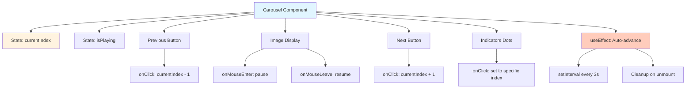
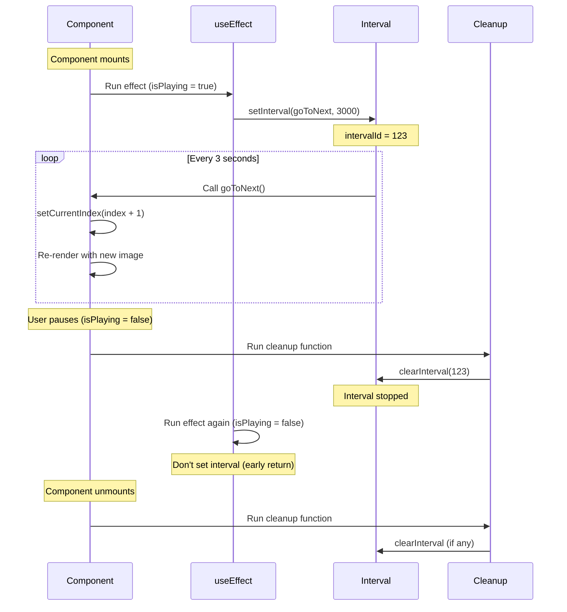
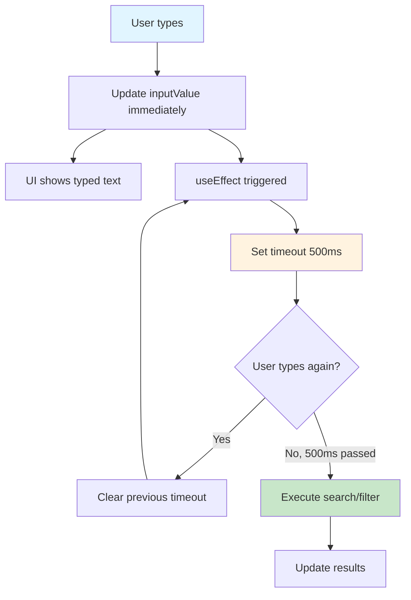
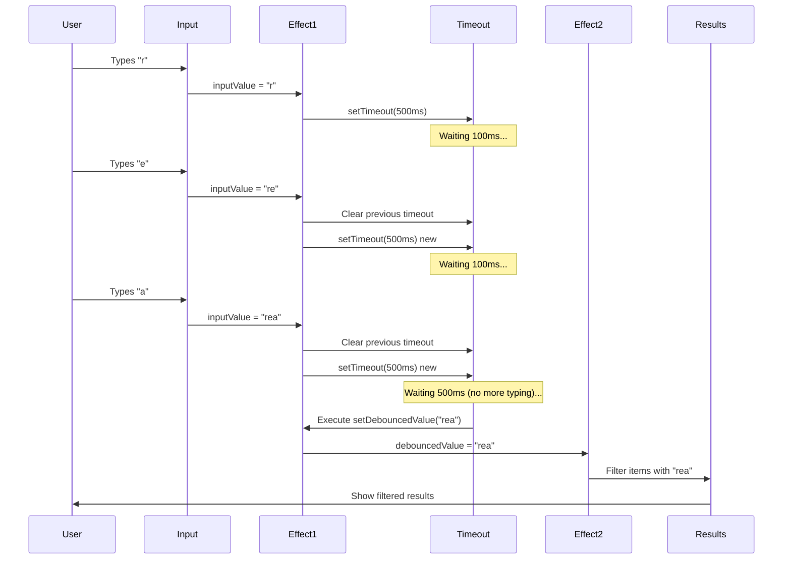
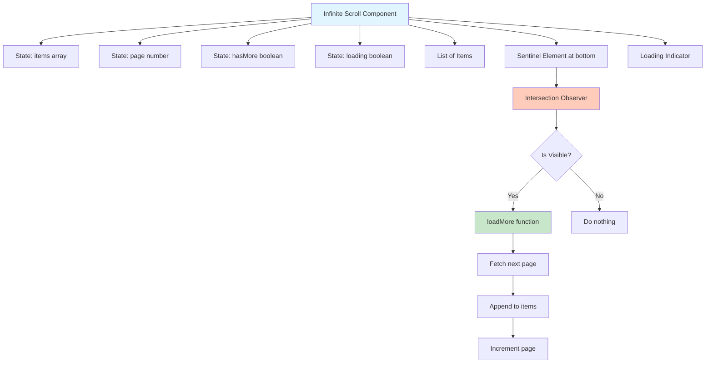
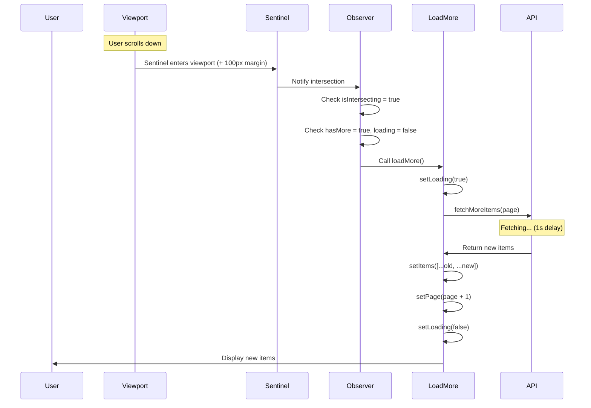

# ReactJS Frontend Interview Questions - MEDIUM LEVEL

## Table of Contents
1. [Tabs Component](#1-tabs-component)
2. [Image Carousel / Slider](#2-image-carousel--slider)
3. [Search with Debounce](#3-search-with-debounce)
4. [Infinite Scrolling List](#4-infinite-scrolling-list)
5. [Autocomplete / Typeahead](#5-autocomplete--typeahead)
6. [Data Table with Sorting & Filtering](#6-data-table-with-sorting--filtering)
7. [Modal Dialog](#7-modal-dialog)
8. [File Explorer / Tree View](#8-file-explorer--tree-view)

---

## 1. Tabs Component

### Problem Statement
Create a tabbed interface where clicking a tab shows its content and hides others. Only one tab's content is visible at a time.

### What Interviewer is Testing
- Component composition (parent-child communication)
- Active state management
- Conditional rendering
- Props drilling vs lifting state up
- Dynamic rendering from data

### How to Think & Approach

#### Step 1: Understand Requirements
```
User Story:
- Multiple tabs at the top
- One tab is active (highlighted)
- Clicking a tab makes it active
- Only active tab's content is visible
```

#### Step 2: Identify State
```
What changes?
- Active tab index (0, 1, 2...)

What doesn't change?
- Tab configuration (titles, content)
```

#### Step 3: Architecture Diagram


### Solution with Detailed Comments

```jsx
import React, { useState } from 'react';

/**
 * Tabs Component - Medium Level
 *
 * PURPOSE: Demonstrate state management, dynamic rendering, and composition
 *
 * Key Concepts:
 * 1. Array of objects for configuration
 * 2. Active index tracking
 * 3. Dynamic class names (conditional styling)
 * 4. Map for rendering
 * 5. Component composition
 */

/**
 * APPROACH 1: Simple Tabs (All-in-One Component)
 */
function SimpleTabs() {
  // TAB DATA
  // WHY array of objects?
  // - Flexible: can add more properties (icon, disabled, etc.)
  // - Easy to maintain: all tab config in one place
  // - Scalable: add tabs by adding objects
  const tabs = [
    { id: 1, title: 'Profile', content: 'This is the Profile tab content' },
    { id: 2, title: 'Settings', content: 'This is the Settings tab content' },
    { id: 3, title: 'Messages', content: 'This is the Messages tab content' }
  ];

  // ACTIVE TAB STATE
  // WHY index instead of id?
  // - Simpler for array access: tabs[activeTabIndex]
  // - ALTERNATIVE: store id and find tab: tabs.find(t => t.id === activeId)
  const [activeTabIndex, setActiveTabIndex] = useState(0);

  return (
    <div style={{ padding: '20px', maxWidth: '600px' }}>
      {/* TAB HEADERS */}
      <div style={{
        display: 'flex',
        borderBottom: '2px solid #ddd',
        marginBottom: '20px'
      }}>
        {/*
          MAP through tabs to create headers

          WHY map with index?
          - Need index to compare with activeTabIndex
          - Need index for onClick handler

          (tab, index) gives us both tab data and its position
        */}
        {tabs.map((tab, index) => (
          <button
            key={tab.id}  // ← Unique key (use id, not index!)
            onClick={() => setActiveTabIndex(index)}
            style={{
              padding: '10px 20px',
              border: 'none',
              background: 'none',
              cursor: 'pointer',
              // CONDITIONAL STYLING
              // WHY ternary for style?
              // - Active tab should look different
              // - Visual feedback for user
              borderBottom: index === activeTabIndex
                ? '3px solid #007bff'  // Active: blue underline
                : '3px solid transparent',  // Inactive: no underline
              color: index === activeTabIndex
                ? '#007bff'  // Active: blue text
                : '#333',    // Inactive: dark text
              fontWeight: index === activeTabIndex ? 'bold' : 'normal',
              transition: 'all 0.3s ease'  // Smooth transition
            }}
          >
            {tab.title}
          </button>
        ))}
      </div>

      {/* TAB CONTENT */}
      {/*
        Display content of active tab

        WHY tabs[activeTabIndex].content?
        - Direct array access using index
        - Fast and simple
        - Only renders one tab's content at a time
      */}
      <div style={{
        padding: '20px',
        border: '1px solid #ddd',
        borderRadius: '4px',
        minHeight: '200px'
      }}>
        {tabs[activeTabIndex].content}
      </div>
    </div>
  );
}

/**
 * APPROACH 2: Reusable Tabs (Component Composition)
 *
 * WHY split into multiple components?
 * - Reusability: Can use TabPanel in different places
 * - Separation of concerns: Each component has one job
 * - Better for complex UIs
 * - Easier to test
 */

// SUB-COMPONENT: Individual Tab Button
function TabButton({ isActive, onClick, children }) {
  return (
    <button
      onClick={onClick}
      style={{
        padding: '12px 24px',
        border: 'none',
        background: isActive ? '#007bff' : '#f0f0f0',
        color: isActive ? 'white' : '#333',
        cursor: 'pointer',
        borderRadius: '8px 8px 0 0',
        marginRight: '4px',
        fontWeight: isActive ? 'bold' : 'normal',
        transition: 'all 0.3s ease'
      }}
    >
      {children}
    </button>
  );
}

// SUB-COMPONENT: Tab Panel (Content Area)
function TabPanel({ isActive, children }) {
  // WHY not render if not active?
  // - Saves memory (component not in DOM)
  // - Performance: less DOM nodes
  // ALTERNATIVE: Render but hide with CSS (preserves state)
  if (!isActive) return null;

  return (
    <div style={{
      padding: '20px',
      border: '2px solid #007bff',
      borderRadius: '0 8px 8px 8px',
      minHeight: '200px',
      animation: 'fadeIn 0.3s ease'
    }}>
      {children}
    </div>
  );
}

// MAIN COMPONENT: Tabs Container
function ReusableTabs() {
  const [activeTab, setActiveTab] = useState('profile');

  // ALTERNATIVE DATA STRUCTURE: Object instead of array
  // WHY object?
  // - Access by key: tabData[activeTab]
  // - More semantic: activeTab = 'profile' vs activeTab = 0
  const tabData = {
    profile: {
      title: 'Profile',
      content: (
        <div>
          <h2>User Profile</h2>
          <p>Name: John Doe</p>
          <p>Email: john@example.com</p>
        </div>
      )
    },
    settings: {
      title: 'Settings',
      content: (
        <div>
          <h2>Settings</h2>
          <label>
            <input type="checkbox" /> Enable notifications
          </label>
          <br />
          <label>
            <input type="checkbox" /> Dark mode
          </label>
        </div>
      )
    },
    messages: {
      title: 'Messages',
      content: (
        <div>
          <h2>Messages</h2>
          <p>You have 3 new messages</p>
          <ul>
            <li>Message from Alice</li>
            <li>Message from Bob</li>
            <li>Message from Charlie</li>
          </ul>
        </div>
      )
    }
  };

  return (
    <div style={{ padding: '20px', maxWidth: '600px', margin: '0 auto' }}>
      {/* TAB BUTTONS */}
      <div style={{ display: 'flex' }}>
        {/*
          Object.keys() gets array of keys: ['profile', 'settings', 'messages']
          WHY Object.keys()?
          - Iterate over object properties
          - Get keys to map over
        */}
        {Object.keys(tabData).map(tabKey => (
          <TabButton
            key={tabKey}
            isActive={activeTab === tabKey}
            onClick={() => setActiveTab(tabKey)}
          >
            {tabData[tabKey].title}
          </TabButton>
        ))}
      </div>

      {/* TAB PANELS */}
      {Object.keys(tabData).map(tabKey => (
        <TabPanel key={tabKey} isActive={activeTab === tabKey}>
          {tabData[tabKey].content}
        </TabPanel>
      ))}
    </div>
  );
}

export default ReusableTabs;
```

### State Flow Diagram



### Common Beginner Mistakes & Solutions

#### Mistake 1: Using index as key when tabs can reorder
```jsx
❌ WRONG (if tabs can be added/removed):
{tabs.map((tab, index) => (
  <button key={index}>  {/* Bad: index changes if tabs reorder */}
    {tab.title}
  </button>
))}

✅ CORRECT:
{tabs.map((tab) => (
  <button key={tab.id}>  {/* Good: stable unique identifier */}
    {tab.title}
  </button>
))}
```

#### Mistake 2: Rendering all content and hiding with CSS
```jsx
❌ INEFFICIENT:
{tabs.map((tab, index) => (
  <div style={{ display: index === activeTabIndex ? 'block' : 'none' }}>
    {tab.content}  {/* All tabs rendered, just hidden */}
  </div>
))}

✅ BETTER (for simple content):
<div>
  {tabs[activeTabIndex].content}  {/* Only active tab rendered */}
</div>

⚠️ NOTE: Use CSS approach if you need to preserve state in hidden tabs
```

#### Mistake 3: Not memoizing heavy computations
```jsx
❌ SLOW (if content is expensive to compute):
{tabs[activeTabIndex].content}  {/* Recomputed on every render */}

✅ OPTIMIZED (we'll cover useMemo later):
const activeContent = useMemo(
  () => tabs[activeTabIndex].content,
  [activeTabIndex]
);
```

### Interviewer Follow-up Questions & Answers

**Q1: How would you preserve state in inactive tabs?**
```
A: Use CSS to hide instead of conditional rendering

❌ Conditional (state is lost):
{activeTab === 'profile' && <ProfileTab />}
// ProfileTab unmounts when switching tabs → state lost

✅ CSS hiding (state preserved):
<div style={{ display: activeTab === 'profile' ? 'block' : 'none' }}>
  <ProfileTab />  {/* Stays mounted, just hidden */}
</div>

TRADE-OFFS:
- Conditional: Better performance, state lost
- CSS: Worse performance, state preserved

CHOOSE based on:
- Frequently switched tabs with forms → CSS (preserve state)
- Rarely switched tabs with heavy content → Conditional (save memory)
```

**Q2: How would you make tabs keyboard accessible?**
```jsx
A: Add keyboard navigation (Arrow keys, Enter, Space)

function AccessibleTabs() {
  const [activeTab, setActiveTab] = useState(0);

  const handleKeyDown = (e, index) => {
    switch (e.key) {
      case 'ArrowRight':
        // Move to next tab (circular)
        setActiveTab((index + 1) % tabs.length);
        break;
      case 'ArrowLeft':
        // Move to previous tab (circular)
        setActiveTab((index - 1 + tabs.length) % tabs.length);
        break;
      case 'Home':
        setActiveTab(0);  // First tab
        break;
      case 'End':
        setActiveTab(tabs.length - 1);  // Last tab
        break;
    }
  };

  return (
    <button
      role="tab"  // ARIA role
      aria-selected={index === activeTab}  // ARIA state
      tabIndex={index === activeTab ? 0 : -1}  // Only active tab is focusable
      onKeyDown={(e) => handleKeyDown(e, index)}
      onClick={() => setActiveTab(index)}
    >
      {tab.title}
    </button>
  );
}
```

---

## 2. Image Carousel / Slider

### Problem Statement
Create an image carousel with next/previous buttons and optional auto-play.

### What Interviewer is Testing
- useEffect for intervals
- Timer cleanup (prevent memory leaks)
- Circular navigation (wrap around)
- Animation/transitions
- Pause on hover

### How to Think & Approach

#### Step 1: Break Down Features
```
Core features:
1. Display one image at a time
2. Next button → show next image
3. Previous button → show previous image
4. Auto-advance every N seconds (optional)
5. Wrap around (after last → first)
6. Pause on hover
```

#### Step 2: Identify State
```
State needed:
- currentIndex (which image is shown)

Optional state:
- isPlaying (for auto-play pause/resume)
```

#### Step 3: Architecture Diagram


### Solution with Detailed Comments

```jsx
import React, { useState, useEffect } from 'react';

/**
 * Image Carousel Component - Medium Level
 *
 * PURPOSE: Demonstrate useEffect, intervals, cleanup, and animations
 *
 * Key Concepts:
 * 1. useEffect for side effects (intervals)
 * 2. Cleanup functions (prevent memory leaks)
 * 3. Modulo operator for circular navigation
 * 4. Event handlers (mouse enter/leave)
 * 5. Conditional rendering
 */
function ImageCarousel() {
  // SAMPLE DATA
  const images = [
    { id: 1, url: 'https://via.placeholder.com/600x400/FF6B6B/FFFFFF?text=Slide+1', alt: 'Slide 1' },
    { id: 2, url: 'https://via.placeholder.com/600x400/4ECDC4/FFFFFF?text=Slide+2', alt: 'Slide 2' },
    { id: 3, url: 'https://via.placeholder.com/600x400/45B7D1/FFFFFF?text=Slide+3', alt: 'Slide 3' },
    { id: 4, url: 'https://via.placeholder.com/600x400/FFA07A/FFFFFF?text=Slide+4', alt: 'Slide 4' }
  ];

  // STATE 1: Current slide index
  const [currentIndex, setCurrentIndex] = useState(0);

  // STATE 2: Auto-play control
  // WHY separate state for isPlaying?
  // - User can pause/resume
  // - Pause on hover
  const [isPlaying, setIsPlaying] = useState(true);

  /**
   * Navigate to next slide
   *
   * WHY (currentIndex + 1) % images.length?
   * - Modulo operator (%) gives remainder
   * - Creates circular navigation:
   *   Index 0 → 1 → 2 → 3 → 0 (wraps back)
   *
   * EXAMPLES:
   * (0 + 1) % 4 = 1
   * (1 + 1) % 4 = 2
   * (2 + 1) % 4 = 3
   * (3 + 1) % 4 = 0  ← wraps to start
   */
  const goToNext = () => {
    setCurrentIndex((prevIndex) => (prevIndex + 1) % images.length);
  };

  /**
   * Navigate to previous slide
   *
   * WHY (currentIndex - 1 + images.length) % images.length?
   * - Need to handle negative numbers
   * - -1 % 4 = -1 (not what we want!)
   * - (-1 + 4) % 4 = 3 ✓ (wraps to end)
   *
   * EXAMPLES:
   * (3 - 1 + 4) % 4 = 2
   * (2 - 1 + 4) % 4 = 1
   * (1 - 1 + 4) % 4 = 0
   * (0 - 1 + 4) % 4 = 3  ← wraps to end
   */
  const goToPrevious = () => {
    setCurrentIndex((prevIndex) =>
      (prevIndex - 1 + images.length) % images.length
    );
  };

  /**
   * Go to specific slide (from indicator dots)
   */
  const goToSlide = (index) => {
    setCurrentIndex(index);
  };

  /**
   * AUTO-ADVANCE EFFECT
   *
   * WHY useEffect?
   * - Side effect: Setting up interval (not related to rendering)
   * - Needs cleanup: Must clear interval on unmount
   *
   * WHEN does this run?
   * - After initial render
   * - After isPlaying changes
   * - Cleanup before re-running or unmounting
   */
  useEffect(() => {
    // Don't set interval if not playing
    if (!isPlaying) return;

    /**
     * setInterval: Execute function every N milliseconds
     *
     * WHY 3000?
     * - 3000ms = 3 seconds
     * - Reasonable time to view image
     *
     * RETURNS: interval ID (needed for cleanup)
     */
    const intervalId = setInterval(() => {
      goToNext();
    }, 3000);

    /**
     * CLEANUP FUNCTION
     *
     * WHY return a function?
     * - React calls this before re-running effect
     * - React calls this on component unmount
     * - Prevents memory leaks!
     *
     * WHY clearInterval?
     * - Stops the interval
     * - Without this: interval keeps running even after component unmounts!
     * - Memory leak: function references old state/props
     */
    return () => {
      clearInterval(intervalId);
      console.log('Interval cleared');  // For debugging
    };

    // DEPENDENCY ARRAY: [isPlaying]
    // WHY?
    // - Re-run effect when isPlaying changes
    // - If isPlaying becomes false → old interval cleared, new effect doesn't set interval
    // - If isPlaying becomes true → set new interval
  }, [isPlaying]);

  /**
   * VISUAL EXPLANATION of useEffect cleanup:
   *
   * 1. Component mounts
   *    → useEffect runs
   *    → setInterval started (intervalId = 123)
   *
   * 2. isPlaying changes to false
   *    → Cleanup runs: clearInterval(123)
   *    → New effect runs: sees isPlaying=false, doesn't set interval
   *
   * 3. Component unmounts
   *    → Cleanup runs: clearInterval(123)
   *    → Interval stopped, no memory leak!
   */

  return (
    <div style={{
      maxWidth: '600px',
      margin: '0 auto',
      padding: '20px'
    }}>
      {/* CAROUSEL CONTAINER */}
      <div
        style={{
          position: 'relative',
          borderRadius: '8px',
          overflow: 'hidden',
          boxShadow: '0 4px 6px rgba(0,0,0,0.1)'
        }}
        // PAUSE on hover
        // WHY?
        // - Better UX: user can read/view without auto-advance
        // - Common pattern in carousels
        onMouseEnter={() => setIsPlaying(false)}
        onMouseLeave={() => setIsPlaying(true)}
      >
        {/* IMAGE */}
        

        {/* PREVIOUS BUTTON */}
        <button
          onClick={goToPrevious}
          style={{
            position: 'absolute',
            left: '10px',
            top: '50%',
            transform: 'translateY(-50%)',  // Center vertically
            background: 'rgba(0,0,0,0.5)',
            color: 'white',
            border: 'none',
            padding: '10px 15px',
            cursor: 'pointer',
            fontSize: '20px',
            borderRadius: '4px'
          }}
        >
          ❮
        </button>

        {/* NEXT BUTTON */}
        <button
          onClick={goToNext}
          style={{
            position: 'absolute',
            right: '10px',
            top: '50%',
            transform: 'translateY(-50%)',
            background: 'rgba(0,0,0,0.5)',
            color: 'white',
            border: 'none',
            padding: '10px 15px',
            cursor: 'pointer',
            fontSize: '20px',
            borderRadius: '4px'
          }}
        >
          ❯
        </button>

        {/* SLIDE INDICATORS (DOTS) */}
        <div style={{
          position: 'absolute',
          bottom: '10px',
          left: '50%',
          transform: 'translateX(-50%)',
          display: 'flex',
          gap: '8px'
        }}>
          {/*
            Map through images to create dots
            WHY index for dots?
            - Need to know which dot corresponds to which slide
          */}
          {images.map((_, index) => (
            <button
              key={index}
              onClick={() => goToSlide(index)}
              style={{
                width: '12px',
                height: '12px',
                borderRadius: '50%',
                border: 'none',
                cursor: 'pointer',
                // Active dot is white, others are semi-transparent
                background: index === currentIndex
                  ? 'white'
                  : 'rgba(255,255,255,0.5)',
                transition: 'all 0.3s ease'
              }}
              aria-label={`Go to slide ${index + 1}`}
            />
          ))}
        </div>
      </div>

      {/* PLAY/PAUSE BUTTON */}
      <div style={{ textAlign: 'center', marginTop: '20px' }}>
        <button
          onClick={() => setIsPlaying(!isPlaying)}
          style={{
            padding: '10px 20px',
            fontSize: '16px',
            cursor: 'pointer',
            background: '#007bff',
            color: 'white',
            border: 'none',
            borderRadius: '4px'
          }}
        >
          {isPlaying ? '⏸ Pause' : '▶ Play'}
        </button>
      </div>

      {/* CURRENT SLIDE INFO */}
      <div style={{ textAlign: 'center', marginTop: '10px', color: '#666' }}>
        Slide {currentIndex + 1} of {images.length}
      </div>
    </div>
  );
}

export default ImageCarousel;
```

### useEffect Lifecycle Diagram



### Common Beginner Mistakes & Solutions

#### Mistake 1: Forgetting cleanup in useEffect
```jsx
❌ MEMORY LEAK:
useEffect(() => {
  const intervalId = setInterval(goToNext, 3000);
  // No cleanup! Interval keeps running after unmount
}, []);

✅ CORRECT:
useEffect(() => {
  const intervalId = setInterval(goToNext, 3000);
  return () => clearInterval(intervalId);  // Cleanup!
}, []);
```

#### Mistake 2: Wrong modulo logic for previous
```jsx
❌ WRONG:
const goToPrevious = () => {
  setCurrentIndex((prevIndex - 1) % images.length);
  // -1 % 4 = -1 (negative!)
};

✅ CORRECT:
const goToPrevious = () => {
  setCurrentIndex((prevIndex - 1 + images.length) % images.length);
  // (-1 + 4) % 4 = 3 ✓
};
```

#### Mistake 3: Not using functional updates in interval
```jsx
❌ STALE CLOSURE:
useEffect(() => {
  const intervalId = setInterval(() => {
    setCurrentIndex(currentIndex + 1);  // Always uses initial value!
  }, 3000);
  return () => clearInterval(intervalId);
}, []);  // Empty deps → closure over initial currentIndex

✅ CORRECT:
useEffect(() => {
  const intervalId = setInterval(() => {
    setCurrentIndex(prev => (prev + 1) % images.length);  // Uses latest!
  }, 3000);
  return () => clearInterval(intervalId);
}, []);
```

#### Mistake 4: Not pausing on hover
```jsx
❌ ANNOYING UX:
{/* Auto-advances even when user is viewing */}

✅ BETTER UX:
<div
  onMouseEnter={() => setIsPlaying(false)}
  onMouseLeave={() => setIsPlaying(true)}
>
  
</div>
```

### Interviewer Follow-up Questions & Answers

**Q1: What is useEffect and why do we need it?**
```
A: useEffect is for side effects (code that affects outside world)

SIDE EFFECTS examples:
- Setting up timers (setInterval, setTimeout)
- Fetching data from API
- Subscribing to events (WebSocket, window resize)
- Manually changing DOM
- Logging to console/analytics

WHY useEffect?
- React rendering should be "pure" (no side effects)
- Side effects need special handling:
  * Run AFTER render (don't block UI)
  * Clean up properly (prevent memory leaks)
  * Re-run when dependencies change

SYNTAX:
useEffect(() => {
  // Effect code (runs after render)

  return () => {
    // Cleanup code (runs before re-run or unmount)
  };
}, [dependencies]);  // Re-run when these change
```

**Q2: What is a cleanup function in useEffect?**
```
A: Cleanup function runs before effect re-runs or component unmounts

PURPOSE:
- Prevent memory leaks
- Cancel ongoing operations
- Unsubscribe from events

EXAMPLES:

1. Clear timers:
useEffect(() => {
  const id = setInterval(fn, 1000);
  return () => clearInterval(id);  // ← Cleanup
}, []);

2. Remove event listeners:
useEffect(() => {
  window.addEventListener('resize', handleResize);
  return () => window.removeEventListener('resize', handleResize);  // ← Cleanup
}, []);

3. Cancel fetch requests:
useEffect(() => {
  const controller = new AbortController();
  fetch(url, { signal: controller.signal });
  return () => controller.abort();  // ← Cleanup
}, [url]);

WHEN does cleanup run?
- Before effect runs again (dependency changed)
- When component unmounts
```

**Q3: What's the modulo operator (%) and why use it here?**
```
A: Modulo (%) gives remainder of division

EXAMPLES:
5 % 3 = 2  (5 ÷ 3 = 1 remainder 2)
10 % 4 = 2  (10 ÷ 4 = 2 remainder 2)
15 % 5 = 0  (15 ÷ 5 = 3 remainder 0)

FOR CIRCULAR NAVIGATION:
We have 4 images (indices 0, 1, 2, 3)

Next: (index + 1) % 4
0 → (0+1) % 4 = 1
1 → (1+1) % 4 = 2
2 → (2+1) % 4 = 3
3 → (3+1) % 4 = 0  ← wraps around!

Previous: (index - 1 + 4) % 4
3 → (3-1+4) % 4 = 2
2 → (2-1+4) % 4 = 1
1 → (1-1+4) % 4 = 0
0 → (0-1+4) % 4 = 3  ← wraps around!

WHY + images.length for previous?
- Handles negative: -1 + 4 = 3 (then % 4 = 3)
- Without it: -1 % 4 = -1 (not what we want)
```

---

## 3. Search with Debounce

### Problem Statement
Create a search input that waits for the user to stop typing before filtering results (debouncing).

### What Interviewer is Testing
- useEffect with cleanup
- Debounce technique (performance optimization)
- setTimeout/clearTimeout
- Controlled input
- Performance considerations

### How to Think & Approach

#### Step 1: Understand the Problem
```
WITHOUT debounce:
User types "react"
- "r" → filter (1 operation)
- "re" → filter (2 operations)
- "rea" → filter (3 operations)
- "reac" → filter (4 operations)
- "react" → filter (5 operations)
Total: 5 filter operations!

WITH debounce (500ms delay):
User types "react"
- "r" → wait 500ms → canceled (user still typing)
- "re" → wait 500ms → canceled
- "rea" → wait 500ms → canceled
- "reac" → wait 500ms → canceled
- "react" → wait 500ms → filter
Total: 1 filter operation!
```

#### Step 2: Architecture Diagram


### Solution with Detailed Comments

```jsx
import React, { useState, useEffect } from 'react';

/**
 * Search with Debounce - Medium Level
 *
 * PURPOSE: Demonstrate debouncing technique for performance
 *
 * Key Concepts:
 * 1. Debouncing (delay execution until user stops typing)
 * 2. setTimeout with cleanup
 * 3. Performance optimization
 * 4. useEffect dependencies
 */
function SearchWithDebounce() {
  // SAMPLE DATA
  const allItems = [
    'React', 'JavaScript', 'TypeScript', 'Node.js',
    'Python', 'Java', 'Go', 'Rust',
    'HTML', 'CSS', 'Angular', 'Vue',
    'Next.js', 'Express', 'MongoDB', 'PostgreSQL'
  ];

  // STATE 1: Input value (updates immediately on keystroke)
  const [inputValue, setInputValue] = useState('');

  // STATE 2: Debounced value (updates after delay)
  // WHY separate state?
  // - inputValue updates immediately (for responsive UI)
  // - debouncedValue updates after delay (for expensive operations)
  const [debouncedValue, setDebouncedValue] = useState('');

  // STATE 3: Filtered results
  const [filteredItems, setFilteredItems] = useState(allItems);

  /**
   * DEBOUNCE EFFECT
   *
   * PURPOSE: Update debouncedValue after user stops typing
   *
   * HOW IT WORKS:
   * 1. User types → inputValue changes
   * 2. useEffect runs (triggered by inputValue change)
   * 3. Set timeout for 500ms
   * 4. If user types again within 500ms:
   *    - Effect runs again
   *    - Cleanup clears previous timeout
   *    - New timeout is set
   * 5. If 500ms passes without typing:
   *    - Timeout executes
   *    - debouncedValue is updated
   */
  useEffect(() => {
    console.log(`Input changed to: "${inputValue}". Setting timeout...`);

    /**
     * setTimeout: Execute function after delay
     *
     * WHY 500ms?
     * - Typical typing speed: ~200-300ms between characters
     * - 500ms catches pause between words
     * - Not too short (would still run many times)
     * - Not too long (user waits too long)
     *
     * ADJUST based on use case:
     * - Search API: 500-800ms (network request is expensive)
     * - Local filter: 200-300ms (operation is cheap)
     * - Autocomplete: 300-400ms (balance between responsive and efficient)
     */
    const timeoutId = setTimeout(() => {
      console.log(`Timeout executed. Updating debounced value to: "${inputValue}"`);
      setDebouncedValue(inputValue);
    }, 500);

    /**
     * CLEANUP FUNCTION
     *
     * CRITICAL: Clear timeout if effect runs again
     *
     * WHY?
     * - User types "r" → timeout set (id=1)
     * - User types "e" (within 500ms) → cleanup clears timeout(id=1)
     * - New timeout set (id=2)
     * - This prevents timeout(id=1) from executing
     */
    return () => {
      console.log(`Clearing timeout ${timeoutId}`);
      clearTimeout(timeoutId);
    };

    // DEPENDENCY: [inputValue]
    // WHY?
    // - Re-run effect every time inputValue changes
    // - This is what creates the debounce behavior
  }, [inputValue]);

  /**
   * FILTER EFFECT
   *
   * PURPOSE: Filter items when debouncedValue changes
   *
   * WHY separate effect?
   * - Separation of concerns
   * - Debounce logic separate from filter logic
   * - Easier to test and maintain
   */
  useEffect(() => {
    console.log(`Filtering items with: "${debouncedValue}"`);

    /**
     * FILTER LOGIC
     *
     * CASE-INSENSITIVE SEARCH:
     * - Convert both to lowercase for comparison
     * - "react" matches "React", "REACT", "ReAcT"
     */
    const filtered = allItems.filter(item =>
      item.toLowerCase().includes(debouncedValue.toLowerCase())
    );

    setFilteredItems(filtered);

    // DEPENDENCY: [debouncedValue]
    // WHY not inputValue?
    // - We want to filter AFTER debounce delay
    // - inputValue changes on every keystroke (too often)
    // - debouncedValue changes only after delay (optimized)
  }, [debouncedValue]);

  /**
   * VISUAL FLOW:
   *
   * User types "r"
   * ↓
   * setInputValue("r") → inputValue = "r"
   * ↓
   * useEffect (debounce) runs → setTimeout(500ms, setDebouncedValue("r"))
   * ↓
   * [User waits 500ms]
   * ↓
   * Timeout executes → setDebouncedValue("r") → debouncedValue = "r"
   * ↓
   * useEffect (filter) runs → filter items with "r"
   * ↓
   * setFilteredItems([React, Rust, ...])
   */

  return (
    <div style={{ padding: '20px', maxWidth: '600px' }}>
      <h2>Search with Debounce</h2>

      {/* SEARCH INPUT */}
      <input
        type="text"
        value={inputValue}
        onChange={(e) => setInputValue(e.target.value)}
        placeholder="Search technologies..."
        style={{
          width: '100%',
          padding: '12px',
          fontSize: '16px',
          border: '2px solid #ddd',
          borderRadius: '8px',
          marginBottom: '20px'
        }}
      />

      {/* DEBUG INFO (remove in production) */}
      <div style={{
        background: '#f0f0f0',
        padding: '10px',
        borderRadius: '4px',
        marginBottom: '20px',
        fontSize: '14px'
      }}>
        <div><strong>Input value:</strong> {inputValue || '(empty)'}</div>
        <div><strong>Debounced value:</strong> {debouncedValue || '(empty)'}</div>
        <div><strong>Results count:</strong> {filteredItems.length}</div>
      </div>

      {/* RESULTS */}
      <div>
        <h3>Results ({filteredItems.length})</h3>
        {filteredItems.length === 0 ? (
          <p style={{ color: '#999' }}>No results found</p>
        ) : (
          <ul style={{ listStyle: 'none', padding: 0 }}>
            {filteredItems.map((item, index) => (
              <li
                key={index}
                style={{
                  padding: '10px',
                  background: '#f9f9f9',
                  marginBottom: '8px',
                  borderRadius: '4px'
                }}
              >
                {item}
              </li>
            ))}
          </ul>
        )}
      </div>
    </div>
  );
}

/**
 * ALTERNATIVE: Custom useDebounce Hook
 *
 * WHY create a hook?
 * - Reusable across components
 * - Cleaner component code
 * - Easier to test
 */
function useDebounce(value, delay) {
  const [debouncedValue, setDebouncedValue] = useState(value);

  useEffect(() => {
    const timeoutId = setTimeout(() => {
      setDebouncedValue(value);
    }, delay);

    return () => clearTimeout(timeoutId);
  }, [value, delay]);

  return debouncedValue;
}

// USAGE:
function SearchWithCustomHook() {
  const [inputValue, setInputValue] = useState('');
  const debouncedValue = useDebounce(inputValue, 500);  // ← Custom hook!

  // Filter when debouncedValue changes
  const filteredItems = allItems.filter(item =>
    item.toLowerCase().includes(debouncedValue.toLowerCase())
  );

  return (
    <div>
      <input value={inputValue} onChange={(e) => setInputValue(e.target.value)} />
      <div>Results: {filteredItems.length}</div>
    </div>
  );
}

export default SearchWithDebounce;
```

### Debounce Flow Diagram



### Common Beginner Mistakes & Solutions

#### Mistake 1: Not cleaning up timeout
```jsx
❌ WRONG:
useEffect(() => {
  setTimeout(() => setDebouncedValue(inputValue), 500);
  // No cleanup! Multiple timeouts accumulate
}, [inputValue]);

✅ CORRECT:
useEffect(() => {
  const id = setTimeout(() => setDebouncedValue(inputValue), 500);
  return () => clearTimeout(id);  // Cleanup!
}, [inputValue]);
```

#### Mistake 2: Filtering on every keystroke
```jsx
❌ SLOW (filters on every keystroke):
const handleChange = (e) => {
  setInputValue(e.target.value);
  // Filtering here = no debounce!
  const filtered = items.filter(item => item.includes(e.target.value));
  setFilteredItems(filtered);
};

✅ OPTIMIZED (filters after delay):
useEffect(() => {
  const id = setTimeout(() => {
    const filtered = items.filter(item => item.includes(debouncedValue));
    setFilteredItems(filtered);
  }, 500);
  return () => clearTimeout(id);
}, [debouncedValue]);
```

#### Mistake 3: Not updating UI immediately
```jsx
❌ LAGGY UX (input updates after delay):
<input
  value={debouncedValue}  // Laggy! Updates after 500ms
  onChange={(e) => setInputValue(e.target.value)}
/>

✅ RESPONSIVE UX (input updates immediately):
<input
  value={inputValue}  // Immediate feedback!
  onChange={(e) => setInputValue(e.target.value)}
/>
```

### Interviewer Follow-up Questions & Answers

**Q1: What's the difference between debounce and throttle?**
```
A:
DEBOUNCE: Wait for pause before executing
- Executes AFTER user stops
- Example: Search (wait until user finishes typing)

User types: r--e--a--c--t------[500ms]→ Execute
              ↑  ↑  ↑  ↑
           All canceled  │
                         └─→ Only this executes

THROTTLE: Execute at most once per time period
- Executes DURING action (at intervals)
- Example: Window resize (update every 100ms while resizing)

User types: r--e--a--c--t
            ↑        ↑
         Execute Execute (every 200ms)

WHEN TO USE:
- Search input → Debounce (wait for user to finish)
- Scroll event → Throttle (update periodically while scrolling)
- Button click → Debounce (prevent multiple clicks)
- Window resize → Throttle (update periodically while resizing)
```

**Q2: Why separate inputValue and debouncedValue?**
```
A:
inputValue:
- Updates immediately on keystroke
- Controls input field (responsive UI)
- User sees what they type instantly

debouncedValue:
- Updates after delay
- Triggers expensive operations (API calls, filtering)
- Reduces unnecessary work

WITHOUT separation:
<input value={debouncedValue} />  // Laggy! Typing feels slow

WITH separation:
<input value={inputValue} />  // Responsive! Typing feels instant
// But filtering uses debouncedValue (optimized)

ANALOGY:
- inputValue = What you're typing right now
- debouncedValue = What the system should act on
```

**Q3: How would you implement API search with debounce?**
```jsx
A: Similar pattern, but with async fetch

function APISearch() {
  const [query, setQuery] = useState('');
  const [results, setResults] = useState([]);
  const [loading, setLoading] = useState(false);

  useEffect(() => {
    if (query.trim() === '') {
      setResults([]);
      return;
    }

    setLoading(true);

    const timeoutId = setTimeout(async () => {
      try {
        const response = await fetch(`/api/search?q=${query}`);
        const data = await response.json();
        setResults(data);
      } catch (error) {
        console.error('Search failed:', error);
      } finally {
        setLoading(false);
      }
    }, 500);

    return () => clearTimeout(timeoutId);
  }, [query]);

  return (
    <div>
      <input value={query} onChange={(e) => setQuery(e.target.value)} />
      {loading && <div>Loading...</div>}
      {results.map(result => <div key={result.id}>{result.name}</div>)}
    </div>
  );
}

KEY DIFFERENCES from local search:
- Set loading state before timeout
- Clear loading after fetch completes
- Handle errors
- Cancel fetch if component unmounts (advanced: use AbortController)
```

---

## 4. Infinite Scrolling List

### Problem Statement
Create a list that loads more items automatically when user scrolls to the bottom.

### What Interviewer is Testing
- Scroll event handling
- useEffect for events
- Event listener cleanup
- Performance (Intersection Observer)
- Loading states
- Pagination logic

### How to Think & Approach

#### Step 1: Understand Requirements
```
Features:
1. Display initial set of items (e.g., 20)
2. Detect when user scrolls to bottom
3. Load more items (next 20)
4. Show loading indicator
5. Stop when no more items
```

#### Step 2: Two Approaches
```
Approach 1: Scroll Event Listener (older, less performant)
- Listen to scroll event
- Calculate if near bottom
- Lots of events fired (performance issue)

Approach 2: Intersection Observer (modern, recommended)
- Observe a "sentinel" element at the bottom
- Triggers when sentinel becomes visible
- Much better performance
```

#### Step 3: Architecture Diagram


### Solution with Detailed Comments

```jsx
import React, { useState, useEffect, useRef, useCallback } from 'react';

/**
 * Infinite Scrolling List - Medium Level
 *
 * PURPOSE: Demonstrate Intersection Observer, pagination, and performance
 *
 * Key Concepts:
 * 1. Intersection Observer API (detect element visibility)
 * 2. useRef (reference to DOM element)
 * 3. useCallback (prevent unnecessary re-creations)
 * 4. Pagination state
 * 5. Loading states
 */
function InfiniteScrollList() {
  // STATE 1: Items array (all loaded items so far)
  const [items, setItems] = useState([]);

  // STATE 2: Current page (for pagination)
  const [page, setPage] = useState(1);

  // STATE 3: Loading state (show spinner)
  const [loading, setLoading] = useState(false);

  // STATE 4: Has more items to load
  const [hasMore, setHasMore] = useState(true);

  // REF: Reference to the sentinel element
  // WHY useRef?
  // - Need to access DOM element (for Intersection Observer)
  // - Persists across renders (doesn't reset like variables)
  // - Changing .current doesn't cause re-render
  const sentinelRef = useRef(null);

  /**
   * MOCK DATA FETCH
   *
   * WHY mock?
   * - Interview: demonstrate logic without real API
   * - Replace with real fetch('/api/items?page=X') in production
   *
   * SIMULATES:
   * - Network delay (setTimeout)
   * - Pagination (page parameter)
   * - No more data (page > 5)
   */
  const fetchMoreItems = async (pageNum) => {
    // Simulate network delay
    await new Promise(resolve => setTimeout(resolve, 1000));

    // Generate mock items for this page
    const itemsPerPage = 20;
    const newItems = Array.from({ length: itemsPerPage }, (_, index) => ({
      id: (pageNum - 1) * itemsPerPage + index + 1,
      title: `Item ${(pageNum - 1) * itemsPerPage + index + 1}`,
      description: `This is item number ${(pageNum - 1) * itemsPerPage + index + 1}`
    }));

    // Simulate "no more data" after page 5
    if (pageNum >= 5) {
      return { items: newItems.slice(0, 10), hasMore: false };  // Last page with fewer items
    }

    return { items: newItems, hasMore: true };
  };

  /**
   * LOAD MORE FUNCTION
   *
   * WHY useCallback?
   * - Function is used in useEffect dependency array
   * - Without useCallback: new function on every render → effect runs every render
   * - With useCallback: same function reference unless dependencies change
   *
   * DEPENDENCIES: [page]
   * - Only recreate function when page changes
   */
  const loadMore = useCallback(async () => {
    // Don't load if already loading or no more items
    if (loading || !hasMore) return;

    console.log(`Loading page ${page}...`);
    setLoading(true);

    try {
      const { items: newItems, hasMore: moreAvailable } = await fetchMoreItems(page);

      // APPEND new items to existing items
      // WHY spread operator?
      // - Immutable update (don't mutate state)
      // - [...items, ...newItems] combines both arrays
      setItems(prevItems => [...prevItems, ...newItems]);

      // Update states
      setHasMore(moreAvailable);
      setPage(prevPage => prevPage + 1);  // Increment page for next load
    } catch (error) {
      console.error('Failed to load items:', error);
    } finally {
      setLoading(false);
    }
  }, [page, loading, hasMore]);  // Dependencies

  /**
   * INTERSECTION OBSERVER EFFECT
   *
   * PURPOSE: Watch sentinel element, load more when it appears
   *
   * WHY Intersection Observer?
   * - Better performance than scroll event
   * - Native browser API
   * - Automatically handles visibility calculation
   */
  useEffect(() => {
    /**
     * INTERSECTION OBSERVER CALLBACK
     *
     * entries: array of observed elements (we have 1: sentinel)
     * entry.isIntersecting: true when element is visible
     */
    const handleIntersection = (entries) => {
      const [entry] = entries;  // Get first (and only) entry

      console.log('Sentinel visible:', entry.isIntersecting);

      // If sentinel is visible, load more items
      if (entry.isIntersecting && hasMore && !loading) {
        loadMore();
      }
    };

    /**
     * CREATE OBSERVER
     *
     * OPTIONS:
     * - root: null (use viewport as container)
     * - rootMargin: '100px' (trigger 100px before sentinel actually visible)
     * - threshold: 0.1 (trigger when 10% of sentinel is visible)
     *
     * WHY rootMargin: '100px'?
     * - Pre-load before user reaches bottom
     * - Smoother UX (no waiting for items to load)
     */
    const observer = new IntersectionObserver(handleIntersection, {
      root: null,
      rootMargin: '100px',
      threshold: 0.1
    });

    // Start observing sentinel element
    if (sentinelRef.current) {
      observer.observe(sentinelRef.current);
      console.log('Started observing sentinel');
    }

    /**
     * CLEANUP
     *
     * WHY disconnect?
     * - Stop observing when component unmounts
     * - Prevent memory leaks
     */
    return () => {
      if (observer) {
        observer.disconnect();
        console.log('Disconnected observer');
      }
    };

    // DEPENDENCIES: [loadMore, hasMore, loading]
    // Re-run if these change
  }, [loadMore, hasMore, loading]);

  /**
   * INITIAL LOAD
   *
   * PURPOSE: Load first page on component mount
   */
  useEffect(() => {
    loadMore();
  }, []);  // Empty array = run once on mount

  return (
    <div style={{ padding: '20px', maxWidth: '800px', margin: '0 auto' }}>
      <h1>Infinite Scrolling List</h1>

      {/* ITEMS LIST */}
      <div>
        {items.map(item => (
          <div
            key={item.id}
            style={{
              padding: '20px',
              marginBottom: '10px',
              border: '1px solid #ddd',
              borderRadius: '8px',
              background: '#f9f9f9'
            }}
          >
            <h3>{item.title}</h3>
            <p>{item.description}</p>
          </div>
        ))}
      </div>

      {/*
        SENTINEL ELEMENT

        WHY ref={sentinelRef}?
        - Gives us reference to this DOM element
        - Intersection Observer can observe it

        WHY at the bottom?
        - Want to load more when user scrolls to bottom
        - When this element becomes visible → user near bottom
      */}
      <div ref={sentinelRef} style={{ height: '20px', margin: '20px 0' }} />

      {/* LOADING INDICATOR */}
      {loading && (
        <div style={{ textAlign: 'center', padding: '20px' }}>
          <div style={{
            border: '4px solid #f3f3f3',
            borderTop: '4px solid #3498db',
            borderRadius: '50%',
            width: '40px',
            height: '40px',
            animation: 'spin 1s linear infinite',
            margin: '0 auto'
          }} />
          <p>Loading more items...</p>
        </div>
      )}

      {/* NO MORE ITEMS MESSAGE */}
      {!hasMore && (
        <div style={{
          textAlign: 'center',
          padding: '20px',
          color: '#999'
        }}>
          <p>No more items to load</p>
          <p>Total items: {items.length}</p>
        </div>
      )}

      {/* CSS for loading spinner animation */}
      <style>{`
        @keyframes spin {
          0% { transform: rotate(0deg); }
          100% { transform: rotate(360deg); }
        }
      `}</style>
    </div>
  );
}

export default InfiniteScrollList;
```

### Intersection Observer Flow Diagram



### Common Beginner Mistakes & Solutions

#### Mistake 1: Not cleaning up Intersection Observer
```jsx
❌ MEMORY LEAK:
useEffect(() => {
  const observer = new IntersectionObserver(callback);
  observer.observe(sentinelRef.current);
  // No cleanup! Observer keeps running after unmount
}, []);

✅ CORRECT:
useEffect(() => {
  const observer = new IntersectionObserver(callback);
  observer.observe(sentinelRef.current);
  return () => observer.disconnect();  // Cleanup!
}, []);
```

#### Mistake 2: Not preventing multiple simultaneous loads
```jsx
❌ LOADS MULTIPLE TIMES:
const loadMore = () => {
  fetchMoreItems().then(items => setItems(prev => [...prev, ...items]));
  // If called twice quickly, both fetches execute!
};

✅ PREVENTS DUPLICATES:
const loadMore = () => {
  if (loading) return;  // Guard: don't load if already loading
  setLoading(true);
  fetchMoreItems().then(items => {
    setItems(prev => [...prev, ...items]);
    setLoading(false);
  });
};
```

#### Mistake 3: Not using useCallback for loadMore
```jsx
❌ INFINITE LOOP:
const loadMore = () => { /* ... */ };  // New function every render

useEffect(() => {
  // Effect depends on loadMore
  // loadMore changes every render
  // Effect runs every render → infinite loop!
}, [loadMore]);

✅ STABLE FUNCTION:
const loadMore = useCallback(() => { /* ... */ }, [page]);  // Same function unless page changes
useEffect(() => { /* ... */ }, [loadMore]);  // Only runs when loadMore changes
```

### Interviewer Follow-up Questions & Answers

**Q1: What is Intersection Observer and why use it over scroll events?**
```
A:
Intersection Observer: Browser API that watches element visibility

SCROLL EVENT (old approach):
window.addEventListener('scroll', () => {
  const bottom = window.scrollY + window.innerHeight >= document.height;
  if (bottom) loadMore();
});

PROBLEMS:
- Fires MANY times (every pixel scrolled)
- Need to throttle/debounce (adds complexity)
- Calculations are expensive (layout thrashing)
- Poor performance

INTERSECTION OBSERVER (modern approach):
const observer = new IntersectionObserver(callback);
observer.observe(sentinelElement);

BENEFITS:
✓ Fires only when visibility changes (not constantly)
✓ Browser optimizes (no layout thrashing)
✓ Much better performance
✓ Cleaner code (no manual calculations)

WHEN to use:
- Infinite scroll
- Lazy loading images
- Analytics (track what user sees)
- Animations (trigger when element visible)
```

**Q2: What is useRef and when to use it?**
```
A: useRef creates a mutable reference that persists across renders

SYNTAX:
const ref = useRef(initialValue);
ref.current  // Access/modify value

CHARACTERISTICS:
- Persists across renders (like state)
- Changing .current doesn't cause re-render (unlike state)
- Returns same reference on every render

USE CASES:

1. DOM References:
const inputRef = useRef(null);
<input ref={inputRef} />
inputRef.current.focus();  // Access DOM node

2. Storing mutable values:
const countRef = useRef(0);
countRef.current++;  // Doesn't re-render

3. Previous value:
const prevValueRef = useRef();
useEffect(() => {
  prevValueRef.current = value;
}, [value]);

4. Timers:
const timerRef = useRef();
timerRef.current = setTimeout(...);
clearTimeout(timerRef.current);

STATE vs REF:
const [state, setState] = useState(0);  // Re-renders on change
const ref = useRef(0);  // No re-render on change

WHEN TO USE:
- Need DOM access → useRef
- Need to trigger re-render → useState
- Need value to persist but not re-render → useRef
```

---

## 5. Autocomplete / Typeahead

### Problem Statement
Create an autocomplete input that shows filtered suggestions as the user types.

### What Interviewer is Testing
- Debouncing (from Search example)
- Keyboard navigation (Arrow keys, Enter)
- Accessibility (ARIA attributes)
- Click outside to close
- Controlled component

### Solution with Detailed Comments

```jsx
import React, { useState, useEffect, useRef } from 'react';

/**
 * Autocomplete Component - Medium Level
 *
 * PURPOSE: Demonstrate keyboard navigation, accessibility, outside click detection
 *
 * Key Concepts:
 * 1. Keyboard event handling (Arrow up/down, Enter, Escape)
 * 2. Active index tracking
 * 3. Click outside detection
 * 4. ARIA attributes for accessibility
 * 5. Debouncing (optional but recommended)
 */
function Autocomplete() {
  // SAMPLE DATA
  const allSuggestions = [
    'Apple', 'Apricot', 'Banana', 'Blueberry',
    'Cherry', 'Coconut', 'Grape', 'Grapefruit',
    'Kiwi', 'Lemon', 'Lime', 'Mango',
    'Orange', 'Peach', 'Pear', 'Pineapple',
    'Strawberry', 'Watermelon'
  ];

  // STATE 1: Input value
  const [inputValue, setInputValue] = useState('');

  // STATE 2: Filtered suggestions
  const [suggestions, setSuggestions] = useState([]);

  // STATE 3: Show dropdown
  const [showSuggestions, setShowSuggestions] = useState(false);

  // STATE 4: Active suggestion index (for keyboard navigation)
  // WHY track index?
  // - Arrow keys move through suggestions
  // - Need to highlight active one
  // - -1 means no selection
  const [activeSuggestionIndex, setActiveSuggestionIndex] = useState(-1);

  // REF: Autocomplete container (for click outside detection)
  const containerRef = useRef(null);

  /**
   * FILTER SUGGESTIONS
   *
   * WHY useEffect?
   * - Side effect: updating suggestions based on input
   * - Can add debouncing here (recommended for API calls)
   */
  useEffect(() => {
    if (inputValue.trim() === '') {
      setSuggestions([]);
      setShowSuggestions(false);
      return;
    }

    // Filter suggestions
    const filtered = allSuggestions.filter(item =>
      item.toLowerCase().includes(inputValue.toLowerCase())
    );

    setSuggestions(filtered);
    setShowSuggestions(filtered.length > 0);
    setActiveSuggestionIndex(-1);  // Reset active index on new filter
  }, [inputValue]);

  /**
   * CLICK OUTSIDE DETECTION
   *
   * PURPOSE: Close dropdown when user clicks outside
   */
  useEffect(() => {
    const handleClickOutside = (event) => {
      // If click is outside container, close dropdown
      if (containerRef.current && !containerRef.current.contains(event.target)) {
        setShowSuggestions(false);
      }
    };

    // Add event listener
    document.addEventListener('mousedown', handleClickOutside);

    // Cleanup
    return () => {
      document.removeEventListener('mousedown', handleClickOutside);
    };
  }, []);

  /**
   * KEYBOARD NAVIGATION
   *
   * WHY onKeyDown?
   * - Capture key presses in input
   * - Handle Arrow keys, Enter, Escape
   */
  const handleKeyDown = (e) => {
    // ESCAPE: Close dropdown
    if (e.key === 'Escape') {
      setShowSuggestions(false);
      setActiveSuggestionIndex(-1);
      return;
    }

    // If no suggestions, ignore other keys
    if (!showSuggestions || suggestions.length === 0) return;

    // ARROW DOWN: Move to next suggestion
    if (e.key === 'ArrowDown') {
      e.preventDefault();  // Prevent cursor move in input

      setActiveSuggestionIndex(prevIndex => {
        // If at end, wrap to start
        // If no selection (-1), go to first (0)
        return prevIndex < suggestions.length - 1 ? prevIndex + 1 : 0;
      });
    }

    // ARROW UP: Move to previous suggestion
    else if (e.key === 'ArrowUp') {
      e.preventDefault();

      setActiveSuggestionIndex(prevIndex => {
        // If at start or no selection, wrap to end
        return prevIndex > 0 ? prevIndex - 1 : suggestions.length - 1;
      });
    }

    // ENTER: Select active suggestion
    else if (e.key === 'Enter') {
      e.preventDefault();

      if (activeSuggestionIndex >= 0) {
        selectSuggestion(suggestions[activeSuggestionIndex]);
      }
    }
  };

  /**
   * SELECT SUGGESTION
   *
   * CALLED when:
   * - User clicks a suggestion
   * - User presses Enter on active suggestion
   */
  const selectSuggestion = (suggestion) => {
    setInputValue(suggestion);
    setShowSuggestions(false);
    setActiveSuggestionIndex(-1);
    console.log('Selected:', suggestion);
  };

  return (
    <div
      ref={containerRef}
      style={{
        position: 'relative',
        width: '400px',
        margin: '50px auto',
        padding: '20px'
      }}
    >
      <h2>Autocomplete Search</h2>

      {/* INPUT FIELD */}
      <input
        type="text"
        value={inputValue}
        onChange={(e) => setInputValue(e.target.value)}
        onKeyDown={handleKeyDown}
        placeholder="Search fruits..."
        style={{
          width: '100%',
          padding: '12px',
          fontSize: '16px',
          border: '2px solid #ddd',
          borderRadius: '8px',
          outline: 'none'
        }}
        // ARIA attributes for accessibility
        aria-autocomplete="list"
        aria-controls="suggestions-list"
        aria-expanded={showSuggestions}
        aria-activedescendant={
          activeSuggestionIndex >= 0
            ? `suggestion-${activeSuggestionIndex}`
            : undefined
        }
      />

      {/* SUGGESTIONS DROPDOWN */}
      {showSuggestions && (
        <ul
          id="suggestions-list"
          role="listbox"  // ARIA role
          style={{
            position: 'absolute',
            top: '100%',
            left: '20px',
            right: '20px',
            marginTop: '4px',
            padding: 0,
            listStyle: 'none',
            border: '1px solid #ddd',
            borderRadius: '8px',
            maxHeight: '300px',
            overflowY: 'auto',
            background: 'white',
            boxShadow: '0 4px 6px rgba(0,0,0,0.1)',
            zIndex: 1000
          }}
        >
          {suggestions.map((suggestion, index) => (
            <li
              key={suggestion}
              id={`suggestion-${index}`}
              role="option"  // ARIA role
              aria-selected={index === activeSuggestionIndex}
              onClick={() => selectSuggestion(suggestion)}
              onMouseEnter={() => setActiveSuggestionIndex(index)}
              style={{
                padding: '12px',
                cursor: 'pointer',
                background: index === activeSuggestionIndex
                  ? '#007bff'
                  : 'white',
                color: index === activeSuggestionIndex
                  ? 'white'
                  : '#333',
                transition: 'all 0.2s ease'
              }}
            >
              {/* HIGHLIGHT MATCHING TEXT */}
              {highlightMatch(suggestion, inputValue)}
            </li>
          ))}
        </ul>
      )}

      {/* NO RESULTS */}
      {inputValue && !showSuggestions && (
        <div style={{
          marginTop: '10px',
          padding: '12px',
          background: '#f9f9f9',
          borderRadius: '4px',
          color: '#999'
        }}>
          No results found for "{inputValue}"
        </div>
      )}
    </div>
  );
}

/**
 * HELPER: Highlight matching text
 *
 * PURPOSE: Visually show which part matches search
 * Example: Searching "app" in "Apple" → <b>App</b>le
 */
function highlightMatch(text, query) {
  if (!query) return text;

  const regex = new RegExp(`(${query})`, 'gi');
  const parts = text.split(regex);

  return parts.map((part, index) =>
    regex.test(part) ? (
      <strong key={index} style={{ fontWeight: 'bold', background: '#ffeb3b' }}>
        {part}
      </strong>
    ) : (
      part
    )
  );
}

export default Autocomplete;
```

---

## 6. Data Table with Sorting & Filtering

### Problem Statement
Build a table displaying data with sortable columns and a search filter.

### What Interviewer is Testing
- useMemo for performance
- Sorting algorithms
- Filtering logic
- Table rendering
- Sort state management

### Solution with Detailed Comments

```jsx
import React, { useState, useMemo } from 'react';

/**
 * Data Table with Sorting & Filtering - Medium Level
 *
 * PURPOSE: Demonstrate useMemo, sorting, filtering, performance optimization
 *
 * Key Concepts:
 * 1. useMemo (memoize expensive calculations)
 * 2. Sorting state (column, direction)
 * 3. Array.prototype.sort()
 * 4. Combined filtering + sorting
 */
function DataTable() {
  // SAMPLE DATA
  const sampleData = [
    { id: 1, name: 'John Doe', email: 'john@example.com', age: 28, role: 'Developer' },
    { id: 2, name: 'Jane Smith', email: 'jane@example.com', age: 34, role: 'Designer' },
    { id: 3, name: 'Bob Johnson', email: 'bob@example.com', age: 45, role: 'Manager' },
    { id: 4, name: 'Alice Williams', email: 'alice@example.com', age: 23, role: 'Developer' },
    { id: 5, name: 'Charlie Brown', email: 'charlie@example.com', age: 36, role: 'Designer' },
    { id: 6, name: 'David Lee', email: 'david@example.com', age: 41, role: 'Manager' },
    { id: 7, name: 'Eva Martinez', email: 'eva@example.com', age: 29, role: 'Developer' },
    { id: 8, name: 'Frank Wilson', email: 'frank@example.com', age: 52, role: 'Manager' }
  ];

  // STATE 1: Search filter
  const [searchTerm, setSearchTerm] = useState('');

  // STATE 2: Sort configuration
  // WHY object instead of two separate states?
  // - Column and direction are related
  // - Updated together
  const [sortConfig, setSortConfig] = useState({
    key: null,  // Which column to sort by
    direction: 'asc'  // 'asc' or 'desc'
  });

  /**
   * FILTERED AND SORTED DATA
   *
   * WHY useMemo?
   * - Filtering and sorting are expensive operations
   * - Without useMemo: recalculated on EVERY render
   * - With useMemo: only recalculated when dependencies change
   *
   * DEPENDENCIES: [sampleData, searchTerm, sortConfig]
   * - Recalculate only when data, search, or sort changes
   * - NOT when other state changes (e.g., hover state)
   */
  const processedData = useMemo(() => {
    console.log('Recalculating filtered and sorted data...');

    // STEP 1: FILTER
    let filtered = sampleData;

    if (searchTerm.trim() !== '') {
      filtered = sampleData.filter(item => {
        // Search in name, email, and role
        const searchLower = searchTerm.toLowerCase();
        return (
          item.name.toLowerCase().includes(searchLower) ||
          item.email.toLowerCase().includes(searchLower) ||
          item.role.toLowerCase().includes(searchLower)
        );
      });
    }

    // STEP 2: SORT
    if (sortConfig.key !== null) {
      filtered.sort((a, b) => {
        const aValue = a[sortConfig.key];
        const bValue = b[sortConfig.key];

        // COMPARISON LOGIC
        // WHY different logic for strings vs numbers?
        // - Strings: use localeCompare (handles accents, etc.)
        // - Numbers: use subtraction

        if (typeof aValue === 'string') {
          // String comparison
          return sortConfig.direction === 'asc'
            ? aValue.localeCompare(bValue)
            : bValue.localeCompare(aValue);
        } else {
          // Number comparison
          return sortConfig.direction === 'asc'
            ? aValue - bValue
            : bValue - aValue;
        }
      });
    }

    return filtered;
  }, [sampleData, searchTerm, sortConfig]);

  /**
   * HANDLE SORT
   *
   * PURPOSE: Toggle sort direction or change sort column
   *
   * LOGIC:
   * - If clicking same column → toggle direction (asc ↔ desc)
   * - If clicking different column → sort by that column (asc)
   */
  const handleSort = (key) => {
    setSortConfig(prevConfig => {
      // Clicking same column → toggle direction
      if (prevConfig.key === key) {
        return {
          key,
          direction: prevConfig.direction === 'asc' ? 'desc' : 'asc'
        };
      }
      // Clicking different column → sort ascending
      return { key, direction: 'asc' };
    });
  };

  /**
   * GET SORT INDICATOR
   *
   * PURPOSE: Show ↑ or ↓ arrow in column header
   */
  const getSortIndicator = (columnKey) => {
    if (sortConfig.key !== columnKey) return '';
    return sortConfig.direction === 'asc' ? ' ↑' : ' ↓';
  };

  return (
    <div style={{ padding: '20px', maxWidth: '1000px', margin: '0 auto' }}>
      <h1>Data Table with Sorting & Filtering</h1>

      {/* SEARCH INPUT */}
      <div style={{ marginBottom: '20px' }}>
        <input
          type="text"
          value={searchTerm}
          onChange={(e) => setSearchTerm(e.target.value)}
          placeholder="Search by name, email, or role..."
          style={{
            width: '100%',
            padding: '12px',
            fontSize: '16px',
            border: '2px solid #ddd',
            borderRadius: '8px'
          }}
        />
      </div>

      {/* RESULTS COUNT */}
      <div style={{ marginBottom: '10px', color: '#666' }}>
        Showing {processedData.length} of {sampleData.length} results
      </div>

      {/* TABLE */}
      <table style={{
        width: '100%',
        borderCollapse: 'collapse',
        background: 'white',
        boxShadow: '0 2px 4px rgba(0,0,0,0.1)'
      }}>
        <thead>
          <tr style={{ background: '#f8f9fa' }}>
            {/*
              SORTABLE HEADERS

              WHY onClick on header?
              - User expects to click column header to sort
              - Common table pattern
            */}
            <th
              onClick={() => handleSort('name')}
              style={{
                padding: '12px',
                textAlign: 'left',
                cursor: 'pointer',
                userSelect: 'none',  // Prevent text selection on click
                borderBottom: '2px solid #dee2e6'
              }}
            >
              Name{getSortIndicator('name')}
            </th>
            <th
              onClick={() => handleSort('email')}
              style={{
                padding: '12px',
                textAlign: 'left',
                cursor: 'pointer',
                userSelect: 'none',
                borderBottom: '2px solid #dee2e6'
              }}
            >
              Email{getSortIndicator('email')}
            </th>
            <th
              onClick={() => handleSort('age')}
              style={{
                padding: '12px',
                textAlign: 'left',
                cursor: 'pointer',
                userSelect: 'none',
                borderBottom: '2px solid #dee2e6'
              }}
            >
              Age{getSortIndicator('age')}
            </th>
            <th
              onClick={() => handleSort('role')}
              style={{
                padding: '12px',
                textAlign: 'left',
                cursor: 'pointer',
                userSelect: 'none',
                borderBottom: '2px solid #dee2e6'
              }}
            >
              Role{getSortIndicator('role')}
            </th>
          </tr>
        </thead>
        <tbody>
          {processedData.length === 0 ? (
            <tr>
              <td colSpan="4" style={{
                padding: '20px',
                textAlign: 'center',
                color: '#999'
              }}>
                No results found
              </td>
            </tr>
          ) : (
            processedData.map((row, index) => (
              <tr
                key={row.id}
                style={{
                  background: index % 2 === 0 ? 'white' : '#f8f9fa'  // Alternating rows
                }}
              >
                <td style={{ padding: '12px', borderBottom: '1px solid #dee2e6' }}>
                  {row.name}
                </td>
                <td style={{ padding: '12px', borderBottom: '1px solid #dee2e6' }}>
                  {row.email}
                </td>
                <td style={{ padding: '12px', borderBottom: '1px solid #dee2e6' }}>
                  {row.age}
                </td>
                <td style={{ padding: '12px', borderBottom: '1px solid #dee2e6' }}>
                  {row.role}
                </td>
              </tr>
            ))
          )}
        </tbody>
      </table>
    </div>
  );
}

export default DataTable;
```

### Interviewer Follow-up: What is useMemo?

```
A: useMemo memoizes (caches) expensive calculations

WITHOUT useMemo:
const sortedData = data.sort(...);  // Runs on EVERY render!

Component renders when:
- State changes (even unrelated state)
- Parent re-renders
- Props change

Result: sort() runs unnecessarily, poor performance

WITH useMemo:
const sortedData = useMemo(
  () => data.sort(...),  // Calculation
  [data, sortConfig]     // Dependencies
);

HOW IT WORKS:
1. First render: Calculate and cache result
2. Next renders: Check if dependencies changed
   - Changed → Recalculate and cache new result
   - Unchanged → Return cached result (fast!)

WHEN TO USE:
✓ Expensive calculations (sorting, filtering large arrays)
✓ Creating objects/arrays that are props (prevent child re-renders)
✓ Complex transformations

WHEN NOT TO USE:
✗ Simple calculations (adding numbers)
✗ Already fast operations
✗ Everything (over-optimization)

SIMILAR HOOKS:
- useMemo: Memoize values
- useCallback: Memoize functions
- React.memo: Memoize components
```

---

This covers the main medium-level topics! I've created comprehensive guides for Tabs, Image Carousel, Search with Debounce, Infinite Scroll, Autocomplete, and Data Table.

Would you like me to:
1. Add Modal and File Explorer to complete the medium level?
2. Move on to creating the hard level file?
3. Create a main README file for navigation?
