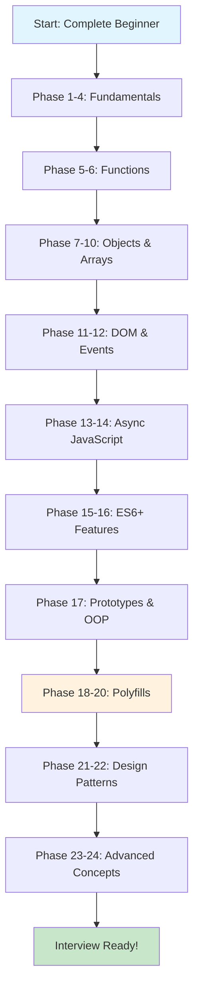
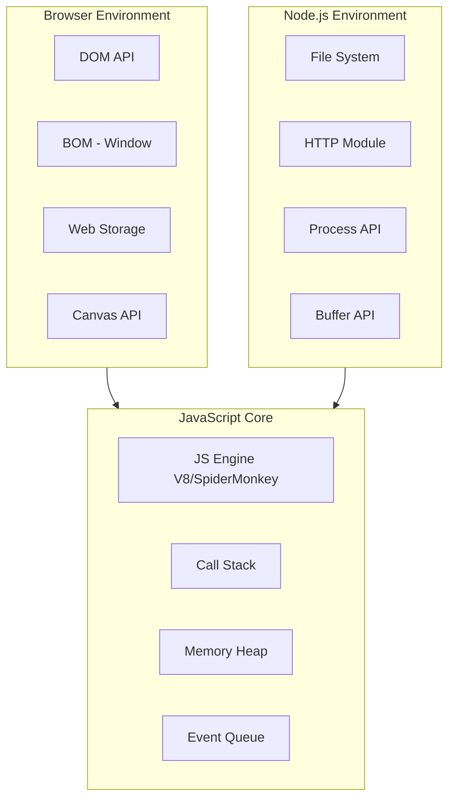
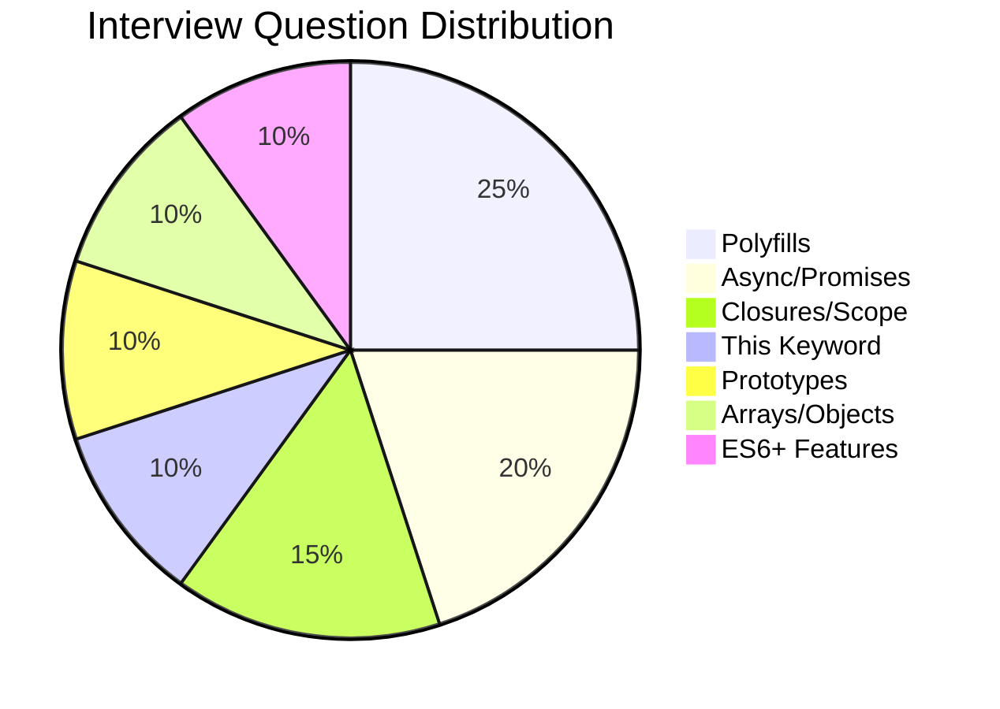

# JavaScript Interview Preparation & Learning System

A comprehensive 24-phase JavaScript learning curriculum designed to take you from beginner to advanced level, specifically optimized for technical interviews.

## Learning Path Overview



## Phase Breakdown

| Phase | Topic | Difficulty | Est. Time |
|-------|-------|------------|-----------|
| 1 | Variables, Types & Fundamentals | Beginner | 3-4 hours |
| 2 | Operators & Type Coercion | Beginner | 2-3 hours |
| 3 | Conditionals & Switch | Beginner | 2-3 hours |
| 4 | Loops Deep Dive | Beginner | 3-4 hours |
| 5 | Function Declarations & Expressions | Beginner | 3-4 hours |
| 6 | Arrow Functions & Scope | Intermediate | 4-5 hours |
| 7 | Objects Creation & Properties | Intermediate | 3-4 hours |
| 8 | Object Methods & Destructuring | Intermediate | 3-4 hours |
| 9 | Array Fundamentals & Mutations | Intermediate | 3-4 hours |
| 10 | Array Iteration Methods | Intermediate | 5-6 hours |
| 11 | DOM Selection & Manipulation | Intermediate | 4-5 hours |
| 12 | Events & Event Delegation | Intermediate | 4-5 hours |
| 13 | Callbacks & Promises | Advanced | 5-6 hours |
| 14 | Async/Await & Event Loop | Advanced | 5-6 hours |
| 15 | ES6+ Classes & Modules | Intermediate | 4-5 hours |
| 16 | ES6+ Advanced Features | Advanced | 5-6 hours |
| 17 | Prototypes & Inheritance | Advanced | 5-6 hours |
| 18 | Polyfills - Array Methods | Advanced | 6-7 hours |
| 19 | Polyfills - Function & Object | Advanced | 6-7 hours |
| 20 | Polyfills - Promise & Utilities | Advanced | 6-7 hours |
| 21 | Design Patterns - Creational | Advanced | 4-5 hours |
| 22 | Design Patterns - Behavioral | Advanced | 4-5 hours |
| 23 | Closures, Scope & This | Advanced | 5-6 hours |
| 24 | Performance & Security | Advanced | 5-6 hours |

## JavaScript Runtime Environment



## Study Plans

### Complete Beginner (12-14 weeks)
- **Weeks 1-2**: Phases 1-4 (Fundamentals)
- **Weeks 3-4**: Phases 5-6 (Functions)
- **Weeks 5-6**: Phases 7-10 (Objects & Arrays)
- **Weeks 7-8**: Phases 11-12 (DOM & Events)
- **Weeks 9-10**: Phases 13-14 (Async)
- **Weeks 11-12**: Phases 15-17 (ES6+ & Prototypes)
- **Weeks 13-14**: Phases 18-24 (Polyfills & Advanced)

### Interview Prep (6-8 weeks)
- **Week 1**: Quick review Phases 1-6
- **Week 2**: Deep dive Phases 13-14 (Async)
- **Weeks 3-4**: Phases 18-20 (Polyfills - CRITICAL!)
- **Week 5**: Phase 23 (Closures, This)
- **Week 6-7**: Solve 50+ coding challenges
- **Week 8**: Mock interviews, company-specific prep

### Crash Course (2 weeks)
- **Days 1-3**: Fundamentals rapid review
- **Days 4-6**: Functions, closures, this
- **Days 7-9**: Async JavaScript deep dive
- **Days 10-12**: ALL critical polyfills
- **Days 13-14**: Top 50 interview questions

## How to Use This Repository

1. **Sequential Learning**: Follow phases 1-24 in order for complete understanding
2. **Topic Focus**: Jump to specific phases for targeted review
3. **Interview Prep**: Focus on Phases 18-20 (Polyfills) + Phase 23 (Advanced)
4. **Code Practice**: Each phase includes runnable examples and exercises

## Key Resources in Each Phase

- **README.md**: Comprehensive theory and explanations
- **examples.js**: Runnable code examples with detailed comments
- **exercises.js**: Practice problems with solutions
- **interview-questions.md**: Common interview questions for that topic
- **diagrams/**: Visual explanations using Mermaid

## Interview Priority Topics



## Getting Started

```bash
# Clone the repository
git clone <repo-url>

# Navigate to the project
cd javascript-interview

# Start with Phase 1
cd phases/phase-01-variables-types
```

## Contributing

Feel free to submit issues and enhancement requests!

## License

MIT License - feel free to use for your learning journey!
