# JavaScript Concept Diagrams

A collection of Mermaid diagrams explaining core JavaScript concepts.

## Event Loop

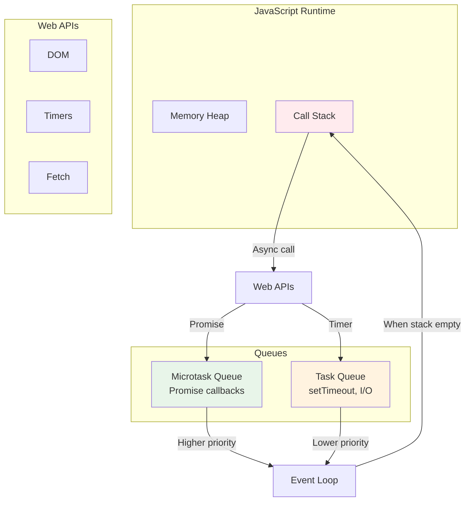

## Execution Context

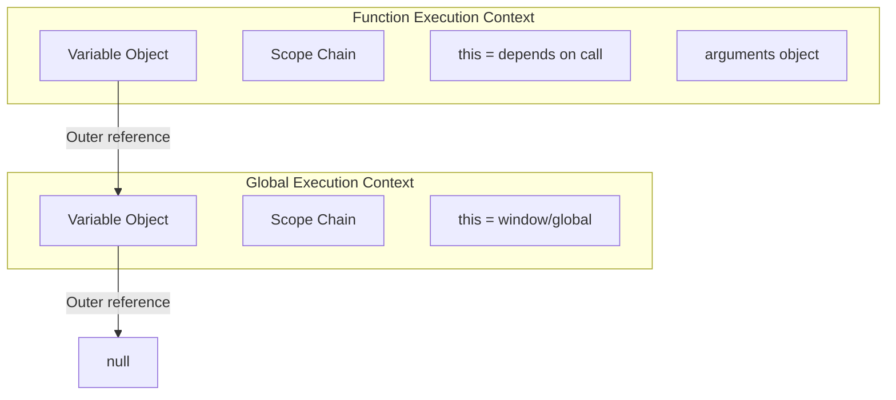

## Hoisting Timeline

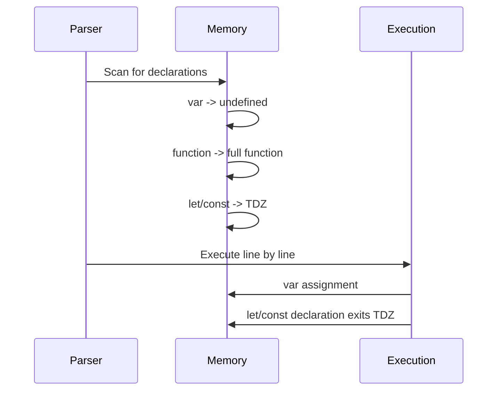

## Closure Scope Chain

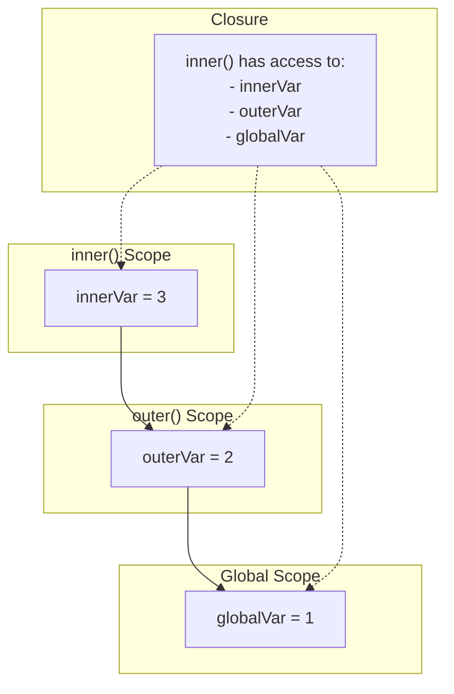

## This Binding Decision Tree

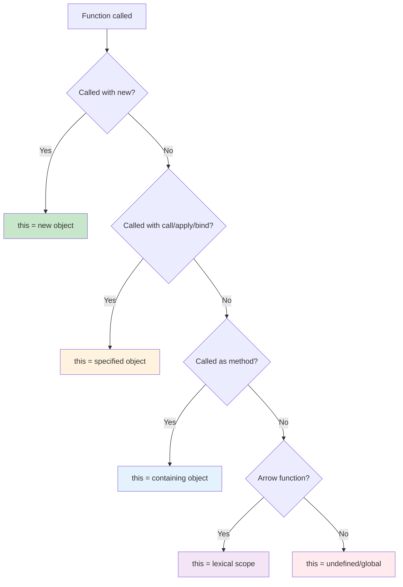

## Promise Flow

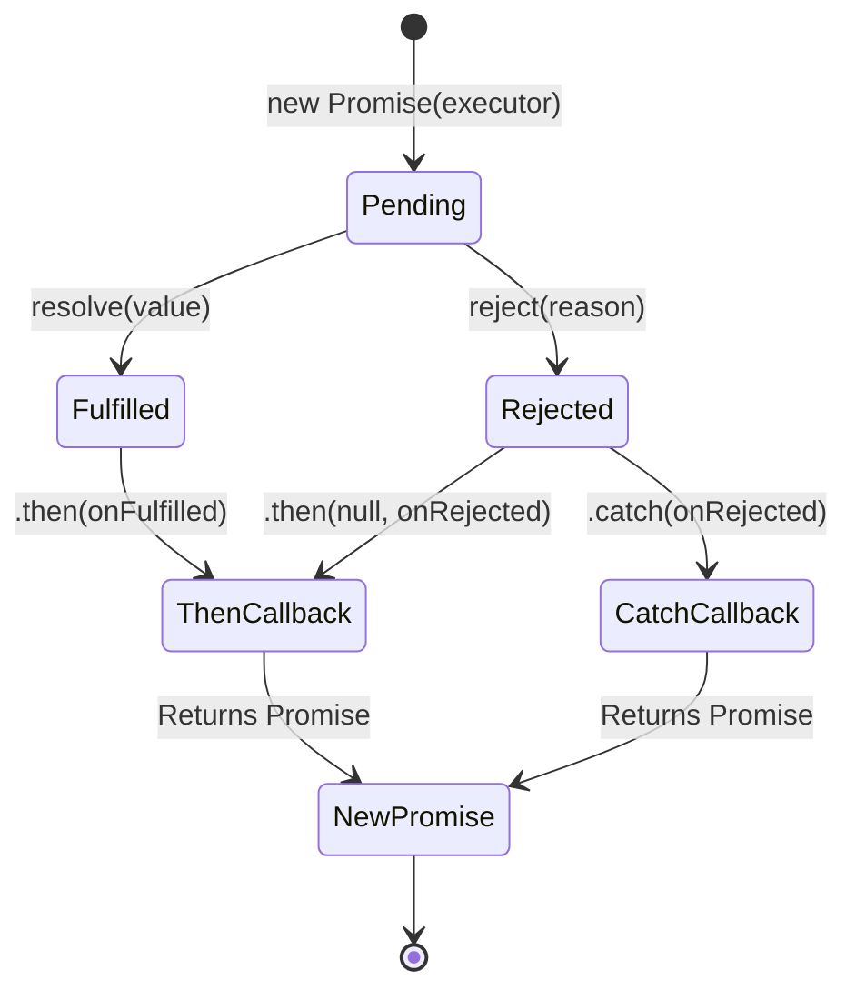

## Array Methods Comparison

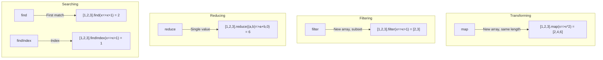

## Prototype Chain

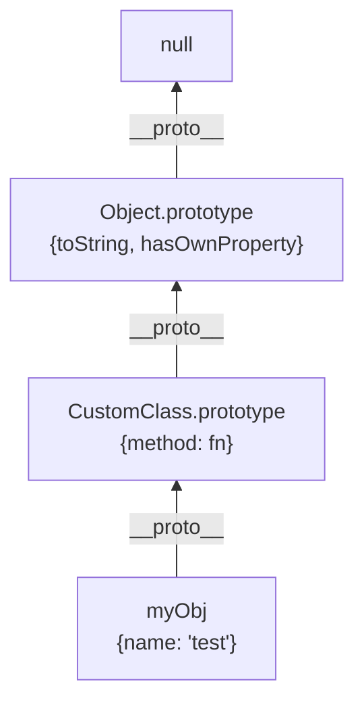

## Async/Await Transformation

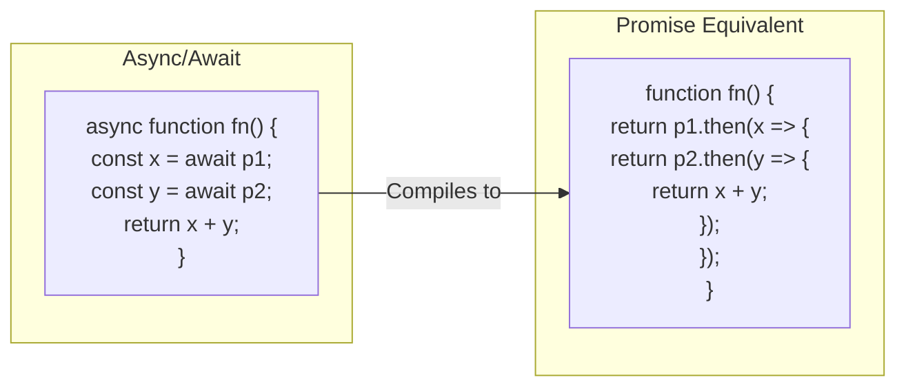

## Debounce vs Throttle

```mermaid
gantt
    title Function Execution Timeline
    dateFormat X
    axisFormat %S

    section Events
    Click 1 :a1, 0, 1
    Click 2 :a2, 2, 1
    Click 3 :a3, 4, 1
    Click 4 :a4, 6, 1
    Click 5 :a5, 10, 1

    section Debounce (3s)
    Wait    :crit, d1, 0, 9
    Execute :done, d2, 9, 1

    section Throttle (3s)
    Execute :done, t1, 0, 1
    Wait    :crit, t2, 1, 3
    Execute :done, t3, 6, 1
    Wait    :crit, t4, 7, 3
    Execute :done, t5, 10, 1
```

## Memory: Stack vs Heap

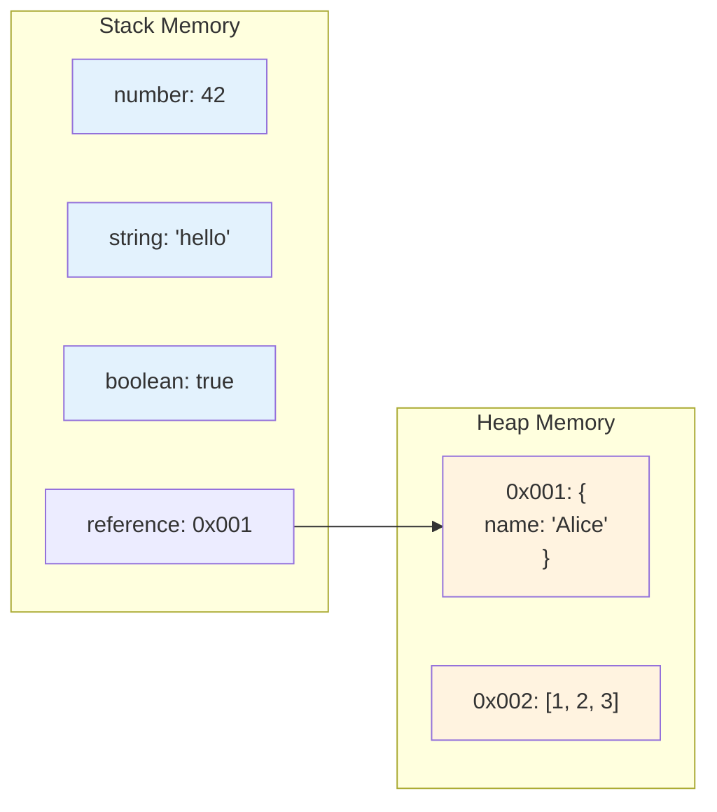

## Module Systems Comparison

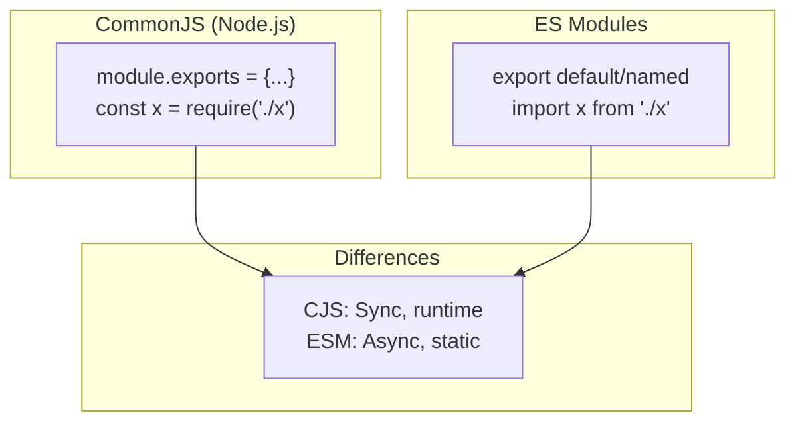

---

All diagrams use Mermaid syntax and can be rendered in GitHub, VSCode, or any Mermaid-compatible viewer.
