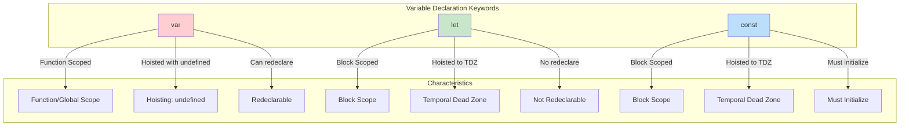
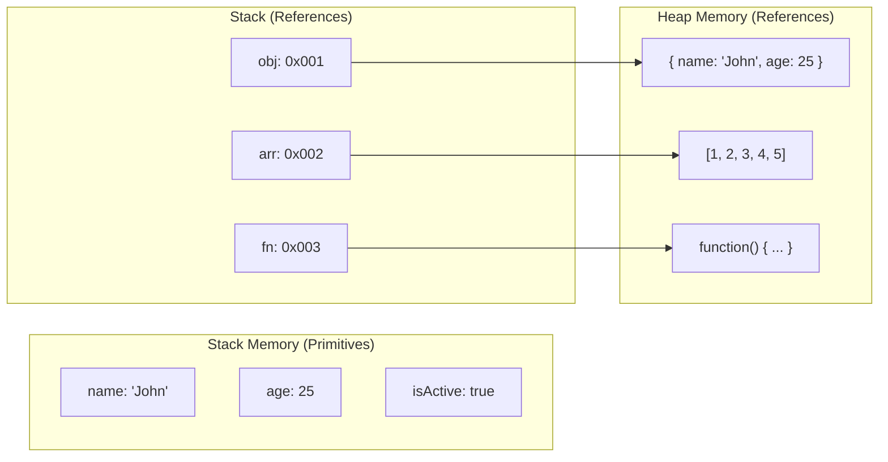
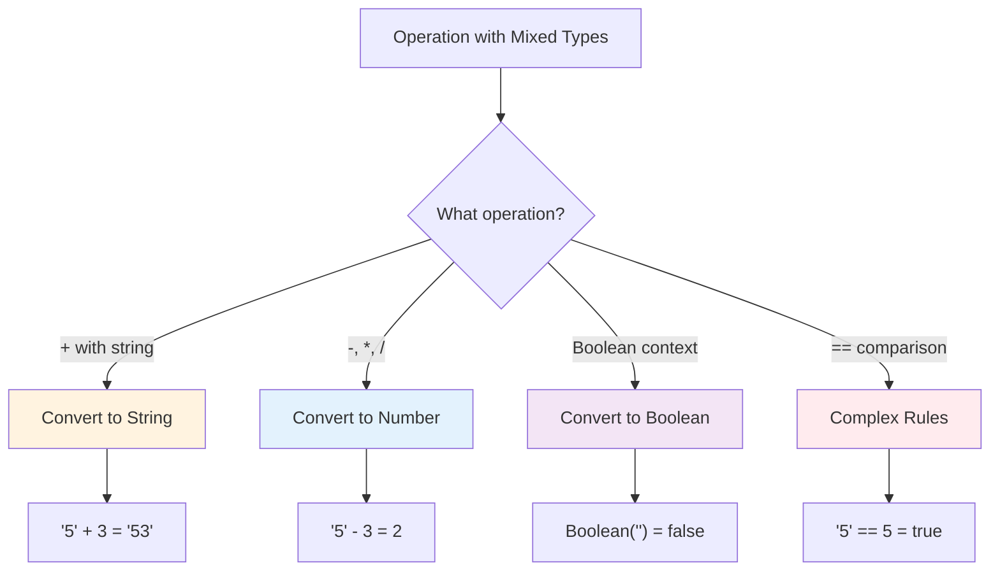

# Phase 1: Variables, Types & Fundamentals

## Overview

This phase covers the absolute foundation of JavaScript - understanding how data is stored, accessed, and typed in the language.

## Variable Declaration Comparison

## Memory Allocation: Primitives vs References

## Type Coercion Flowchart

## Topics Covered

1. What is JavaScript and where does it run
2. Variables: var, let, const
3. Data types: Primitives and References
4. Type coercion and conversion
5. Truthy and falsy values
6. Template literals

## Key Interview Questions

1. What is the difference between `var`, `let`, and `const`?
2. Explain hoisting with examples
3. What is the Temporal Dead Zone?
4. Why does `typeof null` return "object"?
5. What are falsy values in JavaScript?

## Quick Reference

| Feature | var | let | const |
|---------|-----|-----|-------|
| Scope | Function | Block | Block |
| Hoisting | Yes (undefined) | Yes (TDZ) | Yes (TDZ) |
| Redeclare | Yes | No | No |
| Reassign | Yes | Yes | No |
| Must Init | No | No | Yes |

## Files in This Phase

- `examples.js` - Comprehensive code examples
- `exercises.js` - Practice problems
- `interview-questions.md` - Detailed Q&A
