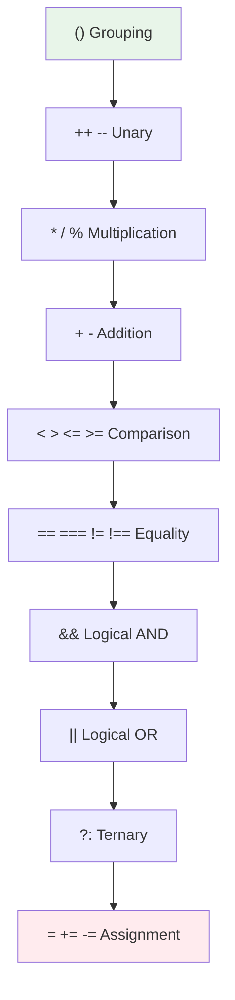
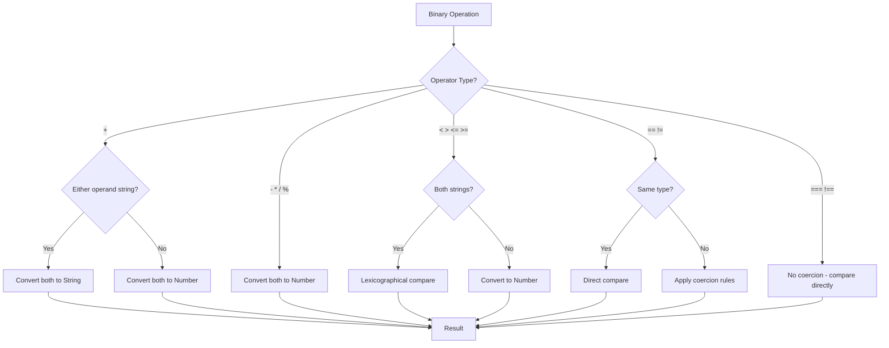
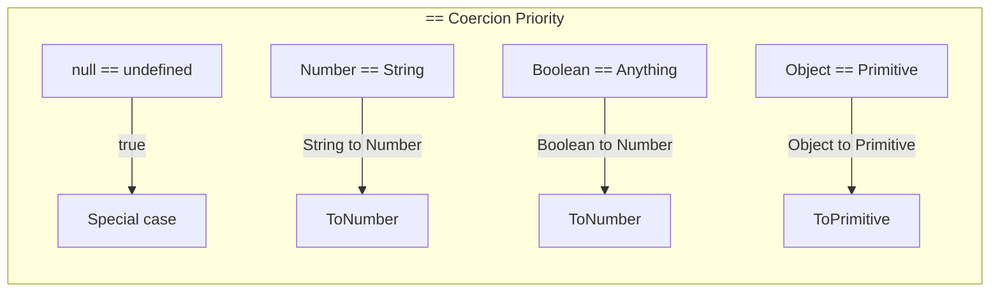

# Phase 2: Operators & Type Coercion

## Overview

Master JavaScript operators and the implicit type coercion rules that drive many interview questions.

## Operator Precedence

## Type Coercion Decision Tree

## Loose Equality Coercion Rules

## Topics Covered

1. Arithmetic operators
2. Comparison operators
3. Logical operators
4. Assignment operators
5. Bitwise operators
6. Type coercion rules
7. Short-circuit evaluation
8. Nullish coalescing

## Key Interview Questions

1. What is operator precedence?
2. Explain short-circuit evaluation
3. What's the difference between || and ??
4. How does type coercion work with ==?
5. Explain the + operator's dual behavior
