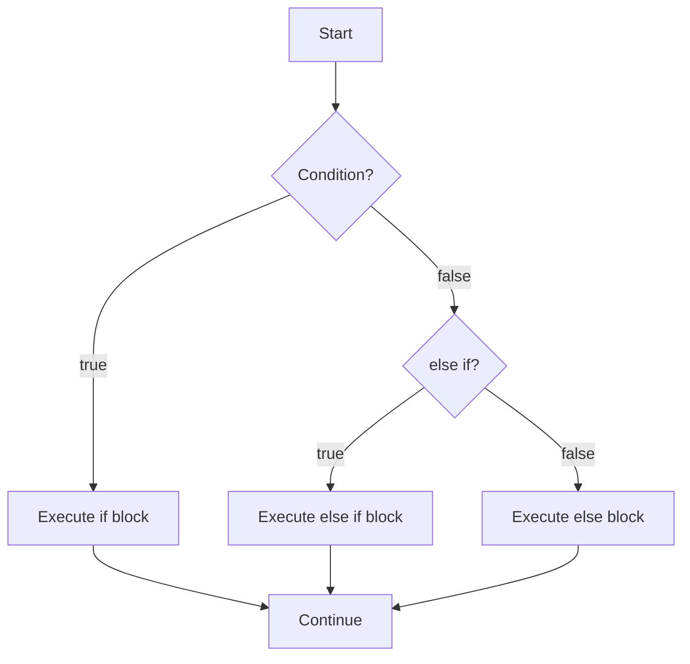
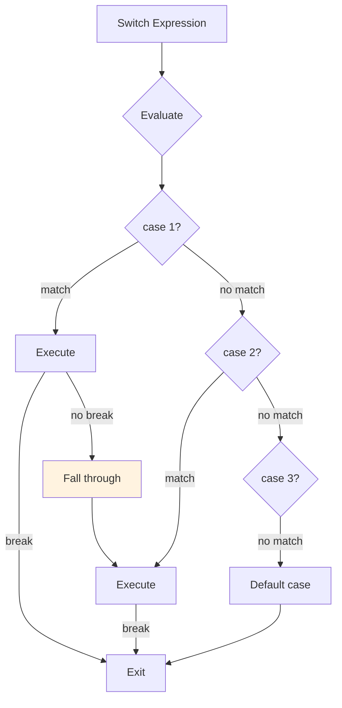

# Phase 3: Conditionals & Switch

## Control Flow Visualization

## Switch Statement Flow

## Topics Covered

1. if/else statements
2. else if chains
3. Switch statements
4. Fall-through behavior
5. Ternary operator patterns
6. Guard clauses
7. Truthy/falsy in conditions

## Key Concepts

- Guard clauses for early returns
- Switch uses strict equality (===)
- Fall-through can be intentional or a bug
