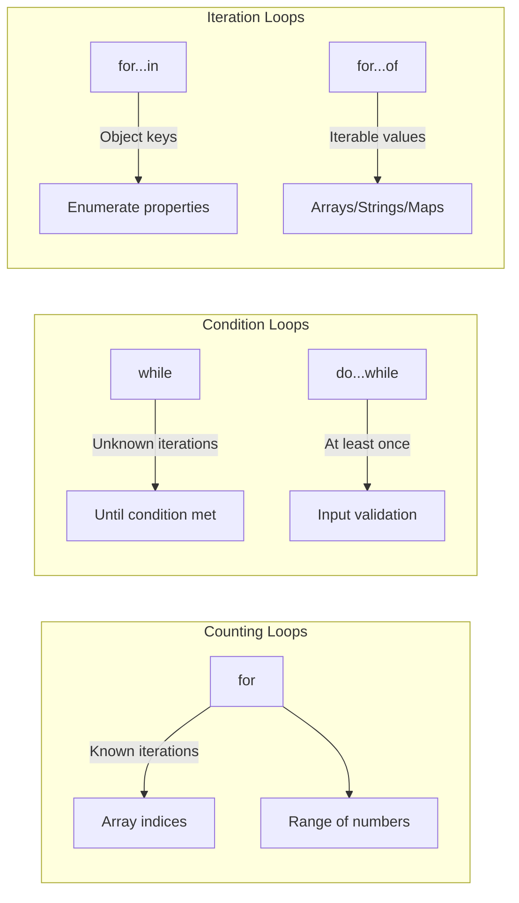
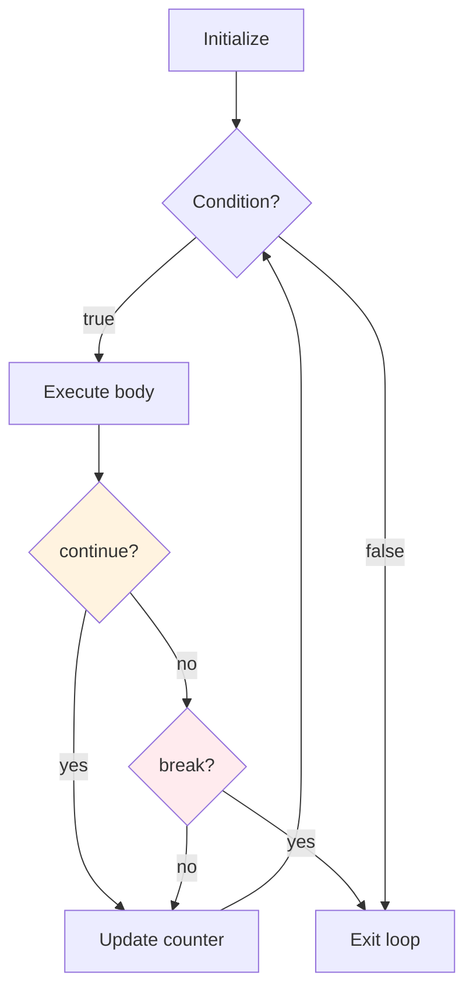

# Phase 4: Loops Deep Dive

## Loop Types Comparison

## Loop Control Flow

## Topics Covered

1. for loop (classic)
2. while loop
3. do...while loop
4. for...in (object properties)
5. for...of (iterable values)
6. break and continue
7. Labeled statements
8. Loop performance
