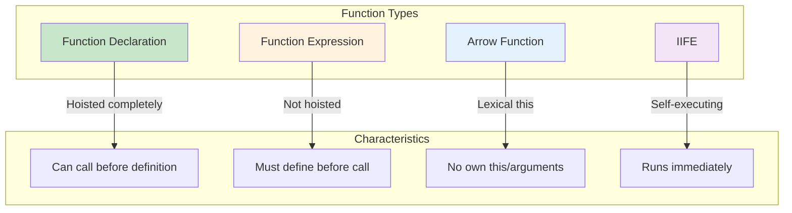
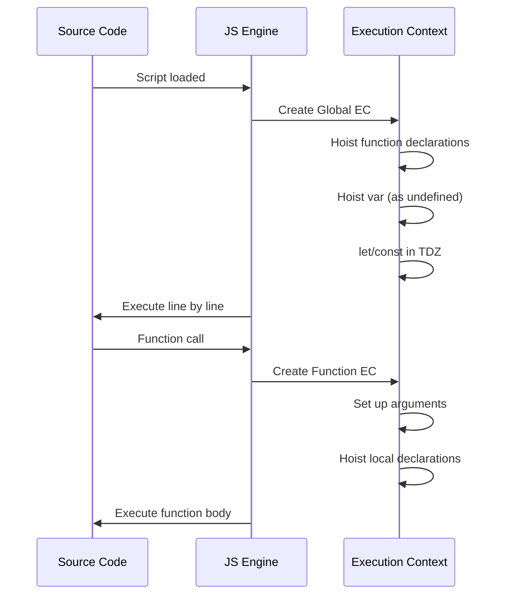

# Phase 5: Function Declarations & Expressions

## Function Types Comparison

## Execution Context Creation

## Topics Covered

1. Function declarations
2. Function expressions
3. Anonymous functions
4. Named function expressions
5. Parameters and arguments
6. Default parameters
7. Rest parameters
8. Return values
9. Hoisting behavior
10. IIFE pattern
