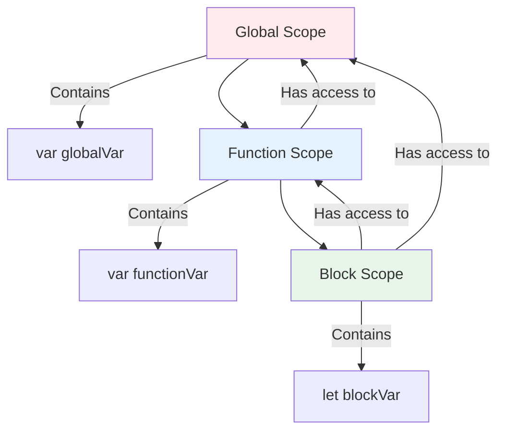

# Phase 6: Arrow Functions & Scope

## Arrow Function vs Regular Function

```mermaid
graph TB
    subgraph "Regular Function"
        RF[function() {}]
        RF --> T1["Own 'this' binding"]
        RF --> A1["Own 'arguments' object"]
        RF --> C1["Can be constructor"]
        RF --> H1["Hoisted if declaration"]
    end

    subgraph "Arrow Function"
        AF["() => {}"]
        AF --> T2["Lexical 'this'"]
        AF --> A2["No 'arguments'"]
        AF --> C2["Cannot be constructor"]
        AF --> H2["Never hoisted"]
    end

    style RF fill:#fff3e0
    style AF fill:#e3f2fd
```

## Scope Chain Visualization



## Topics Covered

1. Arrow function syntax
2. Implicit vs explicit return
3. Lexical this binding
4. When NOT to use arrow functions
5. Scope types (global, function, block)
6. Lexical scoping
7. Scope chain lookup
8. Variable shadowing
