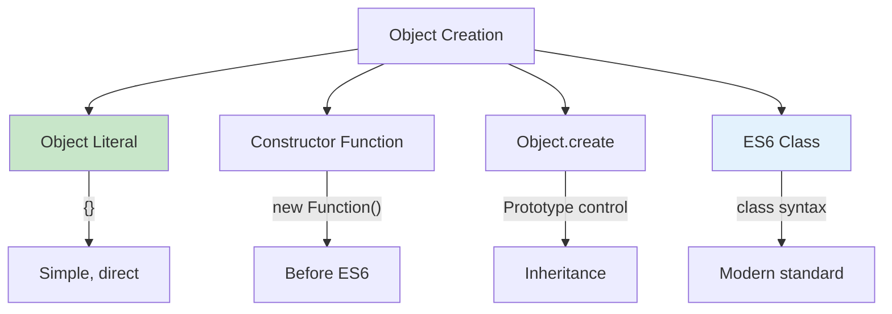
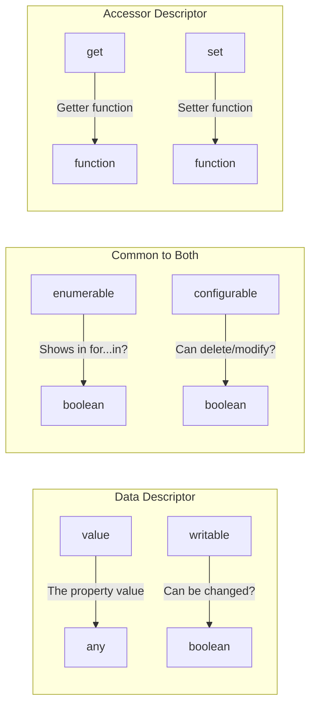

# Phase 7: Objects Creation & Properties

## Object Creation Methods

## Property Descriptors

## Topics Covered

1. Object literal syntax
2. Constructor functions
3. Object.create()
4. Property access (dot vs bracket)
5. Property descriptors
6. Getters and setters
7. Object methods (keys, values, entries)
8. Object immutability
