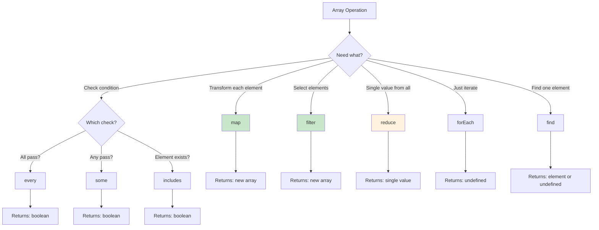
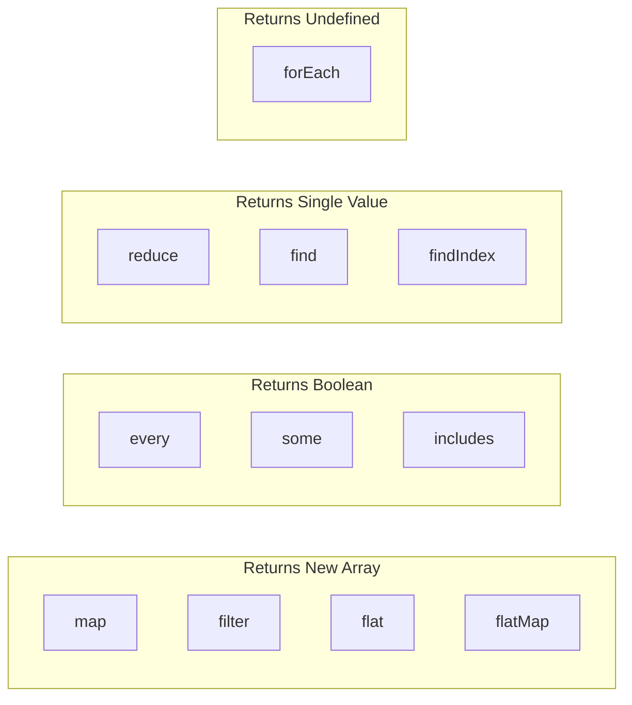

# Phase 10: Array Iteration Methods

## Array Methods Flowchart

## Method Comparison Table

## Topics Covered

1. forEach vs map
2. filter for selection
3. reduce for aggregation
4. find and findIndex
5. some and every
6. flat and flatMap
7. Method chaining
8. Performance considerations
