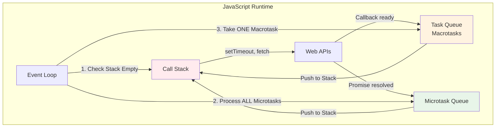
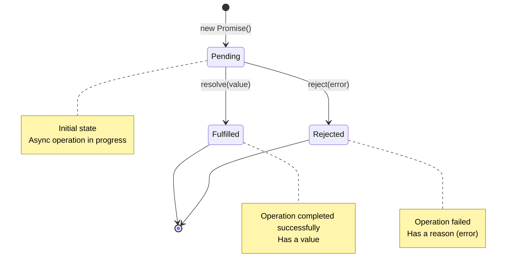
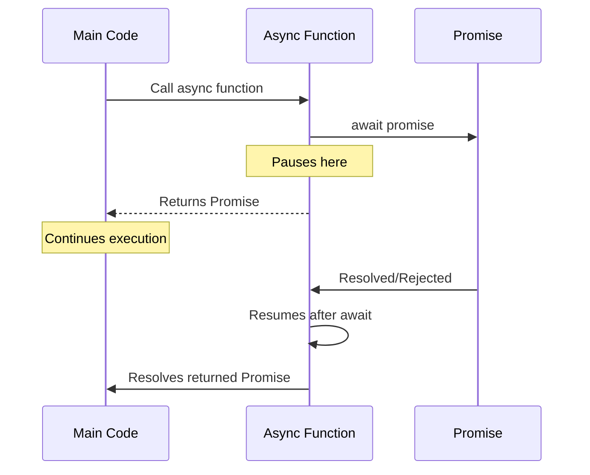

# Phase 14: Async/Await & Event Loop

## The JavaScript Event Loop

## Promise States

## Async/Await Flow

## Topics Covered

1. Event loop mechanics
2. Call stack
3. Task queue vs Microtask queue
4. Promises in depth
5. Promise methods (all, race, allSettled, any)
6. Async/await syntax
7. Error handling patterns
8. Parallel vs sequential execution
