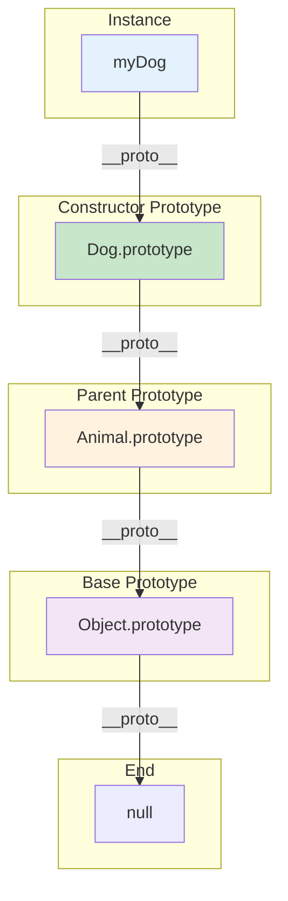
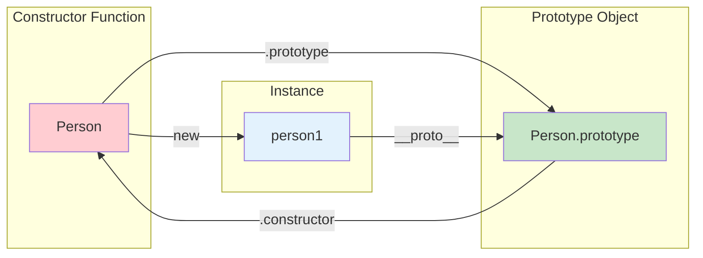

# Phase 17: Prototypes & Inheritance

## Prototype Chain

## Constructor and Prototype Relationship

## Topics Covered

1. Prototype chain
2. __proto__ vs prototype
3. Constructor functions
4. Object.create()
5. Class inheritance
6. Mixins and composition
7. hasOwnProperty vs in
8. Property shadowing
