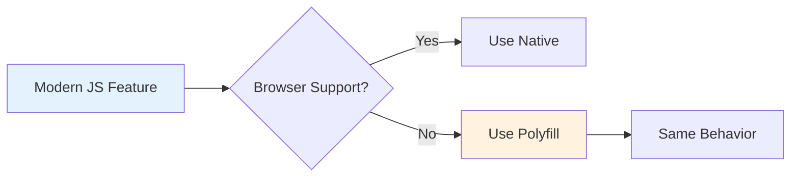
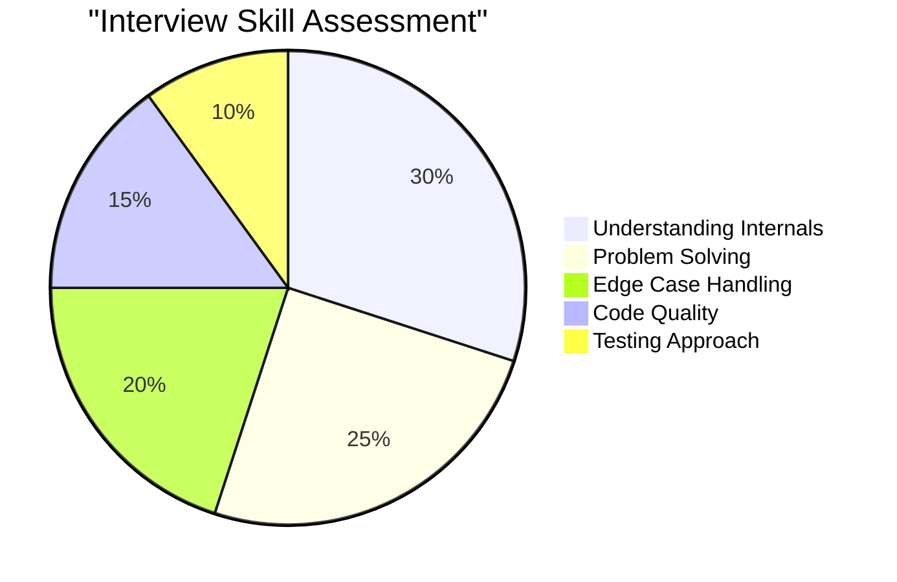
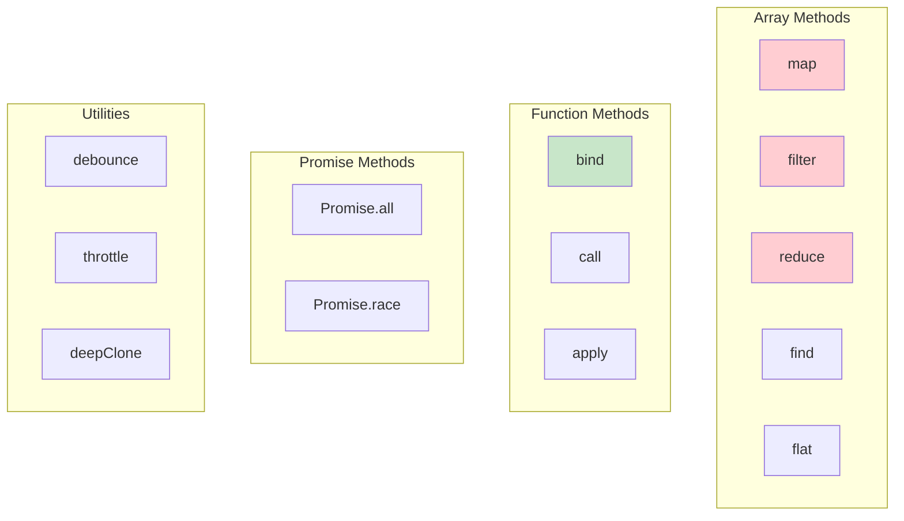

# Phase 18: Polyfills - Array Methods

## What Are Polyfills?

## Why Polyfills in Interviews

## Critical Polyfills to Know

## Topics Covered

1. Array.prototype.map
2. Array.prototype.filter
3. Array.prototype.reduce
4. Array.prototype.find/findIndex
5. Array.prototype.forEach
6. Array.prototype.some/every
7. Array.prototype.flat/flatMap
8. Array.from
