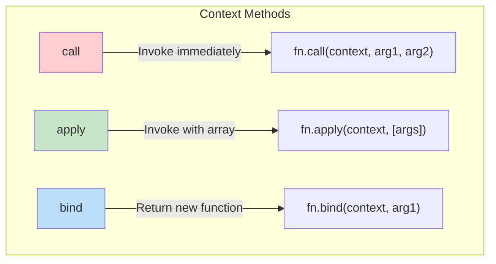
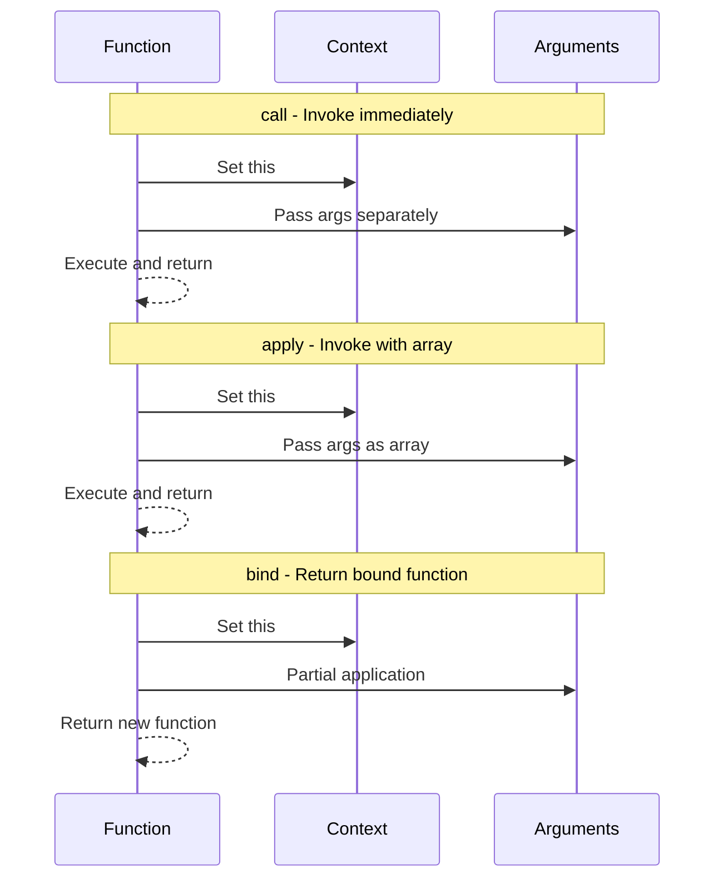

# Phase 19: Polyfills - Function & Object Methods

## Function.prototype Methods

## bind vs call vs apply

## Topics Covered

1. Function.prototype.call
2. Function.prototype.apply
3. Function.prototype.bind
4. Object.create
5. Object.assign
6. Object.keys/values/entries
7. debounce
8. throttle
