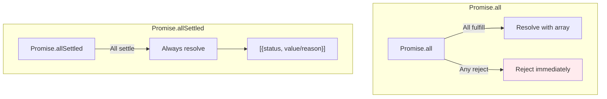
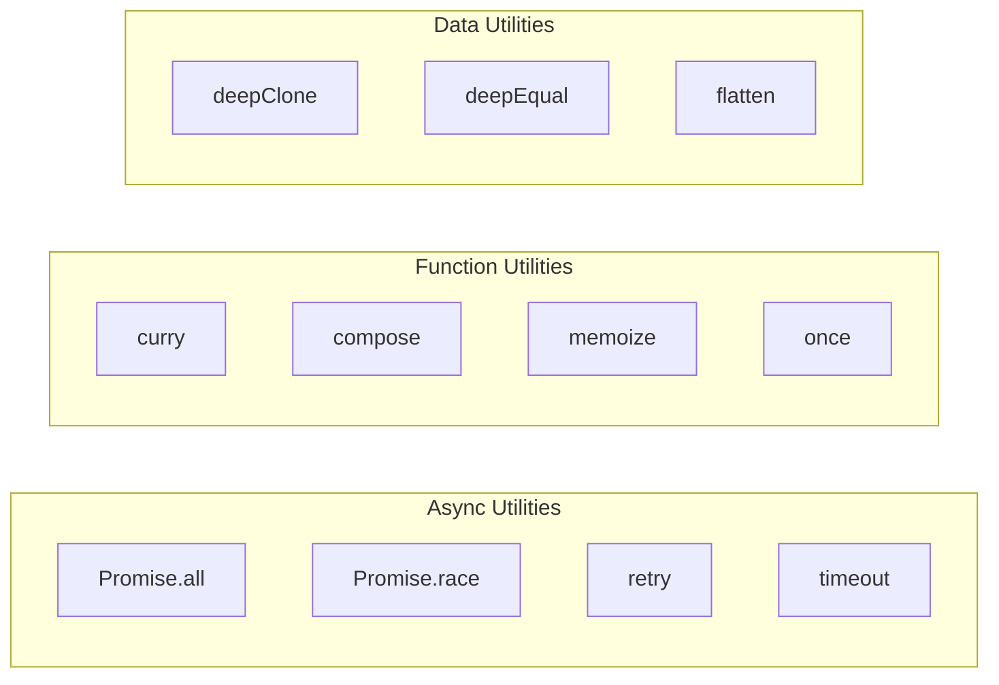

# Phase 20: Polyfills - Promise & Utility Functions

## Promise.all vs Promise.allSettled

## Utility Functions Overview

## Topics Covered

1. Promise.all polyfill
2. Promise.race polyfill
3. Promise.allSettled polyfill
4. Promise.any polyfill
5. Deep clone implementation
6. Deep equality check
7. Event emitter pattern
8. Retry with backoff
