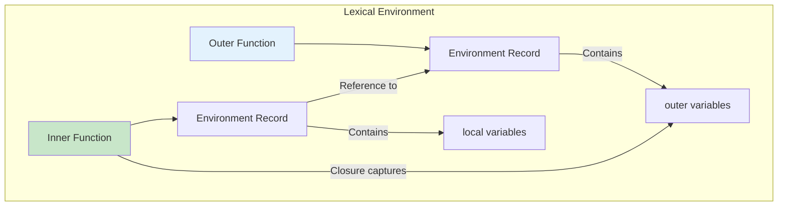
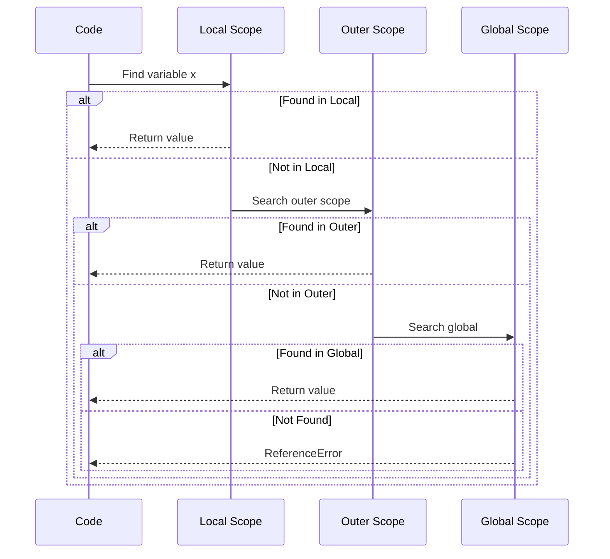

# Phase 23: Closures, Scope & This

## Closure Visualization



## This Binding Rules

```mermaid
flowchart TD
    START[How was function called?] --> Q1{With new?}
    Q1 -->|Yes| NEW["this = new object"]
    Q1 -->|No| Q2{With call/apply/bind?}
    Q2 -->|Yes| EXPLICIT["this = specified context"]
    Q2 -->|No| Q3{As method obj.fn()?}
    Q3 -->|Yes| IMPLICIT["this = object"]
    Q3 -->|No| Q4{Arrow function?}
    Q4 -->|Yes| LEXICAL["this = enclosing scope"]
    Q4 -->|No| DEFAULT["this = undefined (strict) or global"]

    style NEW fill:#c8e6c9
    style EXPLICIT fill:#fff3e0
    style IMPLICIT fill:#e3f2fd
    style LEXICAL fill:#f3e5f5
    style DEFAULT fill:#ffebee
```

## Scope Chain Lookup



## Topics Covered

1. Closures in depth
2. Lexical scoping
3. Scope chain
4. this keyword rules
5. Explicit binding (call/apply/bind)
6. Arrow functions and this
7. Common closure patterns
8. Memory and closures
