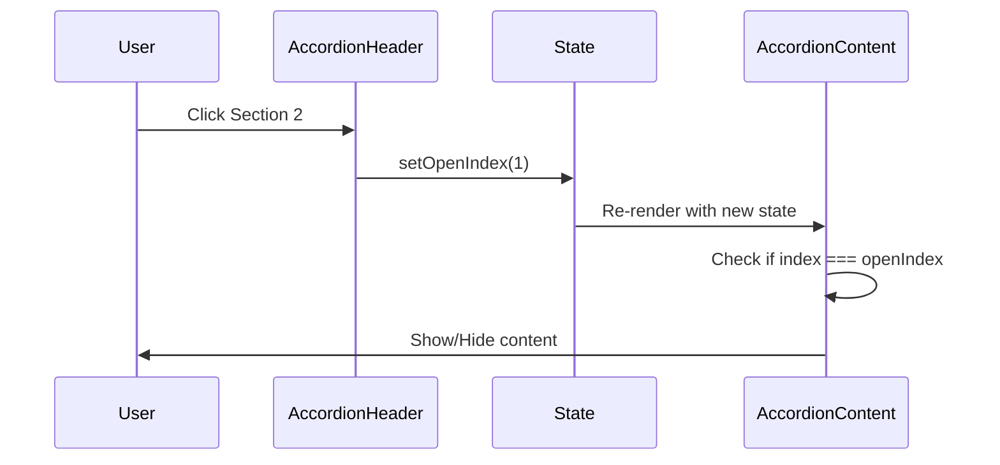

# Accordion Component - Easy Level

**Difficulty:** Beginner
**Time:** 30-45 minutes
**Prerequisites:** Basic React, useState, event handling

---

## 📋 Problem Statement

Build an accordion component that displays a list of sections. Each section has a header and content. Clicking a section header toggles showing/hiding its content. Only one section can be open at a time (unless specified otherwise).

### Example:
```
▼ Section 1
  This is the content of section 1.

► Section 2

► Section 3
```

When user clicks "Section 2", Section 1 closes and Section 2 opens.

---

## 🎯 Requirements

**Must Have:**
- ✅ Display multiple accordion sections
- ✅ Click header to expand/collapse content
- ✅ Only one section open at a time (single-selection mode)
- ✅ Visual indicator (arrow icon) for open/closed state

**Nice to Have:**
- ⭐ Support multi-selection mode (multiple sections open)
- ⭐ Default open section
- ⭐ Smooth transitions
- ⭐ Keyboard navigation

---

## 🤔 How to Think About This Problem

### Step 1: Identify State

**Question:** What data changes when user interacts?

```
Initial State: No section is open
User clicks Section 1 → Section 1 opens
User clicks Section 2 → Section 2 opens, Section 1 closes

What we need to track: Which section is currently open
```

**State Design:**
```jsx
// Option 1: Store index of open section
const [openIndex, setOpenIndex] = useState(null);
// null = nothing open, 0 = first section, 1 = second section, etc.

// Option 2: Store ID of open section (if sections have IDs)
const [openId, setOpenId] = useState(null);
```

### Step 2: Component Structure

```
AccordionContainer
└── Accordion (manages state)
    ├── AccordionItem (section 1)
    │   ├── AccordionHeader (clickable)
    │   └── AccordionContent (show/hide)
    ├── AccordionItem (section 2)
    └── AccordionItem (section 3)
```

**OR Simpler (for interview):**

```
Accordion (single component)
└── Map over items
    ├── Header (clickable)
    └── Content (conditional render)
```

### Step 3: Event Flow



### Step 4: Data Structure

```jsx
// Sample data for accordion sections
const accordionData = [
  {
    id: 1,
    title: 'What is React?',
    content: 'React is a JavaScript library for building user interfaces.'
  },
  {
    id: 2,
    title: 'What is JSX?',
    content: 'JSX is a syntax extension to JavaScript.'
  },
  {
    id: 3,
    title: 'What are components?',
    content: 'Components are reusable pieces of UI.'
  }
];
```

---

## 💡 Approach & Solution

### Approach 1: Single Component (Recommended for Interview)

**Why?** Simple, quick to implement, clear logic.

```jsx
import { useState } from 'react';

function Accordion() {
  // State: Track which section is currently open
  // Why useState? We need to re-render when user clicks a section
  // Why number | null? null means nothing is open, number is the index of open section
  const [openIndex, setOpenIndex] = useState(null);

  // Sample data - in real app, this would come from props or API
  const items = [
    {
      title: 'What is React?',
      content: 'React is a JavaScript library for building user interfaces. It is maintained by Meta and a community of developers.'
    },
    {
      title: 'What is JSX?',
      content: 'JSX is a syntax extension to JavaScript. It allows you to write HTML-like code in JavaScript files.'
    },
    {
      title: 'What are components?',
      content: 'Components are reusable pieces of UI. They can be functional or class-based.'
    }
  ];

  // Event handler: Toggle accordion section
  // Why this logic? If user clicks already-open section, close it. Otherwise, open clicked section.
  const handleToggle = (index) => {
    // If clicking the currently open section, close it (set to null)
    // Otherwise, open the clicked section
    setOpenIndex(openIndex === index ? null : index);

    // Alternative (without ternary):
    // if (openIndex === index) {
    //   setOpenIndex(null); // Close
    // } else {
    //   setOpenIndex(index); // Open
    // }
  };

  return (
    <div className="accordion">
      <h1>Frequently Asked Questions</h1>

      {/* Loop through all items and render each section */}
      {items.map((item, index) => (
        // Why key? React needs unique keys to efficiently update the DOM
        // Why index here? Items are static and won't be reordered
        <div key={index} className="accordion-item">

          {/* Header: Always visible, clickable */}
          <div
            className="accordion-header"
            onClick={() => handleToggle(index)}
            // Why inline function? We need to pass the index to handler
            style={{ cursor: 'pointer', padding: '15px', background: '#f0f0f0', marginBottom: '1px' }}
          >
            {/* Visual indicator: Arrow points down when open, right when closed */}
            <span style={{ marginRight: '10px' }}>
              {openIndex === index ? '▼' : '►'}
            </span>
            <strong>{item.title}</strong>
          </div>

          {/* Content: Only show if this section is open */}
          {/* Why this condition? Only render content when openIndex matches current index */}
          {openIndex === index && (
            <div
              className="accordion-content"
              style={{ padding: '15px', background: '#fff', marginBottom: '10px' }}
            >
              {item.content}
            </div>
          )}

        </div>
      ))}
    </div>
  );
}

export default Accordion;
```

---

### Approach 2: Multi-Component (Better for Production)

**Why?** More maintainable, reusable components.

```jsx
import { useState } from 'react';

// Parent component: Manages state for all accordion items
function Accordion({ items }) {
  const [openIndex, setOpenIndex] = useState(null);

  return (
    <div className="accordion">
      {items.map((item, index) => (
        <AccordionItem
          key={index}
          item={item}
          index={index}
          isOpen={openIndex === index}
          onToggle={() => setOpenIndex(openIndex === index ? null : index)}
        />
      ))}
    </div>
  );
}

// Child component: Represents a single accordion section
function AccordionItem({ item, isOpen, onToggle }) {
  // Why props? This component doesn't manage state, parent does (lifting state up)

  return (
    <div className="accordion-item">
      {/* Header */}
      <div
        className="accordion-header"
        onClick={onToggle}
        // Why onClick={onToggle} not onClick={onToggle()}?
        // onClick expects a function reference, not the result of calling the function
        style={{ cursor: 'pointer', padding: '15px', background: '#f0f0f0' }}
      >
        <span>{isOpen ? '▼' : '►'}</span> {item.title}
      </div>

      {/* Content */}
      {isOpen && (
        <div className="accordion-content" style={{ padding: '15px', background: '#fff' }}>
          {item.content}
        </div>
      )}
    </div>
  );
}

// Usage
function App() {
  const faqData = [
    { title: 'Question 1', content: 'Answer 1' },
    { title: 'Question 2', content: 'Answer 2' },
  ];

  return <Accordion items={faqData} />;
}

export default App;
```

---

## 🚀 Advanced: Multi-Selection Mode

**Requirement:** Allow multiple sections to be open at the same time.

**State Change:**
```jsx
// Before: Single selection (one number or null)
const [openIndex, setOpenIndex] = useState(null);

// After: Multi-selection (array of numbers)
const [openIndexes, setOpenIndexes] = useState([]);
// Example: [0, 2] means first and third sections are open
```

**Complete Implementation:**

```jsx
import { useState } from 'react';

function AccordionMulti() {
  // State: Array of open section indexes
  // Why array? We need to track multiple open sections
  const [openIndexes, setOpenIndexes] = useState([]);

  const items = [
    { title: 'Section 1', content: 'Content 1' },
    { title: 'Section 2', content: 'Content 2' },
    { title: 'Section 3', content: 'Content 3' }
  ];

  const handleToggle = (index) => {
    // Check if this section is already open
    if (openIndexes.includes(index)) {
      // It's open, so close it (remove from array)
      setOpenIndexes(openIndexes.filter(i => i !== index));

      // Why filter? It creates a new array without the index
      // Example: [0, 1, 2].filter(i => i !== 1) → [0, 2]
    } else {
      // It's closed, so open it (add to array)
      setOpenIndexes([...openIndexes, index]);

      // Why spread operator? We must create a new array for React to detect change
      // ❌ Wrong: openIndexes.push(index) - mutates existing array
      // ✅ Correct: [...openIndexes, index] - creates new array
    }
  };

  return (
    <div className="accordion">
      {items.map((item, index) => (
        <div key={index} className="accordion-item">
          <div
            className="accordion-header"
            onClick={() => handleToggle(index)}
            style={{ cursor: 'pointer', padding: '15px', background: '#f0f0f0' }}
          >
            {/* Check if current index is in openIndexes array */}
            <span>{openIndexes.includes(index) ? '▼' : '►'}</span> {item.title}
          </div>

          {openIndexes.includes(index) && (
            <div className="accordion-content" style={{ padding: '15px' }}>
              {item.content}
            </div>
          )}
        </div>
      ))}
    </div>
  );
}

export default AccordionMulti;
```

**State Flow Diagram:**

```
Initial: openIndexes = []

User clicks Section 0:
  includes(0)? No → Add to array
  openIndexes = [0]

User clicks Section 2:
  includes(2)? No → Add to array
  openIndexes = [0, 2]

User clicks Section 0 again:
  includes(0)? Yes → Remove from array
  openIndexes = [2]
```

---

## ❌ Common Beginner Mistakes

### Mistake 1: Mutating State Directly

```jsx
// ❌ WRONG: Mutating array (React won't re-render)
const handleToggle = (index) => {
  openIndexes.push(index); // Mutation!
  setOpenIndexes(openIndexes); // React thinks state is the same (same reference)
};

// ✅ CORRECT: Create new array
const handleToggle = (index) => {
  setOpenIndexes([...openIndexes, index]); // New array created
};
```

**Why this matters:** React uses shallow comparison. If the array reference is the same, React won't re-render.

### Mistake 2: Calling Function in onClick

```jsx
// ❌ WRONG: Calls function immediately on render
<div onClick={handleToggle(index)}>
  {/* handleToggle executes right away, not on click */}
</div>

// ✅ CORRECT: Pass function reference
<div onClick={() => handleToggle(index)}>
  {/* Arrow function creates a new function that will call handleToggle when clicked */}
</div>
```

### Mistake 3: Missing Key in List

```jsx
// ❌ WRONG: No key
{items.map((item, index) => (
  <div>{item.title}</div>
))}

// ❌ ALSO WRONG: Using index as key (can cause bugs if items are reordered)
// For static lists (items don't change), index is acceptable
// For dynamic lists (add/remove/reorder), use unique ID

// ✅ CORRECT: Unique key
{items.map((item) => (
  <div key={item.id}>{item.title}</div>
))}
```

### Mistake 4: Not Handling Edge Cases

```jsx
// ❌ WRONG: No check for empty items
function Accordion() {
  const [openIndex, setOpenIndex] = useState(null);
  const items = []; // Empty array!

  return (
    <div>
      {items.map((item, index) => (
        <div key={index}>{item.title}</div>
      ))}
    </div>
  );
}
// Result: Renders nothing, looks broken

// ✅ CORRECT: Handle empty state
function Accordion() {
  const [openIndex, setOpenIndex] = useState(null);
  const items = [];

  if (items.length === 0) {
    return <div>No items to display</div>;
  }

  return (
    <div>
      {items.map((item, index) => (
        <div key={index}>{item.title}</div>
      ))}
    </div>
  );
}
```

---

## 🎤 Interviewer Questions & Answers

### Q1: Why did you use `useState` here?

**Answer:**
> "I used `useState` to track which accordion section is currently open. Every time the user clicks a section header, we need to update the state and re-render the component to show/hide the content. `useState` gives us the current state value (`openIndex`) and a function to update it (`setOpenIndex`), which triggers a re-render."

### Q2: What if I want multiple sections to be open at the same time?

**Answer:**
> "Great question! I'd change the state from a single number to an array. Instead of `useState(null)`, I'd use `useState([])`. When a user clicks a section, I'd check if the index is already in the array. If yes, remove it using `filter()`. If no, add it using the spread operator `[...openIndexes, index]`. This way, we can track multiple open sections."

### Q3: How would you handle this if data comes from an API?

**Answer:**
```jsx
function Accordion() {
  const [items, setItems] = useState([]);
  const [openIndex, setOpenIndex] = useState(null);
  const [loading, setLoading] = useState(true);

  // useEffect: Run once on component mount
  // Why? We want to fetch data when component first renders
  useEffect(() => {
    // Fetch data from API
    fetch('/api/accordion-items')
      .then(res => res.json())
      .then(data => {
        setItems(data); // Update items state
        setLoading(false); // Update loading state
      })
      .catch(error => {
        console.error('Error fetching data:', error);
        setLoading(false);
      });
  }, []); // Empty dependency array = run once on mount

  if (loading) {
    return <div>Loading...</div>;
  }

  return (
    <div>
      {items.map((item, index) => (
        // ... accordion items
      ))}
    </div>
  );
}
```

### Q4: How would you add smooth transitions when opening/closing?

**Answer:**
> "I'd add CSS transitions to the accordion content. I'd use `max-height` with a transition instead of `display: none/block` since you can't animate `display`. Here's how:"

```jsx
// CSS
.accordion-content {
  max-height: 0;
  overflow: hidden;
  transition: max-height 0.3s ease;
}

.accordion-content.open {
  max-height: 500px; /* Or calculate based on content height */
}

// JSX
<div className={`accordion-content ${isOpen ? 'open' : ''}`}>
  {item.content}
</div>
```

### Q5: What about accessibility? How would you make this keyboard-navigable?

**Answer:**
> "Good point! I'd add several things:
> 1. Use `<button>` instead of `<div>` for headers (or add `role="button"`, `tabIndex={0}`)
> 2. Add `aria-expanded={isOpen}` to indicate state
> 3. Add `aria-controls` to link header to content
> 4. Handle keyboard events (Enter, Space to toggle)
> 5. Add focus styles"

```jsx
<button
  onClick={() => handleToggle(index)}
  onKeyDown={(e) => {
    if (e.key === 'Enter' || e.key === ' ') {
      e.preventDefault();
      handleToggle(index);
    }
  }}
  aria-expanded={openIndex === index}
  aria-controls={`content-${index}`}
>
  {item.title}
</button>

<div id={`content-${index}`} role="region">
  {openIndex === index && item.content}
</div>
```

---

## 📊 Component Structure Diagram

```
┌──────────────────────────────────────────┐
│       Accordion Component                │
│                                          │
│  State: openIndex = 1                    │
│                                          │
├──────────────────────────────────────────┤
│  ┌────────────────────────────────────┐ │
│  │ AccordionItem (index=0)            │ │
│  │ isOpen = false                      │ │
│  │ ┌────────────────────────────────┐ │ │
│  │ │ Header: "Section 1"  ►         │ │ │
│  │ └────────────────────────────────┘ │ │
│  │ Content: (hidden)                   │ │
│  └────────────────────────────────────┘ │
│                                          │
├──────────────────────────────────────────┤
│  ┌────────────────────────────────────┐ │
│  │ AccordionItem (index=1)            │ │
│  │ isOpen = true  ← State matches!    │ │
│  │ ┌────────────────────────────────┐ │ │
│  │ │ Header: "Section 2"  ▼         │ │ │
│  │ └────────────────────────────────┘ │ │
│  │ ┌────────────────────────────────┐ │ │
│  │ │ Content: "This is section 2"   │ │ │
│  │ └────────────────────────────────┘ │ │
│  └────────────────────────────────────┘ │
│                                          │
├──────────────────────────────────────────┤
│  ┌────────────────────────────────────┐ │
│  │ AccordionItem (index=2)            │ │
│  │ isOpen = false                      │ │
│  │ ┌────────────────────────────────┐ │ │
│  │ │ Header: "Section 3"  ►         │ │ │
│  │ └────────────────────────────────┘ │ │
│  │ Content: (hidden)                   │ │
│  └────────────────────────────────────┘ │
└──────────────────────────────────────────┘
```

---

## 🔑 Key Takeaways

1. **State Management:** Use `useState` to track which section is open
2. **Conditional Rendering:** Use `&&` to show/hide content based on state
3. **Event Handling:** Pass function reference to `onClick`, not the result of calling it
4. **Immutability:** Always create new arrays/objects when updating state
5. **Component Structure:** Keep it simple for interviews (single component is fine)
6. **Edge Cases:** Handle empty states, prevent empty clicks

---

## 📈 Next Steps

After mastering the accordion component, try:
- Adding animations with CSS transitions
- Implementing keyboard navigation
- Creating a controlled version (state managed by parent)
- Adding accessibility features (ARIA attributes)

Keep practicing! 🚀
