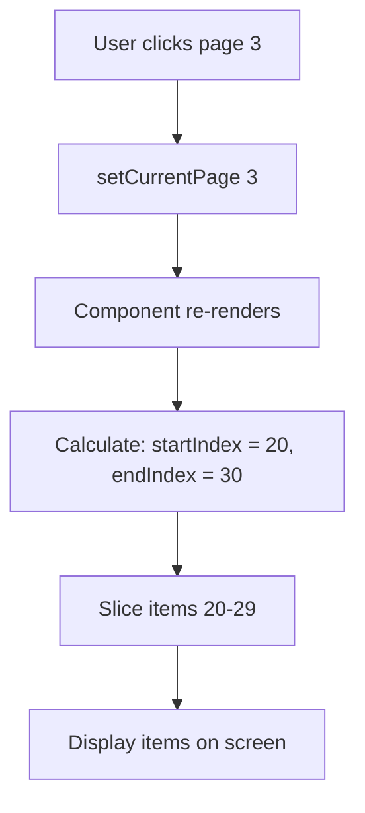
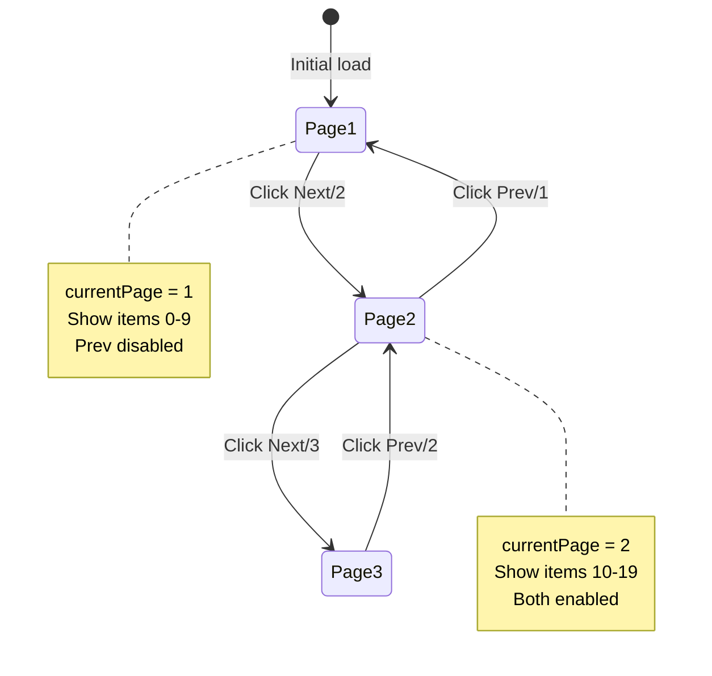

# Pagination Component

**Difficulty:** Intermediate
**Time:** 45-60 minutes
**Prerequisites:** useState, useEffect, API calls, array methods

---

## Problem Statement

Build a pagination component that displays a large list of items across multiple pages. Users can navigate between pages using Previous/Next buttons and page numbers.

### Example:
```
Items 1-10 of 100

[Item 1]
[Item 2]
...
[Item 10]

[Previous] [1] [2] [3] ... [10] [Next]
```

### Real-World Usage:
- E-commerce product listings (Amazon, eBay)
- Search results (Google)
- Admin dashboards with data tables
- Blog post listings

---

## Requirements

**Must Have:**
- Display items for current page
- Page number buttons
- Previous/Next buttons
- Disable buttons at boundaries
- Highlight current page

**Nice to Have:**
- Page size selector (10, 20, 50 items)
- Jump to page input
- Show total pages and items
- Ellipsis for large page counts

---

## How to Think About the Problem

### Step 1: Understand the Data

```javascript
// Given:
totalItems = 100        // Total number of items
itemsPerPage = 10       // Items to show per page

// We need:
totalPages = 10         // How many pages total?
currentPage = 3         // Which page are we on?
currentItems = [...]    // Which items to show?
```

### Step 2: Pagination Logic

```javascript
// Calculate total pages
totalPages = Math.ceil(totalItems / itemsPerPage)
// Example: Math.ceil(100 / 10) = 10 pages

// For page 3, which items to show?
startIndex = (currentPage - 1) * itemsPerPage
// Example: (3 - 1) * 10 = 20

endIndex = startIndex + itemsPerPage
// Example: 20 + 10 = 30

// Show items from index 20 to 29
currentItems = allItems.slice(startIndex, endIndex)
```

### Step 3: State Management

```javascript
// What changes? What stays same?

// State (changes):
const [currentPage, setCurrentPage] = useState(1);

// Derived (calculated from state):
const totalPages = Math.ceil(items.length / itemsPerPage);
const currentItems = items.slice(start, end);

// Constants (don't change):
const itemsPerPage = 10;
```

### Step 4: Visual Flow



---

## Complete Solution

```jsx
import { useState } from 'react';

function Pagination() {
  // Sample data (in real app, this comes from API)
  const allItems = Array.from({ length: 100 }, (_, i) => ({
    id: i + 1,
    name: `Item ${i + 1}`
  }));

  // State: Current page number
  // Why useState? Page changes when user clicks navigation
  const [currentPage, setCurrentPage] = useState(1);

  // Configuration: Items per page
  // Why not state? This rarely changes, can be a constant
  const itemsPerPage = 10;

  // Calculate total pages
  // Why Math.ceil? If 95 items and 10 per page, need 10 pages (not 9.5)
  const totalPages = Math.ceil(allItems.length / itemsPerPage);

  // Calculate items for current page
  // Why calculate? Derived data, no need to store in state
  const indexOfLastItem = currentPage * itemsPerPage;
  const indexOfFirstItem = indexOfLastItem - itemsPerPage;
  const currentItems = allItems.slice(indexOfFirstItem, indexOfLastItem);

  // Event handlers
  const handleNextPage = () => {
    setCurrentPage(prev => Math.min(prev + 1, totalPages));
    // Why Math.min? Prevent going beyond last page
  };

  const handlePrevPage = () => {
    setCurrentPage(prev => Math.max(prev - 1, 1));
    // Why Math.max? Prevent going below page 1
  };

  const handlePageClick = (pageNumber) => {
    setCurrentPage(pageNumber);
  };

  // Generate page numbers array
  // Why function? Logic for showing limited page numbers (e.g., 1 ... 5 6 7 ... 10)
  const getPageNumbers = () => {
    const pages = [];
    const maxPagesToShow = 5;

    if (totalPages <= maxPagesToShow) {
      // Show all pages if total is small
      for (let i = 1; i <= totalPages; i++) {
        pages.push(i);
      }
    } else {
      // Show limited pages with ellipsis
      // Always show: first page, last page, current page, and 2 around current
      pages.push(1);

      let startPage = Math.max(2, currentPage - 1);
      let endPage = Math.min(totalPages - 1, currentPage + 1);

      if (startPage > 2) pages.push('...');

      for (let i = startPage; i <= endPage; i++) {
        pages.push(i);
      }

      if (endPage < totalPages - 1) pages.push('...');

      pages.push(totalPages);
    }

    return pages;
  };

  return (
    <div style={{ maxWidth: '800px', margin: '50px auto', padding: '20px' }}>
      <h1>Pagination Demo</h1>

      {/* Stats */}
      <div style={{ marginBottom: '20px', color: '#666' }}>
        Showing {indexOfFirstItem + 1}-{Math.min(indexOfLastItem, allItems.length)} of {allItems.length} items
      </div>

      {/* Items List */}
      <div style={{ marginBottom: '30px' }}>
        {currentItems.map(item => (
          <div
            key={item.id}
            style={{
              padding: '15px',
              margin: '10px 0',
              background: '#f9f9f9',
              borderRadius: '5px'
            }}
          >
            {item.name}
          </div>
        ))}
      </div>

      {/* Pagination Controls */}
      <div style={{ display: 'flex', gap: '5px', justifyContent: 'center', alignItems: 'center' }}>
        {/* Previous Button */}
        <button
          onClick={handlePrevPage}
          disabled={currentPage === 1}
          // Why disabled? Can't go before page 1
          style={{
            padding: '8px 16px',
            cursor: currentPage === 1 ? 'not-allowed' : 'pointer',
            opacity: currentPage === 1 ? 0.5 : 1
          }}
        >
          Previous
        </button>

        {/* Page Numbers */}
        {getPageNumbers().map((page, index) => (
          page === '...' ? (
            <span key={`ellipsis-${index}`} style={{ padding: '8px' }}>...</span>
          ) : (
            <button
              key={page}
              onClick={() => handlePageClick(page)}
              style={{
                padding: '8px 12px',
                background: currentPage === page ? '#007bff' : 'white',
                color: currentPage === page ? 'white' : 'black',
                border: '1px solid #ddd',
                cursor: 'pointer',
                fontWeight: currentPage === page ? 'bold' : 'normal'
              }}
            >
              {page}
            </button>
          )
        ))}

        {/* Next Button */}
        <button
          onClick={handleNextPage}
          disabled={currentPage === totalPages}
          style={{
            padding: '8px 16px',
            cursor: currentPage === totalPages ? 'not-allowed' : 'pointer',
            opacity: currentPage === totalPages ? 0.5 : 1
          }}
        >
          Next
        </button>
      </div>

      {/* Page Info */}
      <div style={{ textAlign: 'center', marginTop: '20px', color: '#666' }}>
        Page {currentPage} of {totalPages}
      </div>
    </div>
  );
}

export default Pagination;
```

---

## Key Concepts Explained

### 1. Why Calculate Instead of Store?

```jsx
// ❌ WRONG: Store derived data in state
const [currentItems, setCurrentItems] = useState([]);
useEffect(() => {
  const items = allItems.slice(start, end);
  setCurrentItems(items);
}, [currentPage]);

// ✅ CORRECT: Calculate from existing data
const currentItems = allItems.slice(
  (currentPage - 1) * itemsPerPage,
  currentPage * itemsPerPage
);
```

**Why?**
- Derived data should be calculated, not stored
- Less state = less bugs
- No synchronization issues
- Simpler code

### 2. Boundary Checks

```jsx
// Prevent going beyond limits
const handleNextPage = () => {
  setCurrentPage(prev => Math.min(prev + 1, totalPages));
  // Math.min ensures: if prev+1 > totalPages, use totalPages
};

const handlePrevPage = () => {
  setCurrentPage(prev => Math.max(prev - 1, 1));
  // Math.max ensures: if prev-1 < 1, use 1
};
```

### 3. Page Number Generation Logic

```javascript
// For 100 pages, don't show all:
// [1] [2] [3] ... [100] ❌ Too many buttons!

// Instead, show smart selection:
// [1] ... [48] [49] [50] ... [100] ✅ Much better!

function getPageNumbers() {
  if (totalPages <= 5) {
    // Few pages? Show all
    return [1, 2, 3, 4, 5];
  } else {
    // Many pages? Show: first, last, current, and neighbors
    return [1, '...', currentPage-1, currentPage, currentPage+1, '...', totalPages];
  }
}
```

### Visual State Diagram



---

## Advanced: Server-Side Pagination

In real applications, you don't load all items at once. Instead, fetch only the items for the current page from the server.

```jsx
import { useState, useEffect } from 'react';

function PaginationAPI() {
  const [items, setItems] = useState([]);
  const [currentPage, setCurrentPage] = useState(1);
  const [totalPages, setTotalPages] = useState(0);
  const [loading, setLoading] = useState(false);

  // Fetch data when page changes
  // Why useEffect? Side effect (API call) triggered by page change
  useEffect(() => {
    const fetchItems = async () => {
      setLoading(true);
      try {
        // Send page number to server
        const response = await fetch(
          `/api/items?page=${currentPage}&limit=10`
        );
        const data = await response.json();

        // Server returns:
        // {
        //   items: [...],      // Items for this page
        //   totalPages: 50,    // Total pages available
        //   totalItems: 500    // Total items in database
        // }

        setItems(data.items);
        setTotalPages(data.totalPages);
      } catch (error) {
        console.error('Failed to fetch items:', error);
      } finally {
        setLoading(false);
      }
    };

    fetchItems();
  }, [currentPage]); // Re-fetch when page changes

  if (loading) return <div>Loading...</div>;

  return (
    <div>
      {items.map(item => (
        <div key={item.id}>{item.name}</div>
      ))}

      <button
        onClick={() => setCurrentPage(prev => prev - 1)}
        disabled={currentPage === 1}
      >
        Previous
      </button>

      <span>Page {currentPage} of {totalPages}</span>

      <button
        onClick={() => setCurrentPage(prev => prev + 1)}
        disabled={currentPage === totalPages}
      >
        Next
      </button>
    </div>
  );
}
```

### Client-Side vs Server-Side Pagination

| Aspect | Client-Side | Server-Side |
|--------|-------------|-------------|
| **Data Load** | Load all items once | Load per page |
| **Initial Load** | Slow (all data) | Fast (10 items) |
| **Page Switch** | Instant (no API) | Slow (API call) |
| **Memory** | High (all in RAM) | Low (10 in RAM) |
| **Best For** | Small datasets (<1000) | Large datasets (>1000) |

---

## Common Mistakes

### Mistake 1: 0-Based vs 1-Based Indexing

```jsx
// ❌ WRONG: Using 0-based page numbers (confusing for users)
const [currentPage, setCurrentPage] = useState(0); // Page 0, 1, 2...

// Display shows: "Page 0 of 9" ❌ Confusing!

// ✅ CORRECT: Use 1-based (Page 1, 2, 3...)
const [currentPage, setCurrentPage] = useState(1);

// Display shows: "Page 1 of 10" ✅ Intuitive!
```

**Why?** Users think in 1-based numbers (Page 1, 2, 3...), not 0-based.

### Mistake 2: Not Handling Edge Cases

```jsx
// ❌ WRONG: Can go to page 0 or beyond totalPages
const handleNextPage = () => {
  setCurrentPage(currentPage + 1); // No limit! Can be 999
};

const handlePrevPage = () => {
  setCurrentPage(currentPage - 1); // No limit! Can be -5
};

// ✅ CORRECT: Check boundaries
const handleNextPage = () => {
  if (currentPage < totalPages) {
    setCurrentPage(currentPage + 1);
  }
  // Or: setCurrentPage(prev => Math.min(prev + 1, totalPages));
};

const handlePrevPage = () => {
  if (currentPage > 1) {
    setCurrentPage(currentPage - 1);
  }
  // Or: setCurrentPage(prev => Math.max(prev - 1, 1));
};
```

### Mistake 3: Incorrect Slice Indices

```jsx
// ❌ WRONG: Off-by-one error
const startIndex = currentPage * itemsPerPage; // Page 1: 10 (wrong!)
const endIndex = startIndex + itemsPerPage;

// ✅ CORRECT: Subtract 1 from currentPage
const startIndex = (currentPage - 1) * itemsPerPage; // Page 1: 0 (correct!)
const endIndex = startIndex + itemsPerPage;

// Example: Page 1, 10 items per page
// Correct: items 0-9 ✅
// Wrong:   items 10-19 ❌
```

---

## Interviewer Q&A

**Q: How would you handle large page numbers (e.g., 1000 pages)?**

A: "I'd show limited page numbers with ellipsis:
```
[Prev] [1] ... [48] [49] [50] ... [1000] [Next]
```

Show first page, last page, current page, and a few around current. This keeps the UI clean while allowing navigation."

---

**Q: How would you add a 'Jump to Page' feature?**

```jsx
const [jumpToPage, setJumpToPage] = useState('');

const handleJumpToPage = () => {
  const pageNum = parseInt(jumpToPage);

  // Validate input
  if (pageNum >= 1 && pageNum <= totalPages) {
    setCurrentPage(pageNum);
    setJumpToPage(''); // Clear input
  } else {
    alert(`Please enter a number between 1 and ${totalPages}`);
  }
};

return (
  <div>
    <input
      type="number"
      value={jumpToPage}
      onChange={(e) => setJumpToPage(e.target.value)}
      placeholder="Page number"
      min="1"
      max={totalPages}
    />
    <button onClick={handleJumpToPage}>Go</button>
  </div>
);
```

---

**Q: How would you add a page size selector (10, 20, 50 items)?**

```jsx
const [itemsPerPage, setItemsPerPage] = useState(10);

// When itemsPerPage changes, reset to page 1
const handlePageSizeChange = (newSize) => {
  setItemsPerPage(newSize);
  setCurrentPage(1); // Important! Reset to first page
};

return (
  <select
    value={itemsPerPage}
    onChange={(e) => handlePageSizeChange(Number(e.target.value))}
  >
    <option value={10}>10 per page</option>
    <option value={20}>20 per page</option>
    <option value={50}>50 per page</option>
  </select>
);
```

---

**Q: How do you prevent users from clicking 'Next' rapidly?**

```jsx
const [isLoading, setIsLoading] = useState(false);

const handleNextPage = async () => {
  if (isLoading || currentPage >= totalPages) return;

  setIsLoading(true);
  setCurrentPage(prev => prev + 1);

  // If fetching from API:
  await fetchItems(currentPage + 1);

  setIsLoading(false);
};
```

---

**Q: How would you persist the current page in the URL?**

```jsx
import { useSearchParams } from 'react-router-dom';

function Pagination() {
  const [searchParams, setSearchParams] = useSearchParams();

  // Read page from URL (default to 1)
  const currentPage = parseInt(searchParams.get('page') || '1');

  const setCurrentPage = (page) => {
    setSearchParams({ page: page.toString() });
  };

  // Now URL shows: /products?page=3
  // User can bookmark, share, or refresh
}
```

---

## Key Takeaways

1. **State Management**
   - Store only `currentPage` in state
   - Calculate everything else (derived data)
   - Less state = simpler code

2. **Math is Important**
   - Use `Math.ceil` for total pages
   - Use `Math.min`/`Math.max` for boundaries
   - Remember 0-based array indexing vs 1-based page numbers

3. **User Experience**
   - Disable buttons at boundaries
   - Show clear page indicators
   - Handle large page counts with ellipsis

4. **Performance**
   - Client-side for small datasets
   - Server-side for large datasets
   - Consider user experience in both

5. **Edge Cases**
   - Empty datasets
   - Single page
   - Large page numbers
   - Invalid page numbers

---

## Practice Exercises

1. Add a "Items per page" dropdown
2. Implement "Jump to page" input
3. Add keyboard shortcuts (arrow keys for prev/next)
4. Highlight search terms in results
5. Add smooth scroll to top on page change

---

**Next:** [Infinite Scroll](./02-infinite-scroll.md)
