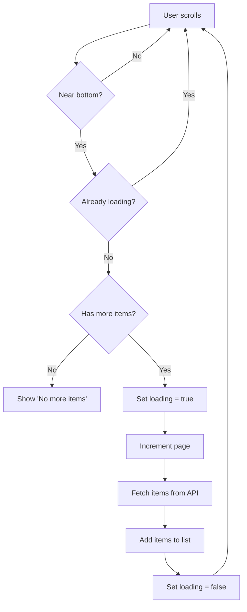
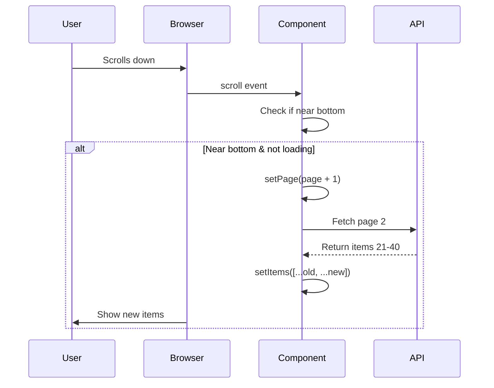
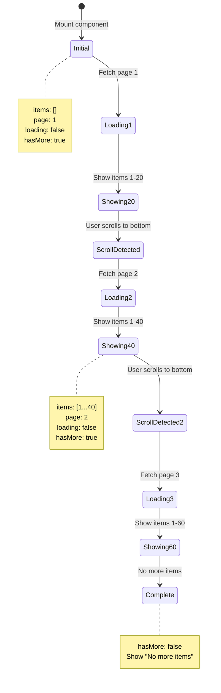

# Infinite Scroll

**Difficulty:** Intermediate
**Time:** 45-60 minutes
**Prerequisites:** useState, useEffect, useRef, scroll events, API calls

---

## Problem Statement

Load more items automatically when user scrolls to the bottom of the page. This is common in social media feeds (Twitter, Instagram, Facebook).

### Example:
```
[Item 1]
[Item 2]
...
[Item 20]
(user scrolls down)
Loading more items...
[Item 21]
[Item 22]
...
```

### Real-World Usage:
- Social media feeds (Twitter, Instagram, TikTok)
- Product catalogs (Pinterest, Etsy)
- News feeds (Medium, Reddit)
- Image galleries (Unsplash, Google Images)

---

## Requirements

**Must Have:**
- Display initial items
- Detect when user scrolls to bottom
- Load more items automatically
- Show loading indicator
- Handle "no more items" state

**Nice to Have:**
- Error handling
- Retry failed requests
- Smooth loading animation
- Skeleton placeholders

---

## How to Think About the Problem

### Step 1: Understand Scroll Detection

```javascript
// Browser provides these values:
window.innerHeight             // Height of viewport (visible area)
document.documentElement.scrollTop      // How far scrolled from top
document.documentElement.scrollHeight   // Total document height

// User at bottom when:
scrollTop + innerHeight >= scrollHeight

// More practical (trigger before absolute bottom):
scrollTop + innerHeight >= scrollHeight - 200
// Start loading 200px before reaching bottom
```

### Visual Representation:

```
┌─────────────────┐ ← Top (scrollTop = 0)
│                 │
│   Viewport      │ ← innerHeight = 800px
│   (visible)     │
├─────────────────┤ ← Current scroll position
│                 │
│   Content       │
│   below fold    │ ← scrollHeight = 2000px
│                 │
│                 │
└─────────────────┘ ← Bottom
```

### Step 2: State Management

```javascript
// What do we need to track?

const [items, setItems] = useState([]);        // All loaded items
const [page, setPage] = useState(1);           // Current page number
const [loading, setLoading] = useState(false); // Is fetching?
const [hasMore, setHasMore] = useState(true);  // More items available?
```

### Step 3: Flow Diagram



### Step 4: Event Flow



---

## Complete Solution

```jsx
import { useState, useEffect, useRef } from 'react';

function InfiniteScroll() {
  // State: Current items
  const [items, setItems] = useState([]);

  // State: Page number for fetching
  const [page, setPage] = useState(1);

  // State: Loading indicator
  const [loading, setLoading] = useState(false);

  // State: Has more items to load?
  const [hasMore, setHasMore] = useState(true);

  // useRef: Track if currently loading (prevent duplicate requests)
  // Why useRef? Value persists but doesn't cause re-render
  const loadingRef = useRef(false);

  // Simulate API call to fetch items
  const fetchItems = async (pageNumber) => {
    // Prevent duplicate requests
    if (loadingRef.current) return;

    loadingRef.current = true;
    setLoading(true);

    try {
      // Simulate network delay
      await new Promise(resolve => setTimeout(resolve, 1000));

      // Simulate fetching 20 items per page
      const newItems = Array.from({ length: 20 }, (_, i) => ({
        id: (pageNumber - 1) * 20 + i + 1,
        name: `Item ${(pageNumber - 1) * 20 + i + 1}`,
        description: `Description for item ${(pageNumber - 1) * 20 + i + 1}`
      }));

      // Add new items to existing items
      // Why spread operator? Keep existing items and add new ones
      setItems(prevItems => [...prevItems, ...newItems]);

      // Stop loading after 100 items (simulate end of data)
      if (pageNumber >= 5) {
        setHasMore(false);
      }

    } catch (error) {
      console.error('Failed to fetch items:', error);
    } finally {
      setLoading(false);
      loadingRef.current = false;
    }
  };

  // Load initial items
  // Why useEffect with empty deps? Run once on mount
  useEffect(() => {
    fetchItems(1);
  }, []);

  // Handle scroll event
  // Why useEffect? Set up event listener (side effect)
  useEffect(() => {
    const handleScroll = () => {
      // Skip if already loading or no more items
      if (loading || !hasMore) return;

      // Calculate if user scrolled to bottom
      const scrollTop = document.documentElement.scrollTop;
      const scrollHeight = document.documentElement.scrollHeight;
      const clientHeight = document.documentElement.clientHeight;

      // Trigger load when 200px from bottom
      // Why 200px threshold? Start loading before reaching absolute bottom (better UX)
      if (scrollTop + clientHeight >= scrollHeight - 200) {
        setPage(prevPage => prevPage + 1);
      }
    };

    // Add event listener
    window.addEventListener('scroll', handleScroll);

    // Cleanup: Remove listener on unmount
    // Why cleanup? Prevent memory leaks
    return () => window.removeEventListener('scroll', handleScroll);
  }, [loading, hasMore]); // Re-run when loading or hasMore changes

  // Fetch more items when page changes
  // Why separate useEffect? Separation of concerns
  useEffect(() => {
    if (page > 1) { // Don't fetch on initial render (already fetched in first useEffect)
      fetchItems(page);
    }
  }, [page]);

  return (
    <div style={{ maxWidth: '800px', margin: '50px auto', padding: '20px' }}>
      <h1>Infinite Scroll Demo</h1>

      {/* Items List */}
      <div>
        {items.map(item => (
          <div
            key={item.id}
            style={{
              padding: '20px',
              margin: '10px 0',
              background: '#f9f9f9',
              borderRadius: '5px'
            }}
          >
            <h3>{item.name}</h3>
            <p>{item.description}</p>
          </div>
        ))}
      </div>

      {/* Loading Indicator */}
      {loading && (
        <div style={{ textAlign: 'center', padding: '20px', color: '#666' }}>
          Loading more items...
        </div>
      )}

      {/* No More Items */}
      {!hasMore && (
        <div style={{ textAlign: 'center', padding: '20px', color: '#999' }}>
          No more items to load
        </div>
      )}
    </div>
  );
}

export default InfiniteScroll;
```

---

## Key Concepts Explained

### 1. Why useRef for Loading Flag?

```jsx
const loadingRef = useRef(false);

// ✅ Use useRef:
// - Value persists across renders
// - Updating doesn't cause re-render
// - Good for tracking flags

// ❌ Don't use useState for this:
// const [loadingFlag, setLoadingFlag] = useState(false);
// - Would cause unnecessary re-renders
// - Could create race conditions
```

**Example Problem with useState:**

```javascript
// User scrolls rapidly:
// 1. Scroll event fires → setPage(2) → Component re-renders
// 2. Before fetch completes, another scroll event → setPage(3)
// 3. Now two API calls are in flight! ❌

// Solution with useRef:
// 1. Scroll event fires → Check loadingRef.current
// 2. If true, ignore the scroll event ✅
// 3. Only one API call at a time
```

### 2. Scroll Event Optimization

```jsx
// Problem: Scroll event fires MANY times per second
// Scrolling down 1000px might fire 100+ events!

// Solution 1: Add threshold (200px before bottom)
if (scrollTop + clientHeight >= scrollHeight - 200) {
  loadMore();
}

// Solution 2: Check loading state
if (loading || !hasMore) return;

// Solution 3: Use Intersection Observer (advanced, covered below)
```

### 3. Why Multiple useEffects?

```jsx
// ✅ GOOD: Separate concerns
useEffect(() => {
  // Concern 1: Initial load
  fetchItems(1);
}, []);

useEffect(() => {
  // Concern 2: Set up scroll listener
  window.addEventListener('scroll', handleScroll);
  return () => window.removeEventListener('scroll', handleScroll);
}, [loading, hasMore]);

useEffect(() => {
  // Concern 3: Fetch when page changes
  if (page > 1) fetchItems(page);
}, [page]);

// ❌ BAD: Everything in one useEffect (hard to understand)
useEffect(() => {
  // Initial load, scroll listener, and page fetching all mixed
  // Hard to debug and maintain
}, [page, loading, hasMore]);
```

### 4. Append vs Replace Items

```jsx
// ❌ WRONG: Replace all items
setItems(newItems);
// Result: Only shows items 21-40 (lost items 1-20!)

// ✅ CORRECT: Append new items to existing
setItems(prevItems => [...prevItems, ...newItems]);
// Result: Shows items 1-40 (kept old items!)

// Visual:
// Before: [1,2,3...20]
// New:    [21,22,23...40]
// After:  [1,2,3...20,21,22,23...40] ✅
```

---

## Advanced: Using Intersection Observer

Intersection Observer is more efficient than scroll events. It's the modern way to detect when an element enters the viewport.

```jsx
import { useState, useEffect, useRef } from 'react';

function InfiniteScrollIO() {
  const [items, setItems] = useState([]);
  const [page, setPage] = useState(1);
  const [loading, setLoading] = useState(false);
  const [hasMore, setHasMore] = useState(true);

  // Ref for the "load more" trigger element
  const observerTarget = useRef(null);

  // Fetch items function
  const fetchItems = async (pageNum) => {
    setLoading(true);
    try {
      await new Promise(resolve => setTimeout(resolve, 1000));

      const newItems = Array.from({ length: 20 }, (_, i) => ({
        id: (pageNum - 1) * 20 + i + 1,
        name: `Item ${(pageNum - 1) * 20 + i + 1}`
      }));

      setItems(prev => [...prev, ...newItems]);

      if (pageNum >= 5) setHasMore(false);
    } finally {
      setLoading(false);
    }
  };

  // Load initial items
  useEffect(() => {
    fetchItems(1);
  }, []);

  // Set up Intersection Observer
  // Why IO? More efficient than scroll events
  useEffect(() => {
    const observer = new IntersectionObserver(
      (entries) => {
        // entries[0].isIntersecting = true when element is visible
        if (entries[0].isIntersecting && hasMore && !loading) {
          setPage(prev => prev + 1);
        }
      },
      { threshold: 1.0 } // Trigger when 100% of element is visible
    );

    if (observerTarget.current) {
      observer.observe(observerTarget.current);
    }

    return () => {
      if (observerTarget.current) {
        observer.unobserve(observerTarget.current);
      }
    };
  }, [hasMore, loading]);

  // Fetch when page changes
  useEffect(() => {
    if (page > 1) fetchItems(page);
  }, [page]);

  return (
    <div>
      {items.map(item => (
        <div key={item.id}>{item.name}</div>
      ))}

      {/* Observer target element */}
      {/* When this element becomes visible, load more items */}
      <div ref={observerTarget} style={{ height: '20px' }}>
        {loading && <p>Loading...</p>}
      </div>

      {!hasMore && <p>No more items</p>}
    </div>
  );
}
```

### Intersection Observer vs Scroll Events

| Aspect | Scroll Events | Intersection Observer |
|--------|---------------|----------------------|
| **Performance** | Fires many times/sec | Fires only when needed |
| **Accuracy** | Manual calculation | Browser calculates |
| **Code** | More complex | Simpler |
| **Support** | All browsers | Modern browsers |
| **Best for** | Simple cases | Production apps |

---

## Common Mistakes

### Mistake 1: Duplicate Fetch Requests

```jsx
// ❌ WRONG: Can trigger multiple fetches
const handleScroll = () => {
  if (atBottom) {
    fetchItems(); // Fires multiple times!
  }
};

// Problem: Scroll event fires rapidly
// Time 0ms:   atBottom = true → fetchItems() called
// Time 10ms:  atBottom = true → fetchItems() called again!
// Time 20ms:  atBottom = true → fetchItems() called again!
// Result: 3+ duplicate API calls ❌

// ✅ CORRECT: Use loading flag
const handleScroll = () => {
  if (atBottom && !loading) {
    fetchItems();
  }
};

// Or use useRef:
if (atBottom && !loadingRef.current) {
  fetchItems();
}
```

### Mistake 2: Not Cleaning Up Event Listener

```jsx
// ❌ WRONG: Memory leak!
useEffect(() => {
  window.addEventListener('scroll', handleScroll);
  // Missing cleanup!
}, []);

// Problem:
// 1. Component mounts → adds scroll listener
// 2. Component unmounts → listener STILL ACTIVE ❌
// 3. User scrolls → handleScroll runs on unmounted component → ERROR!
// 4. Memory leak (event listener never removed)

// ✅ CORRECT: Clean up
useEffect(() => {
  window.addEventListener('scroll', handleScroll);

  // Cleanup function runs when component unmounts
  return () => window.removeEventListener('scroll', handleScroll);
}, []);
```

### Mistake 3: Forgetting Threshold

```jsx
// ❌ WRONG: Trigger at exact bottom
if (scrollTop + clientHeight === scrollHeight) {
  loadMore();
}

// Problem: User must scroll to EXACT bottom pixel
// Might never trigger on some devices!

// ✅ CORRECT: Trigger before bottom
if (scrollTop + clientHeight >= scrollHeight - 200) {
  loadMore();
}

// Triggers 200px before bottom
// Smoother experience, items ready before user reaches end
```

### Mistake 4: Not Handling "No More Items"

```jsx
// ❌ WRONG: Keeps fetching even when no more data
const handleScroll = () => {
  if (atBottom) {
    fetchItems(); // Fetches forever!
  }
};

// ✅ CORRECT: Check hasMore flag
const handleScroll = () => {
  if (atBottom && hasMore && !loading) {
    fetchItems();
  }
};
```

---

## Interviewer Q&A

**Q: How would you handle errors during fetch?**

```jsx
const [error, setError] = useState(null);

const fetchItems = async () => {
  try {
    const response = await fetch('/api/items');
    if (!response.ok) throw new Error('Failed to fetch');
    const data = await response.json();
    setItems(prev => [...prev, ...data]);
  } catch (err) {
    setError(err.message);
  }
};

// In JSX:
{error && (
  <div>
    Error: {error}
    <button onClick={() => {
      setError(null);
      fetchItems(page);
    }}>
      Retry
    </button>
  </div>
)}
```

---

**Q: How do you prevent multiple scroll listeners?**

```jsx
// ✅ Include dependencies in useEffect
useEffect(() => {
  const handleScroll = () => {
    if (loading || !hasMore) return;
    // ... scroll logic
  };

  window.addEventListener('scroll', handleScroll);
  return () => window.removeEventListener('scroll', handleScroll);
}, [loading, hasMore]); // Re-create listener when these change

// Why? handleScroll needs latest values
// Without deps: uses stale values (closure problem)
```

---

**Q: How would you implement "scroll to top" button?**

```jsx
const [showScrollTop, setShowScrollTop] = useState(false);

useEffect(() => {
  const handleScroll = () => {
    // Show button after scrolling 500px
    setShowScrollTop(window.scrollY > 500);
  };

  window.addEventListener('scroll', handleScroll);
  return () => window.removeEventListener('scroll', handleScroll);
}, []);

const scrollToTop = () => {
  window.scrollTo({ top: 0, behavior: 'smooth' });
};

return (
  <>
    {/* Your infinite scroll content */}

    {showScrollTop && (
      <button
        onClick={scrollToTop}
        style={{
          position: 'fixed',
          bottom: '20px',
          right: '20px',
          padding: '10px 15px',
          borderRadius: '50%'
        }}
      >
        ↑
      </button>
    )}
  </>
);
```

---

**Q: How do you debounce the scroll event?**

```jsx
useEffect(() => {
  let timeoutId;

  const handleScroll = () => {
    // Clear previous timeout
    clearTimeout(timeoutId);

    // Set new timeout
    timeoutId = setTimeout(() => {
      // This code runs 200ms after user stops scrolling
      if (loading || !hasMore) return;

      const scrollTop = document.documentElement.scrollTop;
      const scrollHeight = document.documentElement.scrollHeight;
      const clientHeight = document.documentElement.clientHeight;

      if (scrollTop + clientHeight >= scrollHeight - 200) {
        setPage(prev => prev + 1);
      }
    }, 200); // Wait 200ms after last scroll event
  };

  window.addEventListener('scroll', handleScroll);

  return () => {
    window.removeEventListener('scroll', handleScroll);
    clearTimeout(timeoutId);
  };
}, [loading, hasMore]);
```

---

## Visual Diagrams

### Scroll Detection Visualization

```
┌─────────────────────────────────┐
│ window.innerHeight = 800px      │
│ ┌─────────────────────────────┐ │ ← viewport top
│ │                             │ │
│ │   Visible Area              │ │
│ │                             │ │
│ └─────────────────────────────┘ │ ← viewport bottom
│                                 │
│ scrollTop = 1200px              │
│ (distance from top)             │
│                                 │
│ ▼ ▼ ▼ More content below ▼ ▼ ▼ │
│                                 │
│ scrollHeight = 2000px           │
│ (total height)                  │
└─────────────────────────────────┘

Calculation:
scrollTop (1200) + innerHeight (800) = 2000
Is 2000 >= scrollHeight (2000) - threshold (200)?
Is 2000 >= 1800? YES! → Load more items
```

### State Flow Diagram



---

## Key Takeaways

1. **Use useRef for Flags**
   - Prevents duplicate requests
   - Doesn't trigger re-renders
   - Persists across renders

2. **Clean Up Event Listeners**
   - Always remove listeners on unmount
   - Prevents memory leaks
   - Prevents errors on unmounted components

3. **Add Threshold**
   - Don't wait for exact bottom
   - 100-300px before bottom is good
   - Better user experience

4. **Separate Concerns**
   - Multiple useEffects for different tasks
   - Easier to understand and debug
   - Better code organization

5. **Consider Intersection Observer**
   - More performant than scroll events
   - Modern and recommended approach
   - Better for production apps

---

## Practice Exercises

1. Add error handling with retry button
2. Implement "scroll to top" button
3. Add skeleton loading placeholders
4. Convert to use Intersection Observer
5. Add pull-to-refresh on mobile

---

**Previous:** [Pagination](./01-pagination.md) | **Next:** [Auto-complete](./03-autocomplete.md)
