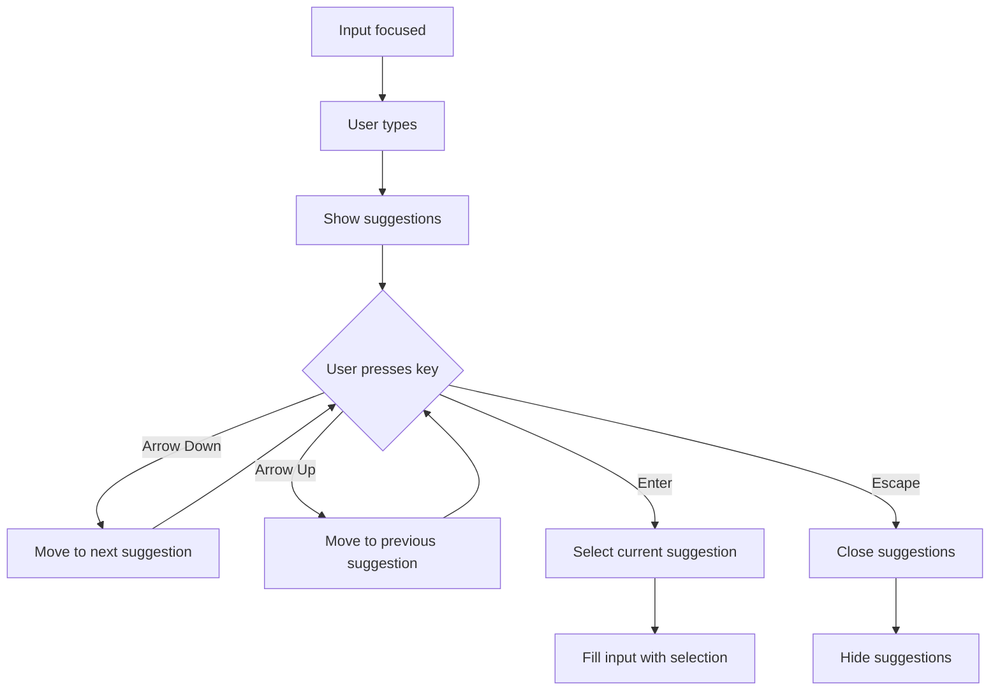
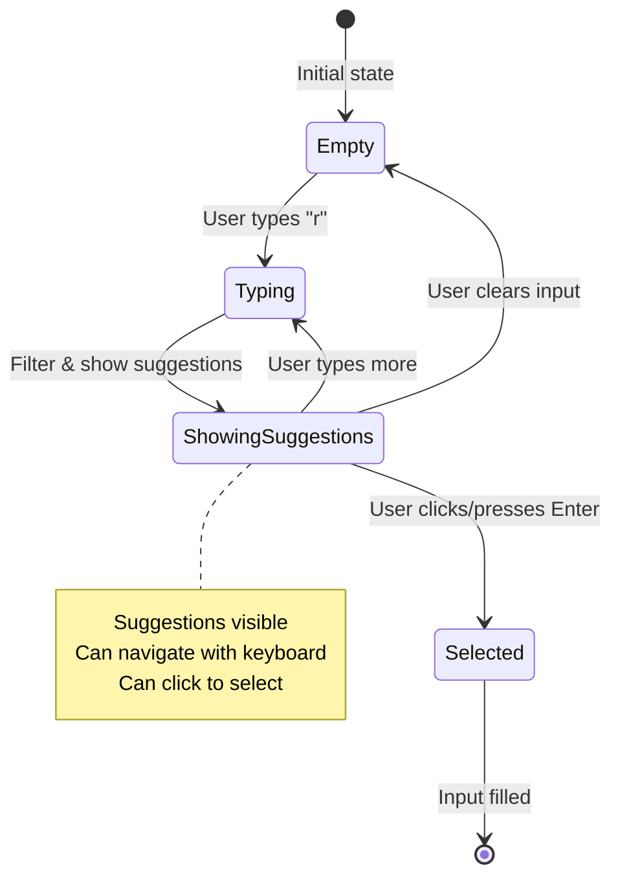
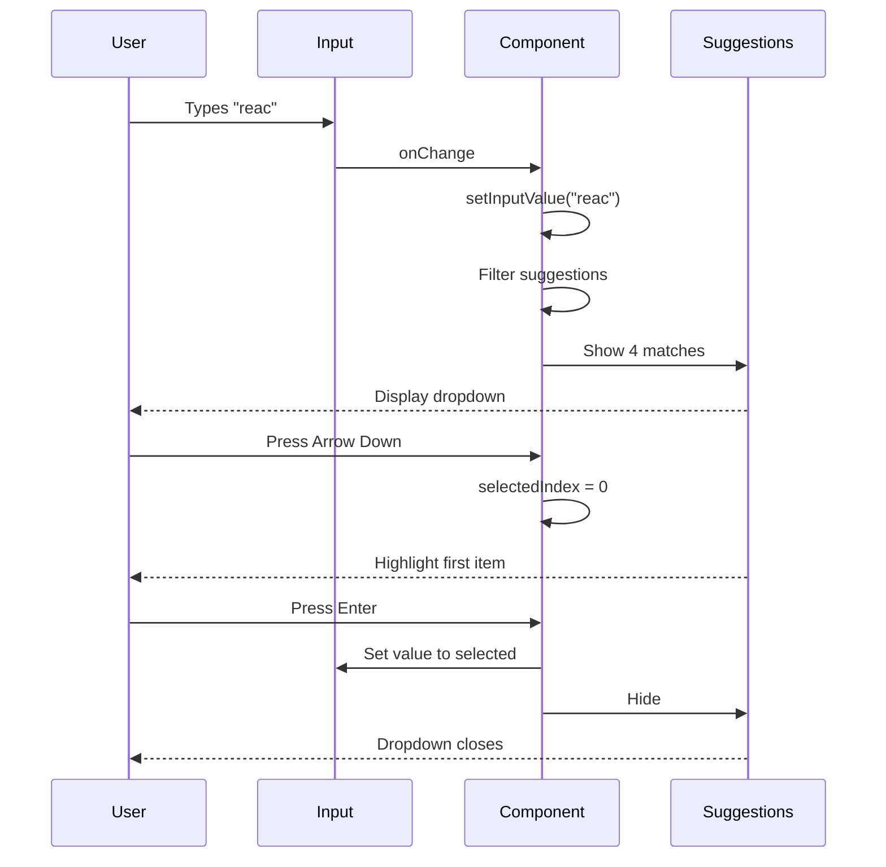

# Auto-complete / Type-ahead

**Difficulty:** Intermediate
**Time:** 45-60 minutes
**Prerequisites:** useState, useEffect, useRef, event handling, keyboard navigation

---

## Problem Statement

Build a search input that shows suggestions as the user types. Common in search bars (Google, Amazon) and form fields.

### Example:
```
Search: "reac" [___]

Suggestions:
▼ React.js
  React Native
  React Router
  React Hooks
```

### Real-World Usage:
- Search bars (Google, Amazon, YouTube)
- Address input (Google Maps, Uber)
- Tag selection (Stack Overflow, Medium)
- Email recipients (Gmail)

---

## Requirements

**Must Have:**
- Input field
- Show suggestions matching input
- Filter suggestions as user types
- Click suggestion to select
- Keyboard navigation (arrow keys, enter)

**Nice to Have:**
- Highlight matching text
- Show "No results" message
- Close on Escape key
- Close on click outside
- API integration for dynamic suggestions

---

## How to Think About the Problem

### Step 1: Component Structure

```
┌─────────────────────────────────┐
│ Search: [reac_________]         │ ← Input field
├─────────────────────────────────┤
│ > React.js            ← Selected│ ← Dropdown
│   React Native                  │
│   React Router                  │
│   React Hooks                   │
└─────────────────────────────────┘
```

### Step 2: State Management

```javascript
// What changes?
const [inputValue, setInputValue] = useState('');     // What user types
const [suggestions, setSuggestions] = useState([]);   // Filtered list
const [showSuggestions, setShowSuggestions] = useState(false); // Show/hide
const [selectedIndex, setSelectedIndex] = useState(-1); // Keyboard navigation
```

### Step 3: Filtering Logic

```javascript
// User types "reac"
inputValue = "reac"

// Filter all suggestions
allSuggestions = ['React.js', 'React Native', 'Redux', 'Vue.js']

// Check which ones include "reac" (case-insensitive)
filtered = allSuggestions.filter(s =>
  s.toLowerCase().includes("reac".toLowerCase())
)

// Result: ['React.js', 'React Native']
```

### Step 4: Keyboard Navigation Flow



### Step 5: Visual State Diagram



---

## Complete Solution

```jsx
import { useState, useRef, useEffect } from 'react';

function Autocomplete() {
  // Sample data (in real app, fetch from API)
  const allSuggestions = [
    'React.js',
    'React Native',
    'React Router',
    'React Hooks',
    'Redux',
    'JavaScript',
    'TypeScript',
    'Node.js',
    'Next.js',
    'Vue.js',
    'Angular'
  ];

  // State: Input value
  const [inputValue, setInputValue] = useState('');

  // State: Filtered suggestions
  const [suggestions, setSuggestions] = useState([]);

  // State: Show/hide suggestions dropdown
  const [showSuggestions, setShowSuggestions] = useState(false);

  // State: Selected suggestion index (for keyboard navigation)
  // -1 means no selection, 0 is first item, 1 is second, etc.
  const [selectedIndex, setSelectedIndex] = useState(-1);

  // Ref: Input element (for focus management)
  const inputRef = useRef(null);

  // Ref: Container element (for click outside detection)
  const containerRef = useRef(null);

  // Filter suggestions based on input
  // Why useEffect? Run filtering whenever input changes
  useEffect(() => {
    if (inputValue.trim() === '') {
      // Empty input → hide suggestions
      setSuggestions([]);
      setShowSuggestions(false);
      return;
    }

    // Filter suggestions that include input text (case-insensitive)
    // Why toLowerCase? Case-insensitive matching ("reac" matches "React")
    const filtered = allSuggestions.filter(suggestion =>
      suggestion.toLowerCase().includes(inputValue.toLowerCase())
    );

    setSuggestions(filtered);
    setShowSuggestions(filtered.length > 0);
    setSelectedIndex(-1); // Reset selection when suggestions change
  }, [inputValue]);

  // Handle input change
  const handleInputChange = (e) => {
    setInputValue(e.target.value);
  };

  // Handle suggestion click
  const handleSuggestionClick = (suggestion) => {
    setInputValue(suggestion);
    setShowSuggestions(false);
    setSuggestions([]);
    setSelectedIndex(-1);
  };

  // Handle keyboard navigation
  const handleKeyDown = (e) => {
    if (!showSuggestions) return;

    switch (e.key) {
      case 'ArrowDown':
        // Move selection down
        e.preventDefault(); // Prevent cursor movement in input
        setSelectedIndex(prev =>
          prev < suggestions.length - 1 ? prev + 1 : prev
        );
        // If at last item, stay there (don't wrap around)
        break;

      case 'ArrowUp':
        // Move selection up
        e.preventDefault();
        setSelectedIndex(prev => (prev > 0 ? prev - 1 : -1));
        // If at first item, go to -1 (no selection)
        break;

      case 'Enter':
        // Select highlighted suggestion
        e.preventDefault();
        if (selectedIndex >= 0) {
          handleSuggestionClick(suggestions[selectedIndex]);
        }
        break;

      case 'Escape':
        // Close suggestions
        setShowSuggestions(false);
        break;

      default:
        break;
    }
  };

  // Close suggestions when clicking outside
  // Why useEffect? Set up global click listener
  useEffect(() => {
    const handleClickOutside = (event) => {
      // Check if click was outside the container
      if (containerRef.current && !containerRef.current.contains(event.target)) {
        setShowSuggestions(false);
      }
    };

    // Add listener to document
    document.addEventListener('mousedown', handleClickOutside);

    // Cleanup: Remove listener on unmount
    return () => document.removeEventListener('mousedown', handleClickOutside);
  }, []);

  return (
    <div style={{ maxWidth: '600px', margin: '50px auto', padding: '20px' }}>
      <h1>Auto-complete Search</h1>

      <div style={{ position: 'relative' }} ref={containerRef}>
        {/* Input */}
        <input
          ref={inputRef}
          type="text"
          value={inputValue}
          onChange={handleInputChange}
          onKeyDown={handleKeyDown}
          placeholder="Search..."
          style={{
            width: '100%',
            padding: '12px',
            fontSize: '16px',
            border: '2px solid #ddd',
            borderRadius: '5px',
            outline: 'none'
          }}
        />

        {/* Suggestions Dropdown */}
        {showSuggestions && (
          <ul
            style={{
              position: 'absolute',
              top: '100%',
              left: 0,
              right: 0,
              margin: 0,
              padding: 0,
              listStyle: 'none',
              background: 'white',
              border: '1px solid #ddd',
              borderTop: 'none',
              borderRadius: '0 0 5px 5px',
              maxHeight: '200px',
              overflowY: 'auto',
              zIndex: 1000,
              boxShadow: '0 4px 6px rgba(0,0,0,0.1)'
            }}
          >
            {suggestions.map((suggestion, index) => (
              <li
                key={suggestion}
                onClick={() => handleSuggestionClick(suggestion)}
                style={{
                  padding: '10px 12px',
                  cursor: 'pointer',
                  background: index === selectedIndex ? '#e3f2fd' : 'white',
                  // Highlight selected item
                  borderBottom: index < suggestions.length - 1 ? '1px solid #eee' : 'none'
                }}
                onMouseEnter={() => setSelectedIndex(index)}
                // Update selection on hover (mouse + keyboard work together)
              >
                {suggestion}
              </li>
            ))}
          </ul>
        )}
      </div>

      {/* Selected Value Display */}
      {inputValue && (
        <div style={{ marginTop: '20px', color: '#666' }}>
          Selected: <strong>{inputValue}</strong>
        </div>
      )}

      {/* Instructions */}
      <div style={{ marginTop: '30px', color: '#999', fontSize: '14px' }}>
        <p>Try typing:</p>
        <ul>
          <li>Use arrow keys to navigate</li>
          <li>Press Enter to select</li>
          <li>Press Escape to close</li>
          <li>Click outside to close</li>
        </ul>
      </div>
    </div>
  );
}

export default Autocomplete;
```

---

## Key Concepts Explained

### 1. Keyboard Navigation Logic

```javascript
// Arrow Down: Move selection down
setSelectedIndex(prev => Math.min(prev + 1, suggestions.length - 1));
// Math.min ensures we don't go beyond last item

// Arrow Up: Move selection up
setSelectedIndex(prev => Math.max(prev - 1, -1));
// Math.max ensures we don't go below -1 (no selection)

// Visual example with 5 items (indices 0-4):
// Start: selectedIndex = -1 (no selection)
// Press ↓: selectedIndex = 0 (first item)
// Press ↓: selectedIndex = 1 (second item)
// Press ↓: selectedIndex = 2 (third item)
// Press ↑: selectedIndex = 1 (back to second)
// Press ↑: selectedIndex = 0 (first)
// Press ↑: selectedIndex = -1 (no selection, back to input)
```

### 2. Click Outside Detection

```jsx
useEffect(() => {
  const handleClickOutside = (event) => {
    if (containerRef.current && !containerRef.current.contains(event.target)) {
      closeSuggestions();
    }
  };

  document.addEventListener('mousedown', handleClickOutside);
  return () => document.removeEventListener('mousedown', handleClickOutside);
}, []);

// How it works:
// 1. User clicks anywhere on page
// 2. Check: Was click inside containerRef?
// 3. If NO → close suggestions
// 4. If YES → do nothing (let normal click handling work)
```

### 3. Why position: relative/absolute?

```css
/* Container */
position: relative;  /* Creates positioning context */

/* Dropdown */
position: absolute;  /* Position relative to container */
top: 100%;          /* Start right below input */
left: 0;            /* Align with left edge */
right: 0;           /* Align with right edge */
```

```
Container (relative)
┌─────────────────────┐
│ Input               │
└─────────────────────┘
┌─────────────────────┐ ← top: 100% (below input)
│ Suggestion 1        │
│ Suggestion 2        │
│ Suggestion 3        │
└─────────────────────┘
```

### 4. Mouse + Keyboard Integration

```jsx
// Problem: Mouse and keyboard should work together
// Solution: Update selectedIndex on hover

<li
  onMouseEnter={() => setSelectedIndex(index)}
  style={{
    background: index === selectedIndex ? '#e3f2fd' : 'white'
  }}
>
  {suggestion}
</li>

// Now:
// - Keyboard arrow keys → updates selectedIndex → item highlighted
// - Mouse hover → updates selectedIndex → item highlighted
// - Both work seamlessly together!
```

---

## Advanced Features

### 1. Highlight Matching Text

```jsx
function HighlightMatch({ text, query }) {
  if (!query) return <span>{text}</span>;

  // Split text by query (case-insensitive)
  const parts = text.split(new RegExp(`(${query})`, 'gi'));

  return (
    <span>
      {parts.map((part, index) =>
        part.toLowerCase() === query.toLowerCase() ? (
          <strong key={index} style={{ background: 'yellow' }}>
            {part}
          </strong>
        ) : (
          <span key={index}>{part}</span>
        )
      )}
    </span>
  );
}

// Usage:
<li>
  <HighlightMatch text="React.js" query="reac" />
  {/* Displays: Reac.js (with "Reac" highlighted) */}
</li>
```

### 2. API Integration

```jsx
function AutocompleteAPI() {
  const [inputValue, setInputValue] = useState('');
  const [suggestions, setSuggestions] = useState([]);
  const [loading, setLoading] = useState(false);

  useEffect(() => {
    if (!inputValue.trim()) {
      setSuggestions([]);
      return;
    }

    const fetchSuggestions = async () => {
      setLoading(true);
      try {
        const response = await fetch(
          `/api/search?q=${encodeURIComponent(inputValue)}`
        );
        const data = await response.json();
        setSuggestions(data.results);
      } catch (error) {
        console.error('Failed to fetch suggestions:', error);
      } finally {
        setLoading(false);
      }
    };

    // Debounce: Wait 300ms after user stops typing
    const timerId = setTimeout(fetchSuggestions, 300);

    return () => clearTimeout(timerId);
  }, [inputValue]);

  return (
    <div>
      <input
        value={inputValue}
        onChange={(e) => setInputValue(e.target.value)}
      />
      {loading && <div>Loading...</div>}
      {suggestions.map(s => <div key={s.id}>{s.name}</div>)}
    </div>
  );
}
```

### 3. Recent Searches

```jsx
function AutocompleteWithHistory() {
  const [inputValue, setInputValue] = useState('');
  const [recentSearches, setRecentSearches] = useState([]);

  // Load recent searches from localStorage
  useEffect(() => {
    const saved = localStorage.getItem('recentSearches');
    if (saved) setRecentSearches(JSON.parse(saved));
  }, []);

  const handleSelect = (suggestion) => {
    // Save to recent searches
    const updated = [suggestion, ...recentSearches.filter(s => s !== suggestion)].slice(0, 5);
    setRecentSearches(updated);
    localStorage.setItem('recentSearches', JSON.stringify(updated));

    setInputValue(suggestion);
  };

  return (
    <div>
      <input value={inputValue} onChange={(e) => setInputValue(e.target.value)} />

      {inputValue === '' && recentSearches.length > 0 && (
        <div>
          <h4>Recent Searches</h4>
          {recentSearches.map(search => (
            <div key={search} onClick={() => handleSelect(search)}>
              {search}
            </div>
          ))}
        </div>
      )}
    </div>
  );
}
```

---

## Common Mistakes

### Mistake 1: Not Preventing Default on Enter

```jsx
// ❌ WRONG: Form submits when pressing Enter
const handleKeyDown = (e) => {
  if (e.key === 'Enter' && selectedIndex >= 0) {
    handleSuggestionClick(suggestions[selectedIndex]);
    // Form submits! Page refreshes! 😱
  }
};

// ✅ CORRECT: Prevent default behavior
const handleKeyDown = (e) => {
  if (e.key === 'Enter' && selectedIndex >= 0) {
    e.preventDefault(); // Stop form submission
    handleSuggestionClick(suggestions[selectedIndex]);
  }
};
```

### Mistake 2: Not Handling Empty Input

```jsx
// ❌ WRONG: Shows all suggestions when input is empty
const filtered = allSuggestions.filter(s =>
  s.toLowerCase().includes(inputValue.toLowerCase())
);
// Empty string "" is included in every string!
// Result: All suggestions shown when input is empty ❌

// ✅ CORRECT: Check for empty input first
if (inputValue.trim() === '') {
  setSuggestions([]);
  setShowSuggestions(false);
  return;
}
```

### Mistake 3: Not Resetting Selection on Input Change

```jsx
// ❌ WRONG: Selection stays on item 2, even when suggestions change
const handleInputChange = (e) => {
  setInputValue(e.target.value);
  // selectedIndex still = 2, but now there might be only 1 suggestion!
};

// ✅ CORRECT: Reset selection when filtering
useEffect(() => {
  // ... filtering logic
  setSuggestions(filtered);
  setSelectedIndex(-1); // Reset to no selection
}, [inputValue]);
```

### Mistake 4: Closing on Any Click

```jsx
// ❌ WRONG: Clicking a suggestion closes dropdown before click registers
<li onClick={() => handleSuggestionClick(suggestion)}>
  {/* Click event fires */}
  {/* Then handleClickOutside fires */}
  {/* Dropdown closes before handleSuggestionClick! */}
</li>

// ✅ CORRECT: Use mousedown for outside detection, click for selection
useEffect(() => {
  const handleClickOutside = (event) => {
    // mousedown fires before click
    // So we detect "outside" before suggestion click happens
    if (containerRef.current && !containerRef.current.contains(event.target)) {
      setShowSuggestions(false);
    }
  };

  document.addEventListener('mousedown', handleClickOutside);
  return () => document.removeEventListener('mousedown', handleClickOutside);
}, []);
```

---

## Interviewer Q&A

**Q: How would you handle a large list of suggestions (1000+ items)?**

A: "I'd implement virtual scrolling to only render visible items:

```jsx
import { FixedSizeList } from 'react-window';

function LargeAutocomplete() {
  // ... state and filtering logic

  return (
    <FixedSizeList
      height={200}
      itemCount={suggestions.length}
      itemSize={35}
      width="100%"
    >
      {({ index, style }) => (
        <div style={style}>
          {suggestions[index]}
        </div>
      )}
    </FixedSizeList>
  );
}
```

This renders only visible items (e.g., 6 items) instead of all 1000, dramatically improving performance."

---

**Q: How do you handle special characters in search?**

```jsx
// Escape special regex characters
function escapeRegex(string) {
  return string.replace(/[.*+?^${}()|[\]\\]/g, '\\$&');
}

const filtered = allSuggestions.filter(suggestion => {
  const escaped = escapeRegex(inputValue);
  const regex = new RegExp(escaped, 'gi');
  return regex.test(suggestion);
});

// Now searching for "react.js" works correctly
// Without escape, "." means "any character" in regex
```

---

**Q: How would you add fuzzy matching (typo tolerance)?**

```jsx
// Using a fuzzy matching library
import Fuse from 'fuse.js';

function FuzzyAutocomplete() {
  const fuse = new Fuse(allSuggestions, {
    threshold: 0.4, // 0 = exact match, 1 = match anything
    keys: ['name']
  });

  const filtered = fuse.search(inputValue).map(result => result.item);

  // Now "recat" matches "react" (typo tolerance)
}
```

---

**Q: How do you prevent race conditions with async suggestions?**

```jsx
useEffect(() => {
  let isCancelled = false;

  const fetchSuggestions = async () => {
    const results = await api.search(inputValue);

    // Only update if this effect hasn't been cancelled
    if (!isCancelled) {
      setSuggestions(results);
    }
  };

  fetchSuggestions();

  // Cleanup: Cancel this request if input changes
  return () => {
    isCancelled = true;
  };
}, [inputValue]);

// Without this:
// 1. User types "a" → fetch starts (slow network)
// 2. User types "ab" → fetch starts
// 3. "ab" results return → setSuggestions(results_ab)
// 4. "a" results return → setSuggestions(results_a) ❌ Wrong results!

// With this:
// Step 4 is prevented because isCancelled = true ✅
```

---

## Visual Diagrams

### Component Hierarchy

```
Autocomplete Component
├── Input Field
│   ├── value: inputValue
│   ├── onChange: setInputValue
│   └── onKeyDown: handleKeyDown
│
└── Suggestions Dropdown
    ├── Show if: showSuggestions = true
    │
    └── For each suggestion:
        ├── background: selected ? blue : white
        ├── onClick: handleSuggestionClick
        └── onMouseEnter: setSelectedIndex
```

### Event Flow Diagram



---

## Key Takeaways

1. **State Management**
   - Track input value, suggestions, visibility, and selection
   - Reset selection when suggestions change
   - Separate filtering logic from rendering

2. **Keyboard Navigation**
   - Arrow keys for navigation
   - Enter to select
   - Escape to close
   - Prevent default behavior

3. **Click Outside**
   - Use ref to track container
   - Listen to document mousedown
   - Clean up event listener
   - Use mousedown (not click) to avoid conflicts

4. **Performance**
   - Debounce API calls
   - Virtual scrolling for large lists
   - Cancel stale requests

5. **User Experience**
   - Mouse and keyboard work together
   - Visual feedback for selection
   - Clear instructions
   - Graceful error handling

---

## Practice Exercises

1. Add highlight matching text feature
2. Implement recent searches with localStorage
3. Add categories to suggestions
4. Implement fuzzy search
5. Add keyboard shortcut (Ctrl+K) to focus search

---

**Previous:** [Infinite Scroll](./02-infinite-scroll.md) | **Next:** [Debounce Search](./04-debounce-search.md)
