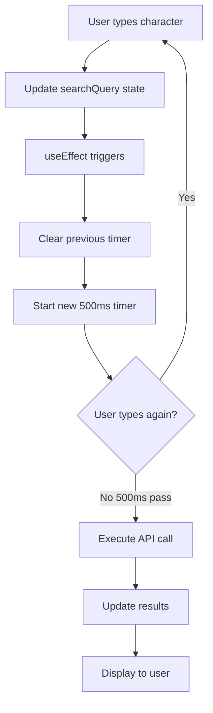
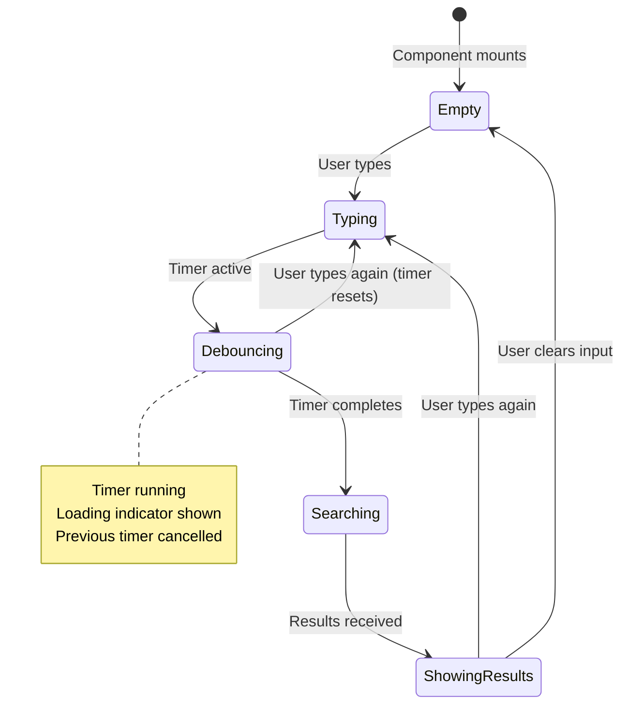

# Debounce Search

**Difficulty:** Intermediate
**Time:** 45-60 minutes
**Prerequisites:** useState, useEffect, setTimeout, API calls, performance optimization

---

## Problem Statement

Implement a search input that debounces API calls. Instead of calling the API on every keystroke, wait for the user to stop typing.

### Example:
```
User types: "r" → Wait...
User types: "re" → Wait...
User types: "rea" → Wait...
User types: "reac" → Wait...
User types: "react" → Wait 500ms... → Call API with "react"
```

### Real-World Usage:
- Search bars (Google, YouTube)
- Filter inputs (e-commerce)
- Form validation (username availability)
- Live previews (Markdown editors)

---

## Why Debouncing?

### Problem Without Debounce:

```
User types "react" (5 characters)
→ 5 API calls fired!

❌ Wastes bandwidth
❌ Slows down app
❌ Costs money (API charges)
❌ Server overload
❌ Poor user experience
```

### Solution With Debounce:

```
User types "react"
Wait 500ms after last keystroke
→ 1 API call fired!

✅ Efficient
✅ Fast
✅ Cost-effective
✅ Server friendly
✅ Better UX
```

---

## Requirements

**Must Have:**
- Input field for search query
- Debounce mechanism (delay API calls)
- Display search results
- Loading indicator
- Handle empty input

**Nice to Have:**
- Cancel pending requests
- Error handling
- Search history
- Clear button
- Configurable delay

---

## How to Think About the Problem

### Step 1: Understand the Timing

```
Time:    0ms   100ms  200ms  300ms  400ms  500ms  600ms  700ms  800ms
Input:   "r"   "e"    "a"    "c"    "t"    (pause)
Timer:    [----cancel----]
               [----cancel----]
                      [----cancel----]
                             [----cancel----]
                                    [--------------- API CALL]

Only the LAST timer completes → API called once with "react"
```

### Step 2: Code Flow

```javascript
// User types "r"
setSearchQuery("r")
→ useEffect runs
→ setTimeout(() => search("r"), 500) // Timer A

// User types "e" (100ms later)
setSearchQuery("re")
→ Cleanup runs: clearTimeout(Timer A) // Cancel Timer A
→ useEffect runs again
→ setTimeout(() => search("re"), 500) // Timer B

// ... continues for "a", "c", "t"

// User stops typing (500ms pass)
→ Final timer completes
→ search("react") is called
```

### Step 3: Visual Flow Diagram



### Step 4: State Management

```javascript
// What changes?
const [searchQuery, setSearchQuery] = useState('');  // User input
const [results, setResults] = useState([]);          // Search results
const [loading, setLoading] = useState(false);       // Loading state
```

---

## Complete Solution

```jsx
import { useState, useEffect } from 'react';

function DebounceSearch() {
  // State: Search query
  const [searchQuery, setSearchQuery] = useState('');

  // State: Search results
  const [results, setResults] = useState([]);

  // State: Loading
  const [loading, setLoading] = useState(false);

  // Debounced search
  // Why useEffect? Run side effect (API call) when searchQuery changes
  useEffect(() => {
    // Don't search for empty query
    if (!searchQuery.trim()) {
      setResults([]);
      return;
    }

    // Set loading state immediately (for instant feedback)
    setLoading(true);

    // Create timer
    // Why setTimeout? Delay API call until user stops typing
    const timerId = setTimeout(() => {
      // This code runs after 500ms delay
      console.log('API call for:', searchQuery);
      performSearch(searchQuery);
    }, 500); // 500ms debounce delay

    // Cleanup function
    // Why cleanup? Cancel timer if user types again before 500ms
    return () => {
      clearTimeout(timerId);
      // If user types "a", then "b" within 500ms:
      // 1. Timer for "a" is cleared (cancelled)
      // 2. New timer for "ab" is created
      // Result: Only final value "ab" triggers API call
    };
  }, [searchQuery]); // Re-run when searchQuery changes

  // Perform search (simulate API call)
  const performSearch = async (query) => {
    try {
      // Simulate API delay
      await new Promise(resolve => setTimeout(resolve, 500));

      // Simulate search results
      const mockResults = [
        `${query} - Result 1`,
        `${query} - Result 2`,
        `${query} - Result 3`,
        `${query} - Documentation`,
        `${query} - Tutorial`,
        `${query} - GitHub Repository`,
        `${query} - Stack Overflow`
      ];

      setResults(mockResults);
    } catch (error) {
      console.error('Search failed:', error);
      setResults([]);
    } finally {
      setLoading(false);
    }
  };

  // Handle input change
  const handleInputChange = (e) => {
    setSearchQuery(e.target.value);
    // Note: API call happens in useEffect, not here!
    // This just updates the state
  };

  // Clear search
  const handleClear = () => {
    setSearchQuery('');
    setResults([]);
    setLoading(false);
  };

  return (
    <div style={{ maxWidth: '600px', margin: '50px auto', padding: '20px' }}>
      <h1>Debounced Search</h1>

      {/* Search Input */}
      <div style={{ position: 'relative', marginBottom: '20px' }}>
        <input
          type="text"
          value={searchQuery}
          onChange={handleInputChange}
          placeholder="Search... (waits 500ms after you stop typing)"
          style={{
            width: '100%',
            padding: '12px',
            paddingRight: '40px',
            fontSize: '16px',
            border: '2px solid #ddd',
            borderRadius: '5px',
            outline: 'none'
          }}
        />

        {/* Clear Button */}
        {searchQuery && (
          <button
            onClick={handleClear}
            style={{
              position: 'absolute',
              right: '10px',
              top: '50%',
              transform: 'translateY(-50%)',
              background: 'none',
              border: 'none',
              fontSize: '20px',
              cursor: 'pointer',
              color: '#999'
            }}
          >
            ✕
          </button>
        )}
      </div>

      {/* Info Text */}
      {searchQuery && (
        <div style={{ marginBottom: '10px', color: '#666', fontSize: '14px' }}>
          Searching for: <strong>{searchQuery}</strong>
        </div>
      )}

      {/* Loading Indicator */}
      {loading && (
        <div style={{ marginTop: '20px', color: '#666', textAlign: 'center' }}>
          Searching...
        </div>
      )}

      {/* Results */}
      {!loading && results.length > 0 && (
        <div>
          <h3>Results ({results.length})</h3>
          <ul style={{ listStyle: 'none', padding: 0 }}>
            {results.map((result, index) => (
              <li
                key={index}
                style={{
                  padding: '12px',
                  margin: '8px 0',
                  background: '#f9f9f9',
                  borderRadius: '5px',
                  cursor: 'pointer'
                }}
                onMouseEnter={(e) => e.target.style.background = '#e3f2fd'}
                onMouseLeave={(e) => e.target.style.background = '#f9f9f9'}
              >
                {result}
              </li>
            ))}
          </ul>
        </div>
      )}

      {/* No Results */}
      {!loading && searchQuery && results.length === 0 && (
        <div style={{ marginTop: '20px', color: '#999', textAlign: 'center' }}>
          No results found for "{searchQuery}"
        </div>
      )}
    </div>
  );
}

export default DebounceSearch;
```

---

## How Debouncing Works

### Timeline Diagram:

```
Time: 0ms   100ms  200ms  300ms  400ms  500ms  600ms  700ms  800ms
Input: "r"   "e"    "a"    "c"    "t"    (pause)
Timer:  [----cancel----]
         [----cancel----]
          [----cancel----]
           [----cancel----]
            [--------------- API CALL]

Only the LAST timer completes → API called once with "react"
```

### Detailed Code Flow:

```javascript
// === KEYSTROKE 1: User types "r" ===
setSearchQuery("r")
→ Component re-renders with searchQuery = "r"
→ useEffect runs (searchQuery changed)
→ setTimeout(() => search("r"), 500) // Timer A starts
   [Timer A will fire at 500ms]

// === KEYSTROKE 2: User types "e" at 100ms ===
setSearchQuery("re")
→ Component re-renders with searchQuery = "re"
→ useEffect CLEANUP runs: clearTimeout(Timer A) // Timer A cancelled!
→ useEffect runs (searchQuery changed)
→ setTimeout(() => search("re"), 500) // Timer B starts
   [Timer B will fire at 600ms]

// === KEYSTROKE 3: User types "a" at 200ms ===
setSearchQuery("rea")
→ Component re-renders with searchQuery = "rea"
→ useEffect CLEANUP runs: clearTimeout(Timer B) // Timer B cancelled!
→ useEffect runs
→ setTimeout(() => search("rea"), 500) // Timer C starts
   [Timer C will fire at 700ms]

// ... same for "c" and "t"

// === User stops typing ===
// 500ms pass with no new input
→ Final timer completes
→ search("react") is called
→ API request sent with "react"
```

---

## Key Concepts Explained

### 1. Why Cleanup is Critical

```jsx
// ❌ WITHOUT cleanup:
useEffect(() => {
  setTimeout(() => {
    performSearch(searchQuery); // Multiple API calls!
  }, 500);
  // Missing: return () => clearTimeout(timerId)
}, [searchQuery]);

// Problem: User types "react" (5 chars)
// → 5 timers created
// → All 5 complete (some late)
// → 5 API calls made ❌
// → Last keystroke's timer might not be the last to complete!

// ✅ WITH cleanup:
useEffect(() => {
  const timerId = setTimeout(() => {
    performSearch(searchQuery);
  }, 500);

  return () => clearTimeout(timerId);
}, [searchQuery]);

// Solution:
// → 5 timers created
// → First 4 cancelled by cleanup
// → Only last timer completes
// → 1 API call made ✅
```

### 2. Immediate vs Delayed State

```jsx
// Set loading immediately (instant feedback)
setLoading(true);

// Delay API call
setTimeout(() => {
  performSearch(query);
}, 500);

// Why?
// - User sees "Searching..." immediately (good UX)
// - But actual search is debounced (good performance)
```

### 3. Empty Input Handling

```jsx
if (!searchQuery.trim()) {
  setResults([]);
  return; // Exit early, don't set timer
}

// Why?
// - Don't search for empty string
// - Clear results when input cleared
// - Save API calls
```

---

## Custom Debounce Hook

Create a reusable hook for debouncing any value:

```jsx
// Custom hook for reusable debouncing
function useDebounce(value, delay) {
  const [debouncedValue, setDebouncedValue] = useState(value);

  useEffect(() => {
    // Set up timer
    const timerId = setTimeout(() => {
      setDebouncedValue(value);
    }, delay);

    // Cleanup: cancel timer on value change
    return () => {
      clearTimeout(timerId);
    };
  }, [value, delay]);

  return debouncedValue;
}

// Usage in component
function SearchComponent() {
  const [searchQuery, setSearchQuery] = useState('');

  // Get debounced value
  // debouncedQuery only updates 500ms after user stops typing
  const debouncedQuery = useDebounce(searchQuery, 500);

  useEffect(() => {
    if (debouncedQuery) {
      // Perform search with debounced value
      performSearch(debouncedQuery);
    }
  }, [debouncedQuery]); // Only runs when debounced value changes

  return (
    <input
      value={searchQuery}
      onChange={(e) => setSearchQuery(e.target.value)}
      placeholder="Search..."
    />
  );
}
```

### Benefits of Custom Hook:

```jsx
// ✅ Reusable across components
const debouncedSearch = useDebounce(searchQuery, 500);
const debouncedFilter = useDebounce(filterValue, 300);
const debouncedUsername = useDebounce(username, 1000);

// ✅ Clean component code
// ✅ Easy to test
// ✅ Configurable delay
```

---

## Advanced: Cancel Previous Requests

```jsx
function DebounceSearchWithCancel() {
  const [searchQuery, setSearchQuery] = useState('');
  const [results, setResults] = useState([]);
  const [loading, setLoading] = useState(false);

  useEffect(() => {
    if (!searchQuery.trim()) {
      setResults([]);
      return;
    }

    setLoading(true);

    // AbortController to cancel fetch
    const controller = new AbortController();
    const signal = controller.signal;

    const timerId = setTimeout(async () => {
      try {
        const response = await fetch(
          `/api/search?q=${searchQuery}`,
          { signal } // Pass signal to fetch
        );

        if (!response.ok) throw new Error('Search failed');

        const data = await response.json();
        setResults(data.results);
      } catch (error) {
        if (error.name === 'AbortError') {
          console.log('Request cancelled');
        } else {
          console.error('Search error:', error);
        }
      } finally {
        setLoading(false);
      }
    }, 500);

    // Cleanup: Cancel both timer and fetch
    return () => {
      clearTimeout(timerId);
      controller.abort(); // Cancel in-flight request
    };
  }, [searchQuery]);

  // ... rest of component
}
```

### Why Cancel Requests?

```
// Without cancellation:
User types: "a" → API call starts (slow network)
User types: "b" → API call starts
"b" results return → setResults(results_b) ✅
"a" results return → setResults(results_a) ❌ WRONG RESULTS!

// With cancellation:
User types: "a" → API call starts
User types: "b" → Cancel "a" request, start "b" request
"b" results return → setResults(results_b) ✅
"a" request cancelled, no update ✅
```

---

## Common Mistakes

### Mistake 1: Not Cleaning Up Timer

```jsx
// ❌ WRONG: Timer not cancelled (multiple API calls!)
useEffect(() => {
  setTimeout(() => {
    performSearch(query);
  }, 500);
  // Missing: return () => clearTimeout(timerId)
}, [query]);

// Result: User types "react" → 5 API calls!

// ✅ CORRECT: Clean up timer
useEffect(() => {
  const timerId = setTimeout(() => performSearch(query), 500);
  return () => clearTimeout(timerId);
}, [query]);

// Result: User types "react" → 1 API call ✅
```

### Mistake 2: Calling API in onChange

```jsx
// ❌ WRONG: API called on every keystroke
const handleChange = (e) => {
  setQuery(e.target.value);
  performSearch(e.target.value); // Called immediately!
};

// No debouncing! Every keystroke = API call

// ✅ CORRECT: Let useEffect handle debounced search
const handleChange = (e) => {
  setQuery(e.target.value);
  // Search happens in useEffect after delay
};
```

### Mistake 3: Not Handling Empty Input

```jsx
// ❌ WRONG: Searches for empty string
useEffect(() => {
  const timerId = setTimeout(() => {
    performSearch(searchQuery); // Searches for ""
  }, 500);

  return () => clearTimeout(timerId);
}, [searchQuery]);

// ✅ CORRECT: Early return for empty input
useEffect(() => {
  if (!searchQuery.trim()) {
    setResults([]);
    return; // No timer created
  }

  const timerId = setTimeout(() => {
    performSearch(searchQuery);
  }, 500);

  return () => clearTimeout(timerId);
}, [searchQuery]);
```

### Mistake 4: Setting Loading Inside setTimeout

```jsx
// ❌ WRONG: Loading state delayed
useEffect(() => {
  const timerId = setTimeout(() => {
    setLoading(true); // User sees nothing for 500ms!
    performSearch(query);
  }, 500);

  return () => clearTimeout(timerId);
}, [query]);

// ✅ CORRECT: Set loading immediately
useEffect(() => {
  setLoading(true); // Instant feedback

  const timerId = setTimeout(() => {
    performSearch(query); // Debounced
  }, 500);

  return () => clearTimeout(timerId);
}, [query]);
```

---

## Interviewer Q&A

**Q: What's the difference between debounce and throttle?**

A: "Great question!

**Debounce:** Wait for user to STOP doing something
- Waits for inactivity
- Executes AFTER user stops
- Example: Search (wait until user stops typing)

**Throttle:** Limit how OFTEN something happens
- Executes at regular intervals
- Happens WHILE user is active
- Example: Window resize (run every 100ms while resizing)

```javascript
// Debounce: User types 'react' → One call after they stop
// Time:  0ms   100   200   300   400   500   600
// Input:  r     e     a     c     t   (stop)
// Calls:                               [ONE CALL]

// Throttle: User types 'react' → Call every 200ms
// Time:  0ms   100   200   300   400   500   600
// Input:  r     e     a     c     t   (stop)
// Calls:  [1]        [2]        [3]
```
"

---

**Q: How do you choose the debounce delay?**

A: "It depends on the use case:

- **Search:** 300-500ms (balance between responsiveness and API calls)
- **Form validation:** 500-1000ms (wait for user to finish)
- **Resize/scroll:** 100-200ms (needs to feel responsive)
- **Typing indicators:** 1000-2000ms (don't want to flicker)

Too short: Many API calls (defeats purpose)
Too long: Feels sluggish (bad UX)

I'd start with 500ms for search and adjust based on user feedback and analytics."

---

**Q: How would you add a minimum search length?**

```jsx
useEffect(() => {
  // Don't search if less than 3 characters
  if (searchQuery.length < 3) {
    setResults([]);
    return;
  }

  setLoading(true);

  const timerId = setTimeout(() => {
    performSearch(searchQuery);
  }, 500);

  return () => clearTimeout(timerId);
}, [searchQuery]);

// Why?
// - Avoid searching for "a" (too many results)
// - Better server performance
// - More relevant results
```

---

**Q: How do you handle rapid switching between inputs?**

A: "I'd use a ref to track the latest query:

```jsx
function DebounceSearch() {
  const [query, setQuery] = useState('');
  const latestQueryRef = useRef('');

  useEffect(() => {
    latestQueryRef.current = query;

    const timerId = setTimeout(async () => {
      const results = await fetchResults(query);

      // Only update if this is still the latest query
      if (query === latestQueryRef.current) {
        setResults(results);
      }
    }, 500);

    return () => clearTimeout(timerId);
  }, [query]);
}
```

This prevents showing stale results if user changes input while API call is in flight."

---

## Visual Diagrams

### Debounce vs Throttle

```mermaid
gantt
    title Debounce vs Throttle Comparison
    dateFormat X
    axisFormat %L

    section User Input
    Type r: 0, 100
    Type e: 100, 200
    Type a: 200, 300
    Type c: 300, 400
    Type t: 400, 500
    Stop: 500, 1000

    section Debounce
    Wait: 0, 500
    API Call: 1000, 1100

    section Throttle
    Call 1: 0, 100
    Call 2: 300, 400
    Call 3: 600, 700
```

### Component State Flow



---

## Key Takeaways

1. **Debouncing Saves Resources**
   - Reduces API calls dramatically
   - Better server performance
   - Lower costs
   - Better user experience

2. **Cleanup is Essential**
   - Always return cleanup function
   - Cancel timers in cleanup
   - Prevents multiple unnecessary calls

3. **Immediate Feedback**
   - Set loading state immediately
   - Debounce the actual API call
   - User sees instant response

4. **Handle Edge Cases**
   - Empty input
   - Minimum search length
   - Cancelled requests
   - Error states

5. **Reusable Hook**
   - Create useDebounce hook
   - Use across components
   - Easier to test and maintain

---

## Practice Exercises

1. Add minimum search length (3 characters)
2. Implement throttling for comparison
3. Add search suggestions with highlighting
4. Store search history in localStorage
5. Add "Clear" button to reset search

---

**Previous:** [Auto-complete](./03-autocomplete.md) | **Next:** [Modal](./05-modal.md)
