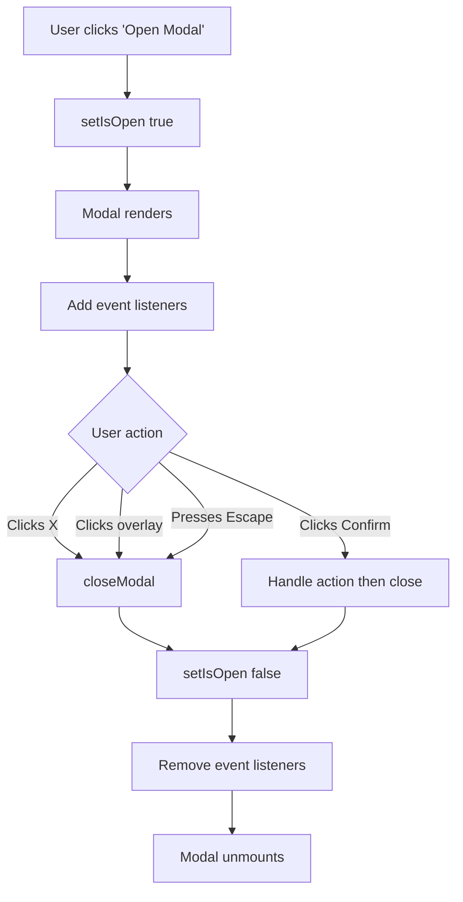
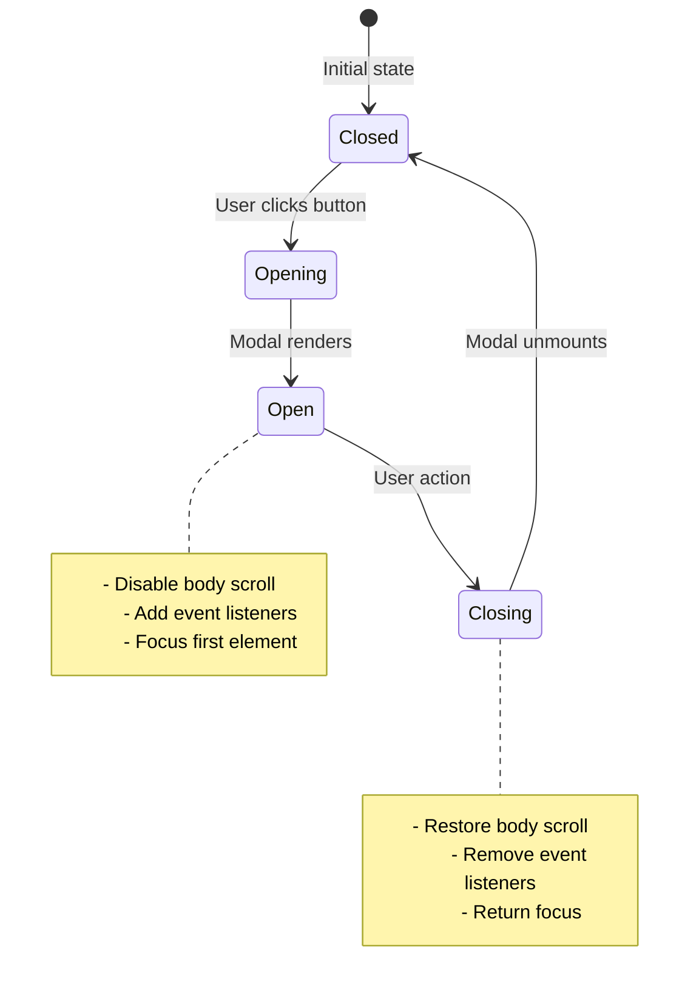
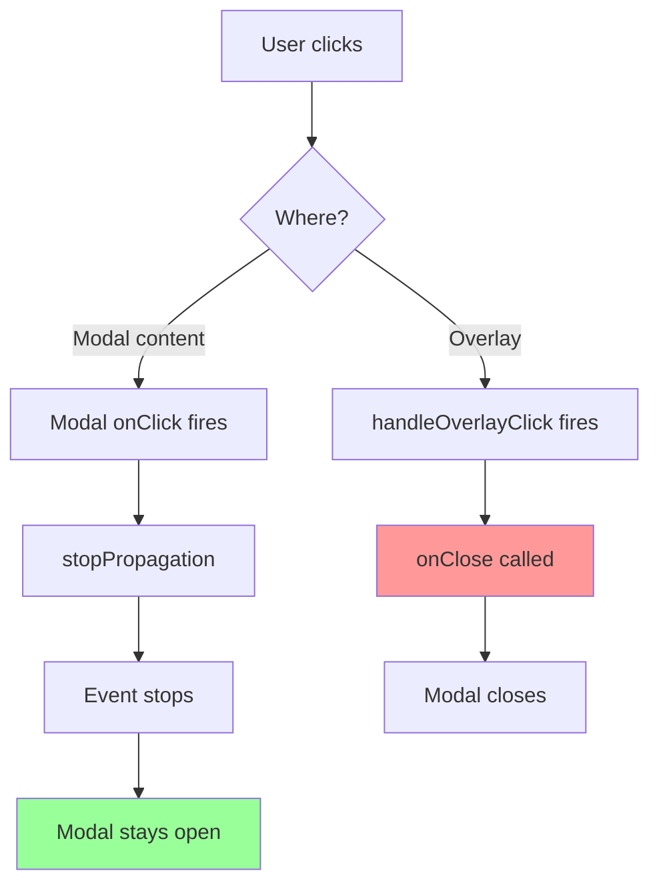

# Modal / Dialog

**Difficulty:** Intermediate
**Time:** 45-60 minutes
**Prerequisites:** useState, useEffect, useRef, event handling, CSS positioning

---

## Problem Statement

Build a modal (popup/dialog) component that overlays the main content. Used for confirmations, forms, images, notifications, etc.

### Example:
```
Main Page Content

[Open Modal Button]

(Click button)

═══════════════════════════════════
║                                 ║
║  Modal Title          [X]       ║
║  ───────────────────────────    ║
║                                 ║
║  Modal content here             ║
║  This overlays the page         ║
║                                 ║
║  [Cancel]  [Confirm]            ║
║                                 ║
═══════════════════════════════════
       ↓ Dark overlay ↓
```

### Real-World Usage:
- Confirmation dialogs (Delete, Logout)
- Forms (Login, Registration)
- Image viewers (Lightbox)
- Notifications and alerts
- Video players

---

## Requirements

**Must Have:**
- Show/hide modal
- Overlay background (dim the page behind)
- Close on X button
- Close on overlay click
- Close on Escape key
- Prevent body scroll when modal is open

**Nice to Have:**
- Focus trap (Tab key stays within modal)
- Animations (fade in/out)
- Multiple modal sizes
- Stacked modals
- Return focus to trigger element

---

## How to Think About the Problem

### Step 1: Component Structure

```
Page
├── Trigger Button (opens modal)
└── Modal (conditionally rendered)
    ├── Overlay (dark background)
    └── Modal Content (white box)
        ├── Header (title + close button)
        ├── Body (main content)
        └── Footer (action buttons)
```

### Step 2: State Management

```javascript
// Simple state
const [isOpen, setIsOpen] = useState(false);

// Open/close handlers
const openModal = () => setIsOpen(true);
const closeModal = () => setIsOpen(false);
```

### Step 3: CSS Positioning

```
┌─────────────────────────────────┐
│ Document Body                   │
│                                 │
│ ┌─────────────────────────────┐ │ ← Overlay (fixed, full screen)
│ │ position: fixed             │ │
│ │ top: 0, left: 0             │ │
│ │ width: 100%, height: 100%   │ │
│ │ background: rgba(0,0,0,0.5) │ │
│ │                             │ │
│ │   ┌───────────────┐         │ │ ← Modal (centered)
│ │   │ Modal Content │         │ │
│ │   └───────────────┘         │ │
│ └─────────────────────────────┘ │
└─────────────────────────────────┘
```

### Step 4: Event Flow



---

## Complete Solution

```jsx
import { useState, useEffect } from 'react';

function ModalDemo() {
  // State: Is modal open?
  const [isOpen, setIsOpen] = useState(false);

  const openModal = () => setIsOpen(true);
  const closeModal = () => setIsOpen(false);

  return (
    <div style={{ padding: '50px' }}>
      <h1>Modal Demo</h1>
      <p>Click the button below to open the modal</p>

      <button
        onClick={openModal}
        style={{
          padding: '12px 24px',
          fontSize: '16px',
          background: '#007bff',
          color: 'white',
          border: 'none',
          borderRadius: '5px',
          cursor: 'pointer'
        }}
      >
        Open Modal
      </button>

      {/* Conditional rendering: Only render modal when isOpen is true */}
      {isOpen && <Modal onClose={closeModal} />}
    </div>
  );
}

// Modal Component
function Modal({ onClose }) {
  // Prevent body scroll when modal is open
  // Why useEffect? Side effect on body element
  useEffect(() => {
    // Save original body overflow
    const originalOverflow = document.body.style.overflow;

    // Disable scroll
    document.body.style.overflow = 'hidden';

    // Cleanup: Restore scroll on unmount
    return () => {
      document.body.style.overflow = originalOverflow;
    };
  }, []);

  // Close on Escape key
  // Why useEffect? Set up event listener
  useEffect(() => {
    const handleEscape = (e) => {
      if (e.key === 'Escape') {
        onClose();
      }
    };

    document.addEventListener('keydown', handleEscape);

    // Cleanup: Remove listener on unmount
    return () => document.removeEventListener('keydown', handleEscape);
  }, [onClose]);

  // Close on overlay click (not on modal content)
  const handleOverlayClick = (e) => {
    // Only close if clicking overlay itself, not modal content
    // e.target = element that was clicked
    // e.currentTarget = element with the onClick handler
    if (e.target === e.currentTarget) {
      onClose();
    }
  };

  return (
    // Overlay
    <div
      onClick={handleOverlayClick}
      style={{
        position: 'fixed',
        top: 0,
        left: 0,
        right: 0,
        bottom: 0,
        background: 'rgba(0, 0, 0, 0.5)', // Semi-transparent black
        display: 'flex',
        alignItems: 'center',
        justifyContent: 'center',
        zIndex: 1000 // Above everything else
      }}
    >
      {/* Modal Content */}
      <div
        onClick={(e) => e.stopPropagation()}
        // Why stopPropagation? Prevent overlay click when clicking modal
        style={{
          background: 'white',
          borderRadius: '8px',
          boxShadow: '0 4px 6px rgba(0, 0, 0, 0.1)',
          maxWidth: '500px',
          width: '90%',
          maxHeight: '80vh',
          overflow: 'auto'
        }}
      >
        {/* Header */}
        <div
          style={{
            display: 'flex',
            justifyContent: 'space-between',
            alignItems: 'center',
            padding: '20px',
            borderBottom: '1px solid #eee'
          }}
        >
          <h2 style={{ margin: 0 }}>Modal Title</h2>

          {/* Close Button */}
          <button
            onClick={onClose}
            style={{
              background: 'none',
              border: 'none',
              fontSize: '24px',
              cursor: 'pointer',
              padding: '0',
              width: '30px',
              height: '30px',
              color: '#666'
            }}
          >
            ×
          </button>
        </div>

        {/* Body */}
        <div style={{ padding: '20px' }}>
          <p>This is the modal content. You can put any content here!</p>
          <p>Try these ways to close:</p>
          <ul>
            <li>Click the × button</li>
            <li>Click outside the modal (on the dark overlay)</li>
            <li>Press the Escape key</li>
            <li>Click Cancel or Confirm buttons</li>
          </ul>
        </div>

        {/* Footer */}
        <div
          style={{
            display: 'flex',
            justifyContent: 'flex-end',
            gap: '10px',
            padding: '20px',
            borderTop: '1px solid #eee'
          }}
        >
          <button
            onClick={onClose}
            style={{
              padding: '10px 20px',
              background: '#f5f5f5',
              border: '1px solid #ddd',
              borderRadius: '4px',
              cursor: 'pointer'
            }}
          >
            Cancel
          </button>
          <button
            onClick={() => {
              alert('Confirmed!');
              onClose();
            }}
            style={{
              padding: '10px 20px',
              background: '#007bff',
              color: 'white',
              border: 'none',
              borderRadius: '4px',
              cursor: 'pointer'
            }}
          >
            Confirm
          </button>
        </div>
      </div>
    </div>
  );
}

export default ModalDemo;
```

---

## Key Concepts Explained

### 1. Prevent Body Scroll

```jsx
useEffect(() => {
  // Save original value
  const originalOverflow = document.body.style.overflow;

  // Disable scroll
  document.body.style.overflow = 'hidden';

  // Restore on cleanup
  return () => {
    document.body.style.overflow = originalOverflow;
  };
}, []);
```

**Why?**
- When modal is open, page behind shouldn't scroll
- User should only interact with modal
- Better focus and user experience

### 2. Event Propagation (stopPropagation)

```jsx
<div onClick={handleOverlayClick}> {/* Overlay */}
  <div onClick={(e) => e.stopPropagation()}> {/* Modal */}
    {/* Clicking here doesn't trigger overlay click */}
  </div>
</div>
```

**Visual Explanation:**
```
User clicks modal content
↓
onClick fires on modal
↓
e.stopPropagation() called
↓
Event stops, doesn't bubble up
↓
Overlay onClick never fires
✅ Modal stays open
```

**Without stopPropagation:**
```
User clicks modal content
↓
onClick fires on modal
↓
Event bubbles up to overlay
↓
Overlay onClick fires
↓
Modal closes
❌ Modal closes unexpectedly!
```

### 3. Position Fixed

```css
position: fixed;
top: 0;
left: 0;
right: 0;
bottom: 0;
```

**Why fixed (not absolute)?**
```
Fixed:
- Relative to viewport (browser window)
- Stays in place when scrolling
- Covers entire screen
✅ Perfect for modals

Absolute:
- Relative to nearest positioned parent
- Moves when scrolling
- Might not cover entire screen
❌ Not good for modals
```

### 4. Z-Index

```css
zIndex: 1000  /* Above everything else */
```

**Why high z-index?**
- Ensures modal appears on top
- Prevents other elements from covering it
- Standard practice: 1000+ for modals

---

## Advanced Features

### 1. Using React Portal

Render modal outside the main React tree:

```jsx
import { createPortal } from 'react-dom';

function Modal({ onClose, children }) {
  // Render modal as direct child of body
  // Why? Avoids z-index conflicts with parent elements
  return createPortal(
    <div className="modal-overlay" onClick={handleOverlayClick}>
      <div className="modal-content" onClick={(e) => e.stopPropagation()}>
        {children}
      </div>
    </div>,
    document.body // Render here instead of normal React tree
  );
}

// Normal React tree:
<App>
  <Header />
  <Main>
    <Button onClick={openModal} />
    {/* Modal would render here normally */}
  </Main>
</App>

// With Portal:
<body>
  <div id="root">
    <App>...</App>
  </div>
  {/* Modal renders here, outside React tree */}
  <div class="modal-overlay">...</div>
</body>
```

**Benefits:**
- Avoids z-index issues
- Cleaner DOM structure
- Better for accessibility
- Easier to style

### 2. Focus Trap

Keep focus within modal:

```jsx
import { useRef, useEffect } from 'react';

function Modal({ onClose }) {
  const modalRef = useRef(null);

  useEffect(() => {
    // Get all focusable elements in modal
    const focusableElements = modalRef.current.querySelectorAll(
      'button, [href], input, select, textarea, [tabindex]:not([tabindex="-1"])'
    );

    const firstElement = focusableElements[0];
    const lastElement = focusableElements[focusableElements.length - 1];

    // Focus first element when modal opens
    firstElement?.focus();

    // Handle Tab key
    const handleTab = (e) => {
      if (e.key !== 'Tab') return;

      if (e.shiftKey) {
        // Shift + Tab (going backwards)
        if (document.activeElement === firstElement) {
          e.preventDefault();
          lastElement.focus();
        }
      } else {
        // Tab (going forwards)
        if (document.activeElement === lastElement) {
          e.preventDefault();
          firstElement.focus();
        }
      }
    };

    document.addEventListener('keydown', handleTab);
    return () => document.removeEventListener('keydown', handleTab);
  }, []);

  return (
    <div ref={modalRef} className="modal">
      {/* Modal content */}
    </div>
  );
}
```

### 3. Animations

```jsx
import { useState, useEffect } from 'react';

function AnimatedModal({ onClose }) {
  const [isVisible, setIsVisible] = useState(false);

  useEffect(() => {
    // Trigger animation after mount
    setTimeout(() => setIsVisible(true), 10);
  }, []);

  const handleClose = () => {
    // Animate out before closing
    setIsVisible(false);
    setTimeout(onClose, 300); // Match animation duration
  };

  return (
    <div
      style={{
        position: 'fixed',
        top: 0,
        left: 0,
        right: 0,
        bottom: 0,
        background: `rgba(0, 0, 0, ${isVisible ? 0.5 : 0})`,
        transition: 'background 300ms ease-in-out'
      }}
    >
      <div
        style={{
          background: 'white',
          transform: isVisible ? 'scale(1)' : 'scale(0.9)',
          opacity: isVisible ? 1 : 0,
          transition: 'transform 300ms ease-in-out, opacity 300ms ease-in-out'
        }}
      >
        {/* Modal content */}
      </div>
    </div>
  );
}
```

### 4. Different Modal Sizes

```jsx
function Modal({ onClose, size = 'medium' }) {
  const sizes = {
    small: '400px',
    medium: '600px',
    large: '800px',
    fullscreen: '95vw'
  };

  return (
    <div className="modal-overlay">
      <div
        className="modal-content"
        style={{ maxWidth: sizes[size] }}
      >
        {/* Content */}
      </div>
    </div>
  );
}

// Usage:
<Modal size="small" onClose={closeModal} />
<Modal size="large" onClose={closeModal} />
```

---

## Common Mistakes

### Mistake 1: Not Preventing Background Scroll

```jsx
// ❌ WRONG: Can scroll page behind modal
function Modal() {
  return <div className="modal">...</div>;
}
// Problem: User scrolls, page moves behind modal (confusing!)

// ✅ CORRECT: Disable body scroll
function Modal() {
  useEffect(() => {
    document.body.style.overflow = 'hidden';
    return () => { document.body.style.overflow = 'auto'; };
  }, []);

  return <div className="modal">...</div>;
}
```

### Mistake 2: Closing on Modal Click

```jsx
// ❌ WRONG: Clicking anywhere closes modal
<div onClick={onClose}>
  <div>Modal content</div>
</div>
// Problem: Clicking content closes modal!

// ✅ CORRECT: Only close on overlay, stop propagation on content
<div onClick={handleOverlayClick}>
  <div onClick={(e) => e.stopPropagation()}>
    Modal content
  </div>
</div>
```

### Mistake 3: Forgetting Cleanup

```jsx
// ❌ WRONG: Event listener not removed
useEffect(() => {
  document.addEventListener('keydown', handleEscape);
  // Missing cleanup!
}, []);
// Problem: Memory leak, errors after unmount

// ✅ CORRECT: Clean up listeners
useEffect(() => {
  document.addEventListener('keydown', handleEscape);
  return () => document.removeEventListener('keydown', handleEscape);
}, []);
```

### Mistake 4: Using Absolute Instead of Fixed

```css
/* ❌ WRONG: position absolute */
position: absolute;
/* Problem:
   - Scrolls with page
   - Might not cover entire viewport
   - Position depends on parent
*/

/* ✅ CORRECT: position fixed */
position: fixed;
top: 0;
left: 0;
right: 0;
bottom: 0;
/* Benefits:
   - Always relative to viewport
   - Stays in place when scrolling
   - Covers entire screen
*/
```

### Mistake 5: Not Handling Escape Key

```jsx
// ❌ WRONG: No keyboard support
function Modal({ onClose }) {
  return <div>Modal content</div>;
}
// Problem: Users expect Escape key to work!

// ✅ CORRECT: Handle Escape key
function Modal({ onClose }) {
  useEffect(() => {
    const handleEscape = (e) => {
      if (e.key === 'Escape') onClose();
    };

    document.addEventListener('keydown', handleEscape);
    return () => document.removeEventListener('keydown', handleEscape);
  }, [onClose]);

  return <div>Modal content</div>;
}
```

---

## Interviewer Q&A

**Q: How would you handle multiple modals open at once?**

```jsx
function App() {
  const [modals, setModals] = useState([]);

  const openModal = (modalId) => {
    setModals(prev => [...prev, modalId]);
  };

  const closeModal = (modalId) => {
    setModals(prev => prev.filter(id => id !== modalId));
  };

  return (
    <>
      <button onClick={() => openModal('modal1')}>Open Modal 1</button>
      <button onClick={() => openModal('modal2')}>Open Modal 2</button>

      {modals.includes('modal1') && (
        <Modal
          onClose={() => closeModal('modal1')}
          zIndex={1000 + modals.indexOf('modal1')}
        >
          Modal 1 Content
        </Modal>
      )}

      {modals.includes('modal2') && (
        <Modal
          onClose={() => closeModal('modal2')}
          zIndex={1000 + modals.indexOf('modal2')}
        >
          Modal 2 Content
        </Modal>
      )}
    </>
  );
}
```

---

**Q: How do you return focus to the trigger element?**

```jsx
function Modal({ onClose, triggerRef }) {
  useEffect(() => {
    // Save element that opened the modal
    const previousActiveElement = document.activeElement;

    return () => {
      // Return focus on close
      if (previousActiveElement && typeof previousActiveElement.focus === 'function') {
        previousActiveElement.focus();
      }
    };
  }, []);

  // ... modal content
}

// Usage:
function App() {
  const buttonRef = useRef(null);
  const [isOpen, setIsOpen] = useState(false);

  return (
    <>
      <button ref={buttonRef} onClick={() => setIsOpen(true)}>
        Open Modal
      </button>

      {isOpen && (
        <Modal onClose={() => setIsOpen(false)} triggerRef={buttonRef} />
      )}
    </>
  );
}
```

---

**Q: How would you make the modal accessible (ARIA)?**

```jsx
function Modal({ onClose, title }) {
  const modalRef = useRef(null);

  return (
    <div
      ref={modalRef}
      role="dialog"
      aria-modal="true"
      aria-labelledby="modal-title"
      aria-describedby="modal-description"
    >
      <div className="modal-content">
        <h2 id="modal-title">{title}</h2>

        <div id="modal-description">
          {/* Modal description/content */}
        </div>

        <button
          onClick={onClose}
          aria-label="Close modal"
        >
          ×
        </button>
      </div>
    </div>
  );
}
```

---

**Q: How do you handle forms in modals?**

```jsx
function FormModal({ onClose, onSubmit }) {
  const [formData, setFormData] = useState({
    name: '',
    email: ''
  });

  const handleSubmit = (e) => {
    e.preventDefault();
    onSubmit(formData);
    onClose();
  };

  const handleChange = (e) => {
    setFormData(prev => ({
      ...prev,
      [e.target.name]: e.target.value
    }));
  };

  return (
    <Modal onClose={onClose}>
      <form onSubmit={handleSubmit}>
        <h2>Sign Up</h2>

        <input
          name="name"
          value={formData.name}
          onChange={handleChange}
          placeholder="Name"
          required
        />

        <input
          name="email"
          type="email"
          value={formData.email}
          onChange={handleChange}
          placeholder="Email"
          required
        />

        <button type="submit">Submit</button>
        <button type="button" onClick={onClose}>Cancel</button>
      </form>
    </Modal>
  );
}
```

---

## Visual Diagrams

### Component Structure

```
┌─────────────────────────────────────────┐
│ Page                                    │
│                                         │
│  ┌────────────────┐                     │
│  │ Open Modal Btn │                     │
│  └────────────────┘                     │
│                                         │
│  (when isOpen = true)                   │
│  ┌─────────────────────────────────────┐│
│  │ Modal Overlay (fixed, full screen)  ││
│  │ ┌─────────────────────────────────┐ ││
│  │ │ Modal Content (centered)        │ ││
│  │ │ ┌─────────────────────────────┐ │ ││
│  │ │ │ Header                      │ │ ││
│  │ │ │ ├ Title                     │ │ ││
│  │ │ │ └ Close Button (×)          │ │ ││
│  │ │ ├─────────────────────────────┤ │ ││
│  │ │ │ Body                        │ │ ││
│  │ │ │   Content here              │ │ ││
│  │ │ ├─────────────────────────────┤ │ ││
│  │ │ │ Footer                      │ │ ││
│  │ │ │   [Cancel] [Confirm]        │ │ ││
│  │ │ └─────────────────────────────┘ │ ││
│  │ └─────────────────────────────────┘ ││
│  └─────────────────────────────────────┘│
└─────────────────────────────────────────┘
```

### State Flow Diagram



### Event Propagation



---

## Key Takeaways

1. **Positioning**
   - Use `position: fixed` for overlay
   - Center modal with flexbox
   - Use high z-index (1000+)

2. **User Experience**
   - Disable body scroll
   - Close on Escape key
   - Close on overlay click
   - Visual feedback

3. **Event Handling**
   - Stop event propagation
   - Multiple ways to close
   - Keyboard support
   - Click outside detection

4. **Cleanup**
   - Remove event listeners
   - Restore body scroll
   - Return focus
   - Cancel timers

5. **Accessibility**
   - ARIA attributes
   - Focus management
   - Keyboard navigation
   - Screen reader support

---

## Practice Exercises

1. Add fade-in/fade-out animations
2. Implement focus trap
3. Add multiple modal sizes
4. Create a confirmation modal with async actions
5. Build a reusable modal context provider

---

## Reusable Modal Hook

```jsx
function useModal() {
  const [isOpen, setIsOpen] = useState(false);

  const open = () => setIsOpen(true);
  const close = () => setIsOpen(false);
  const toggle = () => setIsOpen(prev => !prev);

  return {
    isOpen,
    open,
    close,
    toggle
  };
}

// Usage:
function App() {
  const modal = useModal();

  return (
    <>
      <button onClick={modal.open}>Open Modal</button>

      {modal.isOpen && (
        <Modal onClose={modal.close}>
          <h2>Modal Content</h2>
        </Modal>
      )}
    </>
  );
}
```

---

**Previous:** [Debounce Search](./04-debounce-search.md)

---

## Summary

You've now completed all 5 Medium Level Machine Coding Questions!

**What you learned:**
1. **Pagination** - State management, array slicing, boundary checks
2. **Infinite Scroll** - Scroll detection, useRef, loading states
3. **Auto-complete** - Filtering, keyboard navigation, click outside
4. **Debounce** - Performance optimization, timer cleanup
5. **Modal** - Overlays, focus management, event handling

**Key Skills:**
- Advanced state management
- useEffect for side effects
- useRef for persistent values
- Event listeners and cleanup
- Performance optimization
- User experience considerations

**Next Steps:**
- Practice building these from scratch
- Combine multiple patterns (e.g., searchable paginated list)
- Add your own features and improvements
- Move on to Hard level challenges

Keep practicing! 🚀
